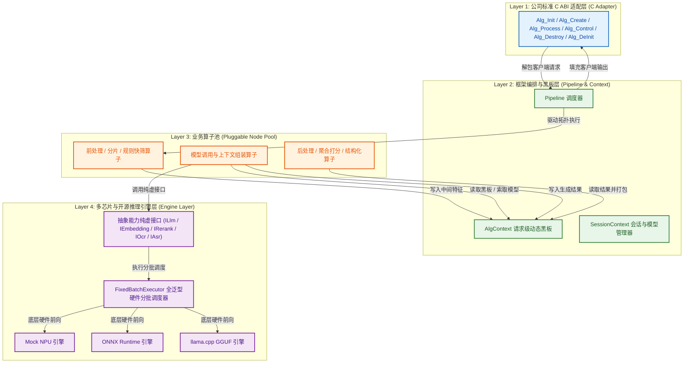

# 🚀 LLM-EdgeFlow

> **High-Performance C++ Pipeline & Heterogeneous Inference Framework for Edge AI & LLMs**
> *(专为边缘芯片、嵌入式设备与企业级端侧场景打造的高性能 C++ 大模型算子流水线与异构推理编排框架)*

---

## 📖 About LLM-EdgeFlow (关于项目)

### 1. 项目定位与背景
在现代 AI 算法工程落地过程中，算法工程师往往面临以下严峻挑战：
- **交付壁垒**：向下游集成部门交付算法动态库（`.so`/`.a`）时，需严格遵循 C ABI 接口规范，且必须具备极强的异常隔离与内存安全防御；
- **芯片异构与硬件限制**：端侧/边缘 SoC（如华为昇腾 Ascend、瑞芯微 RK3588、地平线 Horizon、NVIDIA Jetson）通常采用 **静态编译与定长 DMA Batch 限制**，无法直接处理上层业务复杂可变的长短文本与切片裂变；
- **复杂多模型多模态协同**：大模型、文本向量表征（Embedding）、交叉语义精排（Reranker）、视觉 OCR、语音 ASR 以及业务过滤规则交织在一起，缺乏统一、解耦、零内存泄漏的编排架构；
- **引擎强耦合风险**：算法代码直接侵入具体硬件 SDK 或三方推理库（如 ONNX Runtime、llama.cpp、TensorRT），导致更换芯片或引擎时需要大范围重构代码。

**`LLM-EdgeFlow`** 为此而生。它是一个**工业级、轻量化、高性能的 C++17 异构算子流水线与多模态模型推理编排框架**。通过**4层严格分层隔离**、**异构引擎热插拔**、**全泛型定长硬件 Batch 对齐剥离**以及**动态黑板状态机**，让算法团队能够以极简的方式构建并交付高性能、高可靠的端侧 AI 应用。

---

## 🌟 核心技术亮点 (Key Features)

### 1. 🛡️ 标准 C ABI 安全屏障 (C ABI Safety Barrier)
- 导出标准 6 大 C 接口：`Alg_Init()`, `Alg_Create()`, `Alg_Process()`, `Alg_Control()`, `Alg_Destroy()`, `Alg_DeInit()`；
- 内部建立 `noexcept` 异常屏障与强类型转换，即使内部出现异常也安全捕获并转换为标准错误码返回，**杜绝下游宿主进程崩溃**。

### 2. ⚡ 异构多引擎隔离与热插拔 (Heterogeneous Engine Hot-Swapping)
- **微软 ONNX Runtime**：原生封装，负责文本表征（Embedding）与交叉语义精排（Rerank）；
- **开源 llama.cpp / ggml**：原生封装，负责 GGUF 格式（Qwen2.5/Qwen3.5/Gemma3 等）0.5B ~ 70B 大模型端侧推理；
- **专用芯片/NPU 驱动**：模拟并支持专有 NPU 硬件加速；
- **PIMPL 零侵入封装**：三方推理库头文件被 100% 封闭在引擎实现内部，上层算子仅依赖纯虚能力接口（`ILlmEngine`, `IEmbeddingEngine`, `IRerankEngine`, `IOcrEngine`, `IAudioAsrEngine`），**切换引擎无需改动任何 C++ 代码**。

### 3. 🎯 定长硬件 Batch 对齐与样本溯源 (FixedBatchExecutor)
- 专为边缘 NPU/DMA 批处理设计：自动将 1-to-N 裂变后的任意长度样本切分为定长 Hardware Batch（如 Batch=4）；
- 自动填充 Dummy Pad，推理完成后自动剥离 Pad，并通过 `TraceableItem<T>` 附带的 `(req_id, sub_id)` **100% 精准对齐还原到原始客户端请求**。

### 4. 🧠 动态类型安全异构黑板 (AlgContext Dynamic Blackboard)
- 基于 `std::any` + `type_info` 实现类型安全动态黑板；
- 跨算子传递复杂数据结构（图像 BBox、音频 PCM 采样点、向量张量、JSON 结构体）无需手动编写冗余转换胶水层，请求生命周期结束后自动析构回收。

### 5. 🧪 工业级 Google Test (GTest) 质量保障
- CMake `FetchContent` 自动拉取与编译 Google Test，环境零依赖；
- 5 大自动化单测套件覆盖核心机制、50 轮连续生命周期压测、双引擎交叉对比与多模态数据隔离验证。

### 6. 📊 双模可视化工具链 (Dual-Mode Visualizer)
- **纯 C++ 原生 CLI 工具** (`./build/alg_show`)：专为无 Python、极简嵌入式/开发板环境设计，零外部依赖打印 ASCII 拓扑树；
- **交互式 Web 工作台** (`./show config.json --web`)：动态渲染 DAG 拓扑图、实时黑板数据监控与单步推演仿真。

---

## 🏛️ 4 层严格分层架构 (Layered Architecture)



---

## 📁 代码目录结构 (Directory Layout)

```text
llm-edgeflow/
├── include/
│   ├── company_alg_interface.h # Layer 1: 对外标准 C ABI 接口与结构体
│   ├── core/                   # Layer 2: 核心框架头文件
│   │   ├── alg_context.h       #   - 请求级动态异构黑板
│   │   ├── traceable_item.h    #   - 带 (req_id, sub_id) 样本溯源容器
│   │   ├── node_base.h         #   - 算子纯虚基类 INode
│   │   ├── node_registry.h     #   - 算子动态反射工厂
│   │   ├── session_context.h   #   - ModelManager 会话模型容器
│   │   └── pipeline.h          #   - 核心管线调度器
│   └── engine/                 # Layer 4: 引擎抽象能力接口
│       ├── engine_interface.h  #   - 纯虚接口 (LLM, Embed, Rerank, OCR, ASR)
│       ├── engine_registry.h   #   - 引擎反射工厂
│       └── fixed_batch_executor.h # - 全泛型定长 Batch 调度模板
├── src/
│   ├── core/
│   │   └── pipeline.cpp        # 管线加载与执行实现
│   ├── engine/                 # 引擎私有实现 (按后端子目录严格物理隔离)
│   │   ├── mock_npu/           #   - NPU 模拟与定长 DMA 批处理
│   │   ├── onnx/               #   - 微软 ONNX Runtime 向量与精排引擎
│   │   └── llama_cpp/          #   - llama.cpp GGUF 大模型引擎
│   ├── common_nodes/           # 通用可复用算子 (PromptBuilder, VectorSearch)
│   ├── business/               # 业务专属算子 (7大业务独立子目录)
│   │   ├── keyword_match/      #   - 业务 1: 关注词匹配 (纯规则算子)
│   │   ├── entity_extract/     #   - 业务 2: 实体/名词提取 (0.6B LLM 算子)
│   │   ├── doc_qa/             #   - 业务 3: 智能长文档问答 (Embedding + LLM)
│   │   ├── dialogue_audit/     #   - 业务 4: 对话风控质检 (3模型+6节点协同)
│   │   ├── ocr_doc_qa/         #   - 业务 5: 多模态图文票据问答 (OCR + LLM)
│   │   ├── audio_asr/          #   - 业务 6: 语音识别与意图抽取 (PCM ASR + NLU)
│   │   └── cross_rerank/       #   - 业务 7: 纯语义精排打分 (Cross-Encoder)
│   ├── adapter/
│   │   └── company_c_adapter.cpp # 对接公司 C ABI 接口的安全胶水层
│   └── tools/
│       └── alg_show.cpp        # 纯 C++ 原生零依赖 DAG 可视化工具
├── configs/                    # 9 大标准化业务配置文件 (JSON)
├── demo/
│   └── main.cpp                # 7 大业务端到端全链路集成演示
├── tests/                      # Google Test (GTest) 单元测试套件
├── cmake/                      # CMake 自动拉取与第三方依赖配置
├── scripts/                    # 自动化测试与 Google 规范格式化脚本
└── tools/visualizer/           # 交互式 Web DAG 可视化工作台
```

---

## 🚀 快速上手与编译运行 (Quick Start)

### 1. 编译工程

```bash
mkdir -p build && cd build
cmake ..
make -j4
```

### 2. 运行 7 大业务端到端集成演示

```bash
./build/alg_demo
```

### 3. 运行 Google Test (GTest) 单元测试套件

```bash
# 运行底层硬件定长 Batch 补齐与剥离单测
./build/test_batch_executor

# 运行框架核心黑板/反射工厂/模型管理器单测
./build/test_framework_core

# 运行标准 C ABI 安全边界与 50 轮生命周期压测
./build/test_c_abi_safety

# 运行 Qwen 大模型双推理引擎 (NPU vs llama.cpp) 交叉比对单测
./build/test_qwen_engines_comparison

# 运行多模态 (OCR + 语音 ASR + 语义精排) 异构输入输出隔离单测
./build/test_different_io_modalities
```

### 4. 执行全层级自动化质量验收测试套件 (Quality Assurance)

```bash
./scripts/run_all_tests.sh
```

### 5. 一键代码格式化 (Google C++ Style)

```bash
./scripts/format.sh
```

---

## 📊 算法管线与 DAG 可视化工具 (Visualizer)

### 1. 命令行拓扑打印 (适用于终端或嵌入式调试)
```bash
# Python 命令行工具
./show configs/pipeline_doc_qa.json

# 纯 C++ 原生零依赖工具 (专为边缘 Linux 设备设计)
./build/alg_show configs/pipeline_ocr_doc_qa.json
```

### 2. 启动交互式 Web 可视化工作台
```bash
./show configs/pipeline_dialogue_audit.json --web
```
在浏览器打开 `http://localhost:8080`，即可进行 DAG 拓扑监控、黑板数据流向追踪与动态单步推演仿真！

---

## 📄 License & Standards

- **Language Standard**: Modern C++17
- **Code Style**: Google C++ Style Guide ([`.clang-format`](.clang-format))
- **Test Framework**: Google Test (GTest v1.14.0)
- **Deployment Targets**: x86_64, aarch64 (Linux, Embedded Edge SoC, Android/QNX)
