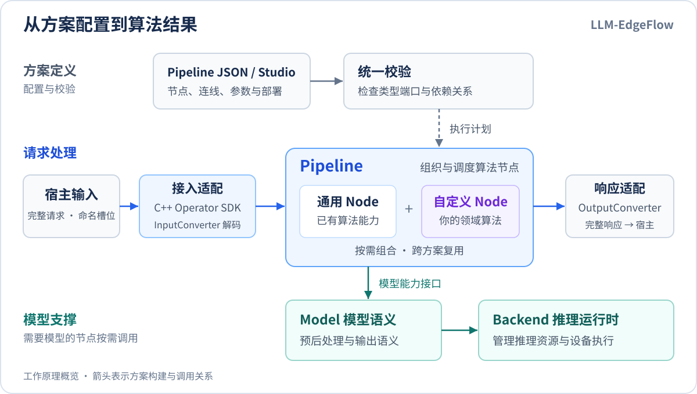
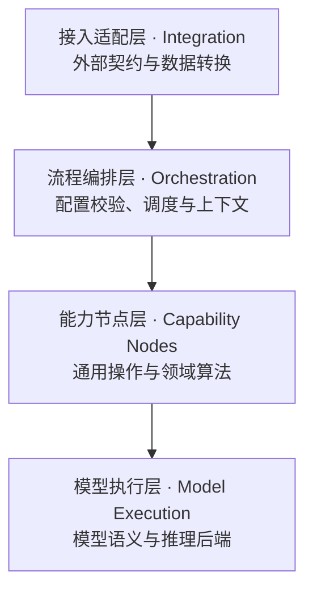

# LLM-EdgeFlow

**面向边缘与端侧应用的 C++ 算法编排框架。**

[](https://github.com/chamsechan/LLM-EdgeFlow/actions/workflows/ci.yml)
[](CMakeLists.txt)
[](LICENSE)

LLM-EdgeFlow 将规则处理、向量检索、文本生成、图像转写和语音识别组织为可复用的算法节点，用 JSON 描述它们的连接关系，再通过统一的 C ABI 或 C++ Operator 接口供宿主程序调用。

框架面向算法方案开发者：已有能力通过配置组合，领域算法在自定义 Node 中实现，平台输入输出由 Adapter 转换。模型语义与推理后端分别扩展，便于在不同方案中复用同一套算法代码。

项目目前处于实际业务接入前的开发与验证阶段。仓库提供可运行示例和自动化测试；模型效果、性能及目标设备适配需按具体场景验收。

[快速开始](#快速开始) · [架构与扩展](#架构与扩展) · [示例方案](#示例方案) · [开发文档](#开发文档)

<p align="center">
  <a href="doc/assets/framework_overview.svg">
    
  </a>
</p>

## 框架提供什么

- **组合算法流程**：Pipeline 以有向无环图（DAG）描述节点依赖，可组合规则、检索、模型调用和结果处理。执行前统一检查端口类型、依赖关系和并发写冲突。
- **复用算法实现**：通用 Node 与自定义 Node 使用相同的类型端口和注册机制；单个节点可用于多个 Pipeline。
- **管理模型执行**：Model 负责模型预后处理与输出语义，Backend 负责推理运行时。节点通过模型能力接口调用推理。
- **对接宿主程序**：C ABI 与 Operator 共用内部算法运行时，集中处理数据转换、资源生命周期和异常隔离。
- **验证运行结果**：命令行工具与 Web 工作台共用 Catalog 和 Validator；统一 Demo 输出逐条结果与运行摘要，并保留请求来源编号。

## 快速开始

以下以 Linux CPU 环境为例，所有命令均在仓库根目录执行。需要支持 C++17 的编译器、CMake 3.16+、Ninja、Python 3 和 Git。首次构建需联网获取固定版本的第三方依赖；模型权重另行准备。

### 1. 获取并构建

```bash
git clone https://github.com/chamsechan/LLM-EdgeFlow.git
cd LLM-EdgeFlow

cmake -S . -B build -G Ninja -DCMAKE_BUILD_TYPE=Release \
  -DENABLE_ONNXRUNTIME=OFF -DENABLE_LLAMACPP=OFF \
  -DENABLE_WHISPERCPP=OFF -DENABLE_KITELLM=OFF
cmake --build build --target alg_sdk alg_demo alg_pipeline_tool alg_show --parallel 4
```

首次练习只构建规则、模板、数据处理与工具，不启用推理后端或构建全部测试。后续真实模型
按[构建变体](doc/VERIFIABLE_SELECTION.md#构建变体)选择 Backend；若沿用 `build/`，重新
配置对应 `ENABLE_*` 开关并重建即可。交付前仍执行完整默认门禁。主要产物如下：

| 产物 | 用途 |
| :--- | :--- |
| `build/libcompany_alg_sdk.so` | 集成到宿主程序的算法共享库 |
| `build/alg_demo` | 使用统一入口运行示例方案 |
| `build/alg_pipeline_tool` | 查询能力、校验 Pipeline、查看执行计划 |
| `build/alg_show` | 在终端查看 Pipeline 的节点与连线 |

### 2. 运行第一个方案

从无需模型权重的关键词匹配开始。下面使用仓库自带的四条测试文本，执行配置中定义的规则：

```bash
./build/alg_pipeline_tool validate configs/pipeline_keyword_match.json
./build/alg_demo --profile keyword_match_mock \
  --dataset tests/fixtures/effects/keyword_inputs.txt \
  --output-dir results/quickstart
```

预期四条输入均处理成功，前两条命中 `SYSTEM_INIT`，后两条未命中。结果位于：

- `results/quickstart/keyword_match_mock/results.jsonl`：逐条请求的状态与匹配结果。
- `results/quickstart/keyword_match_mock/summary.json`：样本数、成功数、失败数与耗时。

`keyword_match_mock` 是 Demo 预设名称，这个方案使用真实规则节点。Demo 默认使用 Pipeline 中的规则；`--no-default-control` 保留为兼容选项。需要体验内置规则热更新时显式添加 `--example-control`。

### 3. 查看与编辑流程

```bash
# 查询当前构建中可用的业务契约与节点
./build/alg_pipeline_tool catalog --biz keyword_match_v1
./build/alg_pipeline_tool describe-node TextRuleMatchNode

# 查看经过校验的执行计划
./build/alg_pipeline_tool plan configs/pipeline_keyword_match.json

# 打开本地 Web 工作台
./show configs/pipeline_keyword_match.json --web
```

工作台绑定 `127.0.0.1`，支持节点连线、参数编辑、配置校验和草稿运行。下一步可跟随 [Studio 编排练习](tools/pipeline_studio/README.md#第一次编排)修改规则，并用 Demo 验证自己的方案。

## 架构与扩展

框架按职责划分为四层。通常先复用节点并编写 Pipeline，出现能力缺口后再扩展对应层。



| 职责 | 何时扩展 | 主要入口 |
| :--- | :--- | :--- |
| 接入适配层 | 宿主程序增加新的输入输出结构或调用约定 | `include/adapter/`、`include/operator/`、`src/adapter/` |
| 流程编排层 | 现有校验、调度或上下文机制无法满足需求 | `include/core/`、`src/core/` |
| 能力节点层 | 增加领域算法、数据处理或模型调用组合 | `src/custom_nodes/`；通用操作位于 `src/common_nodes/` |
| 模型执行层 | 增加模型语义或接入新的推理运行时 | `src/engine/models/`、`src/engine/backends/` |

完整职责、编译依赖和运行时数据流见[架构设计](doc/architecture.md)；首次编写算法见[自定义 Node 入门](doc/dev_guide/first_custom_node.md)。

## 一个方案由哪些文件组成

| 文件 | 负责什么 | 示例 |
| :--- | :--- | :--- |
| Pipeline JSON | 节点、依赖、类型端口、模型与算法参数 | [pipeline_keyword_match.json](configs/pipeline_keyword_match.json) |
| 部署 `.conf` | Pipeline 路径、模型路径覆盖与输出容量 | [pipeline_keyword_match.conf](configs/pipeline_keyword_match.conf) |
| Demo Profile（可选） | 运行预设：业务、配置、数据集和批大小等 | [demo/profiles.json](demo/profiles.json) |

Profile 用于重复运行已有方案，也可以通过 Demo 参数直接指定配置和数据集。保存新的 Pipeline 后，需要让 `.conf` 指向它；具体步骤见[运行当前方案](tools/pipeline_studio/README.md#运行当前方案)。

## 示例方案

以下配置展示已有能力的组合方式。涉及模型的方案需要匹配的 Backend、权重及运行资源；实际可用的节点、模型和后端以目标构建的 `alg_pipeline_tool catalog` 为准。

| 场景 | 处理方式 | 配置与运行条件 |
| :--- | :--- | :--- |
| 关键词匹配 | 文本规则匹配与分类 | [配置](configs/pipeline_keyword_match.json)；无需模型权重 |
| 实体抽取 | LLM 生成与结构化结果解析 | [配置](configs/pipeline_entity_extract_llamacpp.json)；llama.cpp 与匹配的语言模型 |
| 文档问答 | 文本分块、向量检索与 LLM 回答 | [配置](configs/pipeline_doc_qa.json)；ONNX Runtime、llama.cpp 与对应模型 |
| 对话合规审计 | 检索、精排与 LLM 分析 | [配置](configs/pipeline_dialogue_audit.json)；向量、精排和语言模型 |
| 文本精排 | 对问题与候选文本进行相关性评分 | [配置](configs/pipeline_cross_rerank.json)；ONNX Runtime 与精排模型 |
| 图像文档问答 | 图像转写后进行问答 | [配置](configs/kite/pipeline_ocr_doc_qa.json)；Kite 与视觉、语言模型 |
| 语音意图识别 | Whisper 转写与规则分类 | [配置](configs/pipeline_audio_asr_whisper.json)；启用 whisper.cpp 并准备语音模型 |

Kite 的图像转写输出文本，不提供检测框或置信度。Kite、Whisper 等可选后端需单独选择构建配置；参考[构建变体与模型资产](doc/VERIFIABLE_SELECTION.md)和 [kiteLLM 接入说明](doc/kitellm.md)。

查看全部 Demo 预设，或运行无需真实模型的 Smoke 套件：

```bash
./build/alg_demo --list
./build/alg_demo --suite smoke
```

Smoke 验证执行链路；真实模型的业务效果需使用目标数据集另行验证，方法见[效果验收](doc/VERIFIABLE_SELECTION.md#业务效果验收)。

## 开发文档

| 目标 | 入口 |
| :--- | :--- |
| 用已有节点构建方案 | [Pipeline Studio](tools/pipeline_studio/README.md#第一次编排) |
| 编写第一个自定义算法 | [自定义 Node 入门](doc/dev_guide/first_custom_node.md) · [节点作者的五个概念](doc/dev_guide/custom_node_concepts.md) |
| 给节点增加运行时控制 | [Control 入门](doc/dev_guide/first_control.md) |
| 对接平台输入输出 | [业务接入指南](doc/dev_guide/business_onboarding.md) |
| 扩展框架、模型或后端 | [开发者指南](doc/developer_guide.md) · [架构设计](doc/architecture.md) |
| 准备模型并验证效果 | [模型、构建与效果验收](doc/VERIFIABLE_SELECTION.md) |
| 了解设计决策与版本演进 | [RFC 索引](doc/rfcs/README.md) · [Changelog](doc/CHANGELOG.md) |
| 查阅全部文档 | [文档目录](doc/README.md) |

## 参与开发

在独立分支上修改，并在交付前执行完整质量门禁：

```bash
./scripts/run_all_tests.sh
```

该命令统一执行格式与静态检查、配置构建及 CTest 测试。环境需具备 clang-format 18，以及架构图检查所需的 Java 17+；详细流程见 [CONTRIBUTING.md](CONTRIBUTING.md)，测试组织见 [tests/README.md](tests/README.md)，Agent 开发约束见 [AGENTS.md](AGENTS.md)。

当前产品版本为 **v10.0.0**，公共 **ABI major 为 5**。接口边界见[架构设计](doc/architecture.md)，版本记录见 [Changelog](doc/CHANGELOG.md)。

## 许可证

项目采用 [MIT License](LICENSE)。第三方组件及其许可见 [THIRD_PARTY_NOTICES.md](THIRD_PARTY_NOTICES.md)。
