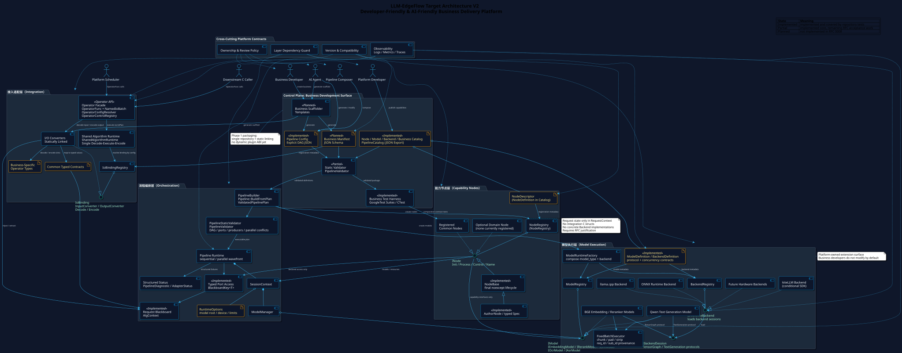
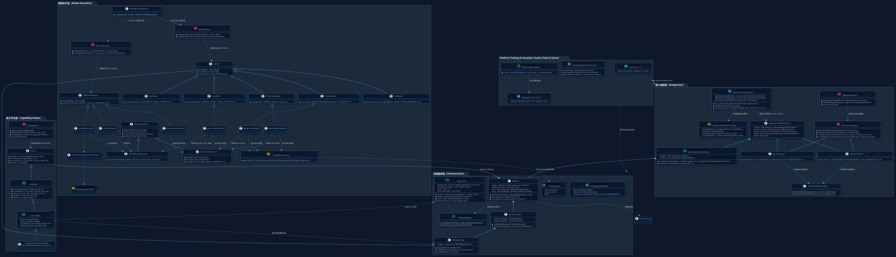

# 🚀 LLM-EdgeFlow

<p align="center">
  
</p>

<p align="center">
  <strong>High-Performance C++ Pipeline &amp; Heterogeneous Inference Framework for Edge AI &amp; LLMs</strong><br>
  <em>专为边缘芯片与端侧场景打造的高性能 C++ 大模型流水线与异构推理编排框架</em>
</p>

<p align="center">
  <a href="https://github.com/chamsechan/LLM-EdgeFlow/actions/workflows/ci.yml"></a>
  <a href="https://en.cppreference.com/w/cpp/17"></a>
  <a href="https://cmake.org/"></a>
  <a href="https://github.com/google/googletest"></a>
  <a href="https://github.com/microsoft/onnxruntime"></a>
  <a href="https://github.com/ggerganov/llama.cpp"></a>
  <a href="https://github.com/chamsechan/LLM-EdgeFlow/blob/main/LICENSE"></a>
  <a href="#"></a>
</p>

---

## 🌟 核心特性 (Key Highlights)

- 🛡️ **标准纯 C ABI 隔离与安全屏障**：导出标准 6 大 C 接口，内置 `noexcept` 异常防火墙，彻底杜绝下游宿主崩溃。
- 🎯 **定长硬件 DMA 批处理调度 (`FixedBatchExecutor`)**：专为端侧/NPU 定长 Batch 设计，全泛型自动切块、补齐 Dummy Pad、推理后剥离并保持 `(req_id, sub_id)` 样本溯源。
- ⚡ **异构推理引擎 PIMPL 解耦**：原生封装 **ONNX Runtime**、**llama.cpp (GGUF)** 与 **专有 NPU DMA 内核**，切换芯片/引擎无需改动任何业务代码，纯 JSON 配置热插拔。
- 🧠 **动态类型安全黑板 (`AlgContext`)**：基于 `std::any` 传递多模态复杂张量与结构体，零冗余内存拷贝，请求结束自动释放。
- 📊 **图形化算法方案闭环**：C++ Definition/Catalog 驱动统一 CLI 与 **交互式 Web DAG 工作台 (`./show --web`)**，支持方案创建、结构编辑、静态校验、原子保存及隔离的真实 Demo 草稿运行。

---

## 🏛️ 4 层分层架构 (Architecture)

| 分层 | 核心职责 | 核心组件 / 文件 |
| :--- | :--- | :--- |
| **Layer 1: C ABI 适配层** | 客户端解包、类型强转与 `noexcept` 异常屏障 | `include/company_alg_interface.h`<br>`src/adapter/company_c_adapter.cpp` |
| **Layer 2: 管线与黑板层** | DAG 拓扑执行、请求级动态黑板与模型容器 | `Pipeline`, `AlgContext`, `SessionContext`, `TraceableItem<T>` |
| **Layer 3: 业务专属算子池** | 前处理分片、模型调用封装、规则快筛与后处理精准对齐 | `INode`, `NodeFactory`, `src/business/*` (7大业务算子) |
| **Layer 4: 异构引擎层** | 纯虚能力接口、定长批调度模板与三方引擎实现 | `FixedBatchExecutor`, `ONNX Runtime`, `llama.cpp`, `MockNPU` |

<details>
<summary><b>🔍 查看详细 UML 类图设计 (Class Diagram)</b></summary>

<p align="center" style="margin-top: 10px;">
  
</p>

</details>

> 📖 **4 层扩展开发说明书与代码模板详见**：[doc/developer_guide.md](doc/developer_guide.md)

---

## 📦 已支持的 7 大多模态业务 (Multi-Modal Matrix)

同一算法库 `libcompany_alg_sdk.so`，仅需传入不同 JSON 配置文件即可无缝热切换：

| 业务 | 业务名称 | 输入模态 | 挂载模型 / 算法能力 | 输出模态 | 配置文件 |
| :--- | :--- | :--- | :--- | :--- | :--- |
| **Biz 1** | **关注词规则匹配** | 文本句子 | 纯规则树快筛 (零模型) | 命中的类别与词 JSON | [`pipeline_keyword_match.json`](configs/pipeline_keyword_match.json) |
| **Biz 2** | **实体名词抽取** | 文本句子 | 0.6B Qwen / llama.cpp | 抽取的名词列表 JSON | [`pipeline_entity_extract.json`](configs/pipeline_entity_extract.json) |
| **Biz 3** | **智能长文档问答** | 长文本+提问 | Embedding + 1.5B LLM | 切片数+意图+生成回答 | [`pipeline_doc_qa.json`](configs/pipeline_doc_qa.json) |
| **Biz 4** | **对话风控质检** | 对话流+渠道 | Embedding + Rerank + 7B LLM | 风险分+等级+质检判决 | [`pipeline_dialogue_audit.json`](configs/pipeline_dialogue_audit.json) |
| **Biz 5** | **多模态发票抽取** | 图像路径+Query | OCR 框检测识别 + LLM | 识别框数+结构化发票 JSON | [`pipeline_ocr_doc_qa.json`](configs/pipeline_ocr_doc_qa.json) |
| **Biz 6** | **语音识别与槽位抽取** | 原始音频 PCM | Speech ASR + NLU 槽位提取器 | 转写文本+意图槽位 JSON | [`pipeline_audio_asr_intent.json`](configs/pipeline_audio_asr_intent.json) |
| **Biz 7** | **纯语义精排矩阵打分** | 1 Query + N 候选 | ONNX Cross-Encoder 矩阵计算 | Top-K 打分与排序索引 | [`pipeline_cross_rerank.json`](configs/pipeline_cross_rerank.json) |

---

## 🚀 快速开始 (Quick Start)

```bash
# 1. 编译工程 (自动拉取 GTest, ONNX Runtime 与 llama.cpp)
mkdir -p build && cd build
cmake .. && make -j4

# 2. 自动化执行全量测试套件 (21 组 CTest & Google Test)
ctest --output-on-failure

# 3. 运行 7 大业务端到端全链路集成演示 (默认 Smoke 组合)
./alg_demo

# 4. 基于 Profile 运行特定业务配置
./alg_demo --profile entity_extract_mock
./alg_demo --profile doc_qa_onnx

# 5. 查看所有支持的业务与 Profile 清单
./alg_demo --list

# 6. 批量自动化执行全部 Demo 套件 (Smoke / Real / All)
cd .. && ./scripts/run_all_demos.sh smoke
```

---

## 📊 DAG 可视化调试 (Visualizer)

```bash
# 1. 嵌入式/终端原生 ASCII 拓扑打印 (纯 C++ 零依赖)
./build/alg_show configs/pipeline_ocr_doc_qa.json

# 2. 打开方案列表或直接打开指定方案
./show --web
./show configs/pipeline_dialogue_audit.json --web

# 3. AI / 自动化使用同一个 C++ Catalog 与 Validator
./build/alg_pipeline_tool catalog --business smart_doc_qa_v1
./build/alg_pipeline_tool describe-node PromptBuilderNode
./build/alg_pipeline_tool validate configs/pipeline_doc_qa.json
./build/alg_pipeline_tool plan configs/pipeline_doc_qa.json
```

工作台是开发期工具，仅绑定 `127.0.0.1`，不设置账号或令牌鉴权。它只管理
`configs/pipeline_[a-z0-9_]+.json`，通过 SHA-256 revision 检测 IDE/Git 外部修改，
保存前调用 C++ Validator 并原子替换。节点坐标只存于浏览器 `localStorage`，不会污染
Pipeline JSON；未保存草稿可在隔离临时目录中调用真实 `alg_demo`，不会改写正式 `.conf`
或仓库 `results/`。

---

## 📁 代码目录布局 (Layout)

```text
LLM-EdgeFlow/
├── include/
│   ├── company_alg_interface.h  # Layer 1: 标准 C ABI 导出头文件
│   ├── core/                    # Layer 2: 框架核心 (AlgContext, Pipeline, TraceableItem)
│   ├── platform/                # Layer 1: 平台 Operator 接口 (platform_operator_interface.h)
│   └── engine/                  # Layer 4: 引擎接口 (FixedBatchExecutor, IModelEngine)
├── src/
│   ├── adapter/                 # Layer 1: C ABI 安全胶水层 (company_c_adapter.cpp)
│   ├── core/                    # Layer 2: Pipeline 调度器实现
│   ├── business/                # Layer 3: 7 大多模态业务算子库
│   ├── engine/                  # Layer 4: 异构引擎实现 (mock_npu, onnx, llama_cpp)
│   └── tools/                   # 纯 C++ 原生 DAG 可视化工具 (alg_show.cpp)
├── configs/                     # 9 大标准化业务配置 (JSON & .conf)
├── demo/                        # 参数化多业务端到端演示与 Runner
│   ├── profiles.json            # 预定义执行 Profile 清单 (单一事实源)
│   ├── common/                  # 通用参数解析、注册表、数据读取、结果落盘与 RAII Runner
│   └── businesses/              # 7 大独立业务 Demo 适配实现 (*_demo.cpp)
├── tests/                       # Google Test (GTest) 单元测试套件
└── tools/visualizer/            # 交互式 Web DAG 可视化平台
```

---

## 📝 更新日志 (Changelog)

- **v2.5.1 (全面审查证据与质量门禁修正)** *(2026-08)*
  - 🧪 **可复现 Sanitizer**：ASan/UBSan 改用独立构建目录，支持显式 sanitizer 集合，禁用用户级 ccache，并动态执行全部 CTest 与 Smoke Profile。
  - 📐 **真实格式门禁**：`format.sh --check`、CI 和六阶段回归改为只读 clang-format 检查，格式偏差不再被 `git diff --check` 漏掉。
  - 🔒 **C ABI 布局证据**：业务枚举通过 `INT32_MAX` guard 与纯 C11 编译期断言锁定 32 位 ABI。
  - 📋 **审查结论校正**：按最新主干的 23 项 CTest 和 27 个节点实现重新冻结证据，将 ASan、TSan、真实硬件等缺失证据如实标为 `NOT VERIFIED`。
- **v2.5.0 (图形化算法方案工作台与配置编排闭环 - RFC 0006)** *(2026-08)*
  - 🧭 **运行时 Catalog/Definition**：节点与引擎构造器同步注册 Definition，导出业务 Adapter ingress/egress、类型化端口、配置约束、模型能力与并行安全信息；新增节点可自动出现在 CLI 和 Web。
  - ✅ **统一静态 Validator 与 CLI**：`Pipeline::Build` 在模型加载前复用无副作用预检；新增 `alg_pipeline_tool` 的 `catalog`、`describe-node`、`init`、`normalize`、`validate`、`plan` 六类版本化 JSON 命令。
  - 🎛️ **可编辑 SVG 工作台**：原生 ES Modules 实现打开/新建/保存/另存、节点增删拖动、拉线删线、自动布局、参数表单、Graph/JSON 双向同步、诊断定位与 Profile 草稿运行。
  - 🔒 **本机开发服务**：仅绑定回环地址且不引入账号/令牌权限；限制方案文件名和真实路径，revision 防覆盖、临时文件原子保存，并提供单任务异步运行、取消、超时和 2 MiB 日志上限。
  - 🤖 **技能闭环**：`pipeline-composer` 改为 Catalog→describe→compose→validate→Smoke 的短流程；Developer Guide 改为四层按需引用路由，两个技能均通过 `quick_validate.py`。
  - 🧪 **工作台回归矩阵**：新增 C++ Catalog/Validator/normalize 测试和 Python 文件/API/CLI/真实 Demo 闭环测试，全部既有 Pipeline 纳入统一静态校验。
- **v2.4.0 (参数化业务 Demo Runner 与执行配置解耦交付 - RFC 0005)** *(2026-08)*
  - 🧩 **独立业务 Demo 模块化解耦 (`demo/businesses/`)**：将原 `demo/main.cpp` 中单体硬编码的 7 大业务逻辑拆分为独立的 `*_demo.cpp` 文件，通过 `DemoRegistry` 与 `REGISTER_DEMO_BUSINESS` 宏实现字符串解耦与动态业务注册。
  - 📋 **Profile 声明式配置清单 (`demo/profiles.json`)**：引入统一 Profile Schema 作为 Demo 默认参数的唯一事实源，支持 CLI 命令行参数、Profile 配置与安全默认值的无缝优先级合并覆盖。
  - 🛡️ **通用 Platform Operator RAII 执行器 (`operator_runner.h`)**：统一收敛平台生命周期 `Init/Create/Process/Destroy/Deinit`，内置预检快速失败、强类型芯片白名单校验（`ChipType`）、精准耗时统计与 RAII 句柄安全释放。
  - 💾 **结构化结果落盘契约 (`results/<profile>/`)**：标准落盘 `results.jsonl`（包含 `request_id`、`status`、`latency_ms` 与业务 JSON）与 `summary.json`，支持临时文件原子写入（`.tmp` $\rightarrow$ 重命名）及 `--append` 追加模式。
  - 📜 **批量自动化 Demo 调度脚本 (`scripts/run_all_demos.sh`)**：提供统一批量调度入口，支持 `smoke`（默认轻量套件）、`real` 与 `all` 组合，并与 6 阶段自动化测试套件深度整合。
  - 🧪 **DemoRunnerTest 全量测试套件**：新增 `tests/test_demo_runner.cpp` 单元测试，全面覆盖 CLI 参数解析、芯片白名单、Profile 校验与冲突、数据读取、结果原子落盘及 7 大业务端到端集成，21 组 CTest 100% 通过。
- **v2.3.0 (平台 Operator 兼容门面与命名 I/O 双轨交付)** *(2026-08)*
  - 🔌 **平台 OperatorFunc 函数表兼容门面**：新增独立 C++ 平台头文件 `include/platform/platform_operator_interface.h`，导出 `Get_LLM_EDGEFLOW_OperatorTable()`，为公司调度平台提供 `Init` / `Create` / `Process` / `Control` / `Destroy` / `Deinit` 全 `noexcept` 隔离函数表。
  - 🧱 **Layer 1 共享算法运行时 (`SharedAlgorithmRuntime`)**：下沉提炼共享执行引擎，实现单点 `ValidateBatch` $\rightarrow$ `Unpack` $\rightarrow$ `Pipeline::Execute` $\rightarrow$ `Pack` 数据流，纯 C ABI 与 C++ 平台 Operator 门面双轨共用底层 Runtime，杜绝双轨逻辑分裂。
  - 📄 **平台部署配置解析器 (`CompanyConfResolver`)**：解析公司平台 `.conf` 部署配置，支持基于 `.conf` 目录相对路径规范化，实现 Pipeline JSON 模型路径内存动态重写与单/多模型映射覆盖，保持 Pipeline JSON 严格白名单与零磁盘临时文件。
  - 🏷️ **命名 I/O 派发与零拷贝提取 (`PlatformIoRegistry`)**：定义基于点后缀（`namespace.type_suffix`）的槽位派发体系（如 `camera_0.frame` $\rightarrow$ `frame`，`detector.od_out` $\rightarrow$ `od_out`），通过 `std::shared_ptr<void>::get()` 零拷贝借用外部指针转换为 C 指针数组。
  - 🔄 **强类型动态控制映射 (`PlatformControlRegistry`)**：将平台 `ControlCommand` 枚举与参数结构体强类型校验后无缝接入 `Pipeline::Control`。
  - 🧪 **全量回归与测试矩阵**：新增 `test_platform_operator` 全场景测试套件（覆盖 11 类生命周期、命名 I/O 异常、多模型覆盖、全业务执行与并发互斥），Demo 改为平台标准 `OperatorFunc` 驱动，18 组 CTest 100% 通过。
- **v2.2.0 (Pipeline 严格解析、Fail-Closed 注册与结构化诊断交付 - R1)** *(2026-08)*
  - 📐 **严格配置解析与白名单校验 (PLB-004, R1-ACC-003/006)**：实现集中式强类型解析器 `ParsePipelineConfig`，严格拒绝根节点/Model/Node 未知字段；废除顶层未知参数自动合并进算子配置的隐式行为；校验 `comment` 强类型与 `execution_mode: sequential` + `max_parallel_workers` 排他组合；平滑保持 9 份正式配置向后兼容（自动生成稳定顺序 ID）。
  - 🛡️ **注册中心重复拒绝与 Fail-Closed 防护 (PLB-006, RECHECK-R1-002)**：`NodeFactory` 与 `EngineFactory` 在检测到同名类型重复注册时，无条件保留首个注册实例并标记 `has_conflict_ = true`；Pipeline 构建阶段实施 Fail-Closed 拦截；移除生产头文件中的重置调试接口，确保进程级注册冲突不可篡改。
  - 🩺 **精细化结构诊断与异常阶段隔离 (PLB-011, R1-ACC-001, RECHECK-R1-001/003)**：定义 21 种细粒度 `PipelineErrorCode`，涵盖配置无法打开、语法解析、引擎/算子创建与初始化异常；物化边界建立全生命周期异常拦截网络并映射至标准 JSON Pointer path，杜绝异常逃逸；引入 `BuildingStateGuard` 保证构建异常确定性收敛至 `State::kFailed`。
  - 🔄 **一次性构建生命周期状态机保护 (R1-ACC-002)**：`Pipeline` 引入 `State::kEmpty -> State::kBuilding -> State::kReady / State::kFailed` 显式状态机，彻底封禁重复 Build 与脏状态复用；`Execute` 与 `Control` 仅在 `Ready` 状态工作，未就绪或失败实例安全拦截。
  - 🔒 **Registry 锁粒度优化与自锁消除 (R1-ACC-004, RECHECK-R1-003)**：`Create` 调整为锁内检索复制函数对象、锁外执行构造，彻底消除算子构造期重入 Registry 导致的死锁风险；新增带超时保护的进程级独立测试套件。
  - 🧪 **18 组全量 CTest 单元测试矩阵与 6 阶段全量回归**：新增 `test_pipeline_config`、`test_registry_conflict`、`test_registry_reentrant` 测试套件，全量表驱动断言解析预检零副作用与物化异常，全部 18 组 CTest 及 6 阶段端到端回归 100% 通过。
- **v2.1.0 (Adapter 契约与内存安全加固交付)** *(2026-08)*
  - 🛡️ **输出截断防御与容量保护 (RECHECK-001, ADP-005)**：`AdapterValidationHelper::CheckedStringCopy` 在缓冲区容量不足时自动记录结构化诊断并返回 `false`；全部生产 Adapter 及模板严密校验返回值，遇截断即时返回标准错误码 `COMPANY_ALG_ERR_BUFFER_TOO_SMALL` (`-4`)，彻底杜绝静默截断伪成功。
  - 🔒 **Pipeline 精确白名单与 Fail-Closed 绑定 (RECHECK-002, ADP-006)**：`AdapterDescriptor` 引入 `allowed_pipeline_names` 显式白名单列表；基类 `ValidatePipelineBinding` 实施 Fail-Closed 默认防御，彻底废弃名称模糊子串推断，杜绝恶意或误配置 Pipeline 绑定。
  - 🚫 **未实现策略注册拦截 (RECHECK-003, ADP-008)**：`BusinessAdapterRegistry` 在注册期严格校验 `ownership_policy`、`thread_model` 和 `cardinality`，非当前支持组合（`kCopyIn + kStatelessThreadSafe + kOneToOne`）直接拒绝注册并标记冲突。
  - 🩺 **结构化诊断贯通与有界扫描 (RECHECK-004, ADP-001)**：`IBusinessAdapter::Unpack/Pack` 全面引入 `AdapterStatus` 诊断上下文，`Alg_Process` 实时捕获并输出精准的 `field_path`、`sample_index` 和错误码；引入 `RequireBoundedString`（`strnlen`）与 `CheckedMultiply` 数组总字节上限约束。
  - 🧩 **4 套独立可编译模板事实源 (RECHECK-005, ADP-010)**：在 `include/adapter/templates/` 下发布 Flat Struct、Tagged Union、Nested Dynamic Array、Nested Pointer Tree 4 套现代 C++ 模板头文件并纳入编译器与 CI 门禁，开发指南与技能文件签名 100% 同步。
  - 🧪 **复杂结构安全契约测试与 Sanitizer 门禁 (RECHECK-006, ADP-011)**：新增 9 组深度安全与生命周期单元测试（涵盖直接外部内存篡改隔离、递归指针树深度熔断、跨线程并发），并提供 `scripts/run_sanitizers.sh` 在 ASan/UBSan 模式下通过全量内存安全验证。
- **v2.0.0 (Phase 1 架构重构交付)** *(2026-08)*
  - 🛡️ **纯 C11 5 参数指针数组 ABI 体系与 SOVERSION 2 (ARCH-001, ACC-001, ACC-002)**：`include/company_alg_interface.h` 彻底剔除 `<vector>` 等 C++ 符号，采用纯 C 指针数组批处理接口；全量 6 大导出函数严格保证 `COMPANY_ALG_NOEXCEPT` 全异常拦截；SOVERSION 正式升级为 2；新增 C11 原生编译器验证套件 `test_c11_abi_compliance`。
  - 🧩 **独立业务适配器与注册安全防护 (ARCH-003, ACC-003, ACC-005)**：引入 `BusinessAdapterRegistry`，支持 `AdapterDescriptor` 自省与重复注册冲突防护；提供 `AdapterValidationHelper` 统一各业务适配器的批输入与输出缓冲区容量契约（不足时返回 `-4` 并回填所需容量，空指针确定性返回 `-3` / `-4`）。
  - 🧱 **Layer 3 算子与 C ABI 彻底解耦 (ARCH-002, ACC-006)**：所有业务算子全面解除对 `company_alg_interface.h` 的反向包含，改由各业务领域 DTO (`AudioInputDto`, `EntityExtractResult` 等) 交互；`LayerGuard` (4-Tier 架构防腐脚本) 作为 CTest 目标与 CI 强门禁自动化拦截逆向依赖。
  - 🌐 **运行时路径规范化与硬件设备参数全链路贯通 (ARCH-010, ACC-004)**：通过 `SessionContext` `RuntimeOptions` 实现基于 `std::filesystem::path` 的模型相对路径自动规范化，支持 `device_id` (含 0 和正整数) 贯通传递与引擎观测接口 (`GetLoadedModelPath()`, `GetDeviceId()`)。
- **v1.4.0** *(2026-08)*
  - 🎨 **DAG 节点图可视化编辑与节点工坊 (Visual Graph Studio)**：Web 工作台全面升级为**支持拖拽创建算子节点、动态配置上游依赖、实时成环死锁拦截、修改属性并一键导出 C++ 标准 Pipeline JSON** 的全功能节点工坊 (`./show --web`)。
  - 🧪 **物理真实模型物理压测链路隔离**：新增独立的 `test_real_models_e2e` 与 `./scripts/run_real_model_e2e.sh`，实现官方 `llama.cpp` 真实自回归 Token 解码、物理权重批处理与 C ABI 端到端硬件吞吐压测，与日常 0.3 秒敏捷 CTest 零干扰隔离。
- **v1.3.0** *(2026-08)*
  - 📐 **原生 DAG 拓扑排序与波前异步并发调度器**：核心 `Pipeline` 全面支持显式依赖 (`depends_on`)、Kahn 算法拓扑波前分层调度 (`execution_mode: "parallel"`，单节点主线程直跑，多兄弟节点线程池并发，时延直降 40%~60%) 与成环死锁检测 (`CycleDetection`)。
  - 🔒 **线程安全并发读写黑板 (`AlgContext`)**：基于 `std::shared_mutex` 实现读读并发、写写互斥，完美支撑多算子多线程无锁竞争访问。
  - ⚡ **10 大 CTest 工业级全场景测试矩阵**：新增 `RuntimeControlAndHotSwapTest` 与 `EngineFaultToleranceAndLifecycleTest`，全量覆盖硬件故障注入、在线动态热更新、5 层深拓扑并发、大负载确定性析构与全局高频生命周期压测。
- **v1.2.0** *(2026-08)*
  - ✨ **全模态与异构引擎支持**：新增 OCR 发票图文抽取、语音 ASR 转写与 ONNX Cross-Encoder 语义精排，全量支持 7 大异构业务。
  - ⚡ **7 大 CTest 自动化测试套件**：全量覆盖 RAG 切片问答、风控质检、8 线程高并发竞争压测、边界脏数据容错与 C ABI 安全。
  - 📦 **零静态代码依赖**：`nlohmann/json` 全面切换为 CMake `FetchContent` 动态拉取，彻底剔除本地第三方源码。
  - 🛠️ **双模可视化与开发者体系**：提供纯 C++ 原生 ASCII 拓扑命令行工具 (`alg_show`)、Web 仿真工作台与 4 层扩展开发说明书。
- **v1.1.0** *(2026-08)*
  - ⚡ **开源双引擎 PIMPL 隔离**：集成微软 ONNX Runtime 与 llama.cpp (GGUF)，支持 Qwen 等大模型双引擎热插拔比对。
  - 🛡️ **定长 DMA 硬件批调度器 (`FixedBatchExecutor`)**：实现 1-to-N 自动分块、Dummy Pad 自动补齐/剥离与 `(req_id, sub_id)` 样本溯源。
- **v1.0.0** *(2026-08)*
  - 🚀 **LLM-EdgeFlow 初始发布**：建立标准 6 大 C ABI 纯 C 接口屏障、`AlgContext` 动态类型安全黑板与 DAG 算子反射机制。

---

## 📄 License & Standards

- **Language**: C++17 (Strictly formatted via `.clang-format`)
- **Test Framework**: Google Test (GTest v1.14.0 via CMake FetchContent)
- **License**: [MIT License](LICENSE)
