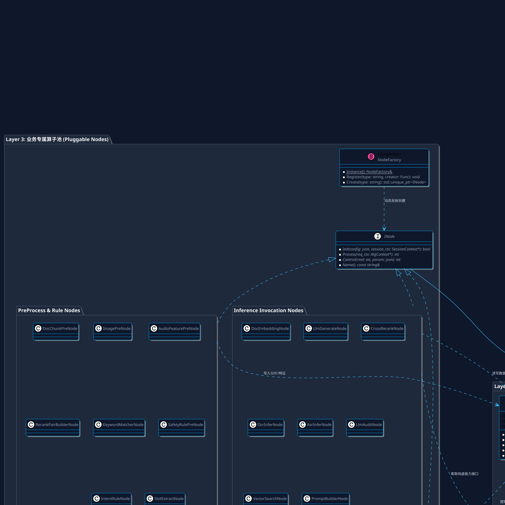

# 🚀 LLM-EdgeFlow

<p align="center">
  
</p>

<p align="center">
  <strong>High-Performance C++ Pipeline &amp; Heterogeneous Inference Framework for Edge AI &amp; LLMs</strong><br>
  <em>专为边缘芯片、嵌入式设备与企业级端侧场景打造的高性能 C++ 大模型算子流水线与异构推理编排框架</em>
</p>

<p align="center">
  <a href="https://en.cppreference.com/w/cpp/17"></a>
  <a href="https://cmake.org/"></a>
  <a href="https://github.com/google/googletest"></a>
  <a href="https://github.com/microsoft/onnxruntime"></a>
  <a href="https://github.com/ggerganov/llama.cpp"></a>
  <a href="https://github.com/chamsechan/LLM-EdgeFlow/blob/main/LICENSE"></a>
  <a href="#"></a>
  <a href="#"></a>
</p>

---

## 📖 About LLM-EdgeFlow (关于项目)

### 1. 为什么需要 LLM-EdgeFlow？
在端侧与边缘设备（如 **华为昇腾 Ascend、瑞芯微 RK3588、地平线 Horizon、NVIDIA Jetson、高通 Snapdragon**）部署落地 AI 算法时，算法团队通常面临三大核心痛点：

1. **跨部门交付与安全崩溃风险**：向下游集成部门交付动态库（`.so`/`.a`）时，需严格遵循纯 C ABI 接口规范。上层任何未捕获的 C++ 异常都会直接导致宿主主进程直接崩溃；
2. **边缘 DMA 定长 Batch 冲突**：边缘 NPU/DSP 通常采用静态编译，要求输入张量必须严格满足固定 `max_batch_size`（如 Batch=4），无法直接吞吐上层业务任意长度的多请求批次或 1对N 样本切片裂变；
3. **多模型/多模态/纯规则协同混乱**：大模型（LLM）、特征向量提取（Embedding）、交叉语义精排（Rerank）、视觉 OCR、语音 ASR 以及业务黑名单规则相互交织，缺乏低耦合、状态隔离且零内存泄漏的编排体系；
4. **底层推理引擎严重绑死**：算法代码深度耦合特定三方 SDK（如 ONNX Runtime、llama.cpp、TensorRT），芯片或引擎迭代时面临高昂的重构代价。

**`LLM-EdgeFlow`** 专为破解上述工程瓶颈而构建。它是一个**工业级、轻量化、高性能的 C++17 异构算子流与多模态模型推理编排框架**，提供 4 层严格分层隔离、全泛型定长 Batch 调度、动态异构黑板与双模可视化工具链。

---

## ⚖️ 架构横向技术对比 (Architecture Comparison)

| 核心特性与考量指标 | 传统 Ad-Hoc 算法胶水代码 | 传统云端框架 (如 Triton/vLLM) | **LLM-EdgeFlow (本框架)** |
| :--- | :--- | :--- | :--- |
| **对外导出接口规范** | 混乱的 C++ 类导出 / 易 ABI 损坏 | HTTP / gRPC 网络微服务 | **标准 6 大 C ABI 纯 C 接口 (`noexcept` 隔离屏障)** |
| **边缘 NPU 定长 Batch 适配** | 业务代码中硬编码 `if/for` 分批 | 针对云端可变 Batch / PagedAttention | **`FixedBatchExecutor` 全泛型自动补齐剥离与样本溯源** |
| **多模态与规则混合编排** | 复杂的全局单例 / 状态混杂 | 仅支持模型推理，规则需外部微服务 | **`AlgContext` 请求级动态黑板 + 7 大多模态全能算子池** |
| **底层硬件/推理引擎解耦** | 业务算子强依赖硬件 SDK 头文件 | 依赖云端 GPU / CUDA 驱动栈 | **PIMPL 零侵入隔离，JSON 配置热插拔切换任意芯片后端** |
| **三方依赖管理与构建** | 需在系统手动 `apt-get` / 易版本冲突 | 巨大的 Docker 容器镜像 (>10GB) | **CMake `FetchContent` 源码按需自动拉取，环境零依赖** |
| **嵌入式与开发板调试** | 依赖 GDB 打印或复杂日志分析 | 依赖 Web 监控后台 | **纯 C++ 原生零依赖 CLI (`alg_show`) + 交互式 Web 工作台** |

---

## 🌟 核心技术亮点 (Key Features)

```text
┌──────────────────────────────────────────────────────────────────────────────────┐
│  Layer 1: C ABI 适配层   ➔  Alg_Init / Alg_Create / Alg_Process / Alg_Destroy      │
│  Layer 2: 管线与黑板层   ➔  Pipeline (DAG 引擎) + AlgContext (类型安全动态黑板)      │
│  Layer 3: 业务算子池     ➔  前处理分片 / 模型调用 / 规则快筛 / 后处理精准对齐       │
│  Layer 4: 异构引擎层     ➔  FixedBatchExecutor + ONNX Runtime / llama.cpp / NPU  │
└──────────────────────────────────────────────────────────────────────────────────┘
```

- **🛡️ 纯 C ABI 安全屏障**：导出标准 6 大 C 接口（`Alg_Init`, `Alg_Create`, `Alg_Process`, `Alg_Control`, `Alg_Destroy`, `Alg_DeInit`），内部 `noexcept` 拦截所有异常，杜绝下游崩溃；
- **⚡ 异构多引擎隔离与热插拔**：基于 PIMPL 模式原生封装 **微软 ONNX Runtime**、**开源 llama.cpp GGUF 引擎** 与 **Mock NPU DMA 内核**，切换引擎无需改动任何 C++ 代码；
- **🎯 全泛型定长硬件 Batch 调度器 (`FixedBatchExecutor`)**：自动将 1-to-N 裂变的任意长度样本分块为 Hardware Batch，自动补齐 Dummy Pad 并在推理后剥离，保留 `(req_id, sub_id)` 溯源对齐；
- **🧠 动态类型安全异构黑板 (`AlgContext`)**：基于 `std::any` + `type_info`，跨算子传递复杂数据（图像 BBox、语音 PCM、高维 Tensor、JSON 结构体）无需手动写胶水层，生命周期全自动回收；
- **🧪 Google Test (GTest) 工业级测试体系**：CMake `FetchContent` 零环境依赖自动拉取 GTest，涵盖核心架构单测、C ABI 50 轮压测、双引擎比对以及多模态隔离验证；
- **📊 原生双模可视化工具链**：提供专为嵌入式设计的 **纯 C++ 原生 ASCII 拓扑命令行工具 (`./build/alg_show`)** 与 **交互式 Web DAG 工作台 (`./show --web`)**。

---

## 📦 已支持的 7 大全模态业务全景 (Multi-Modal Matrix)

同一个算法动态库 `libcompany_alg_sdk.so`，仅通过传入不同配置文件即可执行完全不同的业务拓扑：

| 业务 | 业务名称与定位 | 输入数据模态 (C ABI) | 依赖的核心模型算法与接口 (Layer 4) | 输出数据模态 (C ABI) | 配置文件 |
| :--- | :--- | :--- | :--- | :--- | :--- |
| **业务 1** | **关注词匹配业务** | `CompanyKeywordInputStruct`<br>(文本句子) | **零模型依赖** (纯规则前缀树/哈希快筛) | `CompanyKeywordOutputStruct`<br>(命中类别与词结果 JSON) | [`configs/pipeline_keyword_match.json`](configs/pipeline_keyword_match.json) |
| **业务 2** | **实体/名词抽取业务** | `CompanyEntityInputStruct`<br>(文本句子) | **`ILlmEngine`** (0.6B Qwen / llama.cpp) | `CompanyEntityOutputStruct`<br>(抽取出的名词列表 JSON) | [`configs/pipeline_entity_extract.json`](configs/pipeline_entity_extract.json) |
| **业务 3** | **智能长文档切片问答** | `CompanyDocInputStruct`<br>(长文档 + 用户 Query) | 1. **`IEmbeddingEngine`** (向量表征)<br>2. **`ILlmEngine`** (1.5B 文本摘要) | `CompanyDocOutputStruct`<br>(切片数 + 意图类别 + 答案) | [`configs/pipeline_doc_qa.json`](configs/pipeline_doc_qa.json) |
| **业务 4** | **智能对话风控质检** | `CompanyAuditInputStruct`<br>(对话文本 + 渠道) | 1. **`IEmbeddingEngine`** (初筛召回)<br>2. **`IRerankEngine`** (Cross-Encoder)<br>3. **`ILlmEngine`** (7B 违规判决) | `CompanyAuditOutputStruct`<br>(风险等级 + 风险分 + 判决) | [`configs/pipeline_dialogue_audit.json`](configs/pipeline_dialogue_audit.json) |
| **业务 5** | **多模态图文发票抽取** | `CompanyOcrDocInputStruct`<br>(图片路径 + 提问 Prompt) | 1. **`IOcrEngine`** (OCR 文字区块检测识别)<br>2. **`ILlmEngine`** (版面理解与结构化) | `CompanyOcrDocOutputStruct`<br>(检测框数 + 结构化发票 JSON) | [`configs/pipeline_ocr_doc_qa.json`](configs/pipeline_ocr_doc_qa.json) |
| **业务 6** | **语音识别与槽位抽取** | `CompanyAudioInputStruct`<br>(原始 PCM 浮点音频流) | 1. **`IAudioAsrEngine`** (时序语音转写)<br>2. 规则 / NLU 槽位提取器 | `CompanyAudioOutputStruct`<br>(转写文本 + 意图槽位 JSON) | [`configs/pipeline_audio_asr_intent.json`](configs/pipeline_audio_asr_intent.json) |
---

## 📐 框架类图与 PlantUML 架构设计 (Class Diagram & Architecture)

<details open>
<summary><b>🔍 点击查看 4 层分层架构与完整类图 (PlantUML)</b></summary>



</details>

---

## 📁 目录层级结构 (Directory Layout)

```text
LLM-EdgeFlow/
├── include/
│   ├── company_alg_interface.h # Layer 1: 对外标准 C ABI 接口与结构体
│   ├── core/                   # Layer 2: 核心框架头文件 (黑板 / DAG / 溯源)
│   │   ├── alg_context.h       #   - 请求级动态异构黑板 (std::any 类型安全)
│   │   ├── traceable_item.h    #   - 带 (req_id, sub_id) 样本溯源容器
│   │   ├── node_base.h         #   - 算子纯虚基类 INode
│   │   ├── node_registry.h     #   - 算子动态反射工厂
│   │   ├── session_context.h   #   - ModelManager 会话模型容器
│   │   └── pipeline.h          #   - 核心管线调度器
│   └── engine/                 # Layer 4: 引擎抽象能力接口
│       ├── engine_interface.h  #   - 纯虚接口 (LLM, Embed, Rerank, OCR, ASR)
│       ├── engine_registry.h   #   - 引擎反射工厂
│       └── fixed_batch_executor.h # - 全泛型定长 Batch 调度模板
├── src/
│   ├── core/
│   │   └── pipeline.cpp        # 管线加载与执行实现
│   ├── engine/                 # 引擎私有实现 (按后端子目录严格物理隔离)
│   │   ├── mock_npu/           #   - NPU 模拟与定长 DMA 批处理实现
│   │   ├── onnx/               #   - 微软 ONNX Runtime 向量与精排引擎实现
│   │   └── llama_cpp/          #   - 开源 llama.cpp GGUF 大模型引擎实现
│   ├── common_nodes/           # 通用可复用算子 (PromptBuilder, VectorSearch)
│   ├── business/               # 业务专属算子 (7 大业务独立子目录)
│   │   ├── keyword_match/      #   - 业务 1: 关注词匹配算子
│   │   ├── entity_extract/     #   - 业务 2: 实体/名词提取算子
│   │   ├── doc_qa/             #   - 业务 3: 智能长文档问答算子
│   │   ├── dialogue_audit/     #   - 业务 4: 对话风控质检算子
│   │   ├── ocr_doc_qa/         #   - 业务 5: 多模态图文发票抽取算子
│   │   ├── audio_asr/          #   - 业务 6: 语音识别与意图抽取算子
│   │   └── cross_rerank/       #   - 业务 7: 纯语义精排打分算子
│   ├── adapter/
│   │   └── company_c_adapter.cpp # 对接公司 C ABI 接口的安全胶水层
│   └── tools/
│       └── alg_show.cpp        # 纯 C++ 原生零依赖 DAG 可视化工具
├── configs/                    # 9 大标准化业务配置文件 (JSON)
├── demo/
│   └── main.cpp                # 7 大业务端到端全链路集成演示
├── tests/                      # Google Test (GTest) 单元测试套件
├── cmake/                      # CMake 自动拉取与第三方依赖配置
├── scripts/                    # 自动化测试与 Google 规范格式化脚本
└── tools/visualizer/           # 交互式 Web DAG 可视化工作台
```

---

## 🚀 快速上手与编译运行 (Quick Start)

### 1. 编译工程 (自动拉取 GTest, ONNX Runtime, llama.cpp)

```bash
mkdir -p build && cd build
cmake ..
make -j4
```

### 2. 运行 7 大业务端到端全流程集成演示

```bash
./build/alg_demo
```

### 3. 执行全量 Google Test (GTest) 单元测试套件

```bash
# 运行底层硬件定长 Batch 补齐与剥离单测
./build/test_batch_executor

# 运行框架核心黑板/反射工厂/模型管理器单测
./build/test_framework_core

# 运行标准 C ABI 安全边界与 50 轮生命周期压测
./build/test_c_abi_safety

# 运行 Qwen 大模型双推理引擎 (NPU vs llama.cpp) 交叉比对单测
./build/test_qwen_engines_comparison

# 运行多模态 (OCR + 语音 ASR + 语义精排) 异构输入输出隔离单测
./build/test_different_io_modalities
```

### 4. 执行全层级自动化质量验收测试套件 (Quality Assurance)

```bash
./scripts/run_all_tests.sh
```

### 5. 一键代码格式化 (Google C++ Style)

```bash
./scripts/format.sh
```

---

## 📊 算法管线与 DAG 可视化工具 (Visualizer)

### 1. 命令行拓扑打印 (适用于终端或嵌入式环境调试)
```bash
# Python 命令行工具
./show configs/pipeline_doc_qa.json

# 纯 C++ 原生零依赖工具 (专为开发板/嵌入式 Linux 设计)
./build/alg_show configs/pipeline_ocr_doc_qa.json
```

### 2. 启动交互式 Web 可视化工作台
```bash
./show configs/pipeline_dialogue_audit.json --web
```
在浏览器打开 `http://localhost:8080`，即可进行 DAG 拓扑监控、黑板数据流向追踪与动态单步推演仿真！

---

## 📄 License & Standards

- **Language Standard**: Modern C++17
- **Code Style**: Google C++ Style Guide ([`.clang-format`](.clang-format))
- **Test Framework**: Google Test (GTest v1.14.0)
- **Supported Backends**: NPU DMA, ONNX Runtime, llama.cpp (GGUF), Ascend CANN, RKNN, Horizon BPU
- **Deployment Targets**: x86_64, aarch64 (Linux, Embedded Edge SoC, Android/QNX)
