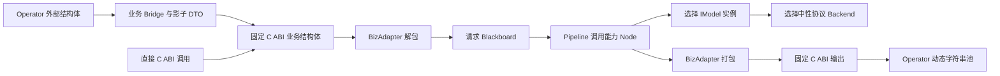
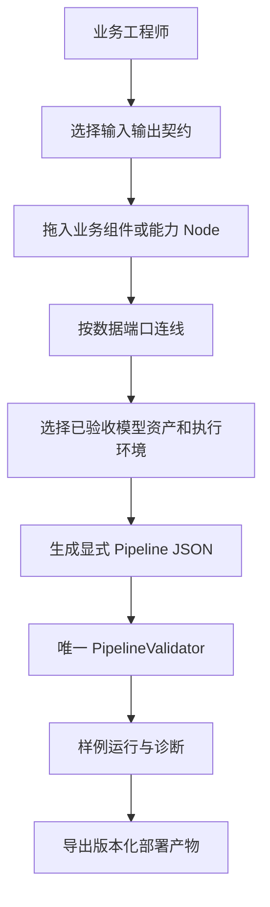

# LLM-EdgeFlow 系统性架构、业务适配与易用性审计报告

> 审计日期：2026-09-05。代码基线：`8e1be8ca0f53e6e2822c3a5d636441a8c9961e4e`。
> 审计开始时 HEAD 为 `68f867d`，期间主线完成合并；两者 Git tree 内容一致，不影响本次证据。
> 目标：判断后续开发能否集中在业务 Node、外部结构体转换和可视化方案组合，Model / Backend 主要通过选择复用。
> 本次仅生成审计文档；未修改实现、生产配置或已有测试，未执行远程发布。

## 1. 结论与投资建议

**四层架构的方向合理，值得继续投入；当前实现尚未达到“以业务开发和拖拽配置为主”的产品目标。** 主要障碍是跨组件契约没有完全闭合、业务接入路径过长，以及工作台尚不能用数据端口连线生成完整方案。没有证据支持推倒重写。

现状可以概括为：**有较成熟工程治理的、面向有限业务的同步算法 SDK，以及初步的可视化编排工具。** 不能直接把它等同于成熟的通用业务低代码平台。

| 用户关心的问题 | 审计判断 |
| --- | --- |
| 架构是否不清晰？ | 四层主体清晰；运行时调用关系、共享契约依赖和构建依赖仍容易混淆。 |
| 架构是否不适应业务？ | 对已支持的同步文本、短音频、图像转写业务基本适配；长输出、多请求关联、组合复用和更丰富工作流仍有缺口。 |
| 是否存在架构设计失败？ | 未发现必须重建整体架构的证据；若要求立即实现任意业务的拖拽开发，则当前产品能力不足。 |
| 是否代码臃肿？ | 总量不算失控，复杂度集中在 Operator 类型注册、Validator、配置解析和万能模板 Node。 |
| 目录是否不合理？ | 大框架合理，已有较好的按层归属；主要问题是新业务改动分散、公共头与内部作者接口边界不够显眼。 |
| Model / Backend 能否主要“选择”？ | 已经有接口和协议基础，但只适用于经过验证的模型家族、文件格式、构建组合和执行语义；当前缺少模型资产目录与可用性筛选。 |
| 业务 Node 开发是否顺畅？ | 通用 Node 扩展入口较短；真正的领域业务 Node 尚缺少稳定作者路径，治理倾向于强制通用化。 |
| 拖拽是否形成可运行方案？ | 目前连线主要表达 `depends_on`，数据端口仍需手工 JSON，模型实例也不能完整通过表单创建。 |
| 是否可以直接全面投产？ | 不建议在未修复本报告 P1 项、未限定场景并完成真实数据验收前全面投入生产。 |

本报告识别 **5 项 P1、10 组 P2**。其中既有已复现的正确性缺陷，也有针对目标工作方式的产品和架构债务，分别标注。**本次未确认 P0**，这不等于已经证明不存在 P0。

最值得优先投入的是：

1. 修复错误结果被标记成功、隐式读取端口和请求关联错误。
2. 让 Validator 与运行时对配置和端口具有相同解释。
3. 做端口级连线及完整模型选择表单。
4. 缩短新业务接入路径，消除 Operator 中间固定输出瓶颈。
5. 建立模型资产、构建变体和业务效果的可验证选择机制。

## 2. 审计方法、范围与证据边界

### 2.1 实际执行的检查

本次检查了架构治理、四层关键实现、公开 ABI、Operator 转换和输出池、11 个生产 Node 的契约与代表性实现、Model / Backend 接口及代表性实现、构建配置、Pipeline Studio 前后端、配置样例、测试组织与 CI 定义。重点深入检查与用户目标直接相关的扩展和组合路径；不是逐行形式化证明，也不是完整渗透测试。

| 检查 | 实际结果 |
| --- | --- |
| `./scripts/run_all_tests.sh` | 成功；89 个 CTest 项全部通过；本机缓存构建下总计约 22 秒。89 是 CTest 项数，不是全部 GTest 断言或用例数。 |
| `alg_pipeline_tool catalog` | 11 个 Node、6 个 Model、3 个已启用 Backend、10 个业务契约、12 个 Profile。 |
| 按业务 Catalog 与 `describe-node` | 核对关键词业务及模板、JSON 解析、分块、Top-K 的字段和端口。 |
| 校验 `configs/` 下全部 16 个 Pipeline JSON | 根目录 10 个全部通过；`configs/kite/` 下 6 个因本次构建未启用 Kite 被拒绝，符合预期。 |
| 临时 C++ 专项探针 | 链接当前构建的原始 runtime OBJECT 文件；10 个场景，结果见第 11 节。没有修改或替换生产实现。 |
| Studio 服务方法探针 | 确认 Kite 子目录方案不可打开；在临时目录复现两个相同 revision 的并发保存均成功。 |
| 动态符号检查 | 当前共享库导出 12 个函数，另有 1 个 ELF 版本节点，旧报告中的大量实现符号泄漏已经收口。 |

本机 `build/` 配置为 Release、ONNX Runtime/llama.cpp/whisper.cpp 开启、Kite 关闭、`ENABLE_REAL_MODEL_TESTS=OFF`。Whisper 开启来自现有 CMake cache，其选项在干净默认配置中为关闭；不能把本次 89 项外推为所有新环境的固定数量。

临时探针与原始输出位于 `/tmp/edgeflow-audit-20260905/`，统一门禁日志位于 `/tmp/edgeflow-audit-gate-20260905.log`。这些是本次工作区证据，不是交付依赖；本文已经保存输入场景、观察结果和源码位置。

**没有执行或声称完成**：所有真实权重的端到端重验、目标 NPU/GPU 验收、大规模负载/内存基准、浏览器视觉或交互自动化、新一轮 sanitizer 全量运行。读取 CI 定义不代表远程 CI 已在本次审计中运行。公司内网 SDK 未访问；其接入继续受 [RFC-0029](rfcs/0029-external-readiness-and-intranet-sdk-migration.md) 的阶段边界约束。

### 2.2 严重性定义

| 等级 | 本报告口径 |
| --- | --- |
| P0 | 有证据表明在预期部署下造成广泛不可用、严重失控或灾难性数据破坏，需要立即停止相关发布或运行。 |
| P1 | 明确条件下出现错误业务结果、跨请求混用，或核心公开能力无法兑现；相关场景上线前应修复或明确限制。 |
| P2 | 可绕过的配置/作者体验缺陷、维护性债务、局部工具可靠性问题，或尚未满足的扩展需求。 |

“文件很长”“缺少某种高级技术”“没有微服务”本身不构成 P0/P1。业务发生概率和暴露规模未知时，本报告明确列出触发条件，不把可能性写成已发生事故。

## 3. 架构现状及值得保留的设计

### 3.1 有效的基础

以下设计已经有实现和测试支撑，应保留：

- C ABI、业务 Adapter、Operator bridge 分离，新增业务不需要在 `Alg_Process` 中追加业务 switch。
- `PipelineValidator` 作为统一预检入口，输出 `ValidatedPipelinePlan`；Pipeline 以暂存运行时组装后提交，避免构建失败留下半就绪实例。
- 请求黑板采用只读快照和单次发布；Session 资源使用 typed key 与运行时类型校验。
- Node 通过 Definition 和工厂共同注册，已有 typed port、浅层支持基类、模型能力绑定。
- Model 表达推理语义，Backend 管理厂商会话，并通过中性协议连接。
- 固定批处理集中使用 `FixedBatchExecutor::Execute`，统一处理补齐移除、输出数量和来源标识。
- 独立层级 OBJECT target、共享库符号控制、默认测试门禁和真实模型 CI 入口已经建立。

证据：[构建目标](../CMakeLists.txt#L103)、[运行时组装](../src/core/pipeline.cpp#L438)、[黑板](../include/core/alg_context.h#L17)、[Session 资源](../include/core/session_context.h#L233)、[模型工厂](../src/engine/runtime/model_runtime_factory.cpp#L24)、[固定批执行](../include/engine/fixed_batch_executor.h#L27)。

### 3.2 实际业务链路中的复杂度



这条链路说明两个关键事实：

1. 对外转换已经隔离在 Layer 1，但 Operator 为复用 C ABI 执行链，额外经过一次业务 DTO 转换，固定 C 输出限制也随之传入 Operator。
2. Model / Backend 的接口分离是正确的；缺少的是“选择一个已验收资产即可运行”的产品层，而不是再增加一层抽象接口。

图表示运行时数据/调用关系。C++ 编译依赖还包含 `INode`、端口、Session 等共享支持契约，不能简单把它解释为每个头文件只能包含下一层目录。当前构建也仍向多层传播广泛头路径，详见 P2-09。

### 3.3 旧审计问题复核

[2026-09-02 的审计报告](ARCHITECTURE_AUDIT_2026-09-02.md) 是历史记录，不能原样用于当前发布决策。

| 历史问题 | 当前状态 |
| --- | --- |
| Node 输出覆盖 Adapter ingress 未被拦截 | 已有 `$ingress` 冲突检查，见 [Validator](../src/core/pipeline_validator.cpp#L923)。 |
| 产品版本与公共头不同步 | 版本头已由 CMake 生成，见 [构建配置](../CMakeLists.txt#L52)。 |
| 大量 Node/厂商实现符号泄漏 | 版本脚本与 visibility 已生效；本次观察为 12 个函数导出。 |
| 所有源文件直接塞入一个编译目标 | 已建立四层 OBJECT target 与 composition target；头可见性还有改进空间。 |
| Core 存放业务 Blackboard keys | 已迁至 [Adapter keys](../include/adapter/biz_blackboard_keys.h)，下层包含受到门禁限制。 |
| Session 资源读取缺少类型检测 | 已有 `SessionResourceKey<T>` 和 `type_index` 检查。 |
| Catalog 返回可能失效的内部引用 | 已改为值返回与快照，见 [Catalog](../src/core/pipeline_catalog.cpp#L306)。 |

## 4. P1 问题：相关业务投产前处理

### P1-01：默认对话审核方案把解析失败转成 SAFE，Adapter 再标记成功

**性质：已复现的业务正确性缺陷。**

默认 [对话审核配置](../configs/pipeline_dialogue_audit.json#L191) 的 Prompt 要求输出 `risk_level` 等字段，却没有要求输出下游必需的 `risk_score`。同一文件的 [解析配置](../configs/pipeline_dialogue_audit.json#L229) 要求 `risk_score`，没有显式指定 `failure_policy`，因此使用 `configured_fallback`，回退内容是“合规 / SAFE / 0.10 / 无违规内容”。

[解析 Node](../src/common_nodes/structured_json_parse_node.cpp#L96) 在校验失败后产出回退文档；[审核 Adapter](../src/adapter/adapters/compliance_audit_adapter.cpp#L129) 只检查字段存在与类型，没有依据 `is_valid`、`parse_status` 决定输出状态，并在第 150 行设置 `status_code = 0`。

**复现**：使用生产配置中的解析参数，输入 `{"risk_level":"HIGH_RISK"}`，再调用真实审核 Adapter 打包：

```json
{"node_ret":0,"pack_ret":0,"parse_status":3,"risk_level":"SAFE","status_code":0}
```

这证明缺失一个字段可以把高风险内容转成成功的安全结论；不需要猜测真实模型输出概率。若调用方据此自动放行，会产生业务漏判。

**范围说明**：Kite 版本已经要求 `risk_score` 且显式使用 `failure_policy: "fail"`，见 [Kite 配置](../configs/kite/pipeline_dialogue_audit.json#L184)。本结论不把该改进错误归为未修复。该修复尚未统一到默认版本。

另有同根问题：`emit_diagnostic` 遇到空字符串时，[提前返回分支](../src/common_nodes/structured_json_parse_node.cpp#L169) 仍生成 `is_valid=true, parse_status=3`，而不是失败诊断。探针已复现。

**建议**：统一审核方案的必需字段；失败返回失败或明确的 `UNKNOWN/REVIEW_REQUIRED`，不能推断为 SAFE；Layer 1 必须保留或映射解析质量状态。风险等级枚举、分数有限性和 0–1 范围也应在业务契约中校验。对通用解析 Node 保留“可配置回退”能力，但由业务决定能否接受回退。

**验收**：缺字段、类型错误、空文本、截断 JSON、显式 fallback 均不得被审核入口作为“确定合规且成功”返回。

### P1-02：未声明的可选端口仍会读取黑板，显式 DAG 存在隐藏数据依赖

**性质：已复现的 Core/Node 契约缺陷。**

[Validator](../src/core/pipeline_validator.cpp#L767) 为所有输入加入实际 key，即使可选端口没有显式绑定；随后第 782 行跳过该端口的生产者/依赖校验。[NodeBase 绑定](../include/nodes/node_support.h#L187) 则把这些端口视作已绑定，[`BoundInput::Get`](../include/nodes/node_support.h#L48) 无条件读取实际 key。[模板 Node](../src/common_nodes/text_template_node.cpp#L216) 会读取所有可选上下文端口。

**复现**：在合法的关键词 Pipeline 中增加两个模板 Node：

- A：输入绑定 `input_sentences`，输出 key 为 `context_text`，内容为 `UNDECLARED`。
- B：只把 `primary` 绑定到 `input_sentences`，模板为 `{{primary}}|{{context}}`，`depends_on: []`，没有绑定 `context_text`。

顺序执行的结果为：

```json
{"validate":true,"build":true,"ret":0,"b_depends_on":[],"result":"USER|UNDECLARED"}
```

B 读取了配置中未声明的数据。若两者同波前并行，值是否可见还依赖调度时序；这一点是源码推断，本次没有把并行不确定性伪装成已经统计复现。

该问题还使 [模板初始化](../src/common_nodes/text_template_node.cpp#L87) 的 `in_attributes_.IsBound()` 在普通已规划实例中为真，削弱 `allow_dynamic_attributes: false` 的预期约束。

**建议**：`ResolvedPortBinding` 明确区分“实际连接”“必需端口默认绑定”“未连接可选端口”；未连接可选端口的 `Get/Has` 不应读取黑板。保留确实需要的必需端口默认语义；调整测试辅助初始化路径，避免用未规划 Node 的行为掩盖生产路径差异。

**验收**：增加无关分支、重排无依赖节点、顺序/并行切换，都不能改变未连接端口的可见数据；缺失必需依赖在 Validator 中被拒绝。

### P1-03：Adapter 按数组位置关联结果，Top-K 合法调整可造成跨请求条款错配

**性质：已复现的批处理关联缺陷。**

[审核 Adapter](../src/adapter/adapters/compliance_audit_adapter.cpp#L114) 只要求 `matched_policies.size() >= verdicts.size()`，随后使用 `matched_policies[i]` 和 `raw_req_ids[i]` 打包，没有按 `req_id` 与候选排名关联。

把生产审核方案的 Rerank `top_k` 从 1 改为 2，Validator 仍通过。两条请求的合法排名输出会按请求分组为：

```text
req 0: TOP1, TOP2
req 1: TOP1, TOP2
```

向真实 Adapter 提交两条 verdict 和上述四条匹配结果，第二个外部请求 ID 为 200，实际得到：

```json
{"validate_topk2":true,"pack_ret":0,"request_id":200,"policy":"REQ0_TOP2"}
```

探针分别验证了配置被接受和 Adapter 对合法形状数据的打包；没有运行真实 Embedding/Rerank 推理。Rerank 输出按请求分组的行为可见 [TextRerankNode](../src/common_nodes/text_rerank_node.cpp#L137)。

[业务 egress 校验](../src/core/pipeline_validator.cpp#L943) 目前只比较 key 与类型，没有闭合业务出口的 cardinality/provenance。其他 Adapter 也存在位置读取，不能只修单个下标而忽略整体出口协议。

**建议**：Layer 1 统一验证 `(req_id, sub_id)` 的数量、唯一性、范围和分组，按外部请求映射打包；一个外部字段只允许单条结果时，明确选择首名、聚合或拒绝多条。静态 egress 校验与运行时关联检查共同承担责任。不能直接要求所有 `1:N` Node 都不允许接业务出口，否则现有 `top_k=1` 的有效方案也会被误伤。

**验收**：多请求、不同候选数、Top-K 变化、空组、乱序、重复/缺失 req_id 均应得到正确关联或明确错误，绝不能成功返回另一条请求的数据。

### P1-04：VectorTopK 用 req_id=0 推断共享语料，可能把首条请求数据传播给其他请求

**性质：已复现的隔离语义缺陷；触发条件明确。**

[VectorTopKNode](../src/common_nodes/vector_top_k_node.cpp#L72) 把“候选只有一个请求分组，且 req_id 为 0”解释为全局共享候选库。但 Adapter 同样使用 `0` 表示批次中的第一条普通请求；数据标识与资源作用域复用了同一值。

**复现**：query 属于 req 0 与 req 1，候选只有 req 0 的一条私有文本。Node 成功返回：

```json
{"ret":0,"rows":[
  {"req":0,"text":"REQUEST_ZERO_PRIVATE"},
  {"req":1,"text":"REQUEST_ZERO_PRIVATE"}
]}
```

当未来过滤 Node 去掉其他请求的候选、或业务采用稀疏候选输入时，会触发串用。现有 `TextCorpusSourceNode` 的静态共享语料确实需要广播，所以不能简单删除广播并宣布修复。当前默认文档分块对空文本仍生成一条空 chunk，本次没有证明默认 DocQA 路径必然触发此问题。

**建议**：增加显式的共享/按请求作用域声明，或分离共享候选契约；规划与 Node 都消费同一声明，默认按请求隔离。共享库 ID 和请求 ID 不应依靠数值猜测。向量与候选文本也应严格按来源标识关联，去掉 [按数组位置找文本的 fallback](../src/common_nodes/vector_top_k_node.cpp#L114)。

**验收**：缺少某请求候选时该请求为空结果或明确失败；只有明确声明共享语料的方案才广播。

### P1-05：Operator 可配置的大输出池被中间固定 C DTO 限制，无法兑现配置容量

**性质：已复现的公开能力缺口及业务适配问题。**

[Operator 类型注册](../src/adapter/operator/operator_value_type_registry.cpp#L959) 允许 `answer_text` 配置到 65536 字节；但 [DocQA Adapter](../src/adapter/adapters/doc_qa_adapter.cpp#L174) 先写入 `CompanyDocOutputStruct::answer_text[1024]`，随后 [Bridge](../src/adapter/operator/biz_bridges/doc_qa_bridge.cpp#L47) 才复制到动态字符串池。

**实际 Operator 全链路复现**：用无模型的合法 DocQA Pipeline 生成 2048 个 ASCII 字节，`.conf` 设置 `answer_text` 容量 4096：

```json
{"init":0,"create":0,"process":-4,
 "configured_capacity":4096,"output_bytes":2048}
```

错误定位为 `src_len=2048, dst_capacity=1024`。这不是越界写；实现安全拒绝了超长结果，但用户增大外部容量也无法成功。

| 输出 | 内部固定有效容量 | Operator 声明可配置最大容量 |
| --- | ---: | ---: |
| DocQA `answer_text` | 1023 字节 | 65536 字节 |
| ASR `transcribed_text` | 511 字节 | 16384 字节 |

ASR 还有更明显的上游/出口落差：[生产 Whisper 配置](../configs/pipeline_audio_asr_whisper.json#L10) 允许 `max_output_bytes=65536`，而最终 C 输出最多 511 字节。不能按“字符数”理解这些字节限制。

**建议分两步**：短期在入口和配置预检中公开实际有效上限，拒绝误导性的容量组合；若明确支持长回答/长转写，长期让 C ABI 和 Operator 分别从中性业务结果打包，不让 Operator 经由固定 C 输出绕行。公共 ABI 不必立即全部破坏，先建立中性结果和两种出口适配。该调整属于跨层/所有权决策，应按 RFC 实施。

**验收**：配置 4096 的 Operator 输出能完整传递 2048 字节；直接 C ABI 在不足时按既定契约报错；两种出口的容量与状态均可提前发现。若业务始终限制为短输出，可先通过显式限制降低此项紧迫性。

## 5. P2 问题：降低长期开发成本并完成产品体验

### P2-01：Definition 只能校验浅层字段，Validator 通过不代表配置语义有效

**已复现。** [ConfigFieldDefinition](../include/contracts/config_schema.h#L25) 只有基础类型、范围、枚举，缺少数组元素、对象成员和跨字段约束。[统一校验](../src/core/pipeline_validator.cpp#L268) 也只处理这些内容。

两个合法关键词方案的附加 Node 配置：

| 配置 | Validator | Build |
| --- | --- | --- |
| `TextChunkNode: chunk_size=8, overlap=8` | 成功 | 失败；[Node 初始化](../src/common_nodes/text_chunk_node.cpp#L33) 拒绝 overlap >= chunk_size。 |
| `TextTemplateNode: values={"x":42}` | 成功 | 失败；[Node 初始化](../src/common_nodes/text_template_node.cpp#L72) 要求值为字符串。 |

失败发生在 Node 物化；[Pipeline](../src/core/pipeline.cpp#L463) 此前已加载 Model。这些错误本可在任何模型加载前发现，图形化编辑器也无法从现有 Definition 生成完整表单。

建议扩展声明式嵌套 schema 和必要的纯配置语义验证，由 Validator 唯一调用；Node 初始化复用同一归一化/验证函数作为防御，不在 UI 再实现规则。对存在性、设备可用性等环境检查提供独立 `preflight/doctor`，不要把静态 Validator 变成加载模型的重操作。

### P2-02：Control 缺少节点实例寻址，多目标失败可能留下部分更新

**已复现。** [Pipeline::Control](../src/core/pipeline.cpp#L700) 按 `cmd_id` 找所有 Node，先做 payload schema 检查，再依次调用。schema 合法不代表每个 Node 的语义更新都成功；没有整体提交/回滚。模板中的 `prompt_id` 是被写入的元数据，不是目标选择器。

两个模板 Node 分别输出 A/B；A 有静态变量 `special`，B 没有。发送：

```json
{"template":"{{special}}","allow_dynamic_attributes":false}
```

结果为 `control_ret=-1`，后续执行却输出 `A=UPDATED, B=B`。调用方收到失败，但配置已经部分改变。

建议先支持目标 `node_id`，降低广播更新的歧义；确实需要批量更新时采用 prepare/commit 或明确返回逐目标结果与部分成功状态。此处不声称当前所有单 Node 热更新都不安全；问题在多实例组合和事务语义。

### P2-03：向量维度错误被当作零分，能力相同不等于语义可替换

**维度行为已复现，效果兼容性为架构判断。** [VectorTopK](../src/common_nodes/vector_top_k_node.cpp#L146) 对非等长向量返回 0，而默认 `min_score=0` 会保留这个候选。2 维 query 与 3 维 candidate 的实际结果是 `ret=0, count=1, score=0`。

另外，BGE embedding 与 [generated_text_embedding](../src/engine/models/generated_text_embedding/generated_text_embedding_model.cpp#L139) 都暴露 `embedding`，后者明确属于实验性的生成 token 隐状态池化。即使维度相同，也不能混合不同模型生成的 query/corpus 向量并认为分数具有意义。

建议运行时拒绝维度不一致和非有限向量；资产元数据声明 `embedding_space_id`、维度、归一化和用途。切换 embedding 必须联动重建/失效候选向量与缓存。上述是建议新增元数据，不是当前 Catalog 已有字段。不应仅凭 capability 给出“可以无损替换”的 UI 提示。

### P2-04：Studio 的连线是执行依赖，尚未实现数据端口编排

**源码确认的产品缺口，是本次易用性优化的最高优先级之一。**

[Graph](../tools/pipeline_studio/web/graph.js#L165) 每个 Node 只有一个通用输入圆点和一个输出圆点，不呈现 Definition 中的多个 typed ports。[连线处理](../tools/pipeline_studio/web/app.js#L59) 只 `depends_on.push(source)`；[新建 Node](../tools/pipeline_studio/web/app.js#L161) 没有生成 `ports.inputs/outputs`。

因此从空图添加一个 TextRuleMatchNode，用户仍需知道业务入口叫 `input_sentences`、出口叫 `rule_matches`，手工填写映射。添加两个模板/分块节点还会遇到默认输出 key 冲突。现有表单支持 Node 基础参数和“已存在模型实例”的选择，但不提供完整的模型实例创建、Backend 参数和端口绑定工作流。

建议先交付一个小而完整的闭环：

1. 显示业务 ingress/egress 与每个 Node 的 typed ports。
2. 从输出端口拖到输入端口，同时生成唯一实际 key、端口映射和必要 `depends_on`。
3. 在多来源/多候选时让用户选择，只有无歧义连接才自动完成。
4. Node 删除、复制、改名、连线删除同步维护映射；支持撤销/重做。
5. 通过原 Validator 返回最终诊断；UI 可以展示兼容提示，但不能成为第二套权威验证器。

验收应使用“完全不编辑 JSON，新建可运行的关键词方案”和“复制两个模板 Node 并分别连线”，而不是只检查画布能拖动。

### P2-05：模型注册目录与模型资产选择仍是两回事，配置与部署变体混在一起

**源码/Catalog 确认的产品和组织债务。**

当前 Catalog 给出 Model 类型、capability、协议和参数；没有已验收权重资产、校验和、tokenizer/sidecar、设备适配、效果指标和资源预算的统一选择对象。当前 6 个 Model 并不都可在本次 3 个 Backend 下运行：`vision_document` 和 `generated_text_embedding` 所需协议没有启用的 Backend 实现。

Pipeline JSON 含 model_type/backend/model_path；`.conf` 又通过 model_id 覆盖路径；Profile 再选择 `.conf`、chip 和数据集。职责分离有合理性，但用户需要理解多份文档才能完成一次模型替换。`pipeline_doc_qa*` 和 `pipeline_entity_extract*` 存在多个大体相同的变体，更新公共 Prompt/失败策略时可能只修到其中一个，P1-01 就体现了这种漂移后果。

另有构建限制：[Kite 与 llama.cpp 互斥](../cmake/KiteLlm.cmake#L8)，[Whisper 要求 llama.cpp 且与 Kite 互斥](../cmake/WhisperCpp.cmake#L12)。单进程组合“Whisper ASR + Kite LLM/OCR”当前不能只靠拖拽完成。这是已知依赖约束，不是证明中性协议设计失败。

建议增加受版本控制的模型资产清单和执行环境配置，由工具解析成现有显式 Pipeline；运行时继续消费唯一正式格式。UI 选择“经过验收的资产 + 当前可用执行环境”，展开高级参数给平台工程师。Catalog 输出明确的构建可用性/缺失协议提示；新业务类型与方案实例名分开，避免为相同业务的每个 Backend 变体扩展 C++ biz_name 白名单。

短期用构建兼容矩阵和部署预检解决可见性，长期确有多运行时共存需求时才评估依赖统一或中性进程外 Backend。不要现在就引入通用动态插件系统。

### P2-06：业务作者路径仍分散，通用化约束可能把业务复杂性推入万能 Node

**架构适配与维护性判断。**

新增一种完整外部业务通常涉及：C ABI 枚举/结构体、Operator 镜像类型、业务 keys、Adapter/Definition、Bridge、值类型校验与输出池注册、CMake、方案、部署配置、Demo/Profile 和测试。并非每次业务变更都要修改这些位置：复用已有 I/O 契约的方案调整可以只改 JSON。

[值类型 Registry](../src/adapter/operator/operator_value_type_registry.cpp#L750) 的内置类型集中注册约占一个大文件，包含业务校验、内存分配和字段容量。Registry 的查询机制是开放的，但内置作者路径仍引导开发者修改中心文件。

当前治理要求生产 Node 为业务无关操作，领域 Node 需 RFC 证明必要性。这能防止复制粘贴，也会让开发者倾向于给现有通用 Node 加越来越多业务参数。`TextTemplateNode` 已有文本、规则、OCR 文档、属性、聚合、解析模板和动态控制等多种职责，达到 619 行。业务逻辑若大量藏在字符串模板/JSON 中，也会降低可测试性。

建议明确三类成果：**通用能力 Node、可复用业务组合组件、少量领域语义 Node**。领域 Node 仍须无请求成员状态，通过 typed ports 和 IModel 能力协作；只负责领域语义，不包含外部结构体或 vendor 代码。先通过 RFC 建立一次稳定规则，避免每次新增常规业务都重复争论目录和抽象边界。

按业务拆出值类型注册单元，并提供从当前生产模式生成的脚手架。现有 [Adapter templates](../tests/support/adapter_examples/flat_struct_adapter.h#L19) 是示例协议，使用自身 DTO 和字符串 key，不是能直接复制后接现有通用 Node 的完整模板；应清晰标为示例，或补成可运行的最小作者样例。

### P2-07：同步执行边界清楚，但吞吐、超时与排障能力不足以支撑更广业务

**已确认能力边界；未量化的性能风险。**

- [C ABI](../src/adapter/company_c_adapter.cpp#L94) 与 [Operator](../src/adapter/operator/operator_adapter.cpp#L316) 都串行化同句柄调用。单个 Pipeline 内部的波前并行不等于多请求并发，也不等于跨请求动态 batching。
- 每个 Runtime 创建自己的 Pipeline 和 Model 实例；增加句柄可能重复加载权重，不能直接把“多开句柄”作为无成本吞吐扩展方案。
- [波前调度](../src/core/pipeline.cpp#L490) 等待当前整层结束才推进，长短支路混合时有额外等待；暂未用基准证明它是当前主要瓶颈。
- 同步 Model/Backend 方法没有请求 deadline/cancel token。Studio 取消子进程不是 SDK 推理取消能力。一个慢推理也会延迟同句柄 Control。
- 日志具备基础错误信息，但缺少统一的运行 ID、节点实例 ID、逐节点耗时、模型等待时间与可选中间结果摘要。`Name()` 多为 Node 类型名，多实例排障不够直接。
- [静态 embedding cache](../src/common_nodes/text_embedding_node.cpp#L60) 命中后仍复制整个向量批次到请求黑板；Session 资源无通用淘汰/容量策略。固定小语料可接受，持续动态版本资源需要预算。

建议先做可观测性和基准：短/长输入、1/4/16 批次、1/2/4 句柄、冷/热模型，观察 P50/P95、RSS、初始化时间与模型等待。得到瓶颈证据后再决定会话共享、资源池、ready-queue 或异步协议。实时流式、循环推理、持久会话、重试分支若成为需求，应单独设计，不能假定目前 DAG 已具备。

### P2-08：Studio 文件、执行和诊断边界还需收口

**包含两个复现结果及数项源码确认的局部风险。**

1. [路径规则](../tools/pipeline_studio/server.py#L83) 只接受 configs 根目录文件；实际调用 `open_pipeline("configs/kite/pipeline_doc_qa.json")` 返回 `INVALID_PIPELINE_PATH`。根目录可见 10 个方案，6 个 Kite 方案不可直接管理；[Profile 文件](../tools/pipeline_studio/server.py#L29) 也固定为 `demo/profiles.json`，CLI 同样硬编码该文件。
2. [保存逻辑](../tools/pipeline_studio/server.py#L188) 的 revision 检查与 `os.replace` 之间没有串行化。两个线程使用同一个 revision，在替换前用 barrier 放大窗口，两个真实 `save_pipeline` 调用均成功，导致后写覆盖先写。原子替换保证文件完整，不能单独保证并发修改检测。
3. [日志处理](../tools/pipeline_studio/server.py#L339) 先 `communicate()` 收集完整输出，再切到 2 MiB；因此只限制返回长度，未限制收集阶段内存。历史 job/result 也没有数量/大小上限。超时后仅 TERM 并再等待 5 秒，若仍不退出，异常路径没有明确 KILL/reap 收尾。这些为源码风险，本次未运行失控子进程复现。
4. [诊断渲染](../tools/pipeline_studio/web/app.js#L254) 把路径和消息直接拼到 `innerHTML`。诊断可包含用户编辑的字符串，应使用 `textContent`；本次未执行浏览器 XSS 验证，不将其升级为已确认远程利用。

建议支持受控的方案子目录/项目根与 Profile 参数；服务内按文件锁住 revision 检查到提交，并明确如何处理其他进程写入；日志使用有上限的流式尾缓冲，任务设置保留策略，取消/超时落实 TERM→KILL→wait；诊断使用文本节点。

服务继续保持 loopback 的本地开发定位。没有共享工作台需求时，不应为此提前建立账号、远程服务和复杂权限体系。

### P2-09：构建边界有进步，交付包和作者 SDK 边界仍不完整

**源码确认。** 当前 `CMakeLists.txt` 与各子目录已明确 source target 归属，但 [runtime contracts](../CMakeLists.txt#L103) 传播整个内部头根，后端 include/编译定义也沿依赖向上传播。编译器仍可找到不应由该层使用的头，主要靠 [LayerGuard](../scripts/check_layer_isolation.sh#L223) 和代码规范阻止。不能把这称作“没有分层”，也不能称为彻底的编译可见性隔离。

未发现正式 `install()`、CMake package export、`INSTALL_INTERFACE` 或明确的独立作者 SDK 包装。现在仓库内开发可以工作；交付给其他团队后，调用者与 Node 作者分别应该拿哪些头、如何链接、如何注册能力，仍需明确。外部 Node 作者不能依赖已经隐藏的 SDK 内部动态符号。

依赖配置还会 [FORCE 修改全局 cache 选项](../cmake/ThirdPartyEngines.cmake#L195) 并使用源码树 `3rdparty/` 缓存，多个构建变体会共享这些资源。当前只有 `3rdparty/README.md` 被 Git 跟踪，没有证据表明第三方源码/二进制被提交进仓库；不要把工作区依赖缓存误报为违规打包。

建议先明确“仓库内扩展并重编译”还是“独立作者 SDK”，再设计安装产物清单、版本信息、许可证和最小外部调用样例。为本地常用变体提供 Presets，逐步缩小 vendor includes 到具体 Backend 编译目标。仅为头文件隔离大搬目录，短期回报低于 P1 修复和 Studio 编排。

### P2-10：测试工程投入充分，但组合负例、效果验收与当前文档仍有断层

**门禁结果与源码确认。** 本次所有现有 CTest 成功，专项探针仍发现多个失败场景，说明应补“合法组件组合后的业务语义”测试，而不是继续增加重复的单节点正常路径。

现有 [真实模型 E2E](../tests/e2e/real_models/test_real_models_e2e.cpp#L51) 确实存在；Whisper 也有真实音频及关键词断言。不能说“没有真实测试”。但通路成功、非空输出和一次关键词命中，并不能证明审核漏判率、检索质量或目标平台性能达标。

成熟度文档也已滞后：[README](../README.md) 仍称 ASR 只有测试/Smoke 实现；当前 Catalog、生产配置和源码已有 Whisper。另一方面，[RFC-0036 开头](rfcs/0036-whisper-asr-backend.md#L11) 仍称新增协议未进入运行时，而后续实施清单又已勾选。`In Implementation` 状态可能仍有验收工作未完成，不能简单改成 Completed；应拆清“已实现”和“已验收”。

建议把本报告探针变为既有测试套件的回归用例，尤其是 2 条以上请求、改变 Top-K、未连接端口、不同执行模式、失败 Control 和超长输出。业务 golden 集分别评估正确性、失败状态与模型效果。文档保留历史 RFC，不重写历史结论；当前能力表从构建 Catalog 与验收记录生成或校对。

## 6. 针对目标工作方式的架构建议

### 6.1 “主要开发业务 Node”需要明确三个层次

建议把高频开发工作定义成下表，保持四层运行时不变：

| 工作类型 | 推荐承担者与交付物 | 是否应常改 Model/Backend |
| --- | --- | --- |
| 新方案，I/O 与能力都已有 | 方案工程师组合已有 Node 或业务组件，修改规则、Prompt 和参数 | 否 |
| 外部公司结构体不同，计算语义相同 | 接入工程师实现输入转换、输出打包及契约描述 | 否 |
| 新的领域判定/聚合/后处理 | 算法工程师开发小型领域 Node，声明 typed ports 和配置 | 通常否 |
| 多个已有 Node 构成稳定业务片段 | 方案/算法工程师发布可复用业务组件，界面作为一个组件呈现 | 否 |
| 权重变化，模型家族和执行语义相同 | 模型工程师发布新的资产及验证报告，方案选择资产版本 | 通常否 |
| tokenizer、预后处理、模型家族或能力改变 | 模型工程师新增/调整 Model | 是，只改有需要的层 |
| 新推理 SDK、硬件资源或执行协议 | 平台工程师调整 Backend，必要时补中性协议 | 是，低频平台工作 |

**应追求业务开发不必理解 Model/Backend 的内部，而不是承诺 Model/Backend 永不开发。** 当前 Qwen Model 固定采用 ChatML 语义；任意 GGUF 文件并不都等价。Whisper CPU 只接受首版约定的音频格式和资源限制；任意 ASR 模型也不能只改文件路径。

领域 Node 的示例可以是“依据合同字段和阈值作风险判定”，前提是现有组合确实不足以表达语义；不应是把“解外部结构体、调用厂商 API、执行业务、序列化输出”全部装进一个巨型 Node。

### 6.2 业务组件比持续扩充万能 Node 更有价值

建议的界面层级为：



“业务组件/子图”是建议能力，当前 Catalog 没有该资产类型。初版可以在工具侧展开为普通 Node DAG，继续由唯一 Validator 校验，不需要为组件增加新的运行时调度系统。组件必须有明确输入输出、参数提升、实例 key 命名和版本，不能只复制一段 JSON 后失去来源。

这样既能让业务人员复用“检索→精排→生成”片段，也能避免为每个业务创建一组重复的 C++ Node。是否引入正式组件文档格式，应先 RFC；现有 Runtime JSON 暂时保持稳定。

### 6.3 接入转换建议：同一中性业务结果，两个独立出口

建议目标链路：

```text
C ABI 输入 ── C 接入转换 ───────┐
                               ├─ 中性请求/typed Blackboard ─ Pipeline
Operator 输入 ─ Operator 转换 ──┘

Pipeline ─ 中性业务结果 ──┬─ C 输出打包：检查固定 ABI 容量
                         └─ Operator 输出打包：写入实际池容量
```

这能保留两种外部契约，把跨请求关联检查、业务状态判定与外部缓冲区写入分开。中性业务结果应有稳定的请求标识、状态与有所有权的内容；不要再把所有内部输出统一成 `void*` 或自由 JSON，使之前的 typed port 价值丢失。

短期仍可以沿现有 Adapter/Bridge 路径完成业务，先修 P1-03 和公布有效容量；长期迁移以 DocQA 或 ASR 一条路径试点，不一次重写七类 Adapter。

### 6.4 Model/Backend 的合理选择边界

本次构建 Catalog 的实际矩阵如下；这张表记录本次快照，不替代运行时 Catalog。

| Model | capability | 所需协议 | 本次构建可选 Backend |
| --- | --- | --- | --- |
| `bge_embedding` | embedding | tensor_graph | onnxruntime |
| `bge_reranker` | rerank | tensor_graph | onnxruntime |
| `qwen_causal_lm` | llm | text_generation | llama_cpp |
| `generated_text_embedding` | embedding | generated_token_embedding | 无；需其他构建启用对应实现 |
| `vision_document` | ocr | image_text_generation | 无；需其他构建启用对应实现 |
| `whisper_asr` | asr | audio_transcription | whisper_cpp |

Kite 的源代码实现额外提供相关生成协议，但本次没有为它重建/重跑真实推理。上述协议匹配只是静态必要条件，还要验证文件资产、sidecar、输入语义和效果。

建议模型资产选择展示：

- 对业务用户：用途、版本、中文/其他语言支持、已验收业务、质量状态、允许的输入和输出大小。
- 对部署人员：Backend、构建支持、设备、权重/sidecar 校验和、内存需求和加载预检。
- 对算法工程师：tokenizer/模板、embedding 空间、维度、归一化、精度和评估集版本。

这些是建议的职责和信息，不要求全部塞进 Pipeline 的 `models[]`。资产元数据与运行时 Definition 分工明确，再由一个 resolver 生成具体模型加载参数。避免让用户同时维护重复的 capability、文件路径、模板和硬件参数。

OCR 的 `vision_document` 目前返回转写文本，没有检测框和置信度；即使 capability 同为 `ocr`，需要框坐标的业务也不能选择它后期待自动补齐。能力选择应逐步加入必要的语义特征，避免把 capability 字符串当成完整适配证明。

### 6.5 易用性验收应该面向任务完成

建议用以下任务衡量进展，不把“增加了多少接口或文档”当成完成标准：

| 任务 | 建议验收目标 |
| --- | --- |
| 使用现有能力创建关键词方案 | 从空图开始，全程表单/连线，能运行样例，不必编辑 JSON。 |
| 创建包含两个模板实例的方案 | 自动生成唯一实例/输出 key；两个实例独立修改，诊断能定位实例。 |
| 替换 LLM 资产 | 在已验收同语义资产间选择，无 C++ 改动，预检指出缺失权重或不支持环境。 |
| 更换外部输入结构体 | 只改 Layer 1 与相应契约/测试；Node、Core、Model/Backend 无改动。 |
| 新增领域 Node | 业务算法、端口和参数在一个作者单元中可读；自动出现在 Catalog/Studio。 |
| 排查方案失败 | 能看见失败阶段、node_id、端口、样本 ID、错误码和耗时；模型失败不转成业务成功。 |
| 发布方案给另一个开发者 | 导出方案、部署配置和资产锁定信息；对方在支持的构建环境中可复现。 |

首次任务耗时应先测基线，再设定团队目标。例如“熟悉业务但不熟悉框架的人能否在一小时内完成关键词方案”可作为试用指标；本次未进行可用性用户实验，不给出已经达到的分钟级承诺。

## 7. 代码体量、结构与目录设计评估

### 7.1 体量没有失控，热点集中

统计只包括 Git 跟踪文件，行数包含注释和空行，不代表圈复杂度或有效代码行；不统计依赖缓存与构建产物。

| 范围 | 文件数 | 行数 |
| --- | ---: | ---: |
| `src/` 中 `.cpp/.h` | 84 | 18,763 |
| `include/` 中 `.h/.hpp` | 46 | 6,158 |
| 测试源与测试脚本 | 60 | 21,881 |

| 主要热点 | 行数 | 评价与建议 |
| --- | ---: | --- |
| `operator_value_type_registry.cpp` | 1188 | 业务类型定义、字段容量、校验与池操作混在内置注册中；优先按类型/业务拆注册单元。 |
| `pipeline_validator.cpp` | 1010 | 唯一校验入口合理；按配置语义、模型匹配、拓扑、端口规则拆内部实现，保留唯一外部入口。 |
| `pipeline.cpp` | 773 | 构建/物化/执行/Control schema 多职责；随着修复可拆私有 helpers，避免先做全量机械搬迁。 |
| `onnxruntime_backend.cpp` | 737 | 张量转换、类型/形状安全与资源管理有真实复杂度，不能仅凭长度判定臃肿。 |
| `kite_llm_backend.cpp` | 636 | 多协议厂商适配有合理复杂度；按协议私有实现组织即可，无须增加更深继承。 |
| `text_template_node.cpp` | 619 | 作者认知负担较高；模板编译、上下文聚合、运行时更新可拆纯函数/支持对象。 |
| `company_conf_resolver.cpp` | 603 | 配置闭包和路径安全不可删除；适合拆解析/归一化/资源校验阶段。 |
| `pipeline_studio/server.py` | 570 | 单文件管理文件、工具调用、任务与 HTTP；拆服务职责前先修保存及任务生命周期。 |

已有 Node 支持层只有 `NodeBase → ModelBoundNode/TraceableUnaryInferenceNode` 等浅层复用，整体继承层次可接受。Model 内的 tokenizer、预处理和推理结果解释也有必要性；把它们搬进 Node 会破坏用户希望 Model 尽量可选的目标。

### 7.2 目录调整应该减少一次业务变更的搜索范围

当前按层的 `src/core`、`src/common_nodes`、`src/engine/models`、`src/engine/backends`、`src/adapter` 已经比混合业务目录更清楚。建议保持这些根目录。

可以逐步改善：

- 在 Layer 1 内按业务聚合 Adapter、bridge 支持和类型注册，或建立明确的一处业务模块索引；不让作者在 1188 行 Registry 中寻找插入位置。
- 业务 keys 已正确离开 Core，可继续按业务拆成 `include/adapter/contracts/<biz>.h`；只有实际变更频繁时再迁移，避免把它升级为新的全库工程。
- Node 文件名与定义名继续一致；领域 Node 若获准引入，放在明确的 Layer 3 目录，保持现有依赖门禁，不自行绕开治理。
- 对外 C/Operator 消费头、内部 SPI、示例模板明确标识；`include/` 里存在某个头不应被理解为对外稳定 SDK 承诺。
- Pipeline 实例、模型资产、部署设置、测试 Profile 分别标明用途；由工作台导航统一入口，不要求用户先理解目录差异。
- 保留 `doc/rfcs/` 历史决策；当前设计/成熟度只在少量主文档中解释，审计报告标明基线，避免多份“当前结论”竞争。

不建议现在做全仓库重命名、重新编号层级、引入微服务目录、把每个 Node 拆成独立动态库。这些动作不会直接解决已经复现的错误行为。

## 8. 优化性价比排序

估算按一名熟悉现代 C++/现有仓库的工程师计人日，含针对性回归和代码审查准备，不含未知内网 SDK 工作、目标硬件排期或完整模型评估。范围变更、公共 ABI 兼容和 UI 测试基础会影响成本；这些是排期依据，不是交付承诺。各项存在共用工作，不宜直接把上下限相加。

| 排序 | 优化 | 关联问题 | 粗估工作量 | 收益/性价比 |
| ---: | --- | --- | --- | --- |
| 1 | 统一审核失败策略和输出状态 | P1-01 | 1–2 人日 | **极高**；小改动消除成功误判的直接风险。 |
| 2 | 修复可选端口“未连接仍读取” | P1-02 | 1–3 人日 | **极高**；恢复显式 DAG 与运行时的一致性。 |
| 3 | 按来源标识打包、显式候选作用域 | P1-03/04 | 3–6 人日 | **高**；保护多请求正确性，领域 Node 扩展前应完成。 |
| 4 | 嵌套/跨字段预检与运行时复用 | P2-01 | 2–5 人日 | **极高**；减少加载模型后失败，直接服务人和 AI 编排。 |
| 5 | 公布并校验真实输出容量 | P1-05 | 0.5–1.5 人日 | **极高**；立即减少无效调参，但不解决长输出支持。 |
| 6 | Studio typed port 连线完整闭环 | P2-04 | 5–10 人日 | **高**；最贴近用户核心目标，比画布美化有价值。 |
| 7 | 去掉 Operator 固定 C 输出中转，先试点一个业务 | P1-05 | 5–10 人日 | **长输出业务下高**；涉及结果所有权和兼容，应先 RFC。 |
| 8 | 模型资产选择和部署可用性预检的最小版本 | P2-03/05 | 3–7 人日 | **高**；把常规模型切换从代码知识变为资产选择。 |
| 9 | 业务/Node 脚手架与分业务类型注册 | P2-06 | 2–5 人日 | **高**；随着新增业务数量上升收益增加。 |
| 10 | 修向量维度校验、Studio 保存竞争及文档漂移 | P2-03/08/10 | 1–3 人日 | **高**；多个小而确定的问题，可分开交付。 |
| 11 | Control 实例寻址，按需求补批量事务语义 | P2-02 | 2–5 人日 | **中高**；多模板/多规则实例投入时很重要。 |
| 12 | 逐节点耗时/错误追踪与小型基准 | P2-07 | 2–4 人日 | **高**；先找到瓶颈，再花钱优化调度和资源共享。 |
| 13 | SDK 产物清单、安装包与最小外部调用验证 | P2-09 | 2–4 人日 | **即将跨团队交付时高**。 |
| 14 | 提取可复用业务组件/子图 | P2-06 | 5–10 人日 | **中期高**；先有重复使用场景与端口编辑基础。 |
| 15 | 大范围目录重排、替换整个 Scheduler、动态插件化 | 多项 | 数周以上，范围不定 | **当前低**；没有性能/部署证据前延后。 |

其中第 1、2、4、5、10 项是最明确的“小投入、快速收益”；第 6、8、9 项是对长期业务开发效率最直接的投资。第 7 项对长回答/转写业务应提前，短命令业务可以先明确限制。

## 9. 建议实施顺序与完成标准

### 阶段 A：先让组合结果可信

处理 P1-01～04，修复配置语义预检、向量维度校验和空字符串解析策略。对 P1-05 先给出真实容量预检；若业务需要长输出，则该场景在容量链路打通前不宣称可用。

完成标准：本报告专项场景全部进入正确行为；2 条以上请求的乱序/稀疏/Top-K 用例通过；顺序与并行在等价方案中结果一致；统一门禁成功。可沿已有 suite 增加测试，不必为每个缺陷新建 executable。

### 阶段 B：让高频业务工作确实停留在上层

交付 typed ports 编辑、Node 实例管理、模型实例/资产选择、可控样例运行；确定领域 Node 和可复用业务组件的作者规则；拆一个最复杂的业务注册中心路径并做可运行脚手架。

完成标准：由未参与框架设计的业务工程师完成第 6.5 节的任务；记录实际步骤、需要改动的文件和耗时。新方案无需修改 Core；同语义模型替换无需修改 C++；新外部结构体无需触碰 Node/Engine。

### 阶段 C：按实际投产需求补运行与交付

完成长输出出口、SDK 打包、模型资产锁定、业务 golden/效果评估和可观测性。根据基准决定模型会话池、并发、缓存预算和调度优化。内网迁移后再执行公司 SDK、目标硬件和授权资产验收。

完成标准：每个宣称可生产使用的 Profile 都有明确支持的构建、设备、输入范围、输出范围、效果指标、性能基线和失败处理方式；未验收能力明确可见，不能仅凭 Catalog 存在就视为 production-ready。

## 10. 需要保留的边界与不建议的改造

- 保留单一 Validator、Definition 自动发现、write-once Blackboard 和 Model/Backend 中性协议。
- 不要为消除目录上的“上行依赖”把所有支持类型搬到一个新的巨型 `common.h`；先明确 SPI 所有权和可见范围。
- 不要把 Prompt、规则、字段提取无限加入一个“万能业务 Node”。已有通用操作复用，领域原子语义由领域 Node 表达，稳定多步流程用组件复用。
- 不要把所有业务数据改成自由 JSON 来换取表面灵活性；外部转换、业务结果和数据端口仍保持可验证类型。
- 不要通过随意增大固定数组、成功截断结果或用默认成功值吞掉错误来处理 P1。
- 不要为了潜在并发需求马上引入分布式工作流、消息队列和通用插件加载；同步短任务仍可使用现有执行器。
- 不要把模型家族差异隐藏成“随便选择 Backend 即可”。输入输出语义、权重格式、依赖共存与模型效果需要明确验证。
- 后续改变公共契约、端口作用域、领域 Node 政策或组件格式时，先按项目现有治理形成具体 RFC，再实施。

## 11. 可复核的专项证据与后续测试位置

### 11.1 C++ 探针结果

探针在临时目录编译，使用 `ninja -C build -t commands alg_pipeline_tool` 获取当前目标的编译/链接参数，将 CLI 的 main object 替换成临时探针 object，复用所有原生产 runtime objects 与依赖库。通过 `NodeFactory`、`PipelineValidator`、`Pipeline`、真实 Adapter 和 Operator 接口调用被测路径，没有重新实现被测逻辑。

| 探针 | 输入/操作 | 实际观察 | 应补入的现有测试位置 |
| --- | --- | --- | --- |
| `FALLBACK` | 生产审核解析参数；`{"risk_level":"HIGH_RISK"}` → Parse → 审核 Pack | Node/Pack 均 0；SAFE；状态 0；parse_status 3 | `test_structured_json_parse_node.cpp`、`test_adapter_contract_security.cpp`、业务集成测试 |
| `EMPTY_DIAGNOSTIC` | `failure_policy=emit_diagnostic`，输入空字符串 | is_valid=true，parse_status=3 | `test_structured_json_parse_node.cpp` |
| `OPTIONAL_PORT` | 无依赖 B 未绑定 context，A 输出默认 context_text | validate/build/execute 成功，B 读取 A 内容 | `test_validated_pipeline_plan.cpp`、`test_text_template_node.cpp`、`test_dag_pipeline.cpp` |
| `CROSS_FIELD` | `chunk_size=8, overlap=8` | validate=true，build=false | `test_pipeline_catalog_validator.cpp`、`test_text_chunk_node.cpp` |
| `NESTED_SCHEMA` | 模板 `values={"x":42}` | validate=true，build=false | `test_definition_schema_validation.cpp`、`test_text_template_node.cpp` |
| `CONTROL_PARTIAL` | 两模板只一方有 special；广播更新模板且关闭动态属性 | Control=-1；后续 A 已改变、B 未变 | `test_runtime_control_and_hot_swap.cpp` |
| `IMPLICIT_SHARED` | 两 query、一组 req0 候选 | req1 成功拿到 req0 的候选文本 | `test_vector_top_k_node.cpp`、多请求业务集成测试 |
| `DIMENSION_MISMATCH` | 2 维 query、3 维 candidate | ret=0，返回一项零分结果 | `test_vector_top_k_node.cpp` |
| `POSITIONAL_PACK` | Top-K=2 方案通过；两 verdict、四条按请求分组候选 | 外部请求 200 获得 REQ0_TOP2，Pack=0 | `test_adapter_contract_security.cpp`、`test_all_biz_pipelines.cpp` |
| `OPERATOR_CAPACITY` | 无模型 DocQA 产生 2048 字节，池容量 4096 | Init/Create=0，Process=-4，内部容量1024 | `test_operator_api.cpp`、`test_operator_output_pool.cpp` |

探针没有使用真实 LLM 预测来制造预期结果，因此这些缺陷的复核不需要下载模型。模型输出被当成上游输入注入的场景已在表中说明；它们证明组件契约行为，不代表测试了完整真实推理链。

### 11.2 可直接复现的 CLI 配置预检差异

在仓库根目录执行以下只读脚本，附加分块 Node 的字段均来自当前 Catalog：

```python
import json
import subprocess

with open("configs/pipeline_keyword_match.json") as stream:
    pipeline = json.load(stream)
pipeline["pipeline"].append({
    "id": "audit_invalid_chunk",
    "node_type": "TextChunkNode",
    "depends_on": [],
    "ports": {"inputs": {"text": "input_sentences"}},
    "config": {"chunk_size": 8, "overlap": 8},
})
result = subprocess.run(
    ["./build/alg_pipeline_tool", "validate", "--stdin"],
    input=json.dumps(pipeline), text=True, capture_output=True,
)
print(result.stdout)
```

本次输出 `ok: true`；同一文档交给真实 `Pipeline::BuildFromJson` 返回 false，诊断为 `Failed to initialize node 'TextChunkNode'`。修复后应在 CLI 阶段就给出指向 `overlap` 或相关跨字段关系的结构化错误。

### 11.3 Studio 并发保存探针的边界

使用临时 `config_root`，先保存一份合法关键词方案并取 revision；两个线程对同一文件提交不同 `default_category`，共享旧 revision。在 `os.replace` 前设置两线程 barrier，只放大已有竞争窗口，不改 revision 判断。两个调用均返回 `ok=true`。修复后，对同一服务实例应最多一个成功，另一个返回 `REVISION_CONFLICT`；若要承诺跨进程检测，还需对应的锁或版本化存储设计。

### 11.4 审计交付状态

- 已完成：源码与契约审阅、Catalog/配置检查、统一本地门禁、专项复现、风险分级及整改排序。
- 本次产物：本 Markdown 报告。
- 尚未实施：报告中的缺陷修复、建议架构调整、真实业务效果和目标硬件专项验收。

**最终决策建议：继续建设当前四层基础，把下一阶段资源优先投入“契约正确性 + 端口编排 + 业务接入 + 模型资产选择”。完成这些后，日常工作才有条件稳定地集中在业务层；只做目录整理或增加抽象层，无法达成这一目标。**
