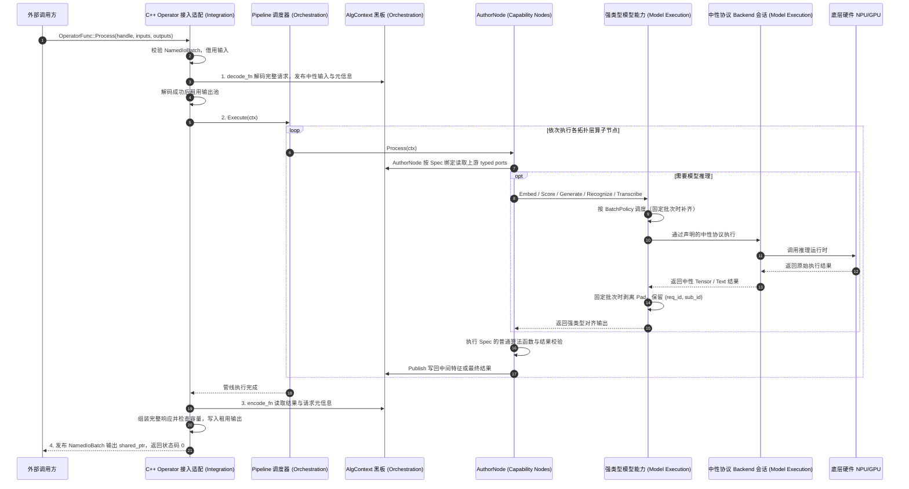

# LLM-EdgeFlow 架构设计

本文档说明 LLM-EdgeFlow 的职责边界、编译依赖和运行时数据流。算法方案由 Pipeline 组合能力节点，接入适配负责外部契约，模型执行负责模型语义与推理后端。

---

## 1. 架构总览

框架采用四层架构，统一按职责命名：**接入适配层 → 流程编排层 → 能力节点层 → 模型执行层**。

| 职责名称 | 英文名称 | 源码归属 | 构建目标 |
| :--- | :--- | :--- | :--- |
| 接入适配层 | Integration | `include/adapter/`、`include/edgeflow/operator/`、`src/adapter/` 及 C++ Operator 接口 | `edgeflow_integration_objects` |
| 流程编排层 | Orchestration | `include/core/`、`src/core/` | `edgeflow_orchestration_objects` |
| 能力节点层 | Capability Nodes | `include/nodes/`、`src/common_nodes/`、`src/custom_nodes/` | `edgeflow_capability_nodes_objects` |
| 模型执行层 | Model Execution | `include/engine/`、`src/engine/` | `edgeflow_model_execution_objects` |

文档、工具诊断和构建目标使用上述职责名称。旧资料中的 Layer 1–4 按表格顺序对应这四层；编号仅用于阅读历史记录。源码目录继续按 Adapter、Core、Nodes、Engine 等组件组织。

下图展示组件职责与调用关系；编译依赖由下文的构建边界约束。`include/core/` 中的中性运行时契约通过独立的 `edgeflow_runtime_contracts` 提供给实现层，不能将目录名称直接等同于完整编译依赖。

```mermaid
graph TD
    classDef integration fill:#E3F2FD,stroke:#1565C0,stroke-width:2px,color:#0D47A1;
    classDef orchestration fill:#E8F5E9,stroke:#2E7D32,stroke-width:2px,color:#1B5E20;
    classDef capability_nodes fill:#FFF3E0,stroke:#E65100,stroke-width:2px,color:#E65100;
    classDef model_execution fill:#F3E5F5,stroke:#7B1FA2,stroke-width:2px,color:#4A148C;
    classDef ext fill:#ECEFF1,stroke:#37474F,stroke-width:1px,color:#263238;

    subgraph External["外部调用方 (业务APP / 车机系统 / 边缘平台)"]
        Caller["下游集成程序 / 主控服务"]
    end

    %% Integration
    subgraph Integration["接入适配层（Integration）"]
        PlatformFacade["C++ Operator 门面 (operator_adapter.cpp)<br>• 命名 I/O 槽位校验与 ValueType 转换<br>• 有界输出池租约生命周期管理<br>• 同句柄 Process / Control 串行化<br>• 异常拦截屏障 (noexcept 安全防护)"]
        IoBinding["I/O 绑定与转换注册 (io_binding_registry.cpp)<br>• IoBindingRegistry / IoConverterRegistry<br>• InputConverter：完整请求解析与字段转换<br>• OutputConverter：完整响应组装与容量检查"]
    end

    %% Orchestration
    subgraph Orchestration["流程编排层（Orchestration）"]
        PipeCore["Pipeline 核心调度器 (pipeline.cpp)<br>• 消费 ValidatedPipelinePlan<br>• 算子波前执行与错误熔断"]
        
        subgraph StateMgr["三级状态与注册管理器"]
            S_Ctx["SessionContext (句柄级持久状态)<br>• ModelManager 多模型池<br>• SessionResourceKey&lt;T&gt; 类型安全缓存"]
            R_Ctx["AlgContext (请求级瞬态黑板)<br>• Read / Publish 不可变快照<br>• 只读视图随请求生命周期稳定"]
            TraceTag["TraceableItem 溯源追踪<br>• req_id (请求索引)<br>• sub_id (1对N分片索引)"]
            Factory["NodeRegistry / ModelRegistry / BackendRegistry<br>• 函数式 Node Spec 与 Model / Backend Definition"]
        end
    end

    %% Capability Nodes
    subgraph CapabilityNodes["能力节点层（Capability Nodes）"]
        NodeApi["INode 运行时接口"]
        NodeBase["NodeBase<br>final noexcept 生命周期与 Typed I/O"]
        ModelNode["AuthorNode：统一 Spec 执行<br>InputsOf / OutputsOf / ModelsOf"]
        CustomNodes["自定义节点扩展目录 (src/custom_nodes/)<br>复用现有接口，按操作组织文件"]
        
        subgraph CommonNodes["通用能力算子池 (src/common_nodes/)"]
            LlmNode["LlmGenerateNode (大语言模型生成)"]
            ChunkNode["TextChunkNode (文本切片)"]
            RuleNode["TextRuleMatchNode (规则与关键词匹配)"]
            EmbedNode["TextEmbeddingNode (向量提取)"]
            TopKNode["VectorTopKNode (Top-K 检索)"]
            RerankNode["TextRerankNode (精排评分)"]
            TemplateNode["TextTemplateNode (提示词模板渲染)"]
            JsonNode["StructuredJsonParseNode (JSON 结构化解析)"]
            AsrNode["AsrTranscribeNode (语音转写)"]
            OcrNode["OcrDetectNode (OCR 识别)"]
            CorpusNode["TextCorpusSourceNode (语料源)"]
        end
    end

    %% Model Execution
    subgraph ModelExecution["模型执行层（Model Execution）"]
        ModelBase["IModel 强类型能力抽象"]
        BackendBase["IInferenceBackend / IBackendSession<br>中性执行协议"]
        LlmIntf["ILlmModel + ITextGenerationSession<br>(formatted prompt / unified options / text)"]
        EmbedIntf["IEmbeddingModel / IRerankModel<br>TensorGraph / GeneratedTokenEmbedding"]
        
        BatchExec["FixedBatchExecutor (硬件固定 Batch 调度器)<br>• 样本自动 Chunking 分块<br>• 末尾 Dummy Pad 自动补齐<br>• 推理后剥离 Pad 并保留溯源标签"]
        
        subgraph ModelSemantics["模型语义实现 (src/engine/models/)"]
            BgeModels["BgeEmbeddingModel / BgeRerankerModel"]
            GeneratedEmbedModel["GeneratedTextEmbeddingModel<br>(generated token pooling / normalization)"]
            QwenModel["QwenCausalLmModel<br>(ChatML / provenance / protocol delegation)"]
            VisionModel["VisionDocumentModel<br>(图像解码与识别指令)"]
            WhisperModel["WhisperAsrModel<br>(音频校验与语言语义)"]
        end

        subgraph HardwareBackends["硬件推理 Backend (src/engine/backends/)"]
            OnnxBackend["OnnxRuntimeBackend<br>(TensorGraph, CPU/CUDA)"]
            LlamaCpp["LlamaCppBackend<br>(TextGeneration, GGUF runtime)"]
            KiteLlm["KiteLlmBackend<br>(Text / ImageText / GeneratedTokenEmbedding, conditional SDK)"]
            WhisperCpp["WhisperCppBackend<br>(AudioTranscription, optional build)"]
        end
    end

    %% 连接关系
    Caller <==|命名 I/O 批次 NamedIoBatch| PlatformFacade
    PlatformFacade --> IoBinding
    PlatformFacade -->|移交 Pipeline 计划 / 执行与控制| PipeCore
    IoBinding -->|解包/打包| R_Ctx
    PipeCore --> S_Ctx
    PipeCore --> NodeApi
    NodeApi --> NodeBase
    NodeBase --> ModelNode
    ModelNode -.-> CommonNodes
    ModelNode -.-> CustomNodes
    CommonNodes & CustomNodes -->|读写特征与溯源数据| R_Ctx
    CommonNodes & CustomNodes -->|从 ModelManager 获取模型| S_Ctx
    CommonNodes & CustomNodes -->|调用强类型模型能力| LlmIntf & EmbedIntf
    LlmIntf & EmbedIntf --> ModelSemantics
    ModelSemantics -->|仅依赖中性协议| BackendBase
    BackendBase --> HardwareBackends
    ModelSemantics --> BatchExec

    class Caller ext;
    class PlatformFacade,IoBinding integration;
    class PipeCore,S_Ctx,R_Ctx,TraceTag,Factory orchestration;
    class NodeApi,NodeBase,ModelNode,CommonNodes,CustomNodes,LlmNode,ChunkNode,RuleNode,EmbedNode,TopKNode,RerankNode,TemplateNode,JsonNode,AsrNode,OcrNode,CorpusNode capability_nodes;
    class ModelBase,BackendBase,LlmIntf,EmbedIntf,BatchExec,BgeModels,GeneratedEmbedModel,QwenModel,VisionModel,WhisperModel,OnnxBackend,LlamaCpp,KiteLlm,WhisperCpp model_execution;
```

---

## 2. 职责与扩展边界

### 接入适配层（Integration）
- **代码位置**：`include/edgeflow/operator/`，`include/adapter/`，`src/adapter/`
- **核心职责**：
  1. 导出基于命名 I/O 槽位的 C++ Operator 门面：`Get_LLM_EDGEFLOW_OperatorTable()`, `GetOperatorLastError()`, `ValidateOperatorConfigBinding()`；
  2. 导出公共日志 C API：`AlgBase_setLogLevelByName`, `AlgBase_getLogLevelByName`, `AlgBase_logPrint`；
  3. 充当 `noexcept` 安全屏障，拦截所有 C++ 异常，防止跨动态库边界崩溃；
  4. 由注册的 Input/Output Converter 与 IoBinding 解包完整外部请求并组装完整外部响应，负责外部契约与内部 `AlgContext` 中性值之间的转换；
  5. 管理有界输出池与租约生命周期，执行同句柄 Process/Control 串行化。

业务需求中的输入输出以 Operator 接口边界为准，包含载体中的业务字段和序列化格式。
Demo 不得提前拆解请求或在 SDK 返回后补组业务响应；内部节点端口不是外部 I/O 契约。
具体职责和判断示例见[输入输出边界](dev_guide/business_onboarding.md)。

#### 统一 Operator 门面与运行时架构

接入适配层通过标准 C++ Operator 门面与共享算法运行时调度算法执行：

```text
外部调用方 (NamedIoBatch) ──> OperatorFunc::Process ──> InputConverter ──> SharedAlgorithmRuntime
                                                                             │
                                                                             ▼
                                                                        Pipeline (DAG)
                                                                             │
                                                                             ▼
外部调用方 (获取已租用输出) <── 发布输出 <── OutputConverter <── 执行完成后
```

- 标准 C++ Operator API（`llm_edgeflow::operator_api`）为唯一公开算法接口，承诺 6 个导出符号（3 个 Operator API 函数与 3 个 AlgBase 日志函数）。Node、Registry、Model、Backend 及第三方运行时符号使用 hidden visibility，不构成稳定动态 ABI。
- 同一 handle 的 `Process` 与 `Control` 串行执行；不同 handle 可并行。`Destroy` 前调用方必须停止提交并等待该 handle 上所有调用返回，释放全部输出指针引用，返回后句柄永久失效。
- C++ Operator API 根据 Key 的最后一个点号解析槽位后缀：`OperatorValueTypeRegistry` 负责“后缀到外部 C++ 类型”的唯一绑定；`IoBindingRegistry` 负责按业务和方向将外部命名槽位映射到内部 Pipeline 逻辑端口。
- 组件调用关系：`外部调用方 → Operator → Pipeline → Node → Model → Backend → Platform`。
  `Operator` 表达对外交付的算法实例，`Platform`（`ComputePlatform`）表达底层硬件执行平台（CPU、CUDA、AX650、Ascend 等）。
- 同一业务可以使用一个聚合结构槽位，也可以由多个原子槽位组成；支持多槽位解绑。
- `CompanyString` 按 `length` 表达文本；Operator 输入校验拒绝原始嵌入 NUL，转换器和输出按显式长度处理，不静默截断。任意二进制数据使用 `CompanyBuffer`。
- 输入存储由调用方保持有效；Process 在同步调用内保留输入 shared_ptr 视图并复制所需中性值，不跨调用保存输入指针或引用。
- 输出由算法库在 Create 期按 `max_frame_depth` 预分配；Process 返回带自定义
  deleter 的 shared_ptr，最后一个引用析构后 reset 并回池；deleter 只捕获池状态的
  weak lifetime token，避免 Destroy 后解引用已释放句柄或池。
- 值类型表、业务桥接表和内存池只属于接入适配层，不得进入 Blackboard、Node、Model 或 Backend。
- 目标共享库输出名称为 `company_alg_sdk`，产品 VERSION 为 11.0.0，
  SOVERSION/ABI major 为 7。
- `OperatorFunc::Create` 和配置预检都以必填部署根 `model_path` 加相对 `cfg_file_name` 解析；
  `.conf` 只用 `pipe_path` 指向 Pipeline JSON，接入绑定与模型路径覆盖由 Pipeline 的 `deployment` 声明；
  Pipeline 的 `deployment.io.output_allocations` 按逻辑槽位归一化输出类型、分配方案、参数与容量；
  最外层的独立配置读取组件按固定枚举提取配置并返回字符串，注册方案在 Create
  将自己的参数文本解析为普通 C++ 结构；分配和业务转换共享该不可变结构。
  每个逻辑输出槽位拥有独立输出池，
  池深只由框架应用；分配实现只处理一份完整输出。见
  [输出分配方案](dev_guide/operator_output_allocation.md)。

### 流程编排层（Orchestration）
- **代码位置**：`include/core/`，`src/core/`
- **核心职责**：
  1. **配置驱动与执行计划**：接入适配层的 `PrepareDeploymentDocument` 准备部署信息和中性 `PipelineIoBoundary`，`PipelineValidator::ValidateAndPlan` 解析中性 Pipeline 配置、校验端口与显式 DAG，并生成 `ValidatedPipelinePlan`；`Pipeline::BuildFromPlan` 消费计划，不重复解析或排序；
  2. **三级状态管理**：
     - `SessionContext`：句柄级常驻状态，管理单句柄加载的多个模型实例
       （`ModelManager`）与 `SessionResourceKey<T>` 类型安全资源；同名异型访问在 cast 前
       fail-closed，`GetOrCreateResource` 对同一 key 执行 single-flight 创建；
     - `AlgContext`：请求级强类型黑板（`BlackboardKey<T>`），`Read` 返回请求生命周期内
       稳定的只读视图，`Publish` 拒绝重复生产；Adapter 与 Node 使用同一 write-once 契约；
     - `TraceableItem<T>`：样本溯源标签（`req_id` + `sub_id`），在 1对N 展开后标识每个分片，供后续聚合或回填对齐；
  3. **自注册 SSOT 机制**：Node 作者通过 `REGISTER_FUNCTION_NODE` 生成 Definition 并复用原注册机制，Model 与 Backend 分别通过 `REGISTER_MODEL_WITH_DEFINITION` 和 `REGISTER_BACKEND_WITH_DEFINITION` 就地声明；`PipelineCatalog` 查询返回值快照，Validator 消费注册 Definition 的值快照，后续注册不会使当前计划悬空。

### 能力节点层（Capability Nodes）
- **代码位置**：`src/common_nodes/`，`src/custom_nodes/`，`include/nodes/`
- **核心职责**：
  1. **算法工程师核心开发区**：算法使用普通函数，Spec 声明输入、输出、配置与模型，统一 `REGISTER_FUNCTION_NODE`；
  2. **异常安全屏障**：`NodeBase::Init` 和 `NodeBase::Process` 设为 `final noexcept`，`AuthorNode` 负责生命周期、端口读写、结果检查及快照，业务作者无需覆写；
  3. **模块化与配置组合**：11 类核心通用算子（`LlmGenerateNode`, `TextChunkNode`, `TextRuleMatchNode`, `TextEmbeddingNode`, `VectorTopKNode`, `TextRerankNode`, `TextTemplateNode`, `StructuredJsonParseNode`, `AsrTranscribeNode`, `OcrDetectNode`, `TextCorpusSourceNode`）全部收敛在 `src/common_nodes/`，通过 JSON Pipeline 自由编排。
  4. **领域扩展与复用**：用户算法集中在 `src/custom_nodes/`，按操作命名文件，可跨方案复用。
     全部 12 个生产 Node 共用函数式作者契约、能力节点层构建目标和注册机制；领域 Node 可完成前处理、声明绑定的
     模型调用与后处理，平台结构转换仍属于 Adapter。Core、Engine 和通用 Node 不依赖
     自定义实现。接入步骤见[自定义 Node 指南](../src/custom_nodes/README.md)。

### 模型执行层（Model Execution）
- **代码位置**：`include/engine/`，`src/engine/`
- **核心职责**：
  1. `IEmbeddingModel`、`IRerankModel`、`ILlmModel`、`IOcrModel` 和 `IAsrModel` 表达模型语义，Node 只依赖所需能力；
  2. `ITensorGraphSession`、`ITextGenerationSession`、`IImageTextGenerationSession`、`IGeneratedTokenEmbeddingSession` 和 `IAudioTranscriptionSession` 表达中性执行协议；Qwen 只提交已格式化 prompt 与统一生成参数，llama.cpp 的低层 decoder 在 Backend 内复用公共自回归生成器，托管引擎可直接生成；ONNX Runtime 当前只提供 TensorGraph，whisper.cpp 提供 AudioTranscription；
  3. `ModelRuntimeFactory` 依据 `model_type + backend` 组合模型与 Backend，校验协议和并发契约后再原子注册到 `ModelManager`；
  4. **固定 Max Batch 自动调度（`FixedBatchExecutor`）**：完成批次切分、Dummy Pad、Pad 剔除和 `(req_id, sub_id)` 溯源；
  5. 在目标构建已注册且协议、模型格式和设备均兼容的 Backend 之间切换，通过 JSON 的 `backend`、`model_path`、`backend_config` 及部署模型路径覆盖完成；存在能力缺口时仍需扩展模型执行层。

图像文档识别沿用 `OcrDetectNode → IOcrModel`：`VisionDocumentModel` 在模型执行层
通过中性 `IImageTextGenerationSession` 调用 Kite，Model 负责图像解码与识别指令，
Backend 负责原生 RGB/聊天输入映射和运行资源。识别结果仅填充 `combined_text`，不伪造
`boxes` 或置信度；Operator、DAG 端口和请求溯源遵守各层契约。

生成向量接入遵循相同分层：`generated_text_embedding` 实现 `IEmbeddingModel`，
经 `IGeneratedTokenEmbeddingSession` 获得生成 token 隐藏向量；Model 独占 prompt、
池化及归一化语义，Backend 独占原生任务和输出内存。该向量空间与 BGE encoder
不同，既有 ONNX 模型和配置保持可用，见 [RFC-0035](rfcs/0035-generated-token-embedding.md)。

### 编译期边界与 Composition Root

各层按总览表中的职责目标独立编译，只链接其下方的
dependency interface；根 `CMakeLists.txt` 是唯一 Composition Root，另以
`edgeflow_composition_objects` 持有日志和共享运行时装配翻译单元。最终 SDK、仓库工具和
测试只聚合这些对象，不重新声明层内源码。

公开 SDK 使用单独的调用头 view；源码扩展与内部头规则见[源码布局](dev_guide/source_layout.md)。
当前用于跑通外网环境的平台数据结构、枚举和交互类型集中在
[`include/platform_mock/`](../include/platform_mock/README.md)，由接入适配层使用；
其名称和布局不是对公司内部 SDK 的声明，Core、Nodes、Models 和 Backends 不依赖这些头。
各层 OBJECT target 使用构建目录中的独立 include view，保留原有头文件写法，
只暴露本层实现头、所需的下层 API 与共享契约；`root/`、`src/` 和完整 `include/`
搜索路径仅由仓库工具、Demo 和测试显式使用，不再经运行时依赖传播。view 中的链接
跟随源码编辑，新增或移除头文件会触发 CMake 重新生成。Model/Backend 私有头不向
上层传播；Node 可引用的 Core 契约由 `cmake_ext/node_core_contracts.txt` 唯一列举，
CMake 与 LayerGuard 共用此清单。新增契约或改变依赖方向需同步设计与规则。

include 搜索范围不是编译器访问权限。`scripts/check_layer_dependencies.py` 继续按
解析后的 include 路径检查相对路径、共享辅助头及具体 Backend 的 vendor 头。
LayerGuard 既注入反向依赖验证静态规则，也使用实际目标的 include 参数执行正反编译
探针，确认正常下层 API 可用、普通反向 include 以及越层私有头无法编译。

业务 ingress/egress 的 Blackboard key 名称由接入适配层的
`adapter/biz_blackboard_keys.h` 持有；流程编排层只提供 Blackboard 机制和中性值类型，
能力节点层通过 `ValidatedNodePlan` 中已经解析的逻辑端口工作。这样业务槽位命名不会成为
Core、Node 或 Engine 的隐含依赖。

---

## 3. 数据流转与调用时序 (Runtime Sequence)



---

## 4. 开发入口

节点实现与 Pipeline 连线的完整练习统一维护在[第一个自定义 Node](dev_guide/first_custom_node.md)，
运行时更新见[第一个 Control](dev_guide/first_control.md)。源码布局、构建登记与复用见
[自定义 Node 源码指南](../src/custom_nodes/README.md)。

已有外部契约的方案先复用 Catalog 操作；新增平台结构按[业务接入指南](dev_guide/business_onboarding.md)
实现接入适配。进阶接口见[开发者扩展指南](developer_guide.md)，任务分级与验证见
[CONTRIBUTING](../CONTRIBUTING.md)。
