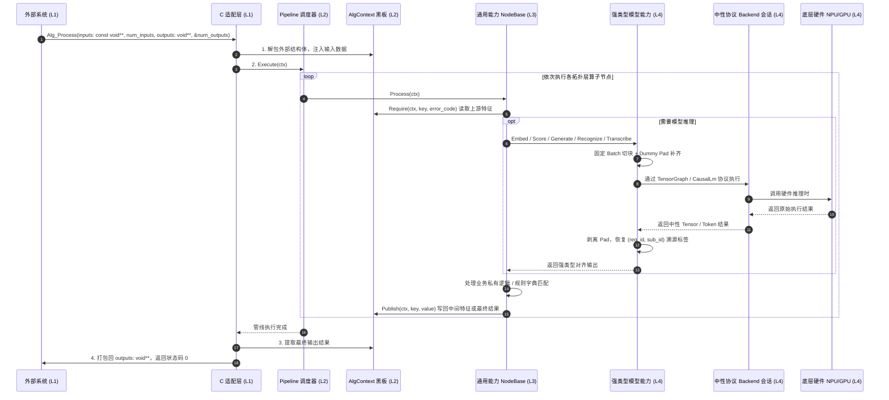

# Alg-SDK Runtime 架构设计与分层规范文档

本文档详细描述了企业级算法交付与管线框架（Alg-SDK Runtime Pipeline Framework）的分层架构、设计模式、数据流转与多人协作规范。

---

## 1. 框架整体 4 层抽象架构

框架严格遵循职责单一与接口隔离原则，划分为 **4 个独立的抽象层次**：

```mermaid
graph TD
    classDef l1 fill:#E3F2FD,stroke:#1565C0,stroke-width:2px,color:#0D47A1;
    classDef l2 fill:#E8F5E9,stroke:#2E7D32,stroke-width:2px,color:#1B5E20;
    classDef l3 fill:#FFF3E0,stroke:#E65100,stroke-width:2px,color:#E65100;
    classDef l4 fill:#F3E5F5,stroke:#7B1FA2,stroke-width:2px,color:#4A148C;
    classDef ext fill:#ECEFF1,stroke:#37474F,stroke-width:1px,color:#263238;

    subgraph External["外部调用方 (业务APP / 车机系统 / 边缘平台)"]
        Caller["下游集成程序 / 主控服务"]
    end

    %% Level 1
    subgraph L1["Layer 1: Operator 接入与 C-ABI 适配层 (Operator & C-ABI Adapter Layer)"]
        C_API["公司统一标准 C ABI 接口<br>• Alg_Init / Alg_DeInit<br>• Alg_Create / Alg_Destroy<br>• Alg_Process(const void** inputs, num_inputs, void** outputs, num_outputs)<br>• Alg_Control"]
        C_Adapter["company_c_adapter.cpp<br>• 同句柄 Process / Control 串行化<br>• 异常拦截屏障 (noexcept 安全防护)<br>• 外部输入解包 / 输出结构体强转打包"]
    end

    %% Level 2
    subgraph L2["Layer 2: 管线调度与状态黑板层 (Pipeline & Multi-Level Context Layer)"]
        PipeCore["Pipeline 核心调度器 (pipeline.cpp)<br>• 消费 ValidatedPipelinePlan<br>• 算子波前执行与错误熔断"]
        
        subgraph StateMgr["三级状态与注册管理器"]
            S_Ctx["SessionContext (句柄级持久状态)<br>• ModelManager 多模型池<br>• 句柄共享缓存资源"]
            R_Ctx["AlgContext (请求级瞬态黑板)<br>• Read / Publish 不可变快照<br>• 只读视图随请求生命周期稳定"]
            TraceTag["TraceableItem 溯源追踪<br>• req_id (请求索引)<br>• sub_id (1对N分片索引)"]
            Factory["NodeFactory / ModelRegistry / BackendRegistry<br>• *_WITH_DEFINITION 就地注册"]
        end
    end

    %% Level 3
    subgraph L3["Layer 3: 无请求状态的通用能力算子与可复用节点层"]
        NodeApi["INode 运行时接口"]
        NodeBase["NodeBase<br>final noexcept 生命周期与 Typed I/O"]
        ModelNode["ModelBoundNode / TraceableUnaryInferenceNode"]
        
        subgraph CommonNodes["通用能力算子池 (src/common_nodes/)"]
            LlmNode["LlmGenerateNode (大语言模型生成)"]
            ChunkNode["TextChunkNode (文本切片)"]
            RuleNode["TextRuleMatchNode (规则与关键词匹配)"]
            EmbedNode["TextEmbeddingNode (向量提取)"]
            TopKNode["VectorTopKNode (Top-K 检索)"]
            RerankNode["TextRerankNode (精排评分)"]
            TemplateNode["TextTemplateNode (提示词模板渲染)"]
            JsonNode["StructuredJsonParseNode (JSON 结构化解析)"]
            AsrNode["AsrTranscribeNode (语音转写)"]
            OcrNode["OcrDetectNode (OCR 识别)"]
            CorpusNode["TextCorpusSourceNode (语料源)"]
        end
    end

    %% Level 4
    subgraph L4["Layer 4: 模型能力与推理 Backend 层 (Model & Backend Layer)"]
        ModelBase["IModel 强类型能力抽象"]
        BackendBase["IInferenceBackend / IBackendSession<br>中性执行协议"]
        LlmIntf["ILlmModel + ICausalLmSession / ICausalLmSequence<br>(Generate / Token Evaluate)"]
        EmbedIntf["IEmbeddingModel / IRerankModel<br>+ ITensorGraphSession"]
        
        BatchExec["FixedBatchExecutor (硬件固定 Batch 调度器)<br>• 样本自动 Chunking 分块<br>• 末尾 Dummy Pad 自动补齐<br>• 推理后剥离 Pad 并保留溯源标签"]
        
        subgraph ModelSemantics["模型语义实现 (src/engine/models/)"]
            BgeModels["BgeEmbeddingModel / BgeRerankerModel"]
            QwenModel["QwenCausalLmModel<br>(ChatML / sampling / generation loop)"]
        end

        subgraph HardwareBackends["硬件推理 Backend (src/engine/backends/)"]
            OnnxBackend["OnnxRuntimeBackend<br>(TensorGraph, CPU/CUDA)"]
            LlamaCpp["LlamaCppBackend<br>(Causal LM, GGUF runtime)"]
        end
    end

    %% 连接关系
    Caller <==|纯 C 指针数组 const void** inputs, outputs| C_API
    C_API --> C_Adapter
    C_Adapter -->|构造/销毁| PipeCore
    C_Adapter -->|解包/打包| R_Ctx
    PipeCore --> S_Ctx
    PipeCore --> NodeApi
    NodeApi --> NodeBase
    NodeBase --> ModelNode
    NodeBase -.-> CommonNodes
    NodeBase -.-> BizNodes
    CommonNodes & BizNodes -->|读写特征与溯源数据| R_Ctx
    CommonNodes & BizNodes -->|从 ModelManager 获取模型| S_Ctx
    CommonNodes & BizNodes -->|调用强类型模型能力| LlmIntf & EmbedIntf
    LlmIntf & EmbedIntf --> ModelSemantics
    ModelSemantics -->|仅依赖中性协议| BackendBase
    BackendBase --> HardwareBackends
    ModelSemantics --> BatchExec

    class Caller ext;
    class C_API,C_Adapter l1;
    class PipeCore,S_Ctx,R_Ctx,TraceTag,Factory l2;
    class NodeApi,NodeBase,ModelNode,CommonNodes,BizNodes,LlmNode,PromptNode,VecSearchNode,RerankNode,PreNode,RuleNode,PostNode l3;
    class ModelBase,BackendBase,LlmIntf,EmbedIntf,BatchExec,BgeModels,QwenModel,OnnxBackend,LlamaCpp l4;
```

---

## 2. 4 层抽象职责定义

### Layer 1: Operator 与 C-ABI 接入层 (Operator & C-ABI Adapter)
- **代码位置**：`include/company_alg_interface.h`，`include/operator/`，`src/adapter/`
- **核心职责**：
  1. 导出公司限定的标准 C 接口：`Alg_Init`, `Alg_Create`, `Alg_Process`, `Alg_Control`, `Alg_Destroy`, `Alg_DeInit`；
  2. 导出基于命名 I/O 槽位的 C++ Operator 门面：`Get_LLM_EDGEFLOW_OperatorTable()`；
  3. 充当 `noexcept` 安全屏障，拦截所有 C++ 异常，防止跨动态库边界崩溃；
  4. 将外部传入的纯 C 指针数组或 NamedIoBatch 解包，转入内部强类型的 `AlgContext`。

#### 双外部门面与单一内部运行时架构

Layer 1 并行维护两个外部门面，统一由 `SharedAlgorithmRuntime` 执行调度：

```text
纯 C ABI：const void** / void** + 现有 CompanyAlg DTO ─┐
                                                       ├─> SharedAlgorithmRuntime
C++ Operator API：NamedIoBatch + Operator 镜像 C 结构 ─┘
```

- 纯 C ABI 继续保持 C11、固定布局和现有六函数契约，其 ABI V2 保持源码与符号兼容。
- 同一 C ABI handle 的 `Alg_Process` 与 `Alg_Control` 串行执行；不同 handle 可并行。
  `Alg_Destroy` 前调用方必须停止提交并等待该 handle 上所有调用返回，返回后句柄永久失效。
- C++ Operator API 根据 Key 的最后一个点号解析类型后缀：
  `OperatorValueTypeRegistry` 负责“后缀到外部 C 类型”的唯一绑定，
  `OperatorBizBridgeDescriptor` 负责按业务和方向收集一个或多个槽位，再转换为
  内部 DTO；两种协议不得通过 `reinterpret_cast` 混用布局。
- 命名解耦设计：`Integration -> Operator -> Pipeline -> Node -> Model -> Backend -> Platform`。
  `Operator` 表达对外交付的算法实例，`Platform`（`ComputePlatform`）表达底层硬件执行平台（CPU、CUDA、AX650、Ascend 等）。
- 同一业务可以使用一个聚合结构槽位，也可以由多个原子槽位组成；支持多槽位解绑。
- `CompanyString` 只表达无嵌入 NUL 的文本；任意二进制数据使用 `CompanyBuffer`。
- 输入由外部持有，Process 只借用裸指针并复制所需值，不持有输入 shared_ptr。
- 输出由算法库在 Create 期按 `max_frame_depth` 预分配；Process 返回带自定义
  deleter 的 shared_ptr，最后一个引用析构后 reset 并回池；deleter 只捕获池状态的
  weak lifetime token，避免 Destroy 后解引用已释放句柄或池。
- 值类型表、业务桥接表和内存池只属于 Layer 1，不得进入 Blackboard、Node、Model 或 Backend。
- 目标共享库输出名称为 `company_alg_sdk`，SOVERSION 为 4。
- v4 Create 和配置预检都以必填部署根 `model_path` 加相对 `cfg_file_name` 解析；
  `.conf` 的 `data.mem_que` 归一化输出后缀、metadata 容量和嵌套字段容量。

### Layer 2: 管线调度与状态黑板层 (Pipeline & State Engine)
- **代码位置**：`include/core/`，`src/core/`
- **核心职责**：
  1. **配置驱动与执行计划**：通过 `PipelineValidator::ValidateAndPlan` 一次性完成 JSON 解析、业务契约查找、拓扑排序生成 `ValidatedPipelinePlan`，杜绝重复解析与排序；
  2. **三级状态管理**：
     - `SessionContext`：句柄级常驻状态，管理单句柄加载的多个模型实例（`ModelManager`）；
     - `AlgContext`：请求级强类型黑板（`BlackboardKey<T>`），`Read` 返回请求生命周期内
       稳定的只读视图，`Publish` 拒绝重复生产；Adapter 与 Node 使用同一 write-once 契约；
     - `TraceableItem<T>`：样本溯源标签（`req_id` + `sub_id`），保证 1对N 裂变后可严格 1:1 对齐回原请求；
  3. **自注册 SSOT 机制**：Node、Model 与 Backend 分别通过 `REGISTER_NODE_WITH_DEFINITION`、`REGISTER_MODEL_WITH_DEFINITION` 和 `REGISTER_BACKEND_WITH_DEFINITION` 就地声明，`PipelineCatalog` 仅聚合这三类定义。

### Layer 3: 通用能力算子层 (Stateless Capability Nodes)
- **代码位置**：`src/common_nodes/`，`include/nodes/`
- **核心职责**：
  1. **算法工程师核心开发区**：算子继承 `NodeBase`，单模型算子继承 `ModelBoundNode`；
  2. **异常安全屏障**：`NodeBase::Init` 和 `NodeBase::Process` 设为 `final noexcept`，派生类覆写 `InitNode` 与 `ProcessNode`，提供 `Require`、`Publish`、`Fail` 辅助方法；
  3. **模块化与配置组合**：11 类核心通用算子（`LlmGenerateNode`, `TextChunkNode`, `TextRuleMatchNode`, `TextEmbeddingNode`, `VectorTopKNode`, `TextRerankNode`, `TextTemplateNode`, `StructuredJsonParseNode`, `AsrTranscribeNode`, `OcrDetectNode`, `TextCorpusSourceNode`）全部收敛在 `src/common_nodes/`，通过 JSON Pipeline 自由编排。

### Layer 4: 模型能力与推理 Backend 层 (Model & Backend)
- **代码位置**：`include/engine/`，`src/engine/`
- **核心职责**：
  1. `IEmbeddingModel`、`IRerankModel`、`ILlmModel`、`IOcrModel` 和 `IAsrModel` 表达模型语义，Node 只依赖所需能力；
  2. `ITensorGraphSession` 与 `ICausalLmSession` / `ICausalLmSequence` 表达中性执行协议；因果序列同时封装状态、执行行为和所需资源生命周期，Backend 负责模型资源加载和硬件会话，模型实现不包含 ONNX Runtime/llama.cpp 具体类型；
  3. `ModelRuntimeFactory` 依据 `model_type + backend` 组合模型与 Backend，校验协议和并发契约后再原子注册到 `ModelManager`；
  4. **固定 Max Batch 自动调度（`FixedBatchExecutor`）**：完成批次切分、Dummy Pad、Pad 剔除和 `(req_id, sub_id)` 溯源；
  5. 切换 NPU/GPU/CPU 只改 JSON 中的 `backend` 与 `backend_config`，不改业务 Node 或模型语义实现。

---

## 3. 数据流转与调用时序 (Runtime Sequence)



---

## 4. 算法开发者新增节点示例

以下仅展示节点实现骨架。新增完整业务仍须按 RFC-first 流程同时提供 Business
Adapter/Definition、Pipeline JSON、GoogleTest，并通过完整门禁；不得把本节理解为
“三步即可交付一个业务”。

### 步骤 1：新建算子源文件并继承 `NodeBase`

```cpp
#include "core/node_registry.h"
#include "nodes/node_support.h"

namespace alg_framework {

inline constexpr BlackboardKey<std::string> kInputText{"input_text", "string"};
inline constexpr BlackboardKey<std::string> kOutputText{"output_text", "string"};

class MyCustomNode final : public NodeBase {
 public:
  inline static constexpr char kNodeType[] = "MyCustomNode";

  MyCustomNode() : NodeBase(kNodeType) {}

 protected:
  // 1. 初始化：读取私有配置
  bool InitNode(const nlohmann::json& config,
                SessionContext& /*session_ctx*/) override {
    threshold_ = config.value("threshold", 0.8f);
    return true;
  }

  // 2. 执行业务计算：通过 Require / Publish 读写强类型黑板
  int ProcessNode(AlgContext& req_ctx) override {
    const auto* input = Require(req_ctx, kInputText, -9001);
    if (!input) return -9001;

    std::string result = *input + "_processed";
    Publish(req_ctx, kOutputText, std::move(result));
    return 0;
  }

 private:
  float threshold_ = 0.8f;
};

// 3. 声明元数据定义并自注册
NodeDefinition MakeMyCustomNodeDefinition() {
  NodeDefinition def;
  def.node_type = MyCustomNode::kNodeType;
  def.category = "business";
  def.description = "My custom business processing node";
  def.inputs = {RequiredInput(kInputText)};
  def.outputs = {Output(kOutputText)};
  def.config_fields = {ConfigFieldDefinition{
      "threshold", ConfigValueKind::kNumber, false, 0.8, 0.0, 1.0}};
  def.parallel_safe = true;
  return def;
}

REGISTER_NODE_WITH_DEFINITION(MyCustomNode, MakeMyCustomNodeDefinition());

} // namespace alg_framework
```

### 步骤 2：编写业务配置文件（JSON）

在 `configs/` 下新建配置文件，自由编排模型和算子顺序：

```json
{
  "biz_name": "my_new_biz",
  "models": [
    {
      "model_id": "my_llm",
      "capability": "llm",
      "model_type": "qwen_causal_lm",
      "backend": "llama_cpp",
      "model_path": "./models/my_llm.gguf",
      "model_config": {},
      "backend_config": {"n_ctx": 2048}
    }
  ],
  "pipeline": [
    { "id": "node_0", "node_type": "MyCustomNode", "config": { "threshold": 0.9 } }
  ]
}
```

### 步骤 3：交付配置文件与算法库即可！
