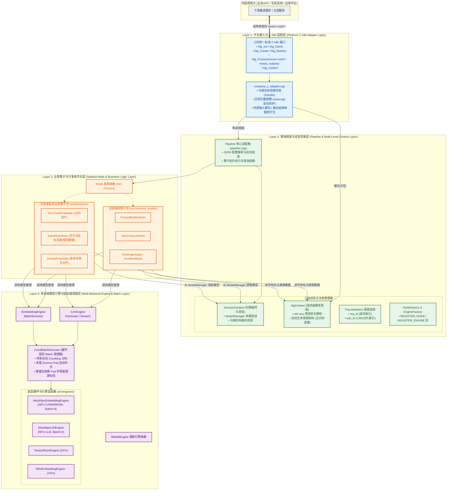
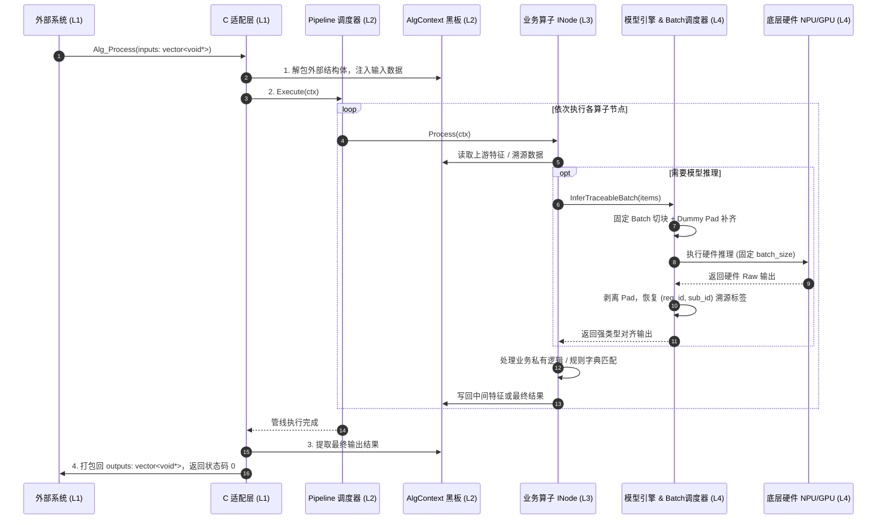

# Alg-SDK Runtime 架构设计与分层规范文档

本文档详细描述了企业级算法交付与管线框架（Alg-SDK Runtime Pipeline Framework）的分层架构、设计模式、数据流转与多人协作规范。

---

## 1. 框架整体 4 层抽象架构

框架严格遵循职责单一与接口隔离原则，划分为 **4 个独立的抽象层次**：



---

## 2. 4 层抽象职责定义

### Layer 1: 平台接入层 (Platform C-ABI Adapter)
- **代码位置**：`include/company_alg_interface.h`，`src/adapter/company_c_adapter.cpp`
- **核心职责**：
  1. 导出公司限定的标准 C 接口：`Alg_Init`, `Alg_Create`, `Alg_Process`, `Alg_Control`, `Alg_Destroy`, `Alg_DeInit`；
  2. 充当 `noexcept` 安全屏障，拦截所有 C++ 异常，防止跨动态库边界崩溃；
  3. 将外部传入的 `vector<void*>` 业务结构体解包，转入内部强类型的 `AlgContext`。

### Layer 2: 管线调度与状态黑板层 (Pipeline & State Engine)
- **代码位置**：`include/core/`，`src/core/`
- **核心职责**：
  1. **配置驱动**：解析外部 JSON 配置文件，动态初始化模型与组装算子节点序列；
  2. **三级状态管理**：
     - `SessionContext`：句柄级常驻状态，管理单句柄加载的多个模型实例（`ModelManager`）；
     - `AlgContext`：请求级瞬态黑板，使用 `std::any` 存储中间特征，用完即释放，避免内存泄漏；
     - `TraceableItem<T>`：样本溯源标签（`req_id` + `sub_id`），保证 1对N 裂变后可严格 1:1 对齐回原请求；
  3. **自注册机制**：`REGISTER_NODE` 与 `REGISTER_ENGINE`，消除硬编码。

### Layer 3: 算子节点与业务编排层 (Stateful Node & Business)
- **代码位置**：`src/common_nodes/`，`src/business/`
- **核心职责**：
  1. **算法工程师核心开发区**：继承 `INode`，实现 `Init(config, session_ctx)` 和 `Process(req_ctx)`；
  2. **有状态节点支持**：开发者可自由在类中定义私有成员变量（私有规则表、词典映射、预编译正则），随句柄常驻；
  3. **模块化复用**：通用算子（Prompt 构造、向量检索、敏感词过滤）全组共享。

### Layer 4: 多后端模型引擎与批处理调度层 (Multi-Backend Engine & Batch)
- **代码位置**：`include/engine/`，`src/engines/`
- **核心职责**：
  1. 纯虚接口屏蔽硬件差异（`ILlmEngine`, `IEmbeddingEngine`, `ICvEngine`）；
  2. **固定 Max Batch 自动调度（`FixedBatchExecutor`）**：解决端侧 NPU 静态编译 `max_batch_size` 限制，自动完成批次切分、末尾补齐 Dummy Pad、推理后剔除 Pad 与结果回溯对齐；
  3. 切换底层芯片（NPU/GPU/CPU）只需改动 JSON 配置中的 `engine_type`，业务代码 0 修改。

---

## 3. 数据流转与调用时序 (Runtime Sequence)



---

## 4. 算法开发者开发新业务指南（3 步上手）

算法同学开发新业务仅需 3 步，**无需修改任何 Core 框架代码**：

### 步骤 1：新建算子源文件并继承 `INode`

```cpp
#include "core/node_base.h"
#include "core/node_registry.h"

namespace alg_framework {

class MyCustomNode : public INode {
public:
    // 1. 初始化：读取私有配置，定义类成员存储私有业务数据
    bool Init(const nlohmann::json& config, SessionContext* session_ctx) override {
        my_threshold_ = config.value("threshold", 0.8f);
        return true;
    }

    // 2. 执行业务计算：从 req_ctx 读取数据，计算后写回
    int Process(AlgContext* req_ctx) override {
        auto* input = req_ctx->Get<std::string>("some_key");
        // 业务处理 ...
        req_ctx->Set("output_key", "result");
        return 0;
    }

    const std::string& Name() const override {
        static std::string name = "MyCustomNode";
        return name;
    }

private:
    float my_threshold_ = 0.8f; // 节点私有状态
};

// 3. 注册节点 (一行宏即可完成自动注册)
REGISTER_NODE(MyCustomNode);

} // namespace alg_framework
```

### 步骤 2：编写业务配置文件（JSON）

在 `configs/` 下新建配置文件，自由编排模型和算子顺序：

```json
{
  "business_name": "my_new_business",
  "models": [
    {
      "model_id": "my_llm",
      "engine_type": "mock_npu_llm",
      "model_path": "./models/my_llm.bin"
    }
  ],
  "pipeline": [
    { "node_type": "MyCustomNode", "config": { "threshold": 0.9 } }
  ]
}
```

### 步骤 3：交付配置文件与算法库即可！
