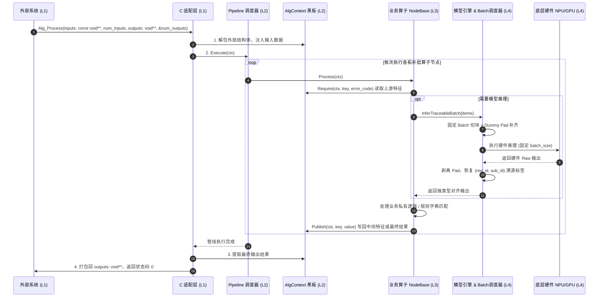

# Alg-SDK Runtime 架构设计与分层规范文档

本文档详细描述了企业级算法交付与管线框架（Alg-SDK Runtime Pipeline Framework）的分层架构、设计模式、数据流转与多人协作规范。

---

## 1. 框架整体 4 层抽象架构

框架严格遵循职责单一与接口隔离原则，划分为 **4 个独立的抽象层次**：

```mermaid
graph TD
    classDef l1 fill:#E3F2FD,stroke:#1565C0,stroke-width:2px,color:#0D47A1;
    classDef l2 fill:#E8F5E9,stroke:#2E7D32,stroke-width:2px,color:#1B5E20;
    classDef l3 fill:#FFF3E0,stroke:#E65100,stroke-width:2px,color:#E65100;
    classDef l4 fill:#F3E5F5,stroke:#7B1FA2,stroke-width:2px,color:#4A148C;
    classDef ext fill:#ECEFF1,stroke:#37474F,stroke-width:1px,color:#263238;

    subgraph External["外部调用方 (业务APP / 车机系统 / 边缘平台)"]
        Caller["下游集成程序 / 主控服务"]
    end

    %% Level 1
    subgraph L1["Layer 1: 平台接入与 C-ABI 适配层 (Platform C-ABI Adapter Layer)"]
        C_API["公司统一标准 C ABI 接口<br>• Alg_Init / Alg_DeInit<br>• Alg_Create / Alg_Destroy<br>• Alg_Process(const void** inputs, num_inputs, void** outputs, num_outputs)<br>• Alg_Control"]
        C_Adapter["company_c_adapter.cpp<br>• 句柄生命周期托管 (Handle)<br>• 异常拦截屏障 (noexcept 安全防护)<br>• 外部输入解包 / 输出结构体强转打包"]
    end

    %% Level 2
    subgraph L2["Layer 2: 管线调度与状态黑板层 (Pipeline & Multi-Level Context Layer)"]
        PipeCore["Pipeline 核心调度器 (pipeline.cpp)<br>• 消费 ValidatedPipelinePlan<br>• 算子波前执行与错误熔断"]
        
        subgraph StateMgr["三级状态与注册管理器"]
            S_Ctx["SessionContext (句柄级持久状态)<br>• ModelManager 多模型池<br>• 句柄共享缓存资源"]
            R_Ctx["AlgContext (请求级瞬态黑板)<br>• std::any 类型安全擦除<br>• 自动生命周期析构 (无内存泄漏)"]
            TraceTag["TraceableItem 溯源追踪<br>• req_id (请求索引)<br>• sub_id (1对N分片索引)"]
            Factory["NodeFactory & EngineFactory<br>• *_WITH_DEFINITION 就地注册"]
        end
    end

    %% Level 3
    subgraph L3["Layer 3: 无请求状态的业务算子与可复用节点层"]
        NodeApi["INode 运行时接口"]
        NodeBase["NodeBase<br>final noexcept 生命周期与 Typed I/O"]
        ModelNode["ModelBoundNode / TraceableUnaryInferenceNode"]
        
        subgraph CommonNodes["全组通用算子池 (src/common_nodes/)"]
            LlmNode["LlmGenerateNode<br>跨 DocQA / Entity / OCR 复用"]
        end
        
        subgraph BizNodes["开发者私有业务算子池 (src/business/)"]
            PreNode["DocChunkPreNode (1对N切片)"]
            RuleNode["IntentRuleNode (含节点私有词典/规则数据)"]
            PostNode["DocQaPostNode (多样本聚合对齐)"]
            PromptNode["PromptBuilderNode"]
            VecSearchNode["VectorSearchNode"]
            RerankNode["RerankRefineNode"]
        end
    end

    %% Level 4
    subgraph L4["Layer 4: 多后端模型引擎与批处理调度层 (Multi-Backend Engine & Batch Layer)"]
        EngineBase["IModelEngine 基础引擎抽象"]
        LlmIntf["ILlmEngine<br>(Generate / Stream)"]
        EmbedIntf["IEmbeddingEngine<br>(BatchEncode)"]
        
        BatchExec["FixedBatchExecutor (硬件固定 Batch 调度器)<br>• 样本自动 Chunking 分块<br>• 末尾 Dummy Pad 自动补齐<br>• 推理后剥离 Pad 并保留溯源标签"]
        
        subgraph HardwareBackends["底层硬件与引擎适配器 (src/engine/)"]
            NpuEmbed["MockNpuEmbeddingEngine<br>(NPU CANN/RKNN, Batch=4)"]
            NpuLlm["MockNpuLlmEngine<br>(NPU LLM, Batch=2)"]
            OnnxEngine["OnnxEmbedding / OnnxRerank<br>(ONNX Runtime, CPU/CUDA)"]
            LlamaCpp["LlamaCppEngine<br>(llama.cpp GGUF)"]
        end
    end

    %% 连接关系
    Caller <==|纯 C 指针数组 const void** inputs, outputs| C_API
    C_API --> C_Adapter
    C_Adapter -->|构造/销毁| PipeCore
    C_Adapter -->|解包/打包| R_Ctx
    PipeCore --> S_Ctx
    PipeCore --> NodeApi
    NodeApi --> NodeBase
    NodeBase --> ModelNode
    NodeBase -.-> CommonNodes
    NodeBase -.-> BizNodes
    CommonNodes & BizNodes -->|读写特征与溯源数据| R_Ctx
    CommonNodes & BizNodes -->|从 ModelManager 获取模型| S_Ctx
    CommonNodes & BizNodes -->|调用模型推理| LlmIntf & EmbedIntf
    LlmIntf & EmbedIntf --> BatchExec
    BatchExec --> HardwareBackends

    class Caller ext;
    class C_API,C_Adapter l1;
    class PipeCore,S_Ctx,R_Ctx,TraceTag,Factory l2;
    class NodeApi,NodeBase,ModelNode,CommonNodes,BizNodes,LlmNode,PromptNode,VecSearchNode,RerankNode,PreNode,RuleNode,PostNode l3;
    class EngineBase,LlmIntf,EmbedIntf,BatchExec,NpuEmbed,NpuLlm,OnnxEngine,LlamaCpp l4;
```

---

## 2. 4 层抽象职责定义

### Layer 1: 平台接入层 (Platform C-ABI Adapter)
- **代码位置**：`include/company_alg_interface.h`，`src/adapter/company_c_adapter.cpp`
- **核心职责**：
  1. 导出公司限定的标准 C 接口：`Alg_Init`, `Alg_Create`, `Alg_Process`, `Alg_Control`, `Alg_Destroy`, `Alg_DeInit`；
  2. 充当 `noexcept` 安全屏障，拦截所有 C++ 异常，防止跨动态库边界崩溃；
  3. 将外部传入的纯 C 指针数组业务结构体解包，转入内部强类型的 `AlgContext`。

### Layer 2: 管线调度与状态黑板层 (Pipeline & State Engine)
- **代码位置**：`include/core/`，`src/core/`
- **核心职责**：
  1. **配置驱动与执行计划**：通过 `PipelineValidator::ValidateAndPlan` 一次性完成 JSON 解析、业务契约查找、拓扑排序生成 `ValidatedPipelinePlan`，杜绝重复解析与排序；
  2. **三级状态管理**：
     - `SessionContext`：句柄级常驻状态，管理单句柄加载的多个模型实例（`ModelManager`）；
     - `AlgContext`：请求级强类型黑板（`BlackboardKey<T>`），零内存拷贝传递特征；
     - `TraceableItem<T>`：样本溯源标签（`req_id` + `sub_id`），保证 1对N 裂变后可严格 1:1 对齐回原请求；
  3. **自注册 SSOT 机制**：`REGISTER_NODE_WITH_DEFINITION` 与 `REGISTER_ENGINE_WITH_DEFINITION`，自动向 `PipelineCatalog` 注册输入输出契约。

### Layer 3: 算子节点与业务编排层 (Stateless-per-request Nodes)
- **代码位置**：`src/common_nodes/`，`src/business/`，`include/nodes/`
- **核心职责**：
  1. **算法工程师核心开发区**：普通节点继承 `NodeBase`，单模型节点继承 `ModelBoundNode`，只有严格单输入/单输出批推理节点才使用 `TraceableUnaryInferenceNode`；
  2. **异常安全屏障**：`NodeBase::Init` 和 `NodeBase::Process` 设为 `final noexcept`，派生类覆写 `InitNode` 与 `ProcessNode`，提供 `Require`、`Publish`、`Fail` 辅助方法；
  3. **模块化复用**：通用算子（`LlmGenerateNode` 等）放置在 `src/common_nodes/`，业务专属算子放置在 `src/business/<biz_name>/`。

### Layer 4: 多后端模型引擎与批处理调度层 (Multi-Backend Engine & Batch)
- **代码位置**：`include/engine/`，`src/engine/`
- **核心职责**：
  1. 纯虚接口屏蔽硬件差异（`ILlmEngine`, `IEmbeddingEngine`, `IOcrEngine`, `IRerankEngine`, `IAudioAsrEngine`）；
  2. **固定 Max Batch 自动调度（`FixedBatchExecutor`）**：解决端侧 NPU 静态编译 `max_batch_size` 限制，自动完成批次切分、末尾补齐 Dummy Pad、推理后剔除 Pad 与结果回溯对齐；
  3. 切换底层芯片（NPU/GPU/CPU）只需改动 JSON 配置中的 `engine_type`，业务代码 0 修改。

---

## 3. 数据流转与调用时序 (Runtime Sequence)



---

## 4. 算法开发者新增节点示例

以下仅展示节点实现骨架。新增完整业务仍须按 RFC-first 流程同时提供 Business
Adapter/Definition、Pipeline JSON、GoogleTest，并通过完整门禁；不得把本节理解为
“三步即可交付一个业务”。

### 步骤 1：新建算子源文件并继承 `NodeBase`

```cpp
#include "core/node_registry.h"
#include "nodes/node_support.h"

namespace alg_framework {

inline constexpr BlackboardKey<std::string> kInputText{"input_text", "string"};
inline constexpr BlackboardKey<std::string> kOutputText{"output_text", "string"};

class MyCustomNode final : public NodeBase {
 public:
  inline static constexpr char kNodeType[] = "MyCustomNode";

  MyCustomNode() : NodeBase(kNodeType) {}

 protected:
  // 1. 初始化：读取私有配置
  bool InitNode(const nlohmann::json& config,
                SessionContext& /*session_ctx*/) override {
    threshold_ = config.value("threshold", 0.8f);
    return true;
  }

  // 2. 执行业务计算：通过 Require / Publish 读写强类型黑板
  int ProcessNode(AlgContext& req_ctx) override {
    const auto* input = Require(req_ctx, kInputText, -9001);
    if (!input) return -9001;

    std::string result = *input + "_processed";
    Publish(req_ctx, kOutputText, std::move(result));
    return 0;
  }

 private:
  float threshold_ = 0.8f;
};

// 3. 声明元数据定义并自注册
NodeDefinition MakeMyCustomNodeDefinition() {
  NodeDefinition def;
  def.node_type = MyCustomNode::kNodeType;
  def.category = "business";
  def.description = "My custom business processing node";
  def.inputs = {RequiredInput(kInputText)};
  def.outputs = {Output(kOutputText)};
  def.config_fields = {ConfigFieldDefinition{
      "threshold", ConfigValueKind::kNumber, false, 0.8, 0.0, 1.0}};
  def.parallel_safe = true;
  return def;
}

REGISTER_NODE_WITH_DEFINITION(MyCustomNode, MakeMyCustomNodeDefinition());

} // namespace alg_framework
```

### 步骤 2：编写业务配置文件（JSON）

在 `configs/` 下新建配置文件，自由编排模型和算子顺序：

```json
{
  "business_name": "my_new_business",
  "models": [
    {
      "model_id": "my_llm",
      "engine_type": "mock_npu_llm",
      "model_path": "./models/my_llm.bin"
    }
  ],
  "pipeline": [
    { "id": "node_0", "node_type": "MyCustomNode", "config": { "threshold": 0.9 } }
  ]
}
```

### 步骤 3：交付配置文件与算法库即可！
