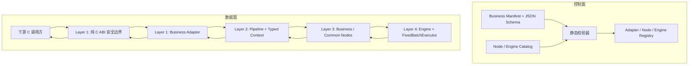

# LLM-EdgeFlow 架构设计评审

> 评审日期：2026-08-19
> 评审基线：`v1.0.0` 初始四层单体分支
> 当前分支状态：`v2.0.0` (Phase 1 核心安全与解耦整改已完成，详见 `doc/architecture_acceptance_review.md`)
> 目标演进版本：Phase 2 / Phase 3 (面向下游开发者的 Manifest、Schema 契约与统一 Catalog)
> 目标用户：数量较多、C++ 与算法工程能力不一的下游业务开发者，以及辅助开发的 AI Agent

## 1. 评审结论

当前四层架构适合作为平台内核的起点，但还不适合作为面向大量下游业务开发者的成熟开发平台，也不够 AI 友好。

现有设计已经具备几项正确基础：

- 对外适配、Pipeline、业务节点和推理引擎具有明确的概念分层。
- `AlgContext` 与 `SessionContext` 区分了请求级数据和句柄级资源。
- `INode`、`REGISTER_NODE`、`IModelEngine`、`REGISTER_ENGINE` 为扩展提供了基本抽象。
- DAG 拓扑、并行波前执行和 `FixedBatchExecutor` 解决了部分工程共性问题。
- Mock Engine 与真实引擎隔离，有利于业务开发者低成本测试。

主要问题不是“有没有分层”，而是“分层是否形成了足够安全、简单、可验证的开发界面”。当前业务开发者仍需理解 C ABI、字符串黑板、隐式数据类型、节点注册、CMake、模型接口和错误传播等较多细节。对于水平参差不齐的团队，这会导致大量问题延迟到编译、启动甚至运行阶段；对于 AI，这些隐式规则也容易造成字段猜测、错误代码生成和文档漂移。

建议保留四层内核，但在其上增加一个明确的“业务开发面”：业务 Manifest、Adapter SDK、节点端口契约、配置 Schema、生成器、静态校验器和机器可读 Catalog。目标应是让普通业务开发者沿着默认路径自然地产生正确实现，而不是依赖其熟悉全部框架内部细节。

## 2. 已确认的阶段性决策

本次评审基于以下产品与组织假设：

1. 后续业务数量较多，多数业务拥有各自的 C 输入输出结构体，因此业务 Adapter 是无法完全消除的正式扩展面。
2. 普通业务开发者可以维护业务专属 ABI、Adapter、业务节点、Pipeline 配置和测试，但应尽量不修改 Core 与 Engine。
3. 第一阶段继续采用当前单仓库和静态编译模式，不建设动态插件 ABI。
4. AI 默认可以生成业务配置、Adapter/节点脚手架和测试，不应默认修改公共 ABI、Core、Engine 或公共节点。
5. 平台团队负责公共接口、Core、Engine、通用节点、生成器、校验器和发布门禁。

这些决策能够降低第一阶段的建设复杂度，同时保留未来演进为独立业务包或动态插件的可能性。

## 3. 当前架构适用性评价

| 维度 | 评价 | 说明 |
| :--- | :--- | :--- |
| 内核职责拆分 | 基本合适 | 四层方向清晰，但实际依赖没有完全遵守文档约束。 |
| 新业务接入成本 | 偏高 | 需要修改公共枚举、Adapter 分支、业务节点、配置、CMake 和测试。 |
| 初级开发者容错 | 不足 | 大量约束依赖字符串约定和人工阅读文档，错误发现较晚。 |
| Core/Engine 稳定性 | 部分满足 | 普通业务理论上无需修改，但现有指南仍容易把开发者引向中心文件。 |
| 业务隔离 | 不足 | 全局节点注册、黑板 key 和中心 Adapter 分支缺少命名空间及冲突检查。 |
| AI 可理解性 | 不足 | 缺少唯一 Schema、端口类型和机器可读节点目录，Skill 与源码已有漂移。 |
| 静态验证能力 | 不足 | 当前主要验证拓扑依赖，无法验证端口类型、缺失生产者和同层写冲突。 |
| 运行诊断能力 | 不足 | 错误码、配置路径、节点端口和实际类型没有形成统一诊断结构。 |
| 推理后端扩展 | 基本合适 | 引擎接口和固定 Batch 抽象可继续使用，但应由平台开发者维护。 |
| 大规模团队治理 | 不足 | 缺少业务 Manifest、代码所有权边界、生成器和分层门禁。 |

## 4. 当前架构中值得保留的设计

### 4.1 请求与会话状态分离

`AlgContext` 负责一次调用中的输入、中间结果和输出，`SessionContext` 负责句柄生命周期内的模型与共享资源。这个分离方向正确，后续应继续保持：

- 请求相关数据只能进入请求上下文。
- 节点成员只能保存只读配置、线程安全资源句柄或显式受控的热更新状态。
- 模型和设备资源由会话/运行时层统一管理，不能由业务节点随意创建和销毁。

### 4.2 节点与引擎能力接口

业务节点通过 `INode` 接入，模型能力通过 `IEmbeddingEngine`、`ILlmEngine`、`IRerankEngine`、`IOcrEngine` 和 `IAudioAsrEngine` 暴露。业务逻辑不直接绑定具体硬件，这一方向符合平台化目标。

后续重点不是重新设计所有接口，而是补充能力元数据、版本、错误模型和线程安全声明。

### 4.3 固定 Batch 与溯源

`FixedBatchExecutor` 统一处理切块、Dummy Pad、剥离和 `(req_id, sub_id)` 溯源，属于适合固化在平台层的共性能力。普通业务开发者不应重复实现该逻辑。

### 4.4 配置驱动的 Pipeline

通过 JSON 选择模型、节点和依赖关系是面向大量业务开发者的正确方向。问题在于当前配置只有语法，没有完整语义 Schema 和端口契约。应增强配置系统，而不是退回到每个业务手写调度代码。

## 5. 主要架构问题与整改建议

### ARCH-001：Layer 1 尚未形成真正稳定的纯 C 边界

**状态：待整改**

`include/company_alg_interface.h` 当前包含 `<vector>`，`Alg_Process` 使用 `std::vector<void*>`。即使函数放在 `extern "C"` 中，参数仍是 C++ ABI，无法被纯 C 调用方使用，也会与编译器和 STL ABI 绑定。6 个导出接口也没有全部形成声明与实现一致的 `noexcept` 异常屏障。

这不仅是代码规范问题，还会影响下游开发模式：业务开发者新增结构体时无法依赖稳定、可生成、可自动测试的 ABI 契约。

**建议目标**

- 保留现有六接口生命周期模型，但新增版本化的纯 C 批处理接口。
- 批量参数使用指针数组和显式数量，不使用引用、模板或 STL。
- 业务结构体继续允许按业务定义，但必须是纯 C、定长或有明确长度字段的结构体。
- 现有 C++ 接口可作为迁移期 wrapper，不能继续称为纯 C ABI。
- 为每个业务 ABI 生成 C11 编译测试、布局检查和 Adapter 往返测试。

### ARCH-002：Layer 3 反向依赖 Layer 1

**状态：待整改**

多个业务后处理节点直接包含 `company_alg_interface.h`，并在节点内部生成 `Company*OutputStruct`。这使业务节点依赖平台交付结构体，与“Layer 1 负责解包和回包”的目标设计冲突。

**建议目标**

- Layer 3 节点只读写内部领域 DTO，不得引用任何 `Company*InputStruct` 或 `Company*OutputStruct`。
- Layer 1 Adapter 负责 C 结构体与内部 DTO/Blackboard 之间的双向转换。
- CI 增加 include 边界检查，禁止 `src/business/` 和 `src/common_nodes/` 包含 Layer 1 头文件。

整改后，修改业务 C 结构体不会强制修改算法节点，节点也可以被测试、复用或迁移到其他交付协议。

### ARCH-003：中心 Adapter 会随业务数量线性膨胀

**状态：待整改**

当前 `src/adapter/company_c_adapter.cpp` 按 `biz_type` 维护大型条件分支。每新增业务都要修改中心文件，容易产生合并冲突，也要求普通开发者理解所有已有业务的处理逻辑。

**建议目标：内部 Adapter 注册机制**

在 Layer 1 内新增 C++ 内部接口 `IBusinessAdapter`，职责限定为：

1. 校验该业务的批量输入输出指针和数量。
2. 将业务 C 输入结构体解包为内部 DTO并写入 `AlgContext`。
3. 从 `AlgContext` 读取内部结果并打包到业务 C 输出结构体。
4. 提供业务类型、ABI 版本和输入输出描述元数据。

每个业务 Adapter 使用注册机制绑定业务类型。公共 `Alg_Process` 只执行：句柄校验、Adapter 查找、统一异常隔离、Unpack、Pipeline Execute 和 Pack。

Adapter 注册机制属于 Layer 1 内部实现，不暴露 C++ 类型到公共 C 头文件。

### ARCH-004：字符串黑板缺少可验证的数据契约

**状态：待整改**

`AlgContext` 使用字符串 key 和 `std::any`，节点只在实现内部隐式决定输入输出类型。当前 Pipeline 能检查 DAG 节点依赖，却不知道：

- 某个输入 key 是否存在生产者。
- 上游输出类型与下游输入类型是否一致。
- 同一个并行层是否有多个节点写同一个 key。
- 节点是否读取了未声明的数据。
- 配置中的模型是否满足节点要求的引擎能力。

**建议目标：节点端口描述**

每个节点必须提供机器可读的 `NodeDescriptor`，至少包含：

- 唯一节点类型、版本和所属命名空间。
- 输入端口名、Blackboard key、数据类型、是否必选、是否多值。
- 输出端口名、Blackboard key、数据类型和覆盖策略。
- 配置 Schema、默认值和约束。
- 所需模型能力，例如 `ILlmEngine` 或 `IRerankEngine`。
- 是否可并行、是否包含可变状态及线程安全级别。
- 可能返回的稳定错误码。

Pipeline 在创建节点和加载模型之后、执行任何请求之前完成静态校验。`std::any` 可以在迁移期保留，但开发者应通过类型化端口或生成的访问器使用它，而不是散落裸字符串。

### ARCH-005：Blackboard 的线程安全结论不完整

**状态：待整改**

`AlgContext::Get<T>` 在持锁时查找数据，但返回内部对象指针后锁已经释放。如果另一个并行节点覆盖或删除同一个 key，调用方可能产生数据竞态或失效访问。

**建议目标**

- 优先采用不可变值或 `shared_ptr<const T>` 快照传递大对象。
- 或提供 scoped read/write callback，使访问期间锁保持有效。
- Pipeline 通过端口描述禁止未声明的同层读写冲突。
- 使用 ThreadSanitizer 验证覆盖、删除、并行读写和热控制场景。

在完成这些整改前，文档不应将当前黑板描述为对任意并发读写都安全。

### ARCH-006：节点状态模型对普通开发者不够明确

**状态：待整改**

现有说明同时使用“Stateless Node”和“Stateful Node”，容易让开发者把请求状态、配置状态和会话资源混为一谈。

**建议统一规则**

- 请求状态：只能存入 `AlgContext`。
- 初始化配置：可以作为节点只读成员保存。
- 模型与共享资源：保存线程安全句柄，生命周期由 `SessionContext` 管理。
- 热更新状态：必须使用明确同步机制，并声明更新的原子性和一致性语义。
- 禁止节点保存某次请求的输入、输出、临时缓存指针或请求 ID。

### ARCH-007：通用节点与业务节点的边界不清

**状态：待整改**

当前 `pipeline-composer` Skill 将若干业务目录节点描述为通用资产，但这些节点仍硬编码 Blackboard key、业务知识库或输出格式。部分 Skill 参数与真实源码也不一致。

**建议准入规则**

通用节点必须同时满足：

- 输入输出端口可配置或遵循公共类型契约。
- 不包含具体业务词表、政策、Prompt 或 C ABI 结构。
- 模型只通过能力接口和 `model_id` 获取。
- 配置项有 Schema、默认值、边界测试和参数生效测试。
- 至少被两个不同业务的测试实际复用。

不满足这些条件的节点保留在 `src/business/<biz>/`，无需为了“通用”而强行提升到公共层。

### ARCH-008：配置不是唯一可信来源

**状态：待整改**

运行时、Python CLI、原生 CLI、Web 编辑器、README 和 Skills 分别维护节点字段和能力描述。当前已经存在 `id`/`node_id`、`model_id`/`name`、配置字段名和节点参数不一致。

**建议目标**

- 定义版本化 Pipeline JSON Schema。
- 节点和引擎的 Descriptor 作为能力事实来源。
- Web、CLI、文档和 AI Catalog 均从 Schema/Descriptor 生成或读取。
- 配置必须包含 schema/version 信息，并定义向后兼容和迁移策略。
- Web 配置导出后必须通过与运行时相同的校验器。

### ARCH-009：错误模型没有贯穿四层

**状态：待整改**

当前错误主要通过整数和可选错误字符串传播，没有统一区分参数、ABI、配置、节点、模型、设备、超时和样本级错误。批量输出不足或输出指针为空时，也可能无法得到明确诊断。

**建议目标**

- 内部使用结构化 `Status`，包含稳定错误码、层级、业务、节点 ID、端口、配置路径和可读消息。
- C ABI 只暴露稳定整数码，并提供查询详细错误的受控方式。
- 明确批级失败与样本级 `status_code` 的关系。
- AI 和 CLI 获得结构化 JSON 诊断，避免解析自由格式日志。

### ARCH-010：公开资源参数没有贯通到 Engine

**状态：待整改**

`model_root_dir` 当前未参与模型路径解析，`device_id` 只保存在句柄中，没有稳定传递到 Pipeline 和 Engine。接口看似支持设备与模型根目录，实际行为由配置和引擎默认值决定。

**建议目标**

- 定义 `RuntimeOptions`，由 Adapter 创建并注入 `SessionContext`。
- 明确创建参数、业务 Manifest、Pipeline 配置和 Engine 配置的优先级。
- 模型路径统一通过资源解析器处理，禁止各节点自行拼接路径。
- Engine 加载接口获得明确的设备上下文和资源根目录。

## 6. 面向大量业务开发者的目标开发面

### 6.1 开发者分级

| 角色 | 默认可修改 | 默认不可修改 | 主要门禁 |
| :--- | :--- | :--- | :--- |
| Pipeline 编排开发者 | 业务配置、Prompt、规则和测试数据 | C++、公共 ABI、Core、Engine | Schema 与 Pipeline 静态校验 |
| 业务开发者 | 业务 C 结构体、业务 Adapter、业务节点、配置、测试 | Core、Engine、公共节点 | 生成器、分层检查、Adapter 契约测试 |
| 平台开发者 | 公共 ABI、Core、公共节点、Engine、工具链 | 无默认限制 | 全量回归、架构评审、兼容性检查 |
| AI Agent | 配置、生成的脚手架、业务测试 | 默认禁止自主修改 Core/Engine/公共 ABI | 机器可读策略、路径权限和 CI |

这套分级比“所有开发者遵循同一份四层开发指南”更适合水平参差不齐的团队。

### 6.2 业务 Manifest

每个业务增加一份机器可读 Manifest，作为业务接入的唯一索引。建议至少包含：

- `business_id`、名称、版本、负责人和状态。
- ABI 版本、输入结构体、输出结构体和 Adapter 类型。
- Pipeline 配置路径和配置 Schema 版本。
- 使用的节点、模型和引擎能力。
- 测试目标、测试数据和支持平台。
- 资源上限、线程安全策略和错误码命名空间。

Manifest 使用 JSON 并提供 JSON Schema，便于现有 C++ JSON 生态、CLI、Web 工具和 AI 共同消费。

Manifest 不应复制节点的完整参数定义；节点参数应引用 `NodeDescriptor`，避免产生新的文档漂移源。

### 6.3 业务脚手架

建议提供统一生成命令，例如：

```text
edgeflow new-business <business_name>
edgeflow validate <business_manifest.json>
edgeflow test-business <business_name>
edgeflow catalog --json
```

`new-business` 应生成：

- 纯 C 输入输出结构体模板和业务 ID 占位。
- Layer 1 Adapter 类及注册代码。
- 内部输入输出 DTO。
- 业务目录、Pipeline 配置和 Manifest。
- 节点骨架与类型化端口常量。
- C ABI、Adapter、Pipeline 和边界测试模板。
- 必要的构建注册内容。

生成器必须支持重复运行检测，不能覆盖开发者已经填写的业务逻辑。

### 6.4 确定性校验与诊断

初级开发者和 AI 最需要的不是更多文字，而是快速、确定、可定位的反馈。建议校验器在提交前发现：

- 重复或非法业务 ID。
- ABI 结构体不是纯 C。
- Adapter 未注册、输入输出类型不匹配或未实现完整方法。
- 节点类型不存在、端口类型不兼容或缺少生产者。
- 并行层重复写 key。
- 模型不存在或能力接口不匹配。
- 配置字段拼写错误、值越界或 Schema 版本不兼容。
- 业务源码越权包含 Core 实现、Engine 实现或 Layer 1 头文件。

诊断应同时支持人类文本和结构化 JSON。例如必须包含配置 JSON Pointer、业务、节点 ID、错误码、期望值和实际值。

## 7. AI 友好设计

### 7.1 AI 需要的事实来源

AI 不应从多个 Markdown 猜测接口。平台应提供：

- Pipeline 与 Business Manifest 的 JSON Schema。
- `catalog --json` 输出的节点、端口、配置、模型能力和版本目录。
- 可编译的最小业务模板和 Golden Examples。
- 稳定错误码及机器可读校验结果。
- 清晰的目录权限和变更所有权规则。

Markdown 和 Skills 用于解释工作流，Schema、Descriptor 和测试才是可执行事实来源。

### 7.2 AI 默认权限边界

AI 默认可以：

- 查询 Catalog 并组合已有节点。
- 生成或修改业务 Pipeline、Manifest、Prompt 和测试数据。
- 调用生成器创建 Adapter 与业务节点脚手架。
- 在业务目录内补充实现和测试，并运行指定业务校验。

AI 默认不可以：

- 修改公共 C ABI、Core、Engine 或公共节点。
- 绕过 Schema、契约测试或代码所有权评审。
- 自行新增未登记的业务 ID、错误码区间或全局节点名。
- 把业务专属规则提升为公共节点。

需要修改平台层时，AI 应输出设计变更说明并请求平台评审，而不是直接扩大修改范围。

### 7.3 Skills 的目标拆分

建议最终形成三类 Skill：

1. **Pipeline Composer**：只负责查询 Catalog、生成配置和运行静态校验。
2. **Business Adapter Author**：负责业务 Manifest、专属 C 结构体、Adapter、业务节点和契约测试。
3. **Platform Extension Guide**：负责 Core、公共节点和 Engine，仅供平台开发者使用。

每个 Skill 都应先调用同一个 Catalog/Schema 工具，不再手工复制节点参数列表。

## 8. 推荐目标架构

四层结构可以保留，但应补充“控制面”和“数据面”，使真实依赖关系更清晰。



关键依赖规则：

- Layer 1 可以依赖 Core 的稳定门面和内部 DTO，但不能把 C++ 类型暴露给调用方。
- Layer 2 负责生命周期、DAG、上下文和调度，不包含具体业务逻辑。
- Layer 3 依赖 Core 契约和 Engine 能力接口，不依赖 Layer 1 或具体 Engine 实现。
- Layer 4 实现硬件能力和 Batch，不依赖业务节点或业务 C 结构体。
- 控制面在请求执行前完成业务、配置、端口、模型和版本校验。

## 9. 保持单仓库的阶段性方案

当前可以继续保留：

```text
include/
src/adapter/
src/core/
src/business/<business_name>/
src/common_nodes/
src/engine/
configs/
tests/
```

第一阶段无需引入动态加载。原因是动态插件还需要解决插件 ABI、依赖冲突、加载安全、签名、版本解析、卸载和跨插件资源共享，会显著增加平台复杂度。

但应在单仓库中先建立逻辑业务包：业务 Manifest 能完整描述一个业务的 Adapter、节点、配置和测试；构建系统可以基于 Manifest 或显式业务 target 管理接入。未来若需要拆分仓库或动态插件，Manifest 与端口契约仍可复用。

## 10. 分阶段整改路线

### 阶段一：建立安全的业务接入路径

**状态：待整改**

1. 明确业务开发者、平台开发者和 AI 的目录权限。
2. 设计纯 C ABI v2 和内部 `IBusinessAdapter`。
3. 将中心业务分支迁移为 Adapter 注册。
4. 为新业务提供脚手架和 Adapter 契约测试。
5. 消除业务节点对 Layer 1 结构体的依赖。

### 阶段二：让配置在执行前可验证

**状态：待整改**

1. 定义 Pipeline Schema 与 Business Manifest Schema。
2. 增加 `NodeDescriptor`、类型化端口和 Engine 能力描述。
3. 实现统一 `validate` 命令。
4. 让 CLI、Web 和 AI Catalog 使用同一事实来源。
5. 修复 `id`/`node_id` 等现有 schema 漂移。

### 阶段三：形成面向规模化团队的开发平台

**状态：待整改**

1. 增加 `new-business`、`test-business` 和 `catalog --json`。
2. 增加分层依赖、名称冲突、错误码和配置版本门禁。
3. 拆分三类 Skills，并让 Skills 查询真实 Catalog。
4. 建立业务 Owner、公共节点晋升和兼容性评审机制。
5. 根据真实团队规模再评估是否需要独立业务仓库或动态插件。

## 11. 可执行验收场景

架构整改完成后，至少应通过以下场景：

1. 初级开发者执行一次 `new-business`，只填写业务结构转换与算法逻辑，不修改 Core、Engine 或中心分发代码即可完成接入。
2. 新生成的业务 C 头文件可被 C11 编译器直接包含和链接。
3. Adapter 中的任意异常不会越过六个公共 C 接口。
4. Pipeline 在启动前拒绝缺失生产者、端口类型不匹配、重复写入和模型能力不匹配。
5. 两个团队并行新增业务时，不争抢中心 Adapter 分支、业务 ID、全局节点名或错误码。
6. AI 仅依赖 Schema、Catalog 和模板即可生成可通过 `validate` 的业务骨架，不需要猜测 Blackboard key。
7. AI 尝试修改 Core 或 Engine 时，目录策略和 CI 会要求平台评审。
8. Web 导出的配置与运行时加载结果一致，导入再导出不丢失节点 ID、依赖、模型和配置。
9. `model_root_dir` 和 `device_id` 能从创建参数稳定传播到模型解析和 Engine。
10. ThreadSanitizer 下的并行节点、同 key 冲突和热更新测试均无数据竞态。

## 12. 最终判断

现有架构不需要推倒重来，但必须从“内部框架分层”继续演进为“有明确开发产品面的平台架构”。

对大量业务开发者而言，最重要的不是开放更多底层能力，而是：

- Core 与 Engine 足够稳定且默认不可触碰。
- Adapter 虽然不可避免，但必须可生成、可注册、可独立测试。
- 节点之间的数据契约必须显式且能在启动前验证。
- 业务配置、工具、文档和 AI 必须共享同一机器可读事实来源。
- 错误必须可定位、可解释、可由工具或 AI 自动修正。

完成这些整改后，四层架构适合继续承载大量业务；在完成之前，它更适合作为由少数熟悉源码的平台工程师维护的框架，而不是直接面向广泛下游开发者的自助式开发平台。
