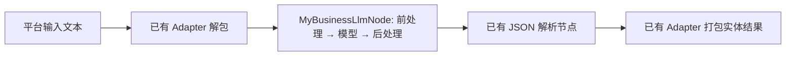

# 第一个自定义 Node：先写两段文本处理，再接入方案

这篇练习面向会写 C++、希望实现“输入处理 → 调用模型 → 输出处理”的方案开发者。
完成后，你会得到一个能通过统一 Demo 运行的节点，并知道下一次应该修改哪些文件。

先确认是否需要写代码：已有节点能通过连线或配置完成的需求，直接用 Pipeline。
下面用实体抽取指令做教学练习；这个任务本身也能用已有通用节点完成。

## 1. 先认清今天要改的范围

本练习使用既有模型能力和实体输入输出结构，只修改：

| 文件 | 你要做什么 |
| --- | --- |
| `src/custom_nodes/my_business_llm_node.cpp` | 脚手架生成后，填写两个文本函数 |
| `src/custom_nodes/CMakeLists.txt` | 脚手架自动登记源码 |
| `demo/fixtures/mock/pipeline_first_node.json` | 在复制的方案中选用新节点 |
| `demo/fixtures/mock/pipeline_first_node.conf` | 指向新方案，复用已有模型路径和输出容量 |

调度、模型加载和平台数据拷贝继续由框架承担。Node 返回内部文本，Adapter 在方案执行
完成后将最终值转换到平台结构。你不用在 Node 中操作平台指针或输出池。

完整的[轻量模板源码](../../dev_support/node_authoring/starter_llm_node.cpp)约百行，默认只做
文本透传和模型调用。脚手架直接使用这份文件，生成的源码会进入现有测试 runner 编译。
先关注 `BuildPrompt` 和 `FormatAnswer` 两个普通函数；其余部分可结合
[五个概念说明](custom_node_concepts.md)逐步阅读。

## 2. 生成自己的节点

以下命令都从仓库根目录执行。前提是已经按根目录 [README](../../README.md#快速开始)
完成默认构建；本练习使用确定性测试模型，不需要下载真实模型。

先查询当前构建，确认要复用的业务和节点：

```bash
./build/alg_pipeline_tool catalog --biz entity_extract_0.6b_v1
./build/alg_pipeline_tool describe-node StructuredJsonParseNode
```

再生成源码：

```bash
./scripts/scaffold_custom_node.py MyBusinessLlmNode --kind model -m llm --add-to-cmake
```

打开 `src/custom_nodes/my_business_llm_node.cpp`。文件中的主要内容分成三部分：

| 位置 | 第一次开发时怎么处理 |
| --- | --- |
| 顶部 `BuildPrompt` / `FormatAnswer` | 填写业务逻辑：接收一个字符串，返回一个字符串 |
| 中部 `InitModelNode` / `ProcessNode` | 保留端口绑定、空批次处理、模型调用和来源校验 |
| 底部 `MakeMyBusinessLlmNodeDefinition` / 注册宏 | 本次沿用默认声明；以后改变端口、配置或模型能力时同步修改 |

两个文本函数位于**具体节点内部**，不是新框架接口。你可以根据业务继续拆分小函数。
源文件按操作放在 `custom_nodes`，另一个方案复用时直接引用同一个节点类型。

## 3. 只修改两个函数体

在 `BuildPrompt` 中，将默认的 `return text;` 换成下面这行，给模型输入加上任务指令：

<!-- starter-example:BuildPrompt -->
```cpp
return "实体抽取：\n" + text;
```

在 `FormatAnswer` 中，将默认的 `return text;` 换成下面几行，去掉回答末尾的换行：

<!-- starter-example:FormatAnswer -->
```cpp
std::string answer = text;
while (!answer.empty() && answer.back() == '\n') answer.pop_back();
return answer;
```

你处理的是 `text`；固定结构负责把处理结果放回原来的 `(req_id, sub_id)`，不会把
第二条回答当成第一条的结果。前处理从只读输入构造新文本，不修改其他节点共享的输入。

这里没有模板语言、参数解析或 Markdown 解析器。需要这些能力时再使用已有通用节点，
或者参考完整样例中对应的一小部分。真实业务的字段提取、规则判断等纯函数也可以放在
这个位置；若需要多输入、输出数量变化或结构化类型，再使用完整的 `ProcessNode` 路径。

## 4. 编译，让工具能够找到新节点

```bash
./scripts/format.sh
cmake --build build --target alg_sdk alg_pipeline_tool alg_pipeline_tool_test alg_demo -j 4
./build/alg_pipeline_tool describe-node MyBusinessLlmNode
```

看到 `node_type` 为 `MyBusinessLlmNode`、输入输出为 `TextBatch`，说明构建和注册已完成。
仅创建 `.cpp` 文件还不够；`--add-to-cmake` 负责把它加入构建，重新编译才会进入 Catalog。

## 5. 复用已有方案和 Adapter

复制这两份已存在的配置，避免从空白文件猜业务输入输出：
如果已有同名练习文件，继续编辑它们即可，不必重新复制。

```bash
cp demo/fixtures/mock/pipeline_entity_extract_custom.json demo/fixtures/mock/pipeline_first_node.json
cp demo/fixtures/mock/pipeline_entity_extract_custom.conf demo/fixtures/mock/pipeline_first_node.conf
```

编辑 `pipeline_first_node.json` 中 `id` 为 `custom_prompt` 的节点，做两处修改：

- `node_type` 改成 `MyBusinessLlmNode`。
- 将整个 `config` 对象替换为下面的内容。轻量节点只声明了模型绑定，不接受完整样例的
  模板、清洗和采样配置字段。

```json
{"bind_model": "llm_0.6b_entity"}
```

保留该节点的 `ports` 和 `depends_on`，以及其他模型与 JSON 解析节点。
在 `pipeline_first_node.conf` 中，将 `data.pipe_path` 改为
`demo/fixtures/mock/pipeline_first_node.json`；其他字段沿用复制内容。

此时数据经过：



为什么节点里叫 `input`，方案里却叫 `input_sentences`？前者是这个操作的接口名，后者是
当前方案给数据取的名字；`ports` 将它们连起来。下一个方案可以换数据名，节点代码继续复用。

## 6. 校验并运行同一个 Demo

```bash
./build/alg_pipeline_tool_test validate demo/fixtures/mock/pipeline_first_node.json
./build/alg_pipeline_tool_test plan demo/fixtures/mock/pipeline_first_node.json
./build/alg_demo --biz entity_extract --config demo/fixtures/mock/pipeline_first_node.conf --dataset data/corpus_entity_extract.txt --output-dir results/first-node
```

这些配置使用测试模型，校验要用带测试注册的 `alg_pipeline_tool_test`。
`alg_pipeline_tool` 用于查看生产注册，也能发现刚编译的自定义节点。

查看 `results/first-node/entity_extract/results.jsonl`：应有 `request_id: 30001`、`status: 0`，
以及 `output.entities.nouns` 中的“张三”“清华大学”等值。`summary.json` 应显示一条成功、
零条失败。这里验证节点、编排与 Adapter 的完整路径，回答来自确定性测试模型。

替换真实模型时，按目标构建的 Catalog 更新 `models` 和资产路径，节点的 `bind_model`
引用相应 `model_id`。再用自己的输入与期望结果验收，不能把测试模型回答作为效果指标。

## 7. 从练习进入真实开发

首次运行只需要两个业务函数。准备交付时，把业务断言加入现有节点测试；可参考
[`test_common_nodes.cpp`](../../tests/unit/nodes/test_common_nodes.cpp) 中的
`StarterTextFunctionsFollowTheDocumentedExercise`。该测试编译本文的两个函数体，检查模型
实际收到的提示词、后处理结果、多条输入的来源，以及输入快照未被修改。

`--generate-test` 可以打印注册测试片段，但你仍需将其放入现有套件，并补充业务期望，
不能只检查“节点创建成功”。已有测试覆盖模型失败和错误来源时不发布输出；你的算法
还应覆盖自己的边界输入。交付执行 `./scripts/run_all_tests.sh`，流程见
[CONTRIBUTING](../../CONTRIBUTING.md)。

| 接下来遇到的问题 | 去哪里看 |
| --- | --- |
| 端口、编号、模型绑定、Definition、并发是什么意思 | [五个概念说明](custom_node_concepts.md) |
| 需要多个输入、配置化模板或复杂后处理 | [完整参考样例与能力边界](../../src/custom_nodes/README.md#完整参考样例) |
| 需要接入全新的平台结构 | [业务接入指南](../BUSINESS_ONBOARDING.md) |
| 需要新增模型语义或硬件后端 | [开发者扩展指南](../developer_guide.md) |

练习生成的节点与配置就是普通源码扩展。真正接入时用操作语义命名，例如“提取字段”或
“核对条件”，避免把项目名固化进节点或为每个业务再建目录。
