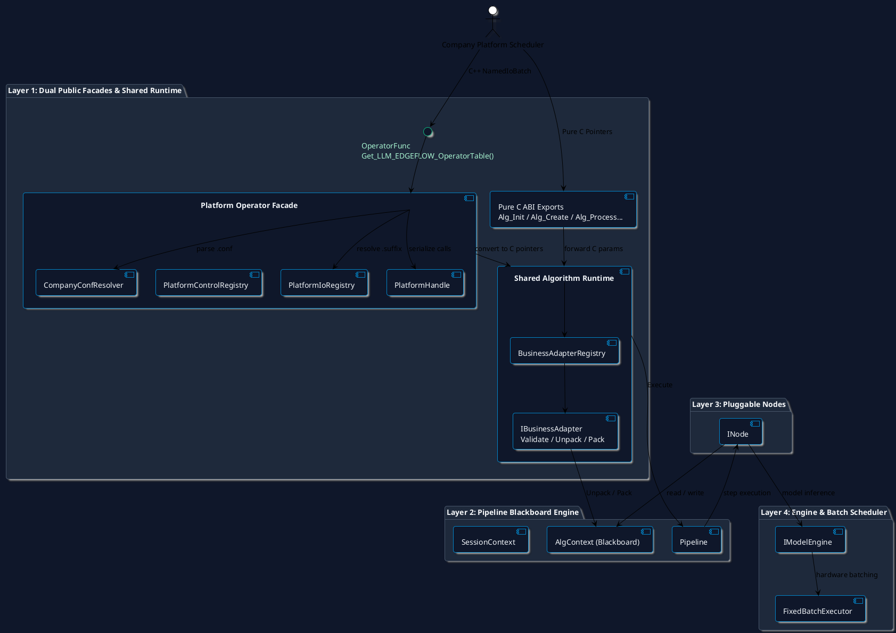

# LLM-EdgeFlow 平台 Operator 接口兼容层设计与实现

> 文档状态：已完成实现并全量回归测试 (v1.3.0 Release)
>
> 目标场景：公司平台通过 `OperatorFunc` 函数表、`.conf` 配置、命名 I/O Map 和外部输出调度调用算法库
>
> 兼容原则：保留现有纯 C ABI V2，在其上增加独立 C++ 平台兼容层

## 1. 背景与设计结论

公司平台的典型调用模型如下：

1. 通过 `Get_LLM_EDGEFLOW_OperatorTable()` 获取一组函数指针。
2. `Init` 初始化进程级资源。
3. `Create` 接收公司平台 `.conf`、芯片信息、网络最大 Batch 和输出深度，创建算法句柄。
4. 外部调度框架按本次实际样本数构造命名输入和输出，并调用 `Process`。
5. `Control` 通过公共命令枚举和对应参数结构体下发运行时配置。
6. `Destroy` 销毁句柄及 Create 阶段创建的输出结构体，`Deinit` 释放进程级资源。

现有仓库已经具备稳定的纯 C ABI、Pipeline、业务 Adapter、Blackboard 和固定 Batch 执行器。新接口不应替换这些能力，而应作为 Layer 1 的 C++ 兼容门面，将公司平台对象转换为现有运行时对象。

最终结论：

- `include/company_alg_interface.h` 保持纯 C，不加入 `std::vector`、`std::unordered_map` 或 `std::shared_ptr`。
- 新增独立 C++ 公开头提供 `OperatorFunc` 和命名 I/O 容器。
- C ABI 和平台门面共享同一个内部运行时句柄与创建逻辑，禁止维护两份 Pipeline 执行实现。
- `.conf` 只负责指向真正的 Pipeline JSON，并提供公司平台管理的模型路径等部署参数；Pipeline JSON 格式保持不变。
- `depth_num` 只声明 Create 阶段输出结构体的创建数量。输出对象的选择以及 input/output 对应关系由外部调度框架决定，LLM-EdgeFlow 不实现内部队列选择策略。

## 2. 范围与非目标

### 2.1 本设计覆盖

- C++ `OperatorFunc` 公开接口和参数类型。
- `.conf` 到 Pipeline JSON、模型路径和运行时参数的解析链路。
- `***.frame`、`***.od_out` 一类命名 I/O 的类型派发规则。
- Create、Process、Control、Destroy 生命周期和所有权边界。
- 外部实际 Batch 与模型固定 Batch 的关系。
- 与现有四层架构的集成方式、错误行为和测试矩阵。

### 2.2 本设计不覆盖

- 公司内网 `.conf` 的最终字段路径和完整 Schema。
- AX650 等芯片枚举的公司正式数值。
- 公司平台如何登记、排队和选择 `depth_num` 个输出对象。
- 将 C++ 容器接口暴露为纯 C ABI。

上述未知项全部集中在平台接入适配点，后续拿到公司接口后不需要修改 Pipeline、Node 或 Engine。

## 3. 总体架构



依赖方向仍为 Layer 1 → Layer 2 → Layer 3 → Layer 4。平台门面不得直接调用业务 Node 或硬件 SDK。

## 4. C++ 公开接口草案

以下名称为本仓库的规范化接口。移植到公司内网时，如正式类型名不同，只在兼容头做别名或薄转发。

```cpp
#pragma once

#include <cstdint>
#include <memory>
#include <string>
#include <unordered_map>
#include <vector>

namespace llm_edgeflow::platform {

enum class ChipType : int32_t {
  kUnknown = 0,
  kAx650 = 1,  // 占位值；移植时替换为公司公共枚举的正式值。
};

enum class ControlCommand : int32_t {
  kUpdateRules = 1,
  kSwitchPrompt = 2,
  kUpdateThreshold = 3,
  // 后续命令只能追加，不能复用已有数值。
};

struct PlatformConfig {
  int32_t batch_size = 1;
  int32_t device_id = 0;
  ChipType type = ChipType::kUnknown;
};

struct CreateParam {
  const char* cfg_file_name = nullptr;
  PlatformConfig platform_config;
  uint32_t depth_num = 1;
};

using OpaqueData = std::shared_ptr<void>;
using NamedIo = std::unordered_map<std::string, OpaqueData>;
using NamedIoBatch = std::vector<NamedIo>;

struct OperatorFunc {
  int (*Init)() noexcept;
  int (*Create)(void** handle, const CreateParam* param) noexcept;
  int (*Process)(void* handle, const NamedIoBatch& inputs,
                 NamedIoBatch& outputs) noexcept;
  int (*Control)(void* handle, ControlCommand command,
                 void* control_param) noexcept;
  int (*Destroy)(void* handle) noexcept;
  int (*Deinit)() noexcept;
};

OperatorFunc Get_LLM_EDGEFLOW_OperatorTable() noexcept;

}  // namespace llm_edgeflow::platform
```

### 4.1 接口约束

- 六个函数及函数表获取入口都必须为 `noexcept`，并具有 `std::exception` 和未知异常双重屏障。
- `Create` 成功时写入非空句柄；失败时必须保证 `*handle == nullptr`。
- `Process` 和 `Control` 使用 `void* handle`，不使用 `void**`。
- `Destroy` 是规范名称，不保留 `Destory` 拼写。
- 函数表按值返回，表内指针指向进程生命周期内稳定的静态函数。
- 不允许把这些 C++ 类型移动到 `company_alg_interface.h`。

### 4.2 参数校验

Create 阶段必须拒绝：

- `handle == nullptr`、`param == nullptr` 或非空的 `*handle`。
- `cfg_file_name == nullptr` 或空字符串。
- `batch_size <= 0`。
- `device_id < 0`。
- `type == ChipType::kUnknown` 或未支持芯片类型。
- `depth_num == 0`。

Process 阶段必须拒绝：

- 空句柄。
- 空输入 Batch。
- `inputs.size() != outputs.size()`。
- `inputs.size() > CreateParam::platform_config.batch_size`。
- 缺失、重复、方向错误或空指针的 I/O 类型槽位。

## 5. `.conf` 与 Pipeline JSON

### 5.1 两类配置的职责

公司 `.conf` 是独立的部署配置。它不是 LLM-EdgeFlow Pipeline JSON，也不直接传给 `ParsePipelineConfig`。

```json
{
  "data": {
    "pipe_path": "configs/pipeline_keyword_match.json",
    "model_path": "models/model.bin"
  }
}
```

以上仅用于说明字段提取方式，不定义公司最终 Schema。当前已知的 Pipeline 路径提取形式为类似 `data["pipe_path"]`；模型字段路径待公司接入时确认。

Pipeline JSON 继续使用仓库现有格式：

```json
{
  "business_name": "keyword_match_v1",
  "models": [],
  "pipeline": [
    {
      "node_type": "KeywordMatcherNode",
      "config": {}
    }
  ]
}
```

### 5.2 集中式公司配置解析器

公司字段读取只能出现在一个内部组件中：

```cpp
struct ResolvedCompanyConfig {
  std::filesystem::path pipeline_path;
  std::optional<std::filesystem::path> single_model_path;
  std::unordered_map<std::string, std::filesystem::path> model_paths_by_id;
};

class CompanyConfResolver {
 public:
  static bool Resolve(const std::filesystem::path& conf_path,
                      ResolvedCompanyConfig* result,
                      PlatformDiagnostic* diagnostic) noexcept;
};
```

移植时只替换 `CompanyConfResolver` 内的 JSON 字段路径。其他模块只使用 `ResolvedCompanyConfig`，不得直接读取 `data["..."]`。

### 5.3 路径解析顺序

Create 按以下确定顺序处理配置：

1. 规范化 `.conf` 路径并读取 JSON；文件不存在、JSON 非对象或解析失败时返回参数错误。
2. 通过 `CompanyConfResolver` 提取 Pipeline JSON 路径和模型覆盖。
3. Pipeline 相对路径以 `.conf` 所在目录为基准进行规范化。
4. 读取 Pipeline JSON，但不修改磁盘文件。
5. 模型相对路径同样以 `.conf` 所在目录为基准规范化后，写入内存中的 Pipeline JSON 副本。
6. 根据 Pipeline 的 `business_name` 反查唯一的 `AdapterDescriptor`；不存在或存在冲突时 fail-closed。
7. 将 `device_id`、芯片类型和其他运行时元数据写入 `SessionContext::RuntimeOptions`。
8. 调用 `Pipeline::BuildFromJson` 完成严格解析和构图。

不得创建临时 Pipeline JSON 文件，也不得为了平台字段放宽现有 Pipeline 根字段白名单。

### 5.4 模型路径覆盖规则

- Pipeline 没有模型时，忽略 `.conf` 中的单模型路径；规则类业务可以正常创建。
- Pipeline 恰好有一个模型且 `.conf` 提供单模型路径时，覆盖该模型的 `model_path`。
- Pipeline 有多个模型时，单一 `model_path` 含义不明确，Create 必须失败并给出诊断。
- 多模型配置必须由 Resolver 返回 `model_id -> model_path` 映射。
- 映射允许只覆盖部分模型；未覆盖模型保留 Pipeline JSON 中的路径。
- 映射包含未知 `model_id` 时 Create 失败，防止配置拼写错误被静默忽略。
- `.conf` 模型路径优先于 Pipeline JSON 路径；`platform_config.device_id` 优先于模型 `config.device_id`。

## 6. 命名 I/O 与类型派发

### 6.1 Key 解析规则

I/O Key 使用最后一个点号分隔命名空间和类型后缀：

```text
camera_0.frame    -> namespace = camera_0, type_suffix = frame
detector.od_out   -> namespace = detector, type_suffix = od_out
```

- 类型只由最后一个点号后的非空字符串决定。
- 点号前的字符串由外部平台用于链路、节点或通道命名，兼容层不解释。
- 没有点号、点号位于首尾、同一样本存在两个相同后缀或未知后缀时返回输入错误。
- 每个样本必须满足当前业务 Adapter 声明的必需输入和输出后缀集合。
- 未声明的额外后缀默认拒绝，避免错误数据被静默忽略。

### 6.2 平台 I/O 描述符

在现有 `AdapterDescriptor` 的 C++ 内部元数据旁增加平台描述信息，不修改纯 C 业务结构体：

```cpp
enum class IoDirection { kInput, kOutput };

struct PlatformIoSlotDescriptor {
  std::string suffix;
  std::string c_type_name;
  IoDirection direction;
  bool required = true;
};

struct PlatformIoDescriptor {
  CompanyAlgBizType biz_type;
  std::vector<PlatformIoSlotDescriptor> slots;
};
```

注册规则：

- `biz_type + direction + suffix` 必须唯一。
- 类型名必须与业务 Adapter 的真实 C 输入/输出结构体一致。
- 注册冲突使 `Init` fail-closed，与现有 Node、Engine、BusinessAdapter Registry 行为一致。
- `Process` 只取 `shared_ptr<void>::get()` 形成临时 C 指针数组，不复制业务结构体。

第一阶段每个样本仍映射为一个现有 C 输入结构体和一个 C 输出结构体。将来若公司单个样本包含多个独立槽位，应由业务专属 Platform I/O Adapter 把这些槽位组装为现有业务 C DTO，不能在通用门面中硬编码业务字段。

## 7. 句柄、输出内存与所有权

### 7.1 PlatformHandle

平台句柄至少保存：

- 已构建的共享内部算法运行时实例。
- 选中的业务 Adapter 和平台 I/O 描述符。
- `batch_size`、`device_id`、`ChipType` 和 `depth_num` 的不可变副本。
- 公司输出内存接入上下文的 opaque 引用。
- 用于同句柄 `Process`/`Control` 串行化的互斥量。
- 活跃/销毁状态，防止销毁后继续调用。

纯 C ABI 和 C++ 平台门面应下沉到一个共享的内部 Runtime，不允许平台门面通过生成临时文件再调用 `Alg_Create`，也不允许复制 `Alg_Process` 的 Unpack → Execute → Pack 逻辑。

### 7.2 `depth_num` 的准确语义

`depth_num` 仅表示 Create 阶段需要创建的输出结构体组数。例如 `depth_num == 12` 表示公司平台集成代码需要建立 12 组输出对象，并在 Destroy 阶段统一销毁。

本框架不负责：

- 决定当前 Process 使用 12 组中的哪一组。
- 维护空闲、占用、等待或回收队列。
- 在深度耗尽时阻塞、扩容或返回忙错误。
- 猜测 input 和 output 的帧号对应关系。

这些行为由公司外部调度框架负责。进入 `Process` 前，外部调度框架必须已经把本次选中的非空输出对象放入 `outputs[i]["***.od_out"]`。

### 7.3 指针生命周期

- 输入 `shared_ptr<void>` 由外部调用方持有；框架仅在同步 `Process` 期间借用底层指针。
- 输出结构体的真实内存由 Create 阶段的公司平台内存接入实现持有，并在 Destroy 时释放。
- 放入 `NamedIo` 的输出 `shared_ptr<void>` 是平台选中对象的句柄；兼容层不得替换其底层地址。
- 调用方必须在 `Destroy` 前停止同句柄的 Process/Control，并释放或作废所有外部输出引用。
- `Destroy` 返回后，任何指向该句柄输出对象的引用均不得再解引用。

## 8. Batch 语义

平台参数中的 `batch_size` 是一次 `Process` 允许提交的最大外部样本数，本次实际样本数为 `curbatch`：

```cpp
int curbatch = std::min(batch_size, image_num - frame_idx);
```

两者和底层模型固定 Batch 的关系如下：

```text
外部平台 batch_size       Process 的最大样本数
外部平台 curbatch         本次真实样本数，1 <= curbatch <= batch_size
Pipeline model max_batch  单个模型/引擎的固定硬件 Batch
FixedBatchExecutor        对 curbatch 派生的推理项切分、补齐、剥离和溯源
```

平台 `batch_size` 不覆盖 Pipeline 中所有模型的 `max_batch_size`。多模型 Pipeline 可以继续使用不同的固定 Batch；所有批推理实现仍必须经过 `FixedBatchExecutor::Execute`。

## 9. Process 数据流

```text
1. 校验 handle、Batch 数量及 Create 时的 batch_size 上限
2. 根据 Pipeline business_name 取得业务和 Platform I/O Descriptor
3. 对每个 NamedIo 解析最后一个点号后的类型后缀
4. 校验必需后缀、方向、重复项和 shared_ptr 非空
5. 从 shared_ptr<void>::get() 构造本次调用的临时 const void*/void* 数组
6. 调用共享 Runtime 的 BusinessAdapter::ValidateBatch
7. BusinessAdapter::Unpack -> AlgContext
8. Pipeline::Execute
9. BusinessAdapter::Pack -> 外部已经选定的输出结构体
10. 返回实际状态码；不在句柄内保留输入指针
```

同一个句柄上的 `Process` 和 `Control` 默认串行执行。不同句柄可以并发执行；`Destroy` 前由调用方停止并等待该句柄的所有调用。

## 10. Control 设计

平台接口使用公共枚举决定 `void* control_param` 的真实类型。公共 C/C++ 接口必须为每个命令声明唯一参数结构体；通用门面不得通过猜测内存布局解析参数。

内部注册表负责：

```text
ControlCommand
  -> expected parameter type
  -> null/范围/string length validation
  -> nlohmann::json or typed internal command
  -> Pipeline::Control
```

未知命令、空参数或结构体字段非法时返回参数错误。命令枚举只允许追加，禁止改变已有命令的含义。公司正式命令和参数结构体拿到后，只替换该注册表的映射。

## 11. 错误码映射

平台门面优先复用现有 ABI V2 错误码：

| 错误码 | 平台门面含义 |
| --- | --- |
| `0` | 成功 |
| `-1` | 空句柄、无效句柄或非法生命周期状态 |
| `-2` | Create/Control 参数、`.conf` 或路径字段非法 |
| `-3` | Batch、命名输入、类型后缀或业务输入字段非法 |
| `-4` | 输出 Batch、输出槽位或输出结构体不可用 |
| `-5` | Pipeline 业务未注册、业务绑定不匹配或芯片/业务不支持 |
| `-6` | Registry 冲突，初始化或创建 fail-closed |
| `-99` | 捕获到 `std::exception` |
| `-100` | 捕获到未知异常 |

实现时增加线程局部的结构化诊断查询接口可以作为后续增强，但不能改变上述返回码语义。

## 12. 目标 demo 形式

demo 只展示公司平台调用形状，不实现 `depth_num` 输出调度。示例中的 `AcquireOutputForFrame` 代表公司外部调度框架已经完成输出对象选择。

```cpp
using namespace llm_edgeflow::platform;

OperatorFunc ops = Get_LLM_EDGEFLOW_OperatorTable();
if (ops.Init() != 0) return -1;

CreateParam param_create{};
param_create.cfg_file_name = "cfg.conf";
param_create.platform_config.batch_size = 1;
param_create.platform_config.device_id = 0;
param_create.platform_config.type = ChipType::kAx650;
param_create.depth_num = 12;

void* handle = nullptr;
if (ops.Create(&handle, &param_create) != 0) {
  ops.Deinit();
  return -1;
}

ControlParam control_param{};
ops.Control(handle, ControlCommand::kUpdateThreshold, &control_param);

for (int frame_idx = 0; frame_idx < image_num;) {
  int curbatch = std::min(param_create.platform_config.batch_size,
                          image_num - frame_idx);
  NamedIoBatch input_od(curbatch);
  NamedIoBatch output_od(curbatch);

  for (int i = 0; i < curbatch; ++i) {
    input_od[i]["detector.frame"] = images[frame_idx + i];

    // 由外部平台从 Create 阶段准备的输出对象中选择本帧对应对象。
    output_od[i]["detector.od_out"] =
        external_scheduler.AcquireOutputForFrame(frame_idx + i);
  }

  int ret = ops.Process(handle, input_od, output_od);
  if (ret != 0) break;
  frame_idx += curbatch;
}

ops.Destroy(handle);
ops.Deinit();
```

`ControlParam`、输入 `frame` 结构体、输出 `od_out` 结构体及外部调度器均由公司公共接口提供，因此开源 demo 只保留可替换示意类型。

## 13. 后续实现步骤

### 阶段 A：共享内部 Runtime

- 从 `company_c_adapter.cpp` 提取不导出的内部 Runtime 和 Handle 实现。
- 让现有六个 C ABI 继续通过该 Runtime 工作，保持 ABI、错误码和测试不变。
- Runtime 同时支持从文件和内存 JSON 创建 Pipeline，避免临时文件。

### 阶段 B：平台配置与函数表

- 新增 C++ 平台公开头和函数表实现。
- 实现 `CompanyConfResolver`、相对路径规范化、模型路径覆盖和 business_name 反查。
- 将 `device_id`、芯片类型和外部 Batch 元数据贯通到句柄与 SessionContext。

### 阶段 C：I/O 与 Control 注册

- 为首个实际业务登记 `frame` 和 `od_out` 后缀及对应 C 结构体。
- 实现零拷贝 NamedIo 到 C 指针数组转换。
- 建立 ControlCommand 到公共参数结构体的集中映射。
- 接入公司提供的输出内存创建/销毁钩子，但不实现输出选择队列。

### 阶段 D：demo 与测试

- 将 `alg_demo` 的平台演示入口改为本文件第 12 节的调用形状。
- 保留现有 C11 ABI 测试，新增 C++ Operator 集成测试并注册到 CTest。
- 更新 README Changelog，执行格式化、CTest 和六阶段全量回归。

## 14. 未来测试矩阵

| 类别 | 必测场景 |
| --- | --- |
| 函数表 | 六个函数指针非空；获取入口不抛异常 |
| 生命周期 | Init/Create/Process/Control/Destroy/Deinit 正常闭环；空句柄和重复销毁失败 |
| `.conf` | 文件不存在、非法 JSON、缺少 `pipe_path`、错误字段类型、相对路径解析 |
| 模型覆盖 | 零模型、单模型覆盖、多模型映射、未知 model_id、单路径配多模型失败 |
| 业务绑定 | business_name 唯一反查、未注册业务、重复注册冲突 |
| 命名 I/O | 正常后缀、无点号、空后缀、未知后缀、重复后缀、方向错误、空 shared_ptr |
| Batch | `curbatch` 为 1、等于上限、超过上限；模型固定 Batch 自动补齐和剥离 |
| 输出所有权 | 使用外部选定输出对象；Process 不替换地址；Destroy 后禁止访问 |
| Control | 每个命令正常路径、空参数、错误结构体内容、未知命令 |
| 并发 | 不同句柄并发；同句柄 Process/Control 串行；Destroy 前停止调用 |
| 异常安全 | 每个公开入口捕获标准异常和未知异常，绝不越过 ABI 边界 |
| 回归 | 现有 C11 ABI、7 个业务 Pipeline、LayerGuard 和六阶段测试全部通过 |

## 15. 公司内网移植清单

拿到公司正式接口后，只需要确认并替换以下内容：

1. `.conf` 中 Pipeline 路径、单/多模型路径的最终 JSON 字段路径。
2. `ChipType` 与 AX650 等芯片的正式枚举数值。
3. `ControlCommand` 数值和每个命令对应的公共参数结构体。
4. `frame`、`od_out` 等点后缀对应的公共 C 结构体。
5. Create/Destroy 阶段输出结构体创建和销毁钩子。
6. 外部调度框架如何把选中的输出对象放入本次 `NamedIoBatch`。

这些替换全部限制在 Layer 1。Pipeline JSON、AlgContext、业务 Node、Engine 和 `FixedBatchExecutor` 不需要因公司平台接口变化而修改。
