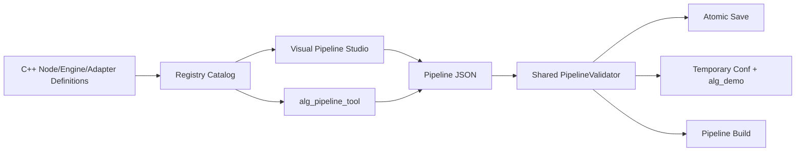

# RFC 0006: 图形化算法方案工作台与 Catalog/Validator 单一事实源

- **RFC 编号**：0006-visual-pipeline-studio
- **创建日期**：2026-08-23
- **文档状态**：Completed
- **关联分支**：`feat/visual-pipeline-studio`
- **目标版本**：v2.5.0
- **负责人 / 作者**：LLM-EdgeFlow Team

---

## 1. 背景与动机 (Motivation & Context)

当前 Web 可视化页只能可靠展示内置预设。其节点、端口和参数由前端手工维护，已经与运行时的 `id`、`model_id`、`bind_model` 和节点实际 Blackboard Key 发生漂移；保存只下载文件，`/api/run_cpp` 也没有后端实现。

本需求建立 C++ Definition/Catalog、共享 Validator、图形化编辑器和真实 Demo 运行闭环，使开发者只通过 Pipeline JSON 即可创建或调整已有算子组成的算法方案。

## 2. 设计范围与边界 (Scope & Non-Goals)

### 2.1 范围内 (In-Scope)

- 代码侧 Node/Engine Definition 与机器可读 Catalog。
- 无模型加载副作用的 Pipeline 静态 Validator 与结构化报告。
- `alg_pipeline_tool` 的 catalog、describe、init、normalize、validate、plan 命令。
- 本机 Web 工作台的方案 CRUD、Graph 编辑、真实校验和 Demo Profile 草稿运行。
- `pipeline-composer` 与 `llm-edgeflow-developer-guide` 使用同一 Catalog/Validator。

### 2.2 非目标 (Non-Goals / Out-of-Scope)

- 不在 Web 中创建新的 C++ 节点、业务模态或引擎。
- 不改变 6 个公开 C ABI 函数或公开 C 结构体。
- 不提供多人协作、远程部署、账号权限或逐节点运行时调试。
- 不向 Pipeline JSON 写入节点坐标、颜色等 UI 元数据。

## 3. 总体技术方案与架构设计 (Architecture & Technical Design)

### 3.1 架构分层映射 (4-Tier Mapping)

- **Layer 1**：Adapter Descriptor 补充 Pipeline ingress/egress Blackboard 端口，仅供静态校验；C ABI 不变。
- **Layer 2**：新增 Definition、Catalog、ValidationReport 与 PipelineValidator；Pipeline Build 复用相同预检。
- **Layer 3**：生产节点注册 Definition，并使用共享的类型化 Blackboard Key。
- **Layer 4**：EngineFactory 注册并导出 EngineDefinition；推理执行仍遵守 FixedBatchExecutor 契约。

### 3.2 核心接口与数据流设计

```cpp
template <typename T>
struct BlackboardKey {
  const char* name;
};

struct NodeDefinition {
  std::string node_type;
  std::string category;
  std::string description;
  std::vector<PortDefinition> inputs;
  std::vector<PortDefinition> outputs;
  std::vector<ConfigFieldDefinition> config_fields;
  std::string model_capability;
  bool parallel_safe = false;
};

struct ValidationReport {
  bool ok = false;
  std::vector<ValidationDiagnostic> diagnostics;
  std::vector<std::string> topological_order;
  std::vector<std::vector<std::string>> topological_layers;
};
```



### 3.3 Web 与文件安全

- 服务仅绑定 `127.0.0.1`，作为单用户开发期工具，不引入账号或令牌鉴权。
- 只允许创建/覆盖 `configs/pipeline_[a-z0-9_]+.json`。
- 使用 SHA-256 revision 防止覆盖 IDE/Git 外部修改。
- 保存前调用 C++ Validator，使用同目录临时文件和原子替换。
- 草稿运行使用隔离临时目录，不修改正式 `.conf` 和仓库 `results/`。

## 4. 关键设计考量与权衡 (Design Trade-offs & Invariants)

1. Catalog 只能由 Registry Definition 导出；Web、Python 和 Skills 禁止维护节点事实表。
2. 连线表示现有 JSON 的 `depends_on`，不引入端口映射协议。
3. 旧顺序配置只在首次结构编辑时显式转换为 `id + depends_on`。
4. 不完整草稿可以编辑，但保存和运行必须零错误。
5. Validator 不加载模型；真实模型加载错误由 Build/Demo 阶段报告。
6. 节点位置只保存在浏览器本地存储，不污染运行时配置。

## 5. 测试与质量验收计划 (Testing & Verification Plan)

- [x] `tests/test_pipeline_studio.cpp`：Definition、Catalog、Validator、normalize 和 CLI 契约。
- [x] `tests/test_visualizer_server.py`：路径安全、revision、原子保存、本机 API 和草稿运行。
- [x] 所有现有 Pipeline 均通过新 Validator、Build 和 Demo 回归。
- [x] `keyword_match_mock` 完成 Web API 到真实 Demo 的最小执行闭环。
- [x] 两个技能通过 `quick_validate.py`，且不再包含手写节点 Catalog。
- [x] 23 项 CTest 与 `./scripts/run_all_tests.sh` 六阶段回归 100% 通过。

## 6. 实施路线与里程碑 (Implementation Milestones)

1. [x] 创建特性分支并提交 RFC 设计。
2. [x] 完成 Definition、Validator、CLI 与 C++ 测试。
3. [x] 完成本机 API、模块化 SVG 编辑器和 Python 测试。
4. [x] 重构两个项目技能并执行技能校验。
5. [x] 完成全量回归、文档与 Changelog，RFC 更新为 Completed。

## 7. 变更记录 (Changelog)

| 日期 | 版本 | 变更内容 | 作者 |
| :--- | :--- | :--- | :--- |
| 2026-08-23 | v0.1 | 初始设计与实施基线 | LLM-EdgeFlow Team |
| 2026-08-23 | v1.0 | 完成 Catalog/Validator/CLI、工作台、隔离运行、技能重构与全量验收 | LLM-EdgeFlow Team |
| 2026-08-23 | v1.1 | 按开发期单用户定位移除会话令牌，保留回环绑定和文件安全边界 | LLM-EdgeFlow Team |
