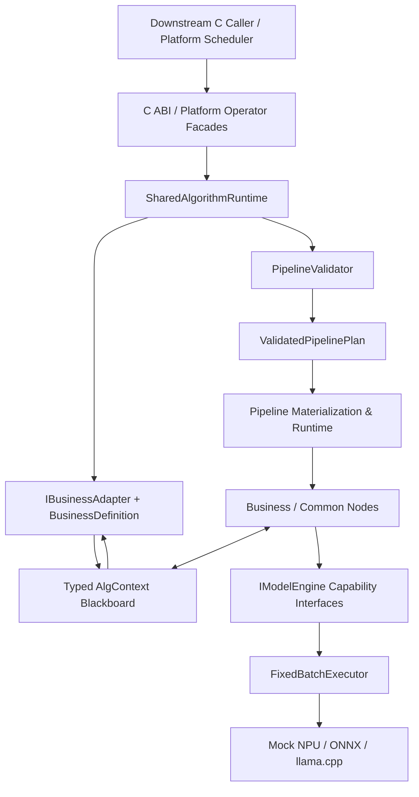

# RFC 0008: 架构契约收敛与文档一致性修复

- **RFC 编号**：0008-architecture-contract-consolidation
- **创建日期**：2026-08-25
- **文档状态**：In Implementation
- **关联分支**：`feat/architecture-contract-consolidation`
- **目标版本**：v2.1.0
- **负责人 / 作者**：LLM-EdgeFlow Team
- **实施计划与验收报告**：
  - 整改计划：[`reviews/0008-architecture-contract-consolidation-remediation-plan.md`](reviews/0008-architecture-contract-consolidation-remediation-plan.md)
  - 独立验收报告：[`reviews/0008-architecture-contract-consolidation-acceptance.md`](reviews/0008-architecture-contract-consolidation-acceptance.md)
  - 收敛复审报告：[`reviews/0008-architecture-contract-consolidation-convergence-review-20260826.md`](reviews/0008-architecture-contract-consolidation-convergence-review-20260826.md)

---

## 1. 背景与动机

LLM-EdgeFlow 已形成可工作的四层运行时：两个外部门面汇入
`SharedAlgorithmRuntime`，业务 Adapter 完成 C ABI 与内部 DTO 转换，Pipeline
负责显式 DAG 调度，节点通过能力接口调用异构引擎，固定批推理统一使用
`FixedBatchExecutor`。这一内核方向正确，本 RFC 不推翻四层结构。

当前问题集中在控制面、契约事实源和文档同步：

1. Node、Engine 和 Business Definition 与实现分离维护，新增能力仍需修改中心
   Catalog。
2. 业务名称、Pipeline 白名单、C 类型和平台 I/O 信息分散在 Adapter、Catalog、
   PlatformIoRegistry、配置及 Demo Profile 中。
3. Blackboard 端口名称、Catalog `type_id` 与实际 `Get<T>/Set<T>` 类型分别使用
   手工字符串声明。
4. Validator 和 Pipeline 各自执行解析、Registry 检查与 DAG 拓扑排序。
5. Runtime 通过诊断字符串识别私有扩展并绕过部分 Validator 错误，CLI、Web 和
   Runtime 可能对同一配置得出不同结论。
6. 部分 common/business 节点归属不准确，LLM 推理逻辑存在重复。
7. 生产节点普遍重复实现名称、模型绑定、Typed Blackboard 取值、错误回写和
   Traceable Batch 调用，但当前只有一个纯接口 `INode`，缺少受约束的通用实现层。
8. 三份架构文档没有充分区分当前能力、部分能力和规划能力。

本 RFC 将当前“结构合理的单仓静态 SDK”收敛为契约清晰、事实唯一、可静态验证且
文档可持续维护的平台内核。

### 1.1 预期收益

- 新节点或引擎只在自身实现处声明构造函数和 Definition。
- Adapter、节点和 Catalog 共享同一组类型化 Blackboard Key。
- Validator 一次生成不可变执行计划，Pipeline 只负责物化与执行。
- CLI、Web、Demo 和 Runtime 对同一配置给出相同诊断与拓扑。
- 公共节点以真实跨业务复用为准，避免过度抽象。
- 节点通过浅层基类复用生命周期骨架和安全边界，业务算法继续通过组合保持清晰。
- 架构文档分别稳定表达当前概念、当前结构和目标蓝图。

---

## 2. 设计范围与边界

### 2.1 范围内

- [ ] Node、Engine、Business Definition 与注册点收敛。
- [ ] Blackboard Key 与端口类型契约统一。
- [ ] 引入 `ValidatedPipelinePlan`，删除重复解析和拓扑规划。
- [ ] 统一结构化诊断码和显式 Validation Policy。
- [ ] 调整 common/business 节点归属并收敛 LLM 推理重复。
- [ ] 引入浅层 Node 基类与组合式助手，迁移适合的生产节点。
- [ ] 修复 `DenseRetrievalNode` 中未参与检索的无效 Embedding 计算。
- [ ] 将节点和引擎并行安全能力改为显式声明。
- [ ] 同步架构说明、PlantUML、开发指南、Skill 和 SVG 资源。
- [ ] 增加架构契约与文档漂移测试。

### 2.2 非目标

- 不修改六个公开 C ABI 函数、C 结构体布局或现有错误码数值。
- 不引入动态插件 ABI，继续采用单仓库和静态链接注册。
- 不新增推理后端，不改变 `IModelEngine` 能力接口语义。
- 不改变官方业务输入输出结构及结果语义。
- 本 RFC 不建设完整 Business Manifest JSON Schema 或 Scaffolder；待内部契约稳定
  后另立 RFC。
- v2.1.0 不立即删除可能被外部 Pipeline 使用的旧节点名称，先提供兼容包装。
- 不把所有相似节点合并为巨型模板，只抽取稳定且跨业务重复的能力。
- 不修改 `INode::Init/Process/Control/Name` 签名，不要求所有节点继承推理模板。
- 不按 Pre/In/Post、Rule、Business/Common 等分类创建空壳基类；目录和 Definition
  已负责表达这些分类。

### 2.3 兼容性默认值

- 公开 C ABI：完全兼容。
- 官方 Pipeline：保持显式 `id + depends_on`，全部继续可执行。
- 私有 C++ 扩展：通过显式兼容策略支持，不再解析错误消息隐式放行。
- 默认生产策略：`ValidationPolicy::kStrict`。

---

## 3. 总体技术方案与架构设计

### 3.1 四层映射

- **Layer 1**：保留双门面和 Shared Runtime；Adapter 注册时发布业务 Pipeline
  Definition；Platform I/O 只维护平台槽位别名。
- **Layer 2**：Catalog 仅聚合注册数据；Validator 生成
  `ValidatedPipelinePlan`；Pipeline 只物化计划；Blackboard 使用类型化 Key。
- **Layer 3**：节点实现、Definition 和注册位于同一编译单元；请求状态只进入
  `AlgContext`；common 目录只容纳真实跨业务节点；浅层基类只实现跨业务稳定的
  生命周期和安全功能，算法复用优先采用组合。
- **Layer 4**：Engine 实现、Definition 和注册位于同一编译单元；固定批路径继续
  使用 `FixedBatchExecutor`；补充 Engine 线程模型。

依赖方向保持：

```text
Layer 1 → Layer 2 → Layer 3 → Layer 4
```

Core 不得依赖业务节点、Adapter 或具体 Engine；节点不得依赖公开 C ABI 结构体或
具体 Engine 实现。

### 3.2 目标数据流



### 3.3 Definition 就地注册

生产 Node 和 Engine 在实现编译单元中同时注册构造函数与 Definition：

```cpp
class LlmGenerateNode final : public ModelBoundNode<ILlmEngine> {
 public:
  inline static constexpr char kNodeType[] = "LlmGenerateNode";
  // ...
};

NodeDefinition MakeLlmGenerateDefinition();
REGISTER_NODE_WITH_DEFINITION(LlmGenerateNode,
                              MakeLlmGenerateDefinition());

EngineDefinition MakeOnnxEmbeddingDefinition();
REGISTER_ENGINE_WITH_DEFINITION(OnnxEmbeddingEngine,
                                MakeOnnxEmbeddingDefinition());
```

每个 Node 的 `kNodeType` 是类型名唯一事实源：NodeBase 构造、Definition 的
`node_type` 和注册宏必须共同引用它。`REGISTER_NODE_WITH_DEFINITION` 不再用
`#NodeType` 产生第二份名称，并拒绝 Definition 名称不一致的注册。

完成迁移后删除 `BuiltinNodes/Engines`、`FindBuiltinNode/Engine` 以及 Web、Skill 或
文档中的手工能力表。`PipelineCatalog` 只负责注册、冲突检测、查询和 JSON 导出。

### 3.4 Business Definition 由 Adapter 发布

建议让 Adapter Descriptor 包含其接受的 Pipeline Definition：

```cpp
struct AdapterDescriptor {
  CompanyAlgBizType biz_type;
  std::string biz_name;
  std::string abi_version;
  std::string input_type_name;
  std::string output_type_name;
  int max_batch_size;
  OwnershipPolicy ownership_policy;
  ThreadModel thread_model;
  OutputCardinality cardinality;
  std::vector<BusinessDefinition> pipelines;
};
```

`REGISTER_BUSINESS_ADAPTER` 原子完成 Adapter 和 Business Definition 注册，并检查
业务 ID、业务名称和 Pipeline 名称冲突。`ValidatePipelineBinding()` 从
`pipelines` 推导；删除独立 `allowed_pipeline_names` 和中心 Builtin Business 表。

Platform I/O 继续维护 canonical suffix、aliases、direction 和 required，但业务名、
输入 C 类型和输出 C 类型从 Adapter Descriptor 推导。

### 3.5 类型化 Blackboard 契约

```cpp
template <typename T>
struct BlackboardKey {
  const char* name;
  const char* type_id;
};

template <typename T>
PortDefinition RequiredInput(const BlackboardKey<T>& key);

template <typename T>
PortDefinition Output(const BlackboardKey<T>& key,
                      bool allow_override = false);
```

公共 Key 放在框架级契约头文件；业务 Key 放在
`src/business/<business>/<business>_contract.h`。Adapter、节点、NodeDefinition
和 BusinessDefinition 必须引用同一 Key。

生产代码不得新增手写字符串版 `Get/Set/Port`。`RerankRefineNode` 的动态 Key 字段在
一个兼容版本内继续解析，但仅允许标准 Key；非标准值返回带迁移建议的诊断。

### 3.6 唯一校验与执行计划

```cpp
enum class ValidationPolicy {
  kStrict,
  kPrivateExtensionCompatible,
};

struct ValidatedPipelinePlan {
  ParsedPipelineConfig config;
  std::vector<std::string> topological_order;
  std::vector<std::vector<std::string>> topological_layers;
  ValidationReport report;
};

class PipelineValidator {
 public:
  static ValidatedPipelinePlan ValidateAndPlan(
      const nlohmann::json& root,
      ValidationPolicy policy = ValidationPolicy::kStrict);
  static ValidationReport Validate(const nlohmann::json& root);
};
```

`Pipeline::BuildInternal()` 只调用一次 `ValidateAndPlan()`，随后创建 Engine、加载模型、
创建 Node 并建立执行层。删除 Pipeline 中的二次 Parse、重复 Registry 检查和第二套
拓扑排序。

生产入口统一使用严格策略；兼容策略只能由测试或明确的内部嵌入调用选择。CLI、Web、
Demo 和 Runtime 对相同配置、相同策略必须产生相同诊断和拓扑。

### 3.7 结构化诊断

增加稳定 `DiagnosticCode` 枚举，并由唯一函数序列化成字符串。PipelineDiagnostic
直接承载首个 Validation Diagnostic；禁止通过错误消息文本判断兼容行为。
AdapterStatus 和公开 C ABI 错误码继续作为边界类型存在，但映射必须基于稳定枚举。

### 3.8 Layer 3 Node 基类与通用功能

#### 3.8.1 设计原则与继承层次

保留 `INode` 作为唯一运行时多态接口，在其上最多提供三层浅继承：

```text
INode
  └─ NodeBase
       ├─ 普通业务节点（Pre / Rule / Post 等）
       └─ ModelBoundNode<EngineCapability>
            ├─ 自定义模型节点（多输入、多输出、组对或归并）
            └─ TraceableUnaryInferenceNode<Engine, Input, Output>（可选）
```

约束如下：

1. `NodeBase` 是所有新生产节点的推荐基类，但不改变 `INode` 接口。
2. `ModelBoundNode<T>` 仅用于单模型能力绑定；多模型节点直接继承 `NodeBase` 并显式
   绑定，避免隐藏资源关系。
3. `TraceableUnaryInferenceNode` 只适用于“一个 Traceable Batch 输入、一次引擎调用、
   一个 Traceable Batch 输出”的节点。只要节点包含双输入、组对、检索、归并或多个
   推理调用，就退回 `ModelBoundNode<T>`，不得为追求继承而扭曲算法。
4. 继承负责稳定骨架，业务步骤和数学算法使用自由函数或小型 helper 组合。
5. 继承深度上限为 `INode` 之上的三层；禁止继续派生新的分类基类。

#### 3.8.2 `NodeBase` 职责与接口草案

新增 `include/nodes/node_support.h`，`include/core/node_base.h` 继续只定义稳定的
`INode` 接口。接口名称可在实现评审中微调，但职责不得扩大：

```cpp
enum class NodeRuntimeCode : int {
  kInvalidContext = -2901,
  kUnhandledException = -2902,
};

class NodeBase : public INode {
 public:
  explicit NodeBase(std::string node_name);
  bool Init(const nlohmann::json& config,
            SessionContext* session_ctx) noexcept final;
  int Process(AlgContext* req_ctx) noexcept final;
  const std::string& Name() const final;

 protected:
  virtual bool InitNode(const nlohmann::json&, SessionContext&) {
    return true;
  }
  virtual int ProcessNode(AlgContext& req_ctx) = 0;

  template <typename T>
  const T* Require(AlgContext& ctx, const BlackboardKey<T>& key,
                   int error_code, std::string_view semantic) const;

  template <typename T>
  void Publish(AlgContext& ctx, const BlackboardKey<T>& key, T value) const;

  int Fail(AlgContext& ctx, int error_code,
           std::string_view message) const;

 private:
  const std::string node_name_;
};
```

- `Name()` 由构造时传入的 `NodeType::kNodeType` 实现，删除每个节点重复的静态字符串
  函数，并确保返回值与注册名、Definition 完全一致。
- `Init()` 检查 Session 指针并调用 `InitNode()`；`Process()` 检查请求指针并调用
  `ProcessNode()`。两者 final 且 `noexcept`，捕获标准及未知异常，保证异常不越过节点
  边界。默认 `InitNode()` 返回 true，无配置普通节点无需重复空实现。
- `NodeRuntimeCode` 只覆盖此前未定义的空 Context 和意外异常，不替换任何节点已有的
  配置、缺失输入或引擎错误码，也不改变公开 C ABI 错误码。异常路径对非空 Context
  尽最大努力写入错误消息；即使错误消息分配失败，也必须返回 `kUnhandledException`。
- `Require()` 返回只读输入，必须使用 `BlackboardKey<T>`；它通过 `Has()` 区分缺失与
  类型不匹配，在失败时设置错误码及包含节点名、Key 名、预期 `type_id` 的消息，并
  返回 `nullptr`；调用方仍显式返回该节点自己的稳定错误码。
- `Publish()` 只接受与 Key 完全相同的类型，并移动写入 `AlgContext`；是否允许覆盖
  仍由 Validator 根据 Definition 决定，NodeBase 不偷偷改变运行时覆盖策略。
- `Fail()` 统一 `SetError + return code`，不得抛异常，也不得把错误码改造成全局共享
  的模糊通用码。
- NodeBase 不解析业务配置、不持有 `SessionContext`、不注册 Definition，也不决定
  `parallel_safe`；业务节点只能覆盖 `InitNode/ProcessNode`，不得绕过安全外壳。

实现时应同时把 `AlgContext::Set(const BlackboardKey<T>&, U&&)` 的严格类型检查和
`BlackboardKey<T>::type_id` 纳入阶段 2，确保上述 helper 没有字符串旁路。

#### 3.8.3 `ModelBoundNode<EngineCapability>` 职责

新增 `include/nodes/model_bound_node.h`：

```cpp
template <typename EngineCapability>
class ModelBoundNode : public NodeBase {
 protected:
  ModelBoundNode(std::string node_name, std::string default_model_id);
  const std::shared_ptr<EngineCapability>& engine() const;
  virtual bool InitModelNode(const nlohmann::json& config,
                             SessionContext& session_ctx) {
    return true;
  }

 private:
  bool InitNode(const nlohmann::json& config,
                SessionContext& session_ctx) final;

  const std::string default_model_id_;
  std::shared_ptr<EngineCapability> engine_;
};
```

NodeBase 已检查 Session 指针；`InitNode()` 的固定顺序是：读取标准 `bind_model`（缺省
为构造参数）→ `GetModel<EngineCapability>()` 并检查能力类型 → 调用
`InitModelNode()` 读取温度、Top-K 等节点专属配置。派生类不得重写 `InitNode()`，从而
避免绕过模型能力检查。

模型句柄属于 Session 生命周期内的共享资源，不是请求状态。能否并发调用仍由
`NodeDefinition::parallel_safe`、Engine 线程模型及 Validator 联合判断，基类不得默认
宣称线程安全。

#### 3.8.4 可选 `TraceableUnaryInferenceNode`

新增 `include/nodes/traceable_unary_inference_node.h`。模板保存输入/输出 Typed Key 和
该节点的错误码，`ProcessNode()` 固定执行：`Require` → `InferBatch` → 检查返回值 →
`Publish`。`InferBatch` 是唯一的纯虚适配 hook：派生类在这里调用能力接口，例如
ASR 的 `InferTraceableBatch`、LLM 带 `GenerateOption` 的重载或 Rerank 的
`ScoreTraceableBatch`。基类不假定不同 Engine 能力具有同名方法。

```cpp
template <typename EngineCapability, typename Input, typename Output>
class TraceableUnaryInferenceNode
    : public ModelBoundNode<EngineCapability> {
 protected:
  using InputBatch = std::vector<TraceableItem<Input>>;
  using OutputBatch = std::vector<TraceableItem<Output>>;

  TraceableUnaryInferenceNode(
      std::string node_name, std::string default_model_id,
      const BlackboardKey<InputBatch>& input_key,
      const BlackboardKey<OutputBatch>& output_key,
      int missing_input_error);

  virtual int InferBatch(const InputBatch& input, OutputBatch* output) = 0;

 private:
  int ProcessNode(AlgContext& req_ctx) final;

  const BlackboardKey<InputBatch>& input_key_;
  const BlackboardKey<OutputBatch>& output_key_;
  const int missing_input_error_;
};
```

NodeBase 负责请求指针与异常安全；Unary 的 `ProcessNode()` 负责输入、局部输出和返回值，
具体 `InferBatch()` 实现仍须防御空输出指针。引擎非零返回值必须通过 `Fail()` 写入
上下文。
Key 引用必须指向 Contract 中静态生命周期的 Key。具体节点仍需提供无参数构造函数，
用类型名、默认模型、Key 和稳定错误码委托上述构造函数，确保
`REGISTER_NODE_WITH_DEFINITION` 当前的 `std::make_unique<NodeType>()` 工厂继续成立。
不得在模板内进行请求级缓存、自动重试、吞掉错误、重排 provenance 或直接调用具体
Engine 类。

#### 3.8.5 不进入继承层的组合式助手

下列重复虽然值得复用，但不是节点生命周期，应放入最窄作用域的 `.h/.cpp` helper：

- `LlmBatchInference`：LLM `GenerateOption` 校验及 Traceable Batch 调用，供公共
  `LlmGenerateNode` 和 deprecated `LlmAuditNode` 使用；
- `ValidateAlignedInputs` / `GroupByRequestId`：检查并组织多个输入的批次与 provenance；
- `CosineTopK`：Dense Retrieval 与确有需要的向量召回节点使用；
- Prompt 模板渲染、规则快照更新等业务语义 helper：放在对应 business 目录，只有
  至少两个业务测试证明复用后才允许移入 `src/common_nodes` 或公共 include。

这些 helper 不得依赖公开 C ABI DTO，不得拥有请求级静态状态，不得绕过
`FixedBatchExecutor`，也不得把 Engine 能力接口降级为 `void*` 或万能 Infer。

#### 3.8.6 节点迁移矩阵

第一轮按以下矩阵迁移；实现时若节点实际数据流与表不符，应选择更浅的基类并在 RFC
变更记录说明，禁止选择更深的基类：

| 节点类型 | 目标基类 / 复用方式 | 原因与边界 |
| :--- | :--- | :--- |
| 所有 Pre、Rule、Prompt、Post 节点 | `NodeBase` | 只复用 Name、Typed I/O 和错误回写；业务算法保持在节点内 |
| `AsrInferNode`、`CrossRerankBatchNode` | `TraceableUnaryInferenceNode` | 单批输入、单次模型调用、单批输出；各自实现一个能力适配 hook |
| `LlmGenerateNode`、兼容 `LlmAuditNode` | `ModelBoundNode<ILlmEngine>` + `LlmBatchInference`；确认模板不隐藏选项后才可使用 Unary 模板 | 有生成参数和兼容 Key 映射，优先保证显式性 |
| `DocEmbeddingNode` | `ModelBoundNode<IEmbeddingEngine>` | 两组输入和两次推理，不满足 Unary 约束 |
| `OcrInferNode` | `ModelBoundNode<IOcrEngine>` | 当前还读取 Query/Request ID、构造 Prompt 并发布两个输出；待 P2 拆分后重新评估 Unary 模板 |
| `CrossRerankNode`、`RerankRefineNode` | `ModelBoundNode<IRerankEngine>` + 组对/归并 helper | 输入转换、打分和 Top-K 归并属于节点算法 |
| `DenseRetrievalNode` | `ModelBoundNode<IEmbeddingEngine>` + `CosineTopK` | 包含政策库资源、Query 编码和检索，不满足 Unary 约束 |
| 多模型或未来复合节点 | `NodeBase` | 显式绑定多个能力，避免基类隐藏资源图 |

迁移采用小步提交：先增加基类契约测试，再迁移 1 个代表性普通节点、1 个单模型复杂
节点和 1 个 Unary 节点；验证行为等价后再机械迁移其余节点。旧节点类型名、配置字段、
Typed Key、错误码和输出语义均不得改变。

#### 3.8.7 逐节点迁移检查清单

对 27 个现有生产节点逐一执行，勾选依据应保留在对应提交或测试中：

1. 记录迁移前的 `node_type`、Name、配置字段及默认值、输入输出 Key/类型、错误码、
   模型能力、`parallel_safe` 和 Control 行为；这些是等价迁移基线。
2. 将端口替换为阶段 2 已建立的公共或业务 `BlackboardKey<T>`，Definition 和 Process
   引用同一对象。动态 Key 先映射到允许的标准 Typed Key，禁止把任意字符串传入基类。
3. 按 3.8.1 决策树选择最浅基类；存在多输入、多输出、多次推理、组对或归并时，不选
   Unary 模板。
4. 在节点类中只声明一次 `inline static constexpr char kNodeType[]`；提供无参数派生
   构造函数，将该常量、默认模型 ID、Typed Key 和原错误码传给基类，确认 NodeFactory
   无需定制 creator。
5. 普通节点将原 `Init()` 内容迁入 `InitNode()`，无初始化逻辑时直接使用默认实现；
   单模型节点把专属配置读取迁入 `InitModelNode()`，删除重复 `GetModel<T>`，但保持原
   默认模型 ID 和失败语义。
6. 将原 `Process()` 主体迁入 `ProcessNode()` 并使用 `Require/Publish/Fail`；算法主体
   不搬进基类，所有失败分支都设置 `AlgContext` 错误，且失败时不发布部分输出。
7. 使用 `REGISTER_NODE_WITH_DEFINITION` 在同一编译单元注册构造函数和 Definition；
   删除对应中心 Builtin 条目，不改变 `node_type`。
8. 对实现了 Control 的节点（当前包括 `KeywordMatcherNode`）保留节点自己的同步状态和
   override，并验证 Control 与并发 Process；禁止将词典或规则快照放入 NodeBase。
9. 运行该节点的配置、缺失输入、类型错误、引擎失败、输出、provenance 和并发测试，
   再运行包含它的全部官方 Pipeline；迁移前后结果和稳定错误码必须一致。
10. 若保留直接继承或选择更浅基类，在变更记录中写明不适用条件；例外是设计结果，
    不得通过增加 hook 或布尔开关消除记录。

#### 3.8.8 明确禁止的过度抽象

- 禁止创建 `PreProcessNodeBase`、`PostProcessNodeBase`、`RuleNodeBase`、
  `BusinessNodeBase`、`CommonNodeBase` 等只有标签意义的基类；
- 禁止让基类生成或持有 `NodeDefinition`，Definition 仍由节点实现编译单元就地注册；
- 禁止在基类中保存 `AlgContext*`、输入指针、请求 ID、输出容器或上次请求结果；
- 禁止基类依赖业务 Contract/DTO、公开 C ABI 类型或具体 Engine 实现；
- 禁止在基类中默认实现 Control 状态、自动并行安全、全局重试和隐藏日志副作用；
- 当一个 hook 需要超过两个业务特定步骤或多个布尔开关时，停止扩展基类，改用组合。

### 3.9 Layer 3 节点归属与复用

目录调整：

```text
src/business/doc_qa/llm_generate_node.cpp
  → src/common_nodes/llm_generate_node.cpp

src/common_nodes/prompt_builder_node.cpp
src/common_nodes/vector_search_node.cpp
src/common_nodes/rerank_refine_node.cpp
  → src/business/doc_qa/
```

目录移动不改变 `node_type`。

新 Pipeline 统一使用 `llm_input_prompts` 和 `generated_llm_answers`。Dialogue Audit
改用公共 `LlmGenerateNode`。`LlmAuditNode` 在 v2.1.0 保留为 deprecated 包装，与公共
节点共享小型 `LlmBatchInference` 助手，不再复制推理主体。

`DenseRetrievalNode` 必须让 Embedding 真正参与召回：Init 准备只读政策库及政策
向量，Process 编码 Query、计算相似度、输出 Top-K，再交给 Rerank。

OCR 推理与 Prompt 构造拆分为 P2 项；若实施，新增业务专属 `OcrPromptNode`，不得把
OCR 业务语义加入通用 Prompt 节点。

### 3.10 并发契约

`NodeDefinition::parallel_safe` 默认改为 `false`，所有生产节点显式声明。
EngineDefinition 增加 `kSerialized/kConcurrent` 线程模型。并行模式下 Validator 同时
检查节点声明、同层写冲突，以及多个节点是否并发调用同一个串行模型实例。

---

## 4. 设计不变量与权衡

### 4.1 必须保持

1. 六个公开函数继续具有 `noexcept` 和双重异常拦截。
2. `company_alg_interface.h` 继续通过严格 C11 编译。
3. Adapter 按 ABI 生命周期深拷贝输入；请求数据只进入 `AlgContext`。
4. 节点成员只保存不可变配置、安全资源句柄或明确同步的 Control 状态。
   Node 基类同样不得持有任何请求级状态或 `AlgContext` 指针。
5. 模型和设备资源由 `SessionContext` 持有。
6. 固定批推理继续使用 `FixedBatchExecutor::Execute`。
7. Pipeline 保持一次性 Build 状态机。
8. 官方 Pipeline 继续使用显式 DAG，不恢复日常隐式顺序配置维护。

### 4.2 有意保留的重复

- 各业务 Adapter 字段级 Unpack/Pack 保持显式，避免模板隐藏 ABI 安全规则。
- `.conf` 表达部署覆盖，Pipeline JSON 表达算法拓扑，二者不合并。
- 各模型能力继续使用窄接口，不引入万能 `Infer(void*)`。

### 4.3 必须消除的重复

- Node/Engine 实现与中心 Definition 双重维护；
- Validator 与 Pipeline 两套解析和拓扑规划；
- Blackboard Key、Catalog 类型字符串和模板类型三重声明；
- Adapter 与 Platform I/O 重复维护业务名和 C 类型；
- 两个 LLM 节点的推理主体重复。
- 各节点重复的 Name、模型绑定、Typed I/O 缺失检查和错误回写样板。

---

## 5. 文档同步计划

### 5.1 `doc/architecture.md`

改为当前运行架构概念说明，包含双门面、Shared Runtime、Business Adapter、
Definition、Validated Plan、显式 DAG、Typed Blackboard、状态规则和真实开发流程。
增加 Node 基类选择决策树，区分生命周期骨架与组合式算法 helper。删除不可执行的
“三步新增业务”示例，改为链接真实模板和本 RFC 的逐节点迁移清单。

### 5.2 `doc/architecture.puml`

定位改为“当前结构关系图”，不再声称精确镜像所有成员和方法。仅保留稳定接口与重要
关系；删除手工节点/引擎完整清单，以 Catalog 为准；加入 Validated Plan、Definition
就地注册和 Typed Key。Layer 3 仅展示 `INode → NodeBase → ModelBoundNode → 可选
Unary` 及 helper 组合关系，不展开业务分类空壳类。

### 5.3 `doc/architecture_v2.puml`

保留目标蓝图，对组件使用 `Implemented`、`Partial`、`Planned` 三态。Node 基类在代码
迁移完成前标记 `Planned`，代表节点完成后标记 `Partial`，全部契约测试和迁移矩阵完成
后才标记 `Implemented`。合并 Control Plane 与 Layer 2 中重复的 Validator，或明确
它们是同一实现的逻辑视图。

### 5.4 其他同步项

同步 `doc/README.md`、`doc/developer_guide.md`、根 README Changelog、项目 Skill 和
两个架构 SVG。修正 Layer 2 Skill 中保留隐式顺序配置的历史表述。增加文档漂移检查，
保证架构图不维护与 Catalog 冲突的节点/引擎清单，六个 C ABI 名称与公开头文件一致。

---

## 6. 测试与质量验收计划

### 6.1 新增测试

- [ ] `tests/test_catalog_contract_ssot.cpp`
  - Definition 全部来自注册；无 Definition 的生产注册失败；
  - 重复业务、Pipeline、端口和类型冲突失败；
  - Node 的 `kNodeType`、`Name()`、注册名和 Definition `node_type` 完全相同；
  - Catalog 不依赖中心 Builtin 表。
- [ ] `tests/test_validated_pipeline_plan.cpp`
  - Validator 计划与 Pipeline 实际顺序一致；
  - CLI、Web、Runtime 对同一错误返回同一诊断；
  - strict 与兼容策略行为明确。
- [ ] `tests/test_typed_blackboard_contracts.cpp`
  - Adapter、Node 和 Definition 共用同一 Key；
  - 类型错误、缺失值、覆盖和并行冲突得到结构化诊断。
- [ ] `tests/test_node_ownership_and_reuse.cpp`
  - 公共 LLM 节点至少在两个业务运行；
  - deprecated 包装与公共实现行为一致；
  - Dense Retrieval 使用 Embedding 结果。
- [ ] `tests/test_node_base_contracts.cpp`
  - `NodeBase` 的 Name、Typed `Require/Publish`、缺失和类型错误行为正确；
  - 空 Session/Context 分别安全失败，hook 抛异常时返回 `-2902` 且无异常越界；
  - `ModelBoundNode` 拒绝空 Session、缺失模型和错误能力类型，并只调用一次专属 Init；
  - Unary 模板保持 `(req_id, sub_id)`，传播引擎错误且不发布半成品输出；
  - 代表性普通、复杂模型和 Unary 节点迁移前后输出、错误码与配置兼容；
  - 同一节点实例并发处理请求时无跨请求状态污染；
  - 基类头文件不依赖业务 DTO、Layer 1 或具体 Engine 实现。

每个测试加入 `CMakeLists.txt` 和 `add_test`。

### 6.2 现有回归

必须继续通过 C11 ABI、C ABI Safety、Adapter Contract、Pipeline Config、DAG、
Registry Conflict、Batch Executor、Engine Lifecycle、Pipeline Studio、Visualizer、
Runtime Control、全部业务 Pipeline 和 Demo Runner。

对每个 `configs/pipeline_*.json` 执行：

```bash
./build/alg_pipeline_tool validate <pipeline.json>
./build/alg_pipeline_tool plan <pipeline.json>
```

要求全部零 error，CLI plan 与 Pipeline getter 完全一致，所有 Smoke Profile 通过。

### 6.3 最终门禁

```bash
./scripts/format.sh
cmake -S . -B build
cmake --build build -j4
ctest --test-dir build --output-on-failure
./scripts/run_all_tests.sh
./scripts/run_sanitizers.sh
./scripts/check_layer_isolation.sh
```

同时确认公开 C ABI 符号、函数签名和 C 结构体布局未变化。

---

## 7. 实施路线与里程碑

实施顺序不得颠倒；每阶段先运行受影响测试，再进入下一阶段。

### 阶段 0：RFC 与基线

- [x] 创建特性分支。
- [x] 创建 RFC-0008 并加入索引。
- [ ] 保存改造前 CTest、回归、Catalog、Validate 和 Plan 基线。
- [x] 评审通过后将状态改为 `In Implementation`。

### 阶段 1：Catalog 与业务契约

- [x] Node/Engine Definition 就地注册，并以 `kNodeType` / `kEngineType` 为名称事实源。
- [x] Business Definition 随 Adapter 原子注册。
- [x] Platform I/O 删除可推导的重复字段。
- [x] 删除 Builtin 中心表并完成 SSOT 测试。

### 阶段 2：Typed Blackboard

- [x] 扩展 Key 和 Port 助手。
- [x] 创建公共及业务 Contract Key。
- [x] 迁移全部 Adapter、生产节点和 Definition。
- [x] 收敛动态 Key 特例并完成类型契约测试。

### 阶段 3：Validated Pipeline Plan

- [x] 引入 ValidationPolicy 和 ValidatedPipelinePlan。
- [x] Pipeline 直接物化 Plan。
- [x] 删除重复 Parse、Registry 检查、DAG Sort 和消息文本兼容判断。
- [ ] 将当前稳定诊断字符串收敛为 `DiagnosticCode` 枚举，并完成 CLI、Web、Runtime 一致性验收。

### 阶段 4：节点归属、复用和并发

- [x] 增加 `NodeBase`、`ModelBoundNode` 和受限 Unary 模板及契约测试。
- [x] 迁移三个代表性节点并做迁移前后行为等价测试。
- [x] 按迁移矩阵迁移其余适用节点；复杂节点保留浅继承。
- [x] 调整 common/business 目录并声明节点业务适用范围。
- [x] 公共化 LLM 节点；业务审计节点通过受限 Unary 模板复用同一推理生命周期骨架。
- [x] 修复 Dense Retrieval。
- [x] 显式声明 Node/Engine 线程模型并完成串行模型同层冲突测试。

### 阶段 5：文档与漂移门禁

- [x] 更新三份架构文档，并区分当前结构与目标状态。
- [ ] 同步开发指南、Skill、README 和 Changelog。
- [ ] 重新生成 SVG。
- [ ] 增加文档漂移检查。

### 阶段 6：验收与交付

- [x] 运行完整门禁和全部 Pipeline Smoke（2026-08-26：28/28 CTest、六阶段回归通过）。
- [ ] 独立审查 C ABI、四层依赖、Catalog 和文档一致性。
- [ ] P0/P1 全部关闭后将 RFC 与索引标记 `Completed`。
- [ ] 使用仓库标准 GitHub 工作流创建 PR、通过 CI 并合并 main。
- [ ] 验证 main 与远端同步且工作区干净。

### 7.1 建议提交顺序

```text
docs(rfc): define architecture contract consolidation
refactor(catalog): colocate node engine and business definitions
refactor(core): introduce typed blackboard contracts
refactor(pipeline): consume a single validated execution plan
refactor(nodes): introduce shallow node support abstractions
refactor(nodes): correct ownership and consolidate inference reuse
fix(concurrency): make node and engine thread safety explicit
docs(architecture): synchronize as-is and target architecture
test(architecture): add contract and documentation drift gates
```

开发阶段不得直接推送或合并 main。完成后保留在特性分支并提交验收；验收通过后再执行
RFC 完成状态、PR 和 merge。

---

## 8. 验收判定

### P0：任一失败即禁止合并

- 公开 C ABI 发生未批准的签名、符号、布局或错误码变化；
- Layer 3 依赖 Layer 1，或 Core 依赖业务/具体 Engine；
- 固定批 Engine 绕过 `FixedBatchExecutor`；
- 官方 Pipeline 无法构建或结果语义改变；
- Runtime 接受而严格 Validator 拒绝同一生产配置；
- CTest 或六阶段回归未 100% 通过。

### P1：必须在本 RFC 关闭

- 仍存在中心 Builtin Node/Engine/Business Definition 表；
- 生产节点继续新增手写 Blackboard Key 或 type 字符串；
- Pipeline 仍包含第二套拓扑排序；
- 兼容逻辑继续依赖诊断消息文本；
- common 节点归属仍与真实复用关系冲突；
- Node 基类持有请求状态、依赖业务/C ABI/具体 Engine，或通过深继承隐藏业务算法；
- NodeBase 未统一封装 `Init/Process` 的空指针和异常边界，或改变正常业务错误码；
- 适合迁移的生产节点仍各自重复 Name、模型绑定和 Typed I/O 错误样板，且没有记录
  合理的例外；
- 三份架构文档仍与 Catalog、公开接口或实现状态冲突。

### P2：允许记录为后续工作

- OCR 推理与 Prompt 构造进一步拆分；
- Business Manifest JSON Schema 和 Scaffolder；
- 完整 Metrics/Tracing；
- 动态插件 ABI。

---

## 9. 变更记录

| 日期 | 版本 | 变更内容 | 作者 |
| :--- | :--- | :--- | :--- |
| 2026-08-26 | v0.3 | 记录实现审查进度：严格默认策略、原子业务注册、业务适用范围、Engine 名称 SSOT 与串行实例并发校验 | Codex |
| 2026-08-25 | v0.2 | 补充 Node 浅层基类、组合式助手、迁移矩阵和契约验收 | LLM-EdgeFlow Team |
| 2026-08-25 | v0.1 | 创建架构契约、实施阶段、文档同步和验收计划 | LLM-EdgeFlow Team |
