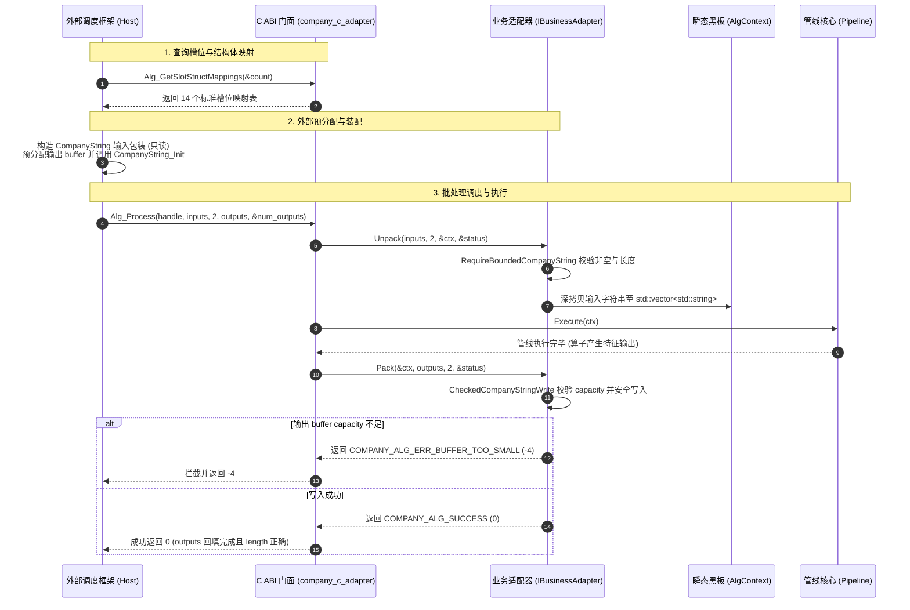

# RFC 0009: 统一 CompanyString 封装与槽位 Mapname 结构体映射契约

- **RFC 编号**：0009-company-string-and-slot-map-struct-binding
- **创建日期**：2026-08-26
- **文档状态**：Proposed
- **关联分支**：`feat/company-string-and-slot-map-binding`
- **目标版本**：v2.2.0
- **负责人 / 作者**：LLM-EdgeFlow Team

---

## 1. 背景与动机 (Motivation & Context)

### 1.1 应用场景与架构定位 (Application Context & Positioning)
本算法框架（`LLM-EdgeFlow`）作为公司统一调度平台（Host / External Platform Scheduler）所集成的标准算法动态库模块（Algorithm Shared Library Plugin）。
公司外部调度框架负责整体业务流编排、多通道数据路由与跨模块调度，并通过标准纯 C ABI 导出接口（`Alg_Init`, `Alg_Create`, `Alg_Process`, `Alg_Control`, `Alg_Destroy`, `Alg_DeInit`）与本算法库进行交互。

### 1.2 外部调度框架的明确规范与要求 (Host Framework Directives)
根据公司外部调度框架的标准接入规范与契约要求，算法库必须满足以下具体机制：
1. **全结构化数据交互 (C-Style Custom Structs)**：
   外部调度框架与算法库之间的输入和输出数据，均封装为 C 风格的自定义结构体进行处理，覆盖关注词匹配、实体抽取、长文档问答、对话合规质检、OCR 图文票据、语音 ASR、语义精排等业务。
2. **统一字符串封装规范 (`CompanyString`)**：
   针对所有业务输入/输出结构体中涉及的字符串数据，公司框架要求统一封装为标准 C 风格字符串结构体 `CompanyString`（包含字符指针 `data`、有效长度 `length` 与缓冲区容量 `capacity`）。所有其他业务结构体凡是引用到字符串，必须全部使用该结构体的指针（只读输入采用 `const CompanyString*`，输出采用 `CompanyString*`），严禁使用裸指针或隐式定长数组。
3. **槽位 Mapname 与解析结构体全局映射契约 (`"xxx.mapname"` Binding)**：
   公司外部调度框架采用通道槽位命名规范 `"xxx.mapname"`（例如输入通道 `"client_channel.keyword_in"` 中的 `keyword_in`，输出通道 `"nlp_node.entity_out"` 中的 `entity_out`）。
   外部调度框架明确要求：**必须在算法库 C ABI 导出头文件（`include/company_alg_interface.h`）接口处显式维护并导出 `mapname` 与解析 C 结构体的映射关系表**（包含 `mapname`、所属业务类型、C 结构体名称、`sizeof` 大小及 I/O 方向）。算法框架内部必须据此映射关系自动完成输入结构体的解包与输出结构体的分发。
4. **统一内存生命周期契约 (Caller Allocates, Callee Fills)**：
   在外部调度框架中，输入结构体与输出结构体（包括输出 `CompanyString` 的字符缓冲区 `data`）均由外部调度模块（Caller）在调用 `Alg_Process` 之前统一创建与预分配；算法框架（Callee）据此进行输入解析，并将结果安全写入已分配的输出结构体中，同时回填实际 `length`。

### 1.3 核心改造目标 (Core Goals)
1. 按照公司调度框架要求，在 `include/company_alg_interface.h` 中定义标准 `CompanyString` 结构体，将 7 大业务的输入输出结构体中的字符串全部重构为指针引用。
2. 在头文件接口处维护 `CompanySlotStructMapping` 映射表及 `Alg_GetSlotStructMappings` 导出函数，并在内部适配层（`PlatformIoRegistry`、`company_c_adapter`）据此进行全自动解析。
3. 同步更新相关文档与说明，并在全量单元测试、6 阶段自动化回归及 Demo 上全部调通。

---

## 2. 设计范围与边界 (Scope & Non-Goals)

### 2.1 范围内 (In-Scope)
- [ ] 在 `include/company_alg_interface.h` 中定义纯 C11 兼容的 `CompanyString` 及其辅助初始化函数。
- [ ] 重构全部 7 个业务的输入输出 C 结构体（`CompanyKeywordInputStruct`, `CompanyDocOutputStruct` 等），所有字符串字段统一改为 `CompanyString*` / `const CompanyString*` 指针。
- [ ] 在 `include/company_alg_interface.h` 中声明槽位映射元数据结构体 `CompanySlotStructMapping` 与 `Alg_GetSlotStructMappings` 导出函数，并在 `src/adapter/company_c_adapter.cpp` 中维护 14 个标准槽位的全局映射表。
- [ ] 增强 `include/adapter/adapter_validation_helper.h` 支持 `CompanyString` 的有界只读校验与安全容量回填。
- [ ] 适配 Layer 1 全部 7 个业务 Adapter 的 `Unpack` / `Pack` 逻辑及 `PlatformIoRegistry`。
- [ ] 适配全量业务 Demo（`demo/businesses/`）与全部测试套件（`tests/`），严格遵循 Caller Allocates, Callee Fills 规范。
- [ ] 维持 C11 严格兼容性、6 大导出函数 `noexcept` 异常安全屏障及 4 层架构隔离。

### 2.2 非目标 (Out-of-Scope)
- 不修改底层推理引擎（Layer 4）的硬件算子与固定 Batch 调度逻辑。
- 绝不在 `include/company_alg_interface.h` 中引入任何 C++ STL 类型或第三方依赖。

---

## 3. 总体技术方案与架构设计 (Architecture & Technical Design)

### 3.1 架构分层映射 (4-Tier Mapping)

```text
Layer 1: Pure C ABI Adapter (include/company_alg_interface.h, src/adapter/)
    │  ▲  [维护 CompanySlotStructMapping 映射表，解包 CompanyString 到 AlgContext，安全回填 CompanyString]
    ▼  │
Layer 2: Pipeline & Dynamic Blackboard (include/core/, src/core/)
    │  ▲  [AlgContext 维持内部强类型 std::string / vector 存储，零外部指针悬挂]
    ▼  │
Layer 3: Pluggable Business & Common Nodes (src/common_nodes/, src/business/)
    │  ▲  [业务算子无感，继续通过 BlackboardKey<T> 读写瞬态特征]
    ▼  │
Layer 4: Heterogeneous Inference Engines (include/engine/, src/engine/)
          [FixedBatchExecutor 与底层硬件后端保持不变]
```

### 3.2 核心数据结构与接口定义

#### 1. `CompanyString` 结构体规范
```c
typedef struct {
  char* data;       // 字符数据指针 (以 '\0' 结尾)
  size_t length;    // 字符串有效长度 (字节数，不含 '\0')
  size_t capacity;  // 缓冲区最大容量 (字节数，含 '\0')
} CompanyString;

// 初始化输出缓冲区
static inline void CompanyString_Init(CompanyString* str, char* buffer, size_t capacity);

// 从只读 C 字符串初始化输入包装
static inline void CompanyString_FromCString(CompanyString* str, const char* cstr);
```

#### 2. 槽位 Mapname 与结构体映射契约
```c
typedef struct {
  const char* slot_mapname;    // 槽位 mapname 后缀 (如 "keyword_in", "doc_out")
  CompanyAlgBizType biz_type;  // 所属业务类型枚举
  const char* struct_name;     // 对应的 C 结构体名称 (如 "CompanyKeywordInputStruct")
  size_t struct_size;          // 结构体大小 sizeof(...)
  int is_input;                // 1: 输入结构体, 0: 输出结构体
} CompanySlotStructMapping;

// 导出全局槽位映射查询接口
COMPANY_ALG_API const CompanySlotStructMapping* Alg_GetSlotStructMappings(int* count) COMPANY_ALG_NOEXCEPT;
```

#### 3. 14 大标准槽位全量映射表 (SSOT)
| 槽位 `slot_mapname` | 业务类型 | 对应 C 结构体名称 | I/O 方向 | 结构体核心字符串字段 |
| :--- | :--- | :--- | :--- | :--- |
| `keyword_in` | `ALG_BIZ_TYPE_KEYWORD_MATCH` | `CompanyKeywordInputStruct` | Input (1) | `sentence_text: const CompanyString*` |
| `keyword_out` | `ALG_BIZ_TYPE_KEYWORD_MATCH` | `CompanyKeywordOutputStruct` | Output (0) | `match_result_json: CompanyString*` |
| `entity_in` | `ALG_BIZ_TYPE_ENTITY_EXTRACT` | `CompanyEntityInputStruct` | Input (1) | `sentence_text: const CompanyString*` |
| `entity_out` | `ALG_BIZ_TYPE_ENTITY_EXTRACT` | `CompanyEntityOutputStruct` | Output (0) | `entities_json: CompanyString*` |
| `doc_in` | `ALG_BIZ_TYPE_DOC_QA` | `CompanyDocInputStruct` | Input (1) | `doc_text, query_text: const CompanyString*` |
| `doc_out` | `ALG_BIZ_TYPE_DOC_QA` | `CompanyDocOutputStruct` | Output (0) | `intent_name, answer_text: CompanyString*` |
| `audit_in` | `ALG_BIZ_TYPE_COMPLIANCE_AUDIT` | `CompanyAuditInputStruct` | Input (1) | `user_text, channel_name: const CompanyString*` |
| `audit_out` | `ALG_BIZ_TYPE_COMPLIANCE_AUDIT` | `CompanyAuditOutputStruct` | Output (0) | `risk_level, matched_policy_clause, audit_verdict_json: CompanyString*` |
| `ocr_doc_in` | `ALG_BIZ_TYPE_OCR_DOC_QA` | `CompanyOcrDocInputStruct` | Input (1) | `image_path, query_prompt: const CompanyString*` |
| `ocr_doc_out` | `ALG_BIZ_TYPE_OCR_DOC_QA` | `CompanyOcrDocOutputStruct` | Output (0) | `extracted_invoice_json: CompanyString*` |
| `audio_in` | `ALG_BIZ_TYPE_AUDIO_ASR_INTENT` | `CompanyAudioInputStruct` | Input (1) | (音频浮点流 `pcm_data: const float*`) |
| `audio_out` | `ALG_BIZ_TYPE_AUDIO_ASR_INTENT` | `CompanyAudioOutputStruct` | Output (0) | `transcribed_text, intent_slot_json: CompanyString*` |
| `rerank_in` | `ALG_BIZ_TYPE_CROSS_RERANK` | `CompanyRerankBatchInputStruct` | Input (1) | `query_text, candidate_passages[8]: const CompanyString*` |
| `rerank_out` | `ALG_BIZ_TYPE_CROSS_RERANK` | `CompanyRerankBatchOutputStruct` | Output (0) | (打分与索引数组 `scores[8], indices[8]`) |

### 3.3 数据流与内存生命周期时序图



---

## 4. 关键设计考量与权衡 (Design Trade-offs & Invariants)

1. **Caller Allocates, Callee Fills 内存所有权模型**：
   - **输入端**：调用方负责分配并持有字符串内存，通过 `CompanyString_FromCString` 构造只读视图包装；Adapter 内部解包时执行深拷贝转入 `AlgContext` 的 `std::string`，彻底隔离调用方后续对输入缓冲区的篡改。
   - **输出端**：调用方负责预分配字符缓冲区并设置 `capacity`，通过 `CompanyString_Init` 绑定至输出结构体；Adapter 内部严密校验 `capacity`，写入数据并同步回填实际写入的 `length`。若容量不足，确定性返回 `COMPANY_ALG_ERR_BUFFER_TOO_SMALL (-4)`，杜绝越界写或静默截断。
2. **槽位映射单一事实源 (SSOT)**：
   - 外部调度框架的槽位规范 `"<ns>.<mapname>"` 中，`mapname` 后缀与 `CompanySlotStructMapping` 表及 `PlatformIoRegistry` 中的 `canonical_suffix` 严格保持 1:1 单一事实源对齐。
3. **C11 ABI 纯净性与异常隔离**：
   - `include/company_alg_interface.h` 严格使用纯 C 语法与基础类型，通过 `test_c11_abi_compliance.c` 进行 C11 编译期与运行时双重检查；所有 6 个导出函数维持 `COMPANY_ALG_NOEXCEPT` 异常安全防火墙。

---

## 5. 测试与质量验收计划 (Testing & Verification Plan)

- [ ] **C11 兼容性专项单测**：`tests/test_c11_abi_compliance.c` 验证 `CompanyString`、`CompanySlotStructMapping` 与 `Alg_GetSlotStructMappings` 在纯 C11 编译器下 0 告警 100% PASS。
- [ ] **C ABI 内存与安全单测**：`tests/test_c_abi_safety.cpp`、`tests/test_adapter_contract_security.cpp` 验证容量不足拦截、空指针拦截与并发读写隔离。
- [ ] **平台 Operator 与多模态测试**：`tests/test_platform_operator.cpp`、`tests/test_different_io_modalities.cpp`、`tests/test_all_business_pipelines.cpp` 验证全量 7 大业务适配。
- [ ] **6 阶段全量自动化回归**：`./scripts/run_all_tests.sh` 阶段 1 至阶段 6 全部 100% PASS。
- [ ] **内存安全与 Sanitizer 门禁**：`./scripts/run_sanitizers.sh --fast` 在 AddressSanitizer 与 UndefinedBehaviorSanitizer 模式下 0 泄漏 100% PASS。

---

## 6. 实施路线与里程碑 (Implementation Milestones)

1. [x] **阶段一：RFC 需求治理与契约设计**（在 `feat/company-string-and-slot-map-binding` 分支中创建 RFC-0009，并在 `doc/rfcs/README.md` 中建立索引登记，提交用户评审）。
2. [ ] **阶段二：C ABI 头文件与 Adapter 基础库重构**（定义 `CompanyString`、`CompanySlotStructMapping`，增强 `AdapterValidationHelper`）。
3. [ ] **阶段三：7 大业务 Adapter、Demo 与测试套件全面适配**。
4. [ ] **阶段四：全量 CTest (33/33 PASS)、6 阶段自动化回归与 ASan/UBSan 门禁验证**。
5. [ ] **阶段五：更新 README 更新日志（v2.2.0），更新 RFC 状态为 `Completed` 并合并至 `main`**。

---

## 7. 变更记录 (Changelog)

| 日期 | 版本 | 变更内容 | 作者 |
| :--- | :--- | :--- | :--- |
| 2026-08-26 | v1.0.0 | 创建 RFC-0009 初始设计提案 (Proposed) | LLM-EdgeFlow Team |
