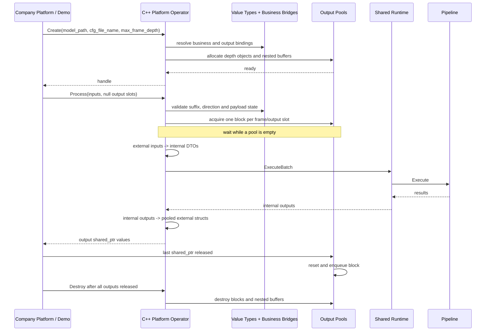

# RFC 0009: 公司平台 C 结构体槽位绑定与输出内存池

- **RFC 编号**：0009-company-string-and-slot-map-struct-binding
- **创建日期**：2026-08-26
- **文档状态**：Completed
- **关联分支**：`feat/company-string-and-slot-map-struct-binding`
- **目标版本**：v3.0.0
- **负责人 / 作者**：LLM-EdgeFlow Team
- **关联 RFC**：RFC-0004、RFC-0005

---

## 1. 背景与动机

LLM-EdgeFlow 编译生成的算法库最终由公司平台加载和调度。公司平台通过
`OperatorFunc` 函数表管理算法实例，并使用如下 C++ 命名 I/O 容器提交一批帧：

```cpp
using OpaqueData = std::shared_ptr<void>;
using NamedIo = std::unordered_map<std::string, OpaqueData>;
using NamedIoBatch = std::vector<NamedIo>;
```

外层 `vector` 的每个元素代表一帧，Map Key 使用“命名空间.类型后缀”格式。例如
`camera_0.frame`、`detector_0.od_out` 和 `request_0.string` 分别以 `frame`、
`od_out` 和 `string` 作为类型后缀。

RFC-0004 已建立 C++ Platform Operator、命名 I/O 和共享内部 Runtime，但其输出
所有权模型基于当时不完整的平台信息：输出对象由外部调度器选择并在调用
`Process` 前放入非空 `shared_ptr`，LLM-EdgeFlow 只借用该地址。公司平台的实际约定
不同：

1. 输入对象由外部平台创建和销毁，算法库只读借用。
2. 输出对象及嵌套内存由算法库在 `Create` 阶段预分配。
3. `Process` 从固定内存池检出输出块，并将带自定义 deleter 的
   `shared_ptr<void>` 写回调用方提供的空槽位。
4. 外部引用析构时，deleter 将输出块归还队列，而不是执行 `delete`。
5. 输出池容量由 `max_frame_depth` 决定，默认值为 25。
6. 公司平台传入的对象均是 C 风格结构体；开源仓库需要提供镜像结构和明确的
   “后缀到结构类型”绑定，以便在没有公司私有 SDK 的环境中演示和测试。

本 RFC 修订 RFC-0004 的 Create 参数、输出池、输出指针生命周期、Process 输出
槽位和 Demo 调用约定，同时保持纯 C ABI、内部业务 DTO、Pipeline、Blackboard、
Node 和 Engine 不变。

### 1.1 长期架构影响

本需求不是单一 Demo 功能，而是算法库与公司平台之间的长期边界基线：

- 平台协议与内部算法协议正式解耦，二者不再假设结构体布局相同。
- Layer 1 同时承担纯 C ABI 和 C++ Platform Operator 两种入口，但二者汇入同一个
  `SharedAlgorithmRuntime`，禁止复制 Pipeline 执行逻辑。
- 新增平台数据类型时，应注册镜像结构与转换器，不应将公司私有结构传播到
  Blackboard、Node 或 Engine。
- 输出内存峰值由 Create 期配置决定，Process 只复用池内存；这成为后续所有输出
  模态共同遵守的资源模型。
- 槽位后缀成为外部类型路由的稳定标识，前缀继续仅表达平台链路命名。

### 1.2 预期收益

- 公开描述公司平台真实的输入、输出和生命周期契约。
- 在后缀字符串和实际 C 结构体之间建立唯一、可校验的类型绑定。
- 避免逐帧分配输出结构及嵌套数组，稳定输出内存峰值。
- 通过自定义 deleter 自动回收输出，避免调用方误删算法库内存。
- 将公司私有结构隔离在 Layer 1，避免平台布局渗透到业务节点和推理引擎。
- 保留现有纯 C ABI 及七类业务 Adapter 的行为，降低迁移范围。

---

## 2. 设计范围与边界

### 2.1 范围内

- 演进现有 C++ Platform Operator 的 `CreateParam` 和 `Process` 输出语义。
- 定义 Demo 可编译的 C 风格平台镜像结构，包括 `CompanyString` 和七类业务的
  输入/输出结构。
- 定义业务桥接描述符与值类型绑定表的两级校验模型。
- 支持一个业务样本由一个聚合结构或多个后缀原子槽位组成，移除现有“一帧只能
  对应一个输入 DTO 和一个输出 DTO”的长期限制。
- 定义平台镜像结构和现有内部 DTO 之间的 Layer 1 双向转换。
- 定义 Create 期预分配、Process 期检出、shared_ptr 析构回池和 Destroy 期统一
  释放的输出池状态机。
- 定义 Batch、阻塞、并发、错误回滚、异常屏障和测试契约。
- 更新 Demo Runner 的目标调用形状和迁移规则。

### 2.2 非目标

- 不修改 `include/company_alg_interface.h` 中六个纯 C 导出函数的签名。
- 不修改现有七类纯 C ABI DTO 的布局和语义。
- 不将 STL、智能指针或第三方类型加入纯 C ABI 头文件。
- 不修改 `AlgContext`、Blackboard Key、Pipeline、Validator 或 SessionContext。
- 不新增或修改 Node、Engine 或 FixedBatchExecutor。
- 不在仓库中提交、打包或生成模型文件；模型由公司部署环境提供，Resolver 不负责证明
  模型可加载。
- 不规定公司私有 SDK 的最终类型名、枚举值和完整配置 Schema；Demo 镜像类型是
  开源仓库中的等价边界模型。
- 不允许输出池自动扩容、逐次临时分配或在池耗尽时静默丢帧。
- 不实现异步 `Process`；一次调用在返回前完成转换、执行和输出打包。

---

## 3. 架构分层与数据流

### 3.1 四层映射

- **Layer 1（C ABI / Platform Adapter）**：新增平台镜像结构、值类型注册、业务桥接、
  双向转换和输出池；演进 C++ Platform Operator。
- **Layer 2（Pipeline & Blackboard）**：保持现状，只接收现有业务 Adapter 写入的
  请求级数据。
- **Layer 3（Business & Common Nodes）**：保持现状，不识别平台后缀或镜像结构。
- **Layer 4（Engines & Hardware Acceleration）**：保持现状，固定 Batch 推理继续
  通过 `FixedBatchExecutor::Execute`。
- **Demo / Integration Tooling**：模拟公司平台创建输入、提交空输出槽位、消费结果
  并及时释放 `shared_ptr`。

```text
Company Platform / Demo
  │ NamedIoBatch，载荷为平台镜像 C 结构
  ▼
C++ Platform Operator                         Layer 1
  │ PlatformValueTypeRegistry + PlatformBusinessBridge
  │ 输入：平台镜像 -> 现有内部 C ABI DTO
  │ 输出：池化平台镜像 <- 现有内部 C ABI DTO
  ▼
SharedAlgorithmRuntime / IBusinessAdapter     Layer 1
  ▼
Pipeline / Blackboard                        Layer 2
  ▼
Nodes                                         Layer 3
  ▼
Engines / FixedBatchExecutor                  Layer 4
```

平台镜像类型不得直接写入 Blackboard。Node 和 Engine 不得包含平台结构头文件，也
不得按字符串后缀进行类型派发。

### 3.2 生命周期时序



---

## 4. C++ Platform Operator 公开契约

### 4.1 保留的入口

函数表继续使用仓库现有规范名称，不采用示例代码中的 `Get_OperatorTable` 或
`Destory` 拼写：

```cpp
struct OperatorFunc {
  int (*Init)() noexcept;
  int (*Create)(void** handle, const CreateParam* param) noexcept;
  int (*Process)(void* handle, const NamedIoBatch& inputs,
                 NamedIoBatch& outputs) noexcept;
  int (*Control)(void* handle, ControlCommand command,
                 void* control_param) noexcept;
  int (*Destroy)(void* handle) noexcept;
  int (*Deinit)() noexcept;
};

OperatorFunc Get_LLM_EDGEFLOW_OperatorTable() noexcept;
```

所有入口继续使用 `noexcept`，并以标准异常和未知异常双重 `catch` 屏障防止异常
越过算法库边界。

现有诊断入口 `GetPlatformLastError()` 保留。只读预检入口同步采用与 Create 相同的
双路径参数，避免预检和实际创建解析出不同文件：

```cpp
int ValidatePlatformConfigBinding(
    const char* model_path,
    const char* cfg_file_name,
    int32_t expected_biz_type,
    char* out_error_msg = nullptr,
    size_t error_buf_size = 0) noexcept;
```

该辅助函数的签名变化也属于下节定义的 C++ Platform ABI v3，不属于纯 C ABI。

### 4.2 CreateParam

```cpp
struct CreateParam {
  const char* cfg_file_name = nullptr;
  const char* model_path = nullptr;
  int32_t device_id = 0;
  ChipType platform_type = ChipType::kUnknown;
  uint32_t max_frame_depth = 25;
};
```

| 字段 | 契约 |
| --- | --- |
| `cfg_file_name` | 必填、非空、相对配置文件路径，不允许绝对路径 |
| `model_path` | 必填、非空，模型和配置共同所在的目录根路径 |
| `device_id` | 必须大于或等于 0 |
| `platform_type` | 必须命中显式设备类型白名单 |
| `max_frame_depth` | 每种输出类型的池深度；0 按默认 25 归一化 |

`CreateParam` 不再公开 `OutputAllocator`、`OutputDeallocator` 或 `user_data`，因为输出
对象由算法库值类型工厂创建和销毁。`depth_num` 改为语义明确的
`max_frame_depth`。外部 Batch 上限不再作为 Create 参数；本次实际 Batch 是
`inputs.size()`。

这是 C++ Platform Operator 的源码和二进制 ABI 变更，不影响六个纯 C ABI 函数或
内部 DTO。旧 `CreateParam` 与新布局使用相同类型名和函数指针签名，旧调用方如果
加载新库会静默按错误偏移解释字段，因此不能只依赖“重新编译”的人工约定。

v3.0.0 实施必须同时完成以下发布隔离：

- 算法动态库 `SOVERSION` 从 2 提升为 3，旧进程不能加载新库替换旧 SONAME。
- `Get_LLM_EDGEFLOW_OperatorTable` 和六个函数表成员名称保持不变，但仅存在于
  SOVERSION 3 的 Platform 包中。
- 纯 C ABI 契约仍标记为 ABI V2，六个 `Alg_*` 符号和
  `company_alg_interface.h` 的源码与符号契约不变。
- 公司平台与算法库必须原子升级，并使用 v3.0.0 Platform 头重新编译。
- CI 增加旧 Platform 头与新库不能形成受支持部署组合的打包校验，并验证纯 C ABI
  V2 客户端仍可按既有方式构建和运行。

如果公司发布系统无法通过 SONAME 阻止错配，则实现阶段必须改用新的版本化 Getter
和 `CreateParamV3`，不得复用现有二进制入口。

当前纯 C ABI 和 C++ Platform Operator 位于同一个 `company_alg_sdk` 动态库，因此
提升整个库的 SONAME 后，原先链接 `.so.2` 的纯 C 可执行文件仍需要保留旧库，或在
不改源码的情况下重新链接到 `.so.3`。本 RFC 所称“纯 C ABI V2 不变”是指结构布局、
符号和调用语义兼容，不承诺旧可执行文件能绕过动态加载器的 SONAME 检查直接加载
新库。若产品要求旧纯 C 可执行文件无重链接替换，则发布前必须把 C++ Platform 门面
拆成独立动态库；该打包拆分需单独评审，不能通过伪造旧 SONAME 规避。

### 4.3 配置路径解析

Create 按固定顺序解析路径：

1. 拒绝空 `model_path` 和空 `cfg_file_name`。
2. 拒绝具有根目录、盘符或其他绝对路径语义的 `cfg_file_name`。
3. 规范化 `model_path` 并确认为目录。
4. 计算 `full_cfg_path = normalize(model_path / cfg_file_name)`。
5. 验证配置路径仍位于 `model_path` 内，拒绝通过 `..` 或符号链接逃逸。
6. 读取公司 `.conf`；Pipeline、模型和池资源的相对路径都以 `model_path` 为根。
7. 只在内存中生成合成 Pipeline JSON，不生成临时文件。

`cfg_file_name` 和 `.conf` 引用的 `pipe_path` 是 Resolver 必须读取的控制文件，因此必须
存在、是 regular file，并通过 canonical containment 校验。`.conf` 的
`data.model_path/model_paths` 和 Pipeline JSON 中的模型路径是部署引用：Resolver 必须拒绝
空值、绝对路径、盘符、UNC、`..` 逃逸以及现存符号链接前缀逃逸，但不得要求最终模型文件
在 Resolver 阶段已经存在，也不得要求仓库提供模型占位文件。对不存在的目标使用“最近
存在父目录 canonical 化 + 剩余分量 lexical normalization”得到根目录内路径；如果目标
已经存在，仍需确认 canonical 路径没有逃逸部署根。模型文件的存在性、文件类型、权限、
格式和可加载性由实际 Engine 在加载阶段或公司部署门禁负责。

因此，控制文件不存在、类型不符、目录逃逸、解析失败或必需字段缺失必须在 Resolver
阶段 fail-closed；模型文件不存在本身不是 Resolver 错误。

### 4.4 Process 形状和前置条件

```cpp
int32_t Process(
    void* hndl,
    const std::vector<std::unordered_map<
        std::string, std::shared_ptr<void>>>& input,
    std::vector<std::unordered_map<
        std::string, std::shared_ptr<void>>>& output) noexcept;
```

- `hndl` 必须有效且未销毁。
- `input` 非空，且 `input.size() == output.size()`。
- `input.size() <= max_frame_depth`；否则同一次调用不可能在返回前归还本次已检出的
  块，会形成确定性死锁，因此直接返回输入错误。
- `input.size()` 还必须不超过现有 `AdapterDescriptor::max_batch_size`。
  Create 将 `min(max_frame_depth, adapter_max_batch_size)` 记录为
  `effective_process_batch_limit`，替代被删除的 `PlatformConfig.batch_size`；实际 Batch
  始终是每次 Process 的 vector 大小，Engine 固定 Batch 仍由既有执行器处理。
- 每帧输入 Map 包含业务要求的非空输入槽位。
- 每帧输出 Map 只预置业务要求的 Key，值必须是空 `shared_ptr<void>`。
- 同一帧不得通过主后缀和别名重复提供同一逻辑槽位。

成功后，算法库用池化 `shared_ptr<void>` 替换每个空输出值。失败时不得向调用方
暴露部分成功的输出；本次已检出的所有块自动回池，输出值恢复为空。

---

## 5. 平台镜像 C 结构

### 5.1 CompanyString

```c
typedef struct CompanyString {
  int32_t length;
  char* data;
} CompanyString;
```

- `length` 是有效字节数，不包含可选结尾 `\0`。
- 输入 `length < 0` 非法；`length == 0` 时 `data` 可以为空；正长度必须配非空 data。
- `CompanyString` 只表达文本。`data[0..length)` 内禁止嵌入 `\0`；二进制数据必须
  使用 `CompanyBuffer`。这一限制保证它能无损转换到现有 NUL 结尾内部 DTO。
- 校验必须按显式 length 有界检查，既不能调用无边界 `strlen`，也不能忽略 length
  直接构造内部字符串。
- 每个文本字段在读内存前必须先校验 `length <= ResolvedInputLimits` 中对应硬上限。
  由于该结构没有 capacity，算法库无法证明调用方分配区确有 `length` 字节；调用方
  必须保证声明长度与真实可读区一致。该 C 指针边界不能靠 `shared_ptr<void>` 补救。
- 输入 CompanyString 只读借用，算法库不得修改结构或内容。
- 输出容量由输出池 sidecar 元数据维护，不加入平台公开布局。
- 输出不得超过容量；池实际分配“有效容量 + 1”，成功时写入实际 length，并始终写入
  `data[length] = '\0'`。

### 5.2 后缀原子类型

后缀首先映射独立数据类型，而不是直接映射某个完整业务 DTO。开源 Demo V1 定义
以下最小 C11 镜像：

```c
typedef struct CompanyBuffer {
  int32_t length;
  uint8_t* data;
} CompanyBuffer;

typedef struct CompanyAny {
  int32_t type_id;
  int32_t element_count;
  int32_t byte_length;
  void* data;
} CompanyAny;

typedef struct CompanyFrame {
  uint64_t request_id;
  const CompanyString* image_uri;
  const CompanyAny* metadata;
} CompanyFrame;

typedef struct CompanyOdOutput {
  uint64_t request_id;
  int32_t detected_box_count;
  CompanyString* result_json;
  CompanyAny* metadata;
  int32_t status_code;
} CompanyOdOutput;
```

契约如下：

- `CompanyBuffer` 用于 PCM、图像字节或其他二进制内容，允许任意字节值；正长度必须
  配非空 data。
- `CompanyAny.type_id` 必须由配置和值类型绑定白名单解释，禁止根据内容猜测类型；
  `element_count` 是元素数，`byte_length` 必须等于白名单元素大小与元素数的安全乘积。
  输入 data 由外部持有，输出 data 由类型工厂在 Create 期按固定容量分配。
- `CompanyBuffer` 的 length，以及 `CompanyAny` 的 count/byte length，都必须先校验
  非负值、checked-multiply 和配置硬上限；调用方负责保证输入指针至少具有声明的
  可读字节数。
- Demo V1 的 `CompanyFrame` 是 URI-backed frame，与当前内部
  `CompanyOcrDocInputStruct::image_path` 可无临时文件转换。原始像素 Frame 属于后续
  新模态，必须另立 RFC 定义宽高、步长、像素格式、Plane 和所有权。
- `CompanyFrame.image_uri` 必需且非空，`metadata` 可空；OCR 的独立 `.string` 查询
  槽位必需且非空。
- `CompanyOdOutput` 是 Demo 的 `od_out` 镜像，`result_json` 承载当前 OCR 结构化结果；
  `metadata` 在 `meta_num == 0` 时为空，否则由输出类型工厂完整预分配。正式公司结构
  取得后只替换 Layer 1 类型与转换器。

因此初始公司调用形状可以是：一帧输入 `*.frame`，必需查询输入 `*.string`，输出
`*.od_out`。业务桥接器负责把这些原子槽位聚合成当前 OCR 内部 DTO。

### 5.3 业务聚合镜像结构

对于一个槽位本身就是完整请求对象的现有业务，继续提供聚合镜像结构。OCR 业务
使用上一节的 `CompanyFrame + CompanyString -> CompanyOdOutput` 组合，因此不再把
`.frame` 错误绑定到 OCR 聚合请求 DTO。所有类型名替换集中在 Layer 1。

```c
typedef struct CompanyPlatformAuditInput {
  uint64_t request_id;
  const CompanyString* user_text;
  const CompanyString* channel_name;
} CompanyPlatformAuditInput;

typedef struct CompanyPlatformAuditOutput {
  uint64_t request_id;
  CompanyString* risk_level;
  float risk_score;
  CompanyString* matched_policy_clause;
  CompanyString* audit_verdict_json;
  int32_t status_code;
} CompanyPlatformAuditOutput;

typedef struct CompanyPlatformKeywordInput {
  uint64_t request_id;
  const CompanyString* sentence_text;
} CompanyPlatformKeywordInput;

typedef struct CompanyPlatformKeywordOutput {
  uint64_t request_id;
  int32_t is_hit;
  CompanyString* match_result_json;
  int32_t status_code;
} CompanyPlatformKeywordOutput;

typedef struct CompanyPlatformEntityInput {
  uint64_t request_id;
  const CompanyString* sentence_text;
} CompanyPlatformEntityInput;

typedef struct CompanyPlatformEntityOutput {
  uint64_t request_id;
  CompanyString* entities_json;
  int32_t status_code;
} CompanyPlatformEntityOutput;

typedef struct CompanyPlatformDocInput {
  uint64_t request_id;
  const CompanyString* doc_text;
  const CompanyString* query_text;
} CompanyPlatformDocInput;

typedef struct CompanyPlatformDocOutput {
  uint64_t request_id;
  CompanyString* intent_name;
  float confidence;
  CompanyString* answer_text;
  int32_t chunk_count;
  int32_t status_code;
} CompanyPlatformDocOutput;

typedef struct CompanyPlatformAudioInput {
  uint64_t request_id;
  const float* pcm_buffer;
  int32_t pcm_length;
  int32_t sample_rate;
} CompanyPlatformAudioInput;

typedef struct CompanyPlatformAudioOutput {
  uint64_t request_id;
  CompanyString* transcribed_text;
  CompanyString* intent_slot_json;
  int32_t status_code;
} CompanyPlatformAudioOutput;

#define COMPANY_PLATFORM_MAX_RERANK_CANDIDATES 8

typedef struct CompanyPlatformRerankInput {
  uint64_t request_id;
  const CompanyString* query_text;
  const CompanyString*
      candidate_passages[COMPANY_PLATFORM_MAX_RERANK_CANDIDATES];
  int32_t candidate_count;
} CompanyPlatformRerankInput;

typedef struct CompanyPlatformRerankOutput {
  uint64_t request_id;
  float scores[COMPANY_PLATFORM_MAX_RERANK_CANDIDATES];
  int32_t sorted_indices[COMPANY_PLATFORM_MAX_RERANK_CANDIDATES];
  int32_t count;
  int32_t status_code;
} CompanyPlatformRerankOutput;
```

这些类型只包含 C 基础类型、指针、定长数组和 C 风格结构体。头文件必须通过独立
C11 编译检查。平台镜像和内部 DTO 是两个独立协议，禁止使用 `reinterpret_cast`
假设布局相同。

字段必需性沿用现有内部 DTO 契约：Audit 的 `user_text` 必需、`channel_name` 可空；
Keyword/Entity 的 `sentence_text` 必需；Doc 的 `query_text` 必需、`doc_text` 可空；
Audio 允许零采样，正 `pcm_length` 必须配 buffer；Rerank 的 query、1 到 8 个候选均
必需。所有输出 `CompanyString*` 及需要启用的嵌套数组必须由池工厂置为非空，转换器
不得在 Process 中补分配。

### 5.4 Demo 输入安全上限

`ResolvedInputLimits` 默认值与当前七业务 Adapter 的既有安全约束对齐：

| 输入字段类别 | Demo V1 默认硬上限 |
| --- | ---: |
| 普通文本、查询、Prompt、候选段落、渠道名 | 64 KiB / 字段 |
| 文档正文 | 10 MiB / 字段 |
| `CompanyFrame.image_uri` | 4096 字节 |
| Audio PCM | 960000 个 float 样本，且 checked-multiply 后不超过 10 MiB |
| Audio sample rate | 8000 ~ 192000 |
| Rerank candidates | 1 ~ 8 |
| 未另行定义的 `CompanyBuffer` / `CompanyAny` | 10 MiB / 载荷 |

配置可以把字段上限调低；调高不得突破编译期安全上限。所有带符号 length/count 必须
先验证非负，再转换为 `size_t`，数组字节数必须使用 checked-multiply。Layer 1 的
检查完成后，现有 BusinessAdapter 仍执行自身校验，形成双重边界而不是替代关系。

### 5.5 Demo 输出字符串默认容量

| 外部输出字段 | 默认有效字节容量 |
| --- | ---: |
| `risk_level` | 31 |
| `matched_policy_clause` | 255 |
| `audit_verdict_json` | 1023 |
| `match_result_json` | 2047 |
| `entities_json` | 2047 |
| `intent_name` | 63 |
| `answer_text` | 1023 |
| `CompanyOdOutput.result_json` | 2047 |
| `transcribed_text` | 511 |
| `intent_slot_json` | 1023 |

实际分配为“有效容量 + 1”，额外字节只用于 NUL。上述值是开源 Demo V1 的规范
默认值，并非对公司私有 Schema 的推断：配置未提供字段容量时使用默认值；提供
覆盖时才由集中 Resolver 归一化为 `ResolvedOutputPoolSpec`。已出现但类型错误、
为零、为负数或超过安全上限的覆盖使 Create 失败。

### 5.6 Demo `.conf` 输出池规范化

公司正式配置 Schema 尚未进入开源仓库。为使 RFC 可以直接实施，Demo V1 在现有
JSON `.conf` 的 `data` 对象内定义集中隔离的 `mem_que`：

```json
{
  "data": {
    "pipe_path": "pipeline_ocr_doc_qa.json",
    "mem_que": {
      "type": "od_out",
      "meta_num": 0,
      "metadata_type_id": 0,
      "capacities": {
        "result_json": 2047
      }
    }
  }
}
```

- `mem_que` 在 Platform ABI v3 配置中必需；旧 `.conf` 必须随迁移补齐。
- `type` 必须是业务桥接表声明的规范输出后缀，不接受别名或任意 C 类型名。
- `meta_num` 是输出类型工厂可用的 metadata 元素容量，必须大于或等于 0；不使用
  metadata 时为 0。
- `meta_num > 0` 时 `metadata_type_id` 必须命中该输出类型的白名单，工厂按
  `meta_num * element_size` checked-multiply 后一次性分配；为 0 时 type_id 也必须为
  0，且 metadata 指针保持空。Demo V1 仅 `od_out` 镜像声明 metadata 指针；其他输出
  类型的两字段必须同时为 0，避免接受实际不会分配和计费的配置。
- `capacities` 只允许当前输出类型登记过的字段名，缺失字段使用 5.5 节默认值；未知
  字段、错误类型、零值、负值或超过编译期上限均使 Create 失败。
- 当前七业务都只有一个规范输出后缀；未来业务确需多输出池时，应把 Schema 版本化为
  `mem_queues` 数组，不得让同一字段同时接受 object/array 两种形状。

Resolver 将上述字段归一化为 `ResolvedOutputPoolSpec`，后续公司正式字段路径只在
Layer 1 Resolver 中替换，值类型表、业务桥接、输出池和下游四层均不感知原始 JSON
键名。CreateParam 的 `model_path` 是部署根目录；`.conf` 内现有的
`data.model_path/model_paths` 是模型覆盖项，二者不得混为同一字段。

---

## 6. 两级槽位与值类型绑定

### 6.1 Key 与业务槽位约束

Key 只按最后一个点号拆分。前缀和后缀都必须非空；后缀比较区分大小写，不做
trim、大小写转换或模糊匹配。前缀只表达外部算子、通道或链路，算法库不解释。

Key 的后缀只回答“这个 shared_ptr 指向什么外部 C 类型”，不回答“它属于哪个
业务字段”。业务语义由独立的 `PlatformBusinessBridgeDescriptor` 声明：

```cpp
struct PlatformBusinessSlot {
  std::string logical_name;
  std::string type_suffix;
  IoDirection direction;
  bool required = true;
};

struct PlatformBusinessBridgeDescriptor {
  CompanyAlgBizType biz_type;
  std::string biz_name;
  std::vector<PlatformBusinessSlot> input_slots;
  std::vector<PlatformBusinessSlot> output_slots;
  ConvertSampleInputFn convert_sample_input;
  ConvertSampleOutputFn convert_sample_output;
};
```

约束如下：

- 每个业务声明一个或多个输入/输出槽位；实现必须删除现有 Descriptor
  “恰好一个 input group 和一个 output group”的限制。
- `logical_name` 在业务和方向内唯一，`type_suffix` 必须存在于全局值类型表。
- 当前 V1 不解释 Key 前缀，因此同一业务、同一方向内最多声明一次相同
  `type_suffix`。需要两个同类型字段时使用聚合镜像结构或新增语义明确的后缀。
- Bridge 逐帧聚合外部槽位，构造一个现有内部输入 DTO；输出方向执行逆转换。
- Bridge 声明的内部 DTO 类型必须与对应 `IBusinessAdapter::GetDescriptor()` 一致。
- 空槽位、缺少必需槽位、额外未知槽位和重复逻辑槽位全部 fail-closed。

### 6.2 PlatformValueTypeRegistry

新增 Layer 1 内部全局值类型表，Key 是规范后缀。值类型表只负责外部布局、校验和
内存操作，不携带业务方向，也不引用内部业务 DTO：

```cpp
struct PlatformValueTypeBinding {
  std::string canonical_suffix;
  std::vector<std::string> aliases;
  std::string external_c_type_name;
  ValidateExternalFn validate_external;
  AllocateExternalFn allocate_external;
  ResetExternalFn reset_external;
  DestroyExternalFn destroy_external;
};
```

这样 `.string` 可以稳定绑定到 `CompanyString*`，`.frame` 可以绑定到
`CompanyFrame*`，而不会因为当前业务恰好是 OCR 就变成整个 OCR DTO。函数对象和
STL 只存在于 Layer 1 内部，Registry 在 Init 审计后不可变。

Registry 审计必须满足：所有规范后缀和别名在全局唯一，别名先归一化为规范后缀；
业务描述符只能引用规范后缀。仅用于输入的类型可以没有 allocate/reset/destroy，
但任何被输出槽位引用的类型必须提供完整且 `noexcept` 的
allocate/reset/destroy，缺失即 Init fail-closed。`validate_external` 必须覆盖输入
结构及其所有嵌套字段，不能通过读取载荷内容猜测实际 C 类型。

### 6.3 初始值类型映射

| 规范后缀 | 兼容别名 | 平台镜像类型 | 用途 |
| --- | --- | --- | --- |
| `string` | 无 | `CompanyString` | 单一文本槽位或业务组合字段 |
| `buffer` | 无 | `CompanyBuffer` | PCM、图像字节或其他二进制数据 |
| `any` | 无 | `CompanyAny` | 配置白名单约束的扩展载荷 |
| `frame` | `image_in` | `CompanyFrame` | URI-backed 图像帧输入 |
| `od_out` | `ocr_out` | `CompanyOdOutput` | OCR/OD 结构化输出 |
| `keyword_in` | `sentence_in` | `CompanyPlatformKeywordInput` | 关注词聚合输入 |
| `keyword_out` | `match_out` | `CompanyPlatformKeywordOutput` | 关注词聚合输出 |
| `entity_in` | `text_in` | `CompanyPlatformEntityInput` | 实体抽取聚合输入 |
| `entity_out` | `extracted_out` | `CompanyPlatformEntityOutput` | 实体抽取聚合输出 |
| `doc_in` | `qa_in` | `CompanyPlatformDocInput` | 文档问答聚合输入 |
| `doc_out` | `qa_out` | `CompanyPlatformDocOutput` | 文档问答聚合输出 |
| `audit_in` | `dialogue_in` | `CompanyPlatformAuditInput` | 合规审计聚合输入 |
| `audit_out` | `verdict_out` | `CompanyPlatformAuditOutput` | 合规审计聚合输出 |
| `audio_in` | `pcm_stream` | `CompanyPlatformAudioInput` | 音频聚合输入 |
| `audio_out` | `asr_out` | `CompanyPlatformAudioOutput` | 音频聚合输出 |
| `rerank_in` | `pair_in` | `CompanyPlatformRerankInput` | 精排聚合输入 |
| `rerank_out` | `scores_out` | `CompanyPlatformRerankOutput` | 精排聚合输出 |

### 6.4 初始业务桥接表

| 业务 | 输入槽位 | 输出槽位 | 聚合目标 |
| --- | --- | --- | --- |
| keyword_match | `keyword_in` | `keyword_out` | 现有 Keyword DTO |
| entity_extract | `entity_in` | `entity_out` | 现有 Entity DTO |
| doc_qa | `doc_in` | `doc_out` | 现有 Doc DTO |
| compliance_audit | `audit_in` | `audit_out` | 现有 Audit DTO |
| ocr_doc_qa | `frame` + `string` | `od_out` | Frame URI 和查询文本聚合为现有 OCR DTO |
| audio_asr_intent | `audio_in` | `audio_out` | 现有 Audio DTO |
| cross_rerank | `rerank_in` | `rerank_out` | 现有 Rerank DTO |

`shared_ptr<void>` 不携带运行时类型信息，因此类型安全来自注册契约、业务描述符和
调用方遵守公开结构协议。不得通过探测内存内容猜测类型。

---

## 7. 输入所有权与边界转换

### 7.1 所有权红线

- 输入 `shared_ptr` 的所有权始终属于外部平台。
- Operator 只在同步 Process 期间调用 `.get()` 获取只读裸指针。
- 算法库不得复制、移动、缓存或跨调用持有输入 `shared_ptr`。
- 算法库不得修改外部结构及其嵌套字符串、PCM 或候选数组。
- 需要写入请求级 Blackboard 的数据必须完成值拷贝。

### 7.2 Process 局部转换存储

```text
NamedIo sample
  -> parse every suffix
  -> PlatformValueTypeRegistry validates each external C value
  -> PlatformBusinessBridge collects required logical slots
  -> copy CompanyString by explicit length into owned std::string
  -> build one existing CompanyXxxInputStruct shadow DTO
  -> pass shadow DTO to SharedAlgorithmRuntime synchronously
```

Shadow DTO 及其字符串、PCM 或候选 backing storage 至少存活到本次
`ExecuteBatch` 返回；Process 返回后统一销毁，不写入句柄状态。

所有计数必须非负并不超过业务固定上限。Rerank 候选数必须为 1 到 8，Audio 在
`pcm_length > 0` 时必须有非空 buffer。CompanyString 必须按显式长度复制，并在
`data[0..length)` 中发现 NUL 时拒绝；CompanyBuffer 则允许任意字节。任一帧非法时
整批失败，不执行部分 Batch。

---

## 8. 输出内存池

### 8.1 池粒度和状态

每个句柄按“规范输出后缀”维护独立池。当前每个池包含
`max_frame_depth` 个完整外部输出对象；未来多输出业务仍按后缀分池，不同结构类型
禁止共用同一裸内存队列。

```cpp
struct OutputPoolState {
  std::string canonical_suffix;
  uint32_t depth;
  std::vector<OwnedExternalBlock> all_blocks;
  std::queue<ExternalBlock*> free_blocks;
  std::mutex mutex;
  std::condition_variable available;
  uint32_t checked_out_count = 0;
  bool closing = false;
};
```

`all_blocks` 是所有权事实源，`free_blocks` 只保存可检出的非拥有型指针。句柄以
`shared_ptr<OutputPoolState>` 持有池状态；输出 deleter 只捕获
`weak_ptr<OutputPoolState>` 和块地址，不捕获句柄或池的裸指针。

### 8.2 Create 预分配

对每个输出绑定依次解析 `ResolvedOutputPoolSpec`，创建外层结构，为每个
`CompanyString*` 或嵌套数组创建固定容量内存，建立 sidecar 容量元数据，执行类型
专属 reset，最后登记并入队。任一步失败都必须逆序销毁本次及此前已分配的所有块，
Create 返回失败并保证 `*handle == nullptr`。

Demo V1 的 64 MiB 硬限制明确采用“每句柄预分配业务载荷”口径，而不是进程 RSS 或
STL allocator 的实际占用。`ComputeOutputPoolPayloadBytes` 必须逐类型确定性计入外层平台
镜像结构、嵌套 `CompanyString`/`CompanyAny` 结构以及其固定容量数据区，并对深度乘法和
多池加法使用 checked arithmetic；所有池的载荷总和不得超过
`kMaxHandlePoolPayloadBytes`。`vector`/`unordered_map` 节点、bucket、共享控制块、mutex 和
allocator 元数据属于实现管理开销，不得用无法证明的常数伪装成“精确总内存”。它们由
`max_frame_depth <= 1024`、固定 Registry 数量和配置字段上限共同约束；若公司平台未来
要求 RSS 或 allocator 级硬上限，应另行 RFC 引入受控 arena/allocator，不能沿用本载荷指标。

`spec.type` 必须非空并严格等于规范输出后缀。预算测试必须覆盖全部七类输出、深度
0/1/25/1024/1025、精确 64 MiB、64 MiB + 1、checked add/multiply 以及句柄多池累加。

### 8.3 Process 事务

1. 校验句柄、Batch、全部 Key、方向、输入载荷和输出空占位。
2. 将所有输入镜像结构转换为 Process 局部内部 DTO。
3. 为每一帧、每个输出后缀检出一个块；每次 pop 都在池锁内增加
   `checked_out_count`，队列为空时以 `closing || !free_blocks.empty()` 为谓词等待。
4. 在局部 lease 中持有全部块，不立即修改调用方输出 Map。
5. 用临时内部输出 DTO 执行 Shared Runtime。
6. 将内部输出逐字段转换到 lease 对应的外部结构。
7. 全部成功后一次性提交池化 `shared_ptr<void>`。

步骤 3 到 6 的任何失败或异常都会由局部 lease reset 并归还已取得的全部块；调用方
仍观察到空输出槽位。回滚归还与正常 deleter 归还使用同一条受锁路径，且都必须恰好
减少一次 `checked_out_count`；发现重复归还、计数下溢或非本池地址时记录内部错误并
fail-closed。

### 8.4 自定义 deleter

最后一个外部 shared_ptr 析构时，deleter 先执行 `weak_pool.lock()`：

- 成功且 `closing == false`：校验块归属，执行 `reset_external`，减少
  `checked_out_count`，把块重新压入 `free_blocks` 并 `notify_one()`。
- 失败或池已 closing：直接 no-op，绝不解引用块地址或已销毁池。这只保证违约引用
  最终析构安全，不允许 Destroy 后读取其数据。

reset 必须将字符串 length、计数、状态、分数和索引恢复为初始值；有容量时将
`data[0]` 设为 `\0`；不得释放或替换嵌套指针，也不得缩减容量。reset 和 deleter
不得抛异常。

调用方禁止对输出裸指针或嵌套指针执行 `delete`、`free`、`realloc` 或地址替换。

### 8.5 池耗尽与阻塞

- 外部可以跨多次 Process 持有输出，每个池最多存在 `max_frame_depth` 个未归还块。
- 池为空时后续 Process 使用条件变量谓词阻塞，直到旧输出析构回池。
- 不自旋、不自动扩容、不临时分配、不覆盖仍在使用的块，也不静默丢帧。
- 调用方必须保证有其他线程或执行路径能释放旧输出，否则阻塞可以持续。
- 单次 Batch 大于深度时在检出前返回输入错误，避免确定性死锁。

### 8.6 输出转换

数值和固定数组按业务上限复制；字符串从内部受限字符字段取得长度后写入池化
CompanyString。结果超过 pool spec 容量时整批返回 buffer-too-small，不允许截断成
成功。输出 `request_id` 必须与对应输入一致。任何转换失败都会归还所有 lease。

---

## 9. 生命周期与并发

### 9.1 生命周期职责

| 阶段 | 算法库职责 | 调用方职责 |
| --- | --- | --- |
| `Init` | 初始化并审计 Adapter、值类型表和业务桥接表 | 在任何 Create 前成功调用 |
| `Create` | 解析配置、创建 Runtime、预分配全部输出池 | 提供有效目录、配置、设备和深度 |
| `Process` | 借用输入、转换、执行、检出并提交池化输出 | 提供有效输入和空输出槽位 |
| 输出消费 | 保持块内容稳定 | 读取结果，及时释放所有 shared_ptr 副本 |
| deleter | reset 并将块归还队列 | 不直接释放或修改嵌套内存 |
| `Destroy` | 释放池中所有块、嵌套内存、队列和 Runtime | 先停止调用并释放全部输出引用 |
| `Deinit` | 清理进程级资源 | 确保所有句柄已 Destroy |

### 9.2 Destroy 前置条件

Destroy 只在以下条件成立时合法：同一句柄没有运行中或等待池的 Process/Control；
调用方已经释放该句柄返回的全部输出 shared_ptr 及副本；调用方不会在 Destroy 后
访问任何相关裸指针。

违反这些条件属于调用方契约违约。Destroy 先在持有池锁时记录
`checked_out_count` 并将 `closing` 设为 true，然后释放锁，再从句柄摘除并销毁 pool
state 和所有输出块；不得在持有 state 内部 mutex 时销毁 state。违约调用方遗留的
数据指针立即失效且不得访问；其 shared_ptr 后续析构通过 weak lifetime token 安全
no-op。若记录值非零，Destroy 在完成全部清理后返回 `-1` 并记录生命周期违约；句柄
仍已被消费，调用方不得重试 Destroy。正式接入文档和 Demo 必须展示正确释放顺序。

### 9.3 并发模型

- 同一句柄的 Process 和 Control 串行化。
- 不同句柄可以并发执行，各自拥有独立输出池。
- deleter 可以在任意调用方线程执行，因此 reset、入队和通知必须线程安全。
- Destroy 不与同句柄 Process、Control 或 deleter 并发；这是调用方前置条件。
- 全局值类型 Registry 和业务桥接表在 Init 审计后只读，可被不同句柄并发查询。

---

## 10. 错误码与异常安全

| 错误码 | 本 RFC 对应场景 |
| ---: | --- |
| `0` | 成功 |
| `-1` | 空句柄、已销毁句柄或非法生命周期状态 |
| `-2` | Create 参数、相对路径、设备、深度或配置非法 |
| `-3` | 输入 Batch、输入槽位、输入结构字段或 Batch 大于池深度 |
| `-4` | 输出槽位非空、输出容量不足或输出池分配失败 |
| `-5` | 业务、后缀、平台类型或值类型绑定不支持 |
| `-6` | 值类型 Registry 或业务桥接描述符冲突 |
| `-99` | 捕获到 `std::exception` |
| `-100` | 捕获到未知异常 |

池为空并等待归还是正常背压，不返回错误码。所有公开入口继续记录线程局部诊断，
并保证异常不越过 `noexcept` 边界。自定义 deleter、reset、回滚和 Destroy 逐块清理
也必须有独立异常屏障；单个块清理失败不能跳过其他块。

---

## 11. 目标 Demo 调用形状

```cpp
using namespace llm_edgeflow::platform;

OperatorFunc ops = Get_LLM_EDGEFLOW_OperatorTable();
if (ops.Init() != 0) return -1;

CreateParam param_create{};
param_create.cfg_file_name = "configs/ocr.conf";
param_create.model_path = "/opt/company/algorithm";
param_create.device_id = 0;
param_create.platform_type = ChipType::kAx650;
param_create.max_frame_depth = 25;

void* handle = nullptr;
if (ops.Create(&handle, &param_create) != 0) {
  ops.Deinit();
  return -1;
}

for (int frame_idx = 0; frame_idx < image_num;) {
  const int curbatch = std::min(batch_size, image_num - frame_idx);
  NamedIoBatch input_od(curbatch);
  NamedIoBatch output_od(curbatch);

  for (int i = 0; i < curbatch; ++i) {
    input_od[i]["ocr_stage.frame"] =
        MakeBorrowedPlatformInput(&frames[frame_idx + i]);
    input_od[i]["ocr_query.string"] =
        MakeBorrowedPlatformInput(&queries[frame_idx + i]);
    output_od[i]["ocr_stage.od_out"] = std::shared_ptr<void>();
  }

  const int ret = ops.Process(handle, input_od, output_od);
  if (ret != 0) break;

  ConsumeOcrResults(output_od);
  output_od.clear();  // 最后一个引用析构，输出块自动回池。
  frame_idx += curbatch;
}

// Destroy 前必须释放该句柄产生的所有输出引用。
ops.Destroy(handle);
ops.Deinit();
```

`frames` 的元素类型是 `CompanyFrame`，`queries` 的元素类型是 `CompanyString`，
输出类型由 `.od_out` 固定为 `CompanyOdOutput`。`MakeBorrowedPlatformInput` 只构造
无所有权 deleter 的临时输入 shared_ptr，输入真实内存仍由 Demo 持有。若业务确需
积压输出，累计未释放帧数不得超过 `max_frame_depth`。

---

## 12. 与 RFC-0004 的关系和迁移

RFC-0004 除以下重叠内容外继续有效：

- CreateParam 中 `depth_num`、外部 Batch 上限和输出 allocator/deallocator Hook。
- RFC-0004 第 7.2 节“框架不负责输出队列”的结论。
- RFC-0004 第 7.3 节“输出对象由外部选择和持有”的生命周期。
- RFC-0004 第 9 节要求从非空输出 shared_ptr 提取裸指针的步骤。
- RFC-0004 第 12 节要求 Demo 调用外部输出调度器的示例。
- 与上述旧模型绑定的参数校验和测试条目。

上述内容自 RFC-0009 实现后，以本 RFC 为唯一事实源。迁移要求：

1. Platform 调用方将路径拆为必填 `model_path` 和相对 `cfg_file_name`。
2. `depth_num` 改为 `max_frame_depth`，零值归一化为 25。
3. 移除外部输出分配/释放回调和外部输出选择逻辑。
4. Process 前只提供输出 Key 和空 shared_ptr，不再传入外部输出地址。
5. 全部 Platform v3 `.conf` 在 `data.mem_que` 填写规范输出后缀、`meta_num` 和容量；
   旧配置不能未经迁移直接用于新 Create。
6. 输入载荷改为本 RFC 的平台镜像结构，内部 C ABI 调用不变。
7. 调用方消费后及时释放输出，Destroy 前释放所有输出副本。
8. 删除 PlatformIoRegistry 的单输入/单输出组限制，引入值类型表和业务桥接描述符。
9. 动态库提升到 SOVERSION 3；若发布系统不支持 SONAME 隔离，则使用版本化 Getter。

---

## 13. 设计不变量与权衡

1. **边界隔离**：平台镜像结构只能存在于 Layer 1 和 Demo。
2. **内部稳定**：纯 C ABI DTO、Blackboard、Node 和 Engine 不因平台布局改变。
3. **输入不持有**：Process 不复制输入 shared_ptr，只复制所需数据值。
4. **输出固定容量**：Create 后不扩容、不逐帧分配输出对象或嵌套 payload、不改变
   嵌套地址；shared_ptr 控制块和 Process 局部 shadow DTO 不属于池化 payload 承诺。
5. **结果事务性**：整批成功才提交输出 shared_ptr，失败不暴露半成品。
6. **后缀即类型**：全局后缀只绑定独立外部 C 类型；业务语义由 Bridge 组合。
7. **受控背压**：池空时阻塞，单批超过深度提前拒绝。
8. **销毁前归还**：Destroy 前全部输出必须释放，这是调用方强制前置条件。
9. **异常不外泄**：公开入口、deleter 和回滚清理均不得抛出异常。
10. **固定 Batch 不变**：外部帧 Batch 与 Engine 固定 Batch 继续由既有调度层解耦。

选择内部池而非外部分配 Hook，会使算法库承担更多生命周期和并发复杂度，但它精确
匹配公司平台所有权模型，并能确保嵌套结构复用。选择 Layer 1 镜像转换会增加一次
边界字段复制，但避免修改稳定的内部 DTO 和七类业务节点，是可控且可测试的成本。

---

## 14. 测试与质量验收计划

### 14.1 结构、转换与注册

- [x] 新平台类型头文件通过独立 C11 编译测试，不包含 STL 或第三方头。
- [x] 现有 `company_alg_interface.h` DTO 布局测试保持不变。
- [x] `CompanyString` 覆盖空值、负长度、非 NUL 结尾、嵌入 NUL 拒绝和容量不足。
- [x] `CompanyString`、`CompanyBuffer` 和 `CompanyAny` 在解引用前执行配置硬上限校验；
  调用方声明长度大于真实分配区属于无法由 ABI 自证的违约。
- [x] `CompanyBuffer` 覆盖任意二进制字节，`CompanyAny.type_id` 必须命中白名单。
- [x] 七类输入镜像逐字段转换为现有 DTO，七类内部输出转换为池化镜像，并以
  64 帧首、中、尾字段检查证明转换内容正确。
- [x] request_id、计数、固定数组、PCM 和 Rerank 上限保持一致，并覆盖 PCM 首尾
  sample 与 8 个候选项。
- [x] 覆盖最后点号解析、主名、别名、未知后缀、方向错误和重复逻辑槽位。
- [x] 输入 shared_ptr 的 `use_count` 在 Process 前后不因算法库持有而增加；输入内存
  在 Process 返回后可由调用方立即释放。
- [x] 输出 Map 缺 Key、含额外 Key、使用非空占位或同时使用主名与别名均失败且不检出块。
- [x] 值类型绑定缺失、类型不一致、转换函数 identity 冲突和重复注册使 Init
  fail-closed，异常注册不污染原快照。
- [x] OCR 以 `frame + string -> od_out` 多槽位聚合，其他业务聚合 DTO 路径保持正常。
- [x] Registry 允许多输入槽位，同时拒绝同一业务方向中的重复类型后缀。
- [x] 规范后缀与别名全局冲突、输出类型工厂缺失均使 Init fail-closed，并覆盖
  alias/canonical 插入异常的原子回滚。
- [x] `data.mem_que` 缺失、type 与业务不符、meta_num/type_id 组合非法和未知容量字段
  均使 Create fail-closed；缺失的已知容量使用规范默认值。
- [x] `cfg_file_name` 的绝对路径、`..` 逃逸和符号链接逃逸被 Create 与预检一致拒绝。
- [x] cfg 与 Pipeline 控制文件的缺失、非 regular file、绝对路径及符号链接逃逸均被
  Create 与预检一致拒绝；模型路径允许目标不存在，但空值、绝对路径、`..` 和现存
  symlink 前缀逃逸必须被拒绝，且不得依赖或提交模型占位文件。

### 14.2 输出池与生命周期

- [x] `max_frame_depth == 0` 使用默认 25；显式深度分配准确数量。
- [x] Batch 同时受池深度和 BusinessAdapter max_batch_size 约束，并以二者较小值拒绝。
- [x] Create 任意位置失败都完整逆序回滚，且不返回半初始化句柄；故障注入覆盖
  pool object、容器预留、块及嵌套对象、账本提交和历史块。
- [x] 64 MiB 预分配业务载荷口径与逐类型平台镜像/嵌套数据分配一致，严格拒绝空或
  不匹配的 `spec.type`，并覆盖临界值、临界值加一、多池累加和算术溢出；STL/allocator
  管理开销不冒充精确 RSS 上限。
- [x] Process 返回地址来自池，释放后复用同一地址和嵌套容量。
- [x] 跨多次 Process 持有输出，未归还总数不超过深度时正常运行。
- [x] 池耗尽时线程阻塞；释放一个旧输出后唤醒并完成。
- [x] 单次 Batch 大于深度立即失败，不进入阻塞等待。
- [x] Process 或转换异常归还全部局部 lease，输出 Map 保持空值。
- [x] 正确生命周期下 Destroy 释放所有块、嵌套内存和队列。
- [x] 违约场景中 Destroy 后遗留 shared_ptr 的数据不可访问，但其析构通过 weak token
  安全 no-op，不访问已释放 pool state。
- [x] 仍有检出块时 Destroy 完成清理、返回 `-1` 且消费句柄；重复 Destroy 被拒绝。

### 14.3 异常、并发与回归

- [x] 不同句柄并发执行且输出池互不影响。
- [x] 同句柄 Process/Control 串行，deleter 可从其他线程安全回池。
- [x] 六个 Platform 入口捕获标准异常和未知异常。
- [x] deleter、reset 和 Destroy 清理单块失败不跳过剩余块。
- [x] 现有 C11 ABI、安全测试和七类业务 Pipeline 测试全部通过。
- [x] SOVERSION 3 阻止旧 Platform 二进制误加载；纯 C ABI V2 回归保持兼容。
- [x] `ctest --output-on-failure` 100% 通过。
- [x] `./scripts/run_all_tests.sh` 六阶段回归通过。
- [x] ASan / LSan 验证无泄漏、UAF 和双重释放；TSan 验证池队列与 deleter 无数据竞争。

---

## 15. 实施路线与里程碑

1. [x] **RFC 评审**：确认平台镜像字段、公司配置容量来源和阻塞语义。
2. [x] **平台类型与注册**：增加 C11 原子/聚合类型、值类型表和完整原子冲突审计。
3. [x] **业务桥接**：移除单 DTO 限制，完成七业务槽位聚合和双向转换。
4. [x] **输出池**：实现 Create 预分配、事务式 lease、自定义 deleter 和 Destroy。
5. [x] **Operator 与 Demo 迁移**：演进 CreateParam、空输出槽位和结果释放流程。
6. [x] **测试门禁**：补齐 GTest/C11 测试，执行格式、CTest、回归和 Sanitizer。
7. [x] **ABI 发布隔离**：提升 SOVERSION 或落地版本化 Getter，验证错误组合不能部署。
8. [x] **完成闭环**：更新 RFC 状态、索引和 README Changelog，进入标准分支 PR/CI
   交付门禁。

### 15.1 实施前必须冻结的评审决策

| 决策 | 本 RFC 的 Demo 基线 | 未确认时的处理 |
| --- | --- | --- |
| Frame 载荷 | URI-backed `CompanyFrame` | 不擅自加入像素宽高、stride 或 plane；另立模态 RFC |
| 配置 Schema | `data.mem_que` object，单规范输出后缀 | 公司字段到位后只替换 Resolver；不让下游读取原始键 |
| metadata | `meta_num + metadata_type_id` 白名单工厂 | 未确认元素类型时只允许 `meta_num == 0` |
| ABI 隔离 | 整库 SOVERSION 3，平台与库原子升级 | 要求纯 C 旧二进制无重链接时，先评审拆分 Platform 动态库 |
| 池耗尽 | 条件变量无限等待，释放后唤醒 | 若公司要求超时或取消，必须先扩展公开错误/控制契约 |
| 违约 Destroy | 完成清理、返回 `-1`、句柄被消费 | 不得改成静默成功或允许访问已释放输出 |

上述决策由 RFC 评审记录确认后才能进入代码阶段；改变任一项都必须同步修改接口、
状态机、测试矩阵和迁移说明，不能只在实现中形成隐含行为。

### 15.2 建议文件落点

实现阶段按下表落位；名称可在评审中微调，但层级职责不得合并回中心 switch：

| 文件或目录 | 计划职责 |
| --- | --- |
| `include/platform/company_platform_types.h` | 仅声明可由 C11 编译的原子与业务聚合镜像类型 |
| `include/platform/platform_operator_interface.h` | 发布 `CreateParam` v3、双路径预检接口和不变的六函数表形状 |
| `src/adapter/platform/platform_value_type_registry.{h,cpp}` | 后缀、别名、外部类型及内存操作的全局 SSOT |
| `src/adapter/platform/platform_business_bridge_registry.{h,cpp}` | 业务槽位描述、聚合转换与内部 DTO 契约审计 |
| `src/adapter/platform/business_bridges/` | 七类业务逐字段转换及自注册；禁止中心业务 switch |
| `src/adapter/platform/platform_output_pool.{h,cpp}` | 线程安全队列、lease、sidecar 容量、weak deleter 和回滚 |
| `src/adapter/platform/company_conf_resolver.{h,cpp}` | 双路径安全解析及 `ResolvedInputLimits/ResolvedOutputPoolSpec` |
| `src/adapter/platform_operator_adapter.cpp` | 编排校验、桥接、Runtime、池事务和六入口异常屏障 |
| `demo/common/operator_runner.h`、`demo/businesses/*.cpp` | 使用平台镜像输入、空输出槽位及正确释放顺序 |
| `tests/test_platform_operator.cpp` 与新增专项测试 | 覆盖注册、转换、池、并发、异常和 ABI 门禁 |
| `CMakeLists.txt` | 登记新源文件、C11 编译测试和 SOVERSION 3 |

现有 `PlatformIoRegistry` 在迁移期可以作为门面，但其“后缀直接绑定内部 DTO”与
“恰好一个输入/输出组”逻辑必须最终删除；不得让新旧 Registry 同时成为事实源。

---

## 16. 公司接入替换点

以下内容在取得公司正式 SDK 后只允许在 Layer 1 集中替换：

1. `ChipType` 的正式枚举名和值。
2. 后缀原子类型与七类业务聚合镜像的正式类型名和字段名。
3. `.conf` 中 `mem_que.type`、`meta_num`、容量和 Pipeline 路径的最终位置。
4. 公司允许的字符串、PCM、元数据和单字段容量上限。
5. 公司平台对进程退出前未归还输出的诊断或治理方式。

这些替换不得传播到 Pipeline、Blackboard、Node、Engine 或 FixedBatchExecutor。

---

## 17. 变更记录

| 日期 | 版本 | 变更内容 | 作者 |
| :--- | :--- | :--- | :--- |
| 2026-08-26 | v0.1 | 初始 Proposed 草案：平台镜像结构、槽位绑定和库内输出池 | LLM-EdgeFlow Team |
| 2026-08-26 | v0.2 | 按评审拆分原子类型与业务桥接，补齐 NUL、deleter 和 ABI 安全 | LLM-EdgeFlow Team |
| 2026-08-26 | v0.3 | 补齐 Batch、输入硬上限、配置 Schema、Destroy 违约、辅助 API 与实施落点 | LLM-EdgeFlow Team |
| 2026-08-27 | v0.4 | 实现方声明完成阶段 G～K 并绑定候选提交 `4b419ce`；该闭环结论后经 v0.5 独立复验撤销 | LLM-EdgeFlow Team |
| 2026-08-27 | v0.5 | 第七轮独立复验确认 `fi` 已修复，但 Registry、池预算、故障注入、路径/七业务证据和 Sanitizer 候选门禁仍未闭环，恢复未完成项 | LLM-EdgeFlow Team |
| 2026-08-27 | v0.6 | 第八轮独立复验确认生成器兼容与三组 Sanitizer 已恢复，但模型存在性边界、七业务字段证据、精确预算、完整故障点和异常注入仍未闭环 | LLM-EdgeFlow Team |
| 2026-08-27 | v0.7 | 按公司部署约束修正路径契约：模型不提交 Git，Resolver 只做根目录内安全归一化，不要求模型文件存在 | LLM-EdgeFlow Team |
| 2026-08-27 | v0.8 | 固化 64 MiB 为可证明的预分配业务载荷预算，补齐模型引用、七业务字段、故障回滚、Registry 发布和 generator 隔离测试；本地实现验收通过，状态仍待候选提交与 PR CI | LLM-EdgeFlow Team |
| 2026-08-27 | v0.9 | 实现候选 `af201b6bf6c7f016248a9ad7f4b628935725a9d5` 通过 37/37 CTest、六阶段回归及既有 Sanitizer 门禁；RFC 生命周期更新为 Completed，进入 PR CI | LLM-EdgeFlow Team |
