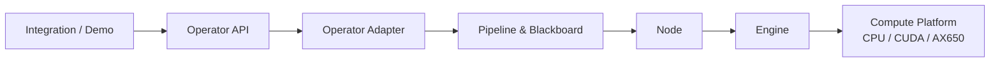

# RFC 0011: Operator 与计算 Platform 命名解耦

- **RFC 编号**：0011-operator-platform-naming-unification
- **创建日期**：2026-08-27
- **文档状态**：Completed
- **关联分支**：`feat/operator-naming-unification`
- **目标版本**：v4.0.0
- **负责人 / 作者**：LLM-EdgeFlow Architecture & Quality Team

---

## 1. 背景与动机 (Motivation & Context)

### 1.1 当前痛点

公司现有术语中，CPU、CUDA、AX650 等执行环境统一称为 **Platform**；外部
Integration 调用算法库时使用的算法接口与部署单元称为 **Operator**。

当前仓库却使用 `platform` 同时表达两类概念：

1. `include/platform/`、`src/adapter/platform/`、
   `llm_edgeflow::platform` 表示公司调度系统调用算法库的 Operator 接口及其适配实现；
2. `CreateParam::platform_type` 表示 AX650、NVIDIA GPU、通用 CPU 等计算目标；
3. `PlatformOutputPool`、`PlatformBizBridgeRegistry` 等类型实际服务于 Operator
   接口的内存与数据转换契约，并不表示计算平台能力。

这使代码评审、配置说明、日志诊断和后续硬件 Platform 扩展产生持续歧义。

### 1.2 统一术语

本 RFC 采用以下术语链作为唯一规范：

```text
Integration -> Operator -> Pipeline -> Node -> Engine -> Platform
```

| 术语 | 唯一语义 | 示例 |
| :--- | :--- | :--- |
| Integration | 公司外部集成与调用层；仓库 Demo 是其示例实现 | `demo/` |
| Operator | 算法库对外公开的生命周期、配置和命名 I/O 契约 | `OperatorFunc` |
| Operator Adapter | Operator 契约在 Layer 1 内的适配实现 | 配置解析、业务桥接、输出池 |
| Pipeline | 算法 DAG 编排与执行计划 | `Pipeline` |
| Node | 可注册的业务或公共处理节点 | `NodeBase` |
| Engine | 具体推理引擎与批调度实现 | `IModelEngine` |
| Platform | CPU、CUDA、AX650 等计算平台 | `ComputePlatform` |

### 1.3 预期收益

- 与公司既有领域语言保持一致，消除 Operator 接入与计算 Platform 的歧义；
- 为 CUDA、CPU、AX650 等 Platform 能力扩展保留清晰命名空间；
- 让目录、类型、测试、日志和架构文档能直接表达职责；
- 保持四层架构依赖方向和现有运行时行为不变。

---

## 2. 设计范围与边界 (Scope & Non-Goals)

### 2.1 范围内 (In-Scope)

- [x] 将 Operator 公开头目录从 `include/platform/` 迁移至
      `include/operator/`；
- [x] 将 Operator 内部实现从 `src/adapter/platform/` 迁移至
      `src/adapter/operator/`；
- [x] 将 `src/adapter/platform_operator_adapter.cpp` 迁移为
      `src/adapter/operator/operator_adapter.cpp`；
- [x] 将公开 C++ 命名空间从 `llm_edgeflow::platform` 调整为
      `llm_edgeflow::operator_api`；
- [x] 将实际承担 Operator 职责的 `Platform*` 类型、函数、文件和测试改为
      `Operator*`；
- [x] 将硬件目标类型规范为 `ComputePlatform`，专门表达 CPU、CUDA、AX650
      等计算平台；
- [x] 更新 Demo、CMake、测试、架构图、README 和相关脚本中的现行命名；
- [x] 定义 C++ Operator ABI 主版本迁移及下游 Integration 升级策略。

### 2.2 非目标 (Non-Goals / Out-of-Scope)

- 不改变六个纯 C ABI 导出函数 `Alg_Init`、`Alg_Create`、`Alg_Process`、
  `Alg_Control`、`Alg_Destroy`、`Alg_DeInit` 的名称、签名或异常屏障；
- 不改变 Pipeline JSON、DAG 规划、Blackboard Key 或 Session 行为；
- 不改变业务 Node、公共 Node 或 Engine 的计算逻辑；
- 不引入新的硬件 Platform 或推理 Backend；
- 不移动 `demo/`。Demo 继续作为 Integration 调用 Operator 的示例；
- 不重写历史 RFC 的文件名和历史结论，只在必要处增加被本 RFC 修订的说明。

---

## 3. 总体技术方案与架构设计 (Architecture & Technical Design)

### 3.1 架构分层映射 (4-Tier Mapping)

- **Layer 1 (C ABI / Operator Adapter)**：本 RFC 的主要变更层。迁移 Operator
  公开契约、配置解析、值类型注册、业务桥接、控制注册和输出池命名；纯 C ABI
  保持不变。
- **Layer 2 (Pipeline & Blackboard)**：行为和接口保持不变，仅更新引用该术语的
  架构文档。
- **Layer 3 (Business & Common Nodes)**：保持不变。
- **Layer 4 (Engines & Hardware Acceleration)**：保持执行行为不变；明确 Platform
  仅指 CPU、CUDA、AX650 等计算目标，Engine 仍指具体推理实现。

依赖方向继续严格保持：Layer 1 -> Layer 2 -> Layer 3 -> Layer 4。

### 3.2 目标目录结构

```text
include/
├── company_alg_interface.h              # 纯 C ABI，保持不动
├── adapter/                             # 通用业务 Adapter，保持不动
├── core/
├── engine/
├── nodes/
└── operator/
    ├── company_operator_types.h         # 原 company_platform_types.h
    └── operator_interface.h             # 原 platform_operator_interface.h

src/
└── adapter/
    ├── company_c_adapter.cpp            # 纯 C ABI Adapter，保持不动
    ├── shared_algorithm_runtime.cpp
    ├── adapters/                        # 通用业务 Adapter，保持不动
    └── operator/
        ├── operator_adapter.cpp
        ├── company_conf_resolver.cpp
        ├── company_conf_resolver.h
        ├── operator_value_type_registry.cpp
        ├── operator_value_type_registry.h
        ├── operator_biz_bridge_registry.cpp
        ├── operator_biz_bridge_registry.h
        ├── operator_control_registry.cpp
        ├── operator_control_registry.h
        ├── operator_output_pool.cpp
        ├── operator_output_pool.h
        └── biz_bridges/
            ├── keyword_match_bridge.cpp
            ├── entity_extract_bridge.cpp
            ├── doc_qa_bridge.cpp
            ├── compliance_audit_bridge.cpp
            ├── ocr_doc_qa_bridge.cpp
            ├── audio_asr_intent_bridge.cpp
            └── cross_rerank_bridge.cpp
```

### 3.3 目录与标识符迁移映射

| 当前名称 | 目标名称 |
| :--- | :--- |
| `include/platform/` | `include/operator/` |
| `src/adapter/platform/` | `src/adapter/operator/` |
| `platform_operator_interface.h` | `operator_interface.h` |
| `company_platform_types.h` | `company_operator_types.h` |
| `platform_operator_adapter.cpp` | `operator/operator_adapter.cpp` |
| `llm_edgeflow::platform` | `llm_edgeflow::operator_api` |
| `PlatformOutputPool` | `OperatorOutputPool` |
| `PlatformValueTypeRegistry` | `OperatorValueTypeRegistry` |
| `PlatformBizBridgeRegistry` | `OperatorBizBridgeRegistry` |
| `PlatformControlRegistry` | `OperatorControlRegistry` |
| `GetPlatformLastError` | `GetOperatorLastError` |
| `ValidatePlatformConfigBinding` | `ValidateOperatorConfigBinding` |
| `ChipType` | `ComputePlatform` |
| `platform_type` | `compute_platform` |

`operator` 是 C++ 关键字，不能直接作为命名空间标识符，因此公开命名空间使用
`llm_edgeflow::operator_api`；目录和自然语言继续使用 `operator`。

### 3.4 核心接口示意

```cpp
#include "operator/operator_interface.h"

namespace llm_edgeflow::operator_api {

enum class ComputePlatform : int32_t {
  kUnknown = 0,
  kAx650 = 1,
  kAscend310P = 2,
  kAscend910B = 3,
  kRk3588 = 4,
  kCuda = 5,
  kCpu = 6,
};

struct CreateParam {
  const char* cfg_file_name = nullptr;
  const char* model_path = nullptr;
  int32_t device_id = 0;
  ComputePlatform compute_platform = ComputePlatform::kUnknown;
  uint32_t max_frame_depth = 25;
};

OperatorFunc Get_LLM_EDGEFLOW_OperatorTable() noexcept;
const char* GetOperatorLastError() noexcept;

}  // namespace llm_edgeflow::operator_api
```

枚举底层类型和已有数值映射必须保持稳定。是否将显示字符串
`NVIDIA_GPU`/`CPU_GENERIC` 同步调整为 `CUDA`/`CPU`，必须在实现评审时明确，并纳入
配置兼容测试，不能通过本次纯命名迁移隐式改变部署配置语义。

### 3.5 数据流



---

## 4. 关键设计考量与权衡 (Design Trade-offs & Invariants)

### 4.1 架构与命名不变量

1. `Operator` 只表示算法库对外生命周期及命名 I/O 契约；
2. `Operator Adapter` 只表示 Layer 1 内部适配实现；
3. `Platform` 只表示 CPU、CUDA、AX650 等计算平台；
4. `Engine` 只表示具体推理引擎，不与 Platform 合并；
5. `Integration` 只表示算法库外部调用层，Demo 仍是 Integration 示例；
6. Operator Adapter 不得直接调用业务 Node 或硬件 SDK，仍通过共享运行时与
   Pipeline 下沉执行。

### 4.2 C ABI 与 C++ ABI

- `include/company_alg_interface.h` 必须继续保持 C11 可编译，不引入 STL、C++
  命名空间或第三方类型；
- 六个纯 C ABI 入口必须继续保持 `noexcept`、标准异常捕获和未知异常捕获；
- C++ 公开头路径、命名空间和导出函数名称发生变化，属于源码及二进制 ABI 变更，
  因此目标版本按主版本 `v4.0.0` 管理；
- 实现前必须选择并记录以下兼容策略之一：
  1. 公司 Integration 与算法库原子升级，不保留旧 C++ Platform API；
  2. 保留一个发布周期的旧头转发、类型别名和旧导出符号薄包装，并明确移除版本；
- 兼容层不得复制 Pipeline 执行逻辑，旧新入口必须汇入同一共享运行时。

### 4.3 内存、生命周期与性能

- 目录和标识符迁移不得改变命名 I/O 的所有权、输出池 lease、sidecar 容量和回滚
  规则；
- 不增加输入、输出或 Blackboard 数据复制；
- 固定 Batch 仍必须通过 `FixedBatchExecutor::Execute` 执行；
- `Create`、`Process`、`Control`、`Destroy` 的线程安全和错误传播语义保持不变。

---

## 5. 测试与质量验收计划 (Testing & Verification Plan)

- [x] 将 `test_platform_operator.cpp` 迁移为 `test_operator_api.cpp` 并全量通过；
- [x] 将 `test_platform_output_pool.cpp` 迁移为
      `test_operator_output_pool.cpp` 并全量通过；
- [x] 将 `test_platform_value_registry.cpp` 迁移为
      `test_operator_value_registry.cpp` 并全量通过；
- [x] 将 `test_platform_biz_bridge_registry.cpp` 迁移为
      `test_operator_biz_bridge_registry.cpp` 并全量通过；
- [x] `tests/test_c11_abi_compliance.c` 编译并通过，验证纯 C ABI 未被污染；
- [x] Demo 使用 `operator/operator_interface.h` 完成所有业务烟雾测试；
- [x] 增加仓库残留词扫描，确保现行代码中的 `platform` 仅表达计算 Platform；
- [x] `scripts/check_layer_isolation.sh` 通过；
- [x] `scripts/check_architecture_docs.sh` 通过；
- [x] `./scripts/format.sh` 通过；
- [x] `ctest --test-dir build --output-on-failure` 100% 通过；
- [x] `./scripts/run_all_tests.sh` 六阶段回归全部通过。

纯目录和文档阶段不新增运行时代码；进入实现阶段后，上述门禁全部为强制验收项。

---

## 6. 实施路线与里程碑 (Implementation Milestones)

1. [x] **阶段一：创建特性分支并形成 RFC 草案**
   （`feat/operator-naming-unification`）；
2. [x] **阶段二：评审术语、C++ ABI 版本和兼容策略**；
3. [x] **阶段三：迁移公开头、命名空间和 Layer 1 Operator Adapter 实现**；
4. [x] **阶段四：迁移 Demo、测试、CMake、脚本与现行架构文档**；
5. [x] **阶段五：运行格式化、100% CTest 与六阶段回归门禁**；
6. [x] **阶段六：更新 RFC 状态为 Completed，提交 PR 并合并至 `main`**。

---

## 7. 变更记录 (Changelog)

| 日期 | 版本 | 变更内容 | 作者 |
| :--- | :---: | :--- | :--- |
| 2026-08-27 | v0.1 | 创建 RFC 草案，确定 Integration / Operator / Platform 术语边界与目录迁移方案 | LLM-EdgeFlow Architecture & Quality Team |
| 2026-08-27 | v1.0 | 完成代码、测试、文档全量迁移与门禁回归，状态变更为 Completed | LLM-EdgeFlow Architecture & Quality Team |
