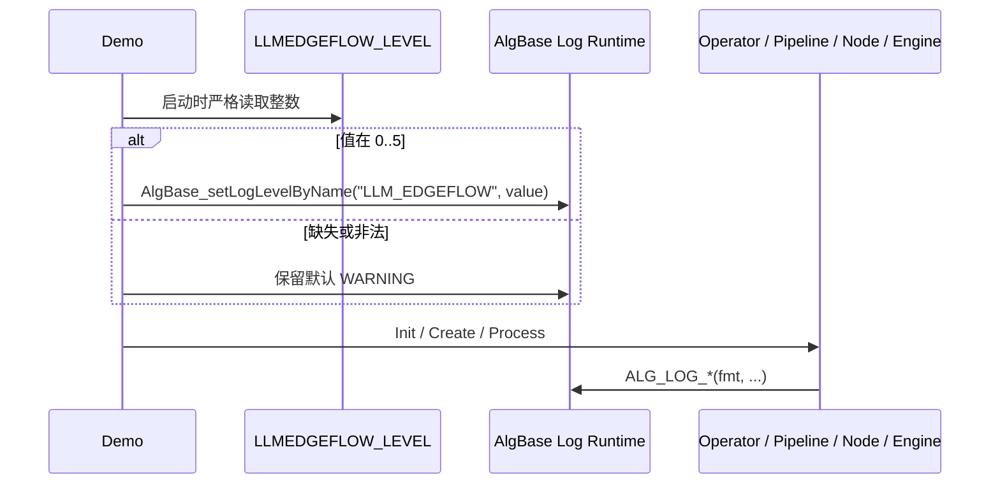

# RFC 0014: 独立公共日志 API 与核心日志统一

- **RFC 编号**：0014-public-log-api
- **创建日期**：2026-08-28
- **文档状态**：Completed
- **关联分支**：`feat/public-log-api`
- **目标版本**：v4.3.0
- **负责人 / 作者**：LLM-EdgeFlow Team

---

## 1. 背景与动机 (Motivation & Context)

当前 SDK 生产代码直接使用 `std::cout` 和 `std::cerr`，无法按运行时
等级过滤，也没有供下游调用方使用的统一日志头。本 RFC 新增一个独立、
可被 C11/C++17 直接包含的公共日志 API，并将 SDK 生产日志收敛到六个等级宏。

## 2. 设计范围与边界 (Scope & Non-Goals)

### 2.1 范围内 (In-Scope)

- 新增 `include/company_alg_log.h` 和 SDK 内部日志实现。
- 提供 FATAL、ERROR、WARNING、INFO、DEBUG、VERBOSE 六级宏与全局等级设置。
- Demo 启动时读取 `LLMEDGEFLOW_LEVEL` 数字环境变量并设置全局等级。
- 迁移 `alg_sdk` 生产源码和生产头文件中现有 iostream 日志。

### 2.2 非目标 (Non-Goals / Out-of-Scope)

- 不引入第三方日志库，不实现日志文件轮转或远程 sink。
- 不迁移 Demo、CLI 工具和测试程序自身用于人机交互的终端输出。
- `ALG_LOG_FATAL` 不终止进程。

## 3. 总体技术方案与架构设计 (Architecture & Technical Design)

### 3.1 架构分层映射 (4-Tier Mapping)

- **横切基础设施**：日志公共头仅依赖 C 基本类型，不归属业务层且不导入任何上层依赖。
- **Layer 1**：C ABI Adapter 使用公共日志宏，现有六个生命周期函数签名不变。
- **Layer 2–4**：Pipeline、Node 和 Engine 仅依赖无业务类型的日志头，不形成反向分层依赖。

### 3.2 核心接口与数据流设计 (Interface & Data Flow)

```c
typedef enum {
  E_ALG_BASE_LOG_LEVEL_FATAL = 0,
  E_ALG_BASE_LOG_LEVEL_ERROR = 1,
  E_ALG_BASE_LOG_LEVEL_WARNING = 2,
  E_ALG_BASE_LOG_LEVEL_INFO = 3,
  E_ALG_BASE_LOG_LEVEL_DEBUG = 4,
  E_ALG_BASE_LOG_LEVEL_VERBOSE = 5
} AlgBaseLogLevel;

int AlgBase_setLogLevelByName(const char* name, int level);
int AlgBase_getLogLevelByName(const char* name);

ALG_LOG_VERBOSE("...");
ALG_LOG_DEBUG("...");
ALG_LOG_INFO("...");
ALG_LOG_WARNING("...");
ALG_LOG_ERROR("...");
ALG_LOG_FATAL("...");
```

- 默认全局等级为 `WARNING (2)`，启用条件为 `message_level <= current_level`。
- `AlgBase_setLogLevelByName` 接受 0–5 并返回 0；越界返回 -1 且不修改当前等级。
- 等级在进程内全局生效；`name` 保留 AlgBase 命名契约并用于输出标签。
- `ALG_LOG_*` 默认 name 为 `LLM_EDGEFLOW`，可通过 `COMPANY_ALG_LOG_NAME` 编译期覆盖。
- 日志输出到 `stderr`，格式为 `[Level][name] ` + 原始 `fmt`，不自动补换行。

### 3.3 Demo 启动流程



## 4. 关键设计考量与权衡 (Design Trade-offs & Invariants)

1. 公共头必须可由严格 C11 编译，不暴露 STL 或第三方类型。
2. 全局等级使用原子状态，输出使用同步保护，公共函数不得泄漏 C++ 异常。
3. 等级过滤必须在参数求值前执行，禁用日志不得产生副作用。
4. 使用标准 C11 可变参数转发，不依赖 GNU `##__VA_ARGS__` 空参扩展。
5. 环境变量仅由 Demo 启动代码读取；非 Demo 宿主可在 `Alg_Init` 前调用 setter。

## 5. 测试与质量验收计划 (Testing & Verification Plan)

- 严格 C11 包含、枚举布局、无额外格式参数的宏调用编译验证。
- 默认等级、全等级边界、非法 setter、参数不求值、格式和 name 测试。
- Fatal 不终止、多线程设置/读取/输出测试。
- Demo 对 `LLMEDGEFLOW_LEVEL` 合法、缺失、非数字及越界值的测试。
- `ctest --output-on-failure` 与 `./scripts/run_all_tests.sh` 六阶段全量回归通过。

## 6. 实施路线与里程碑 (Implementation Milestones)

1. [x] 创建功能分支并完成 RFC 方案。
2. [x] 实现公共头、日志 Runtime 与 Demo 启动配置。
3. [x] 迁移 SDK 生产日志并补齐测试。
4. [x] 通过 78/78 CTest 与六阶段全量门禁，更新 README 和 RFC 状态。

## 7. 变更记录 (Changelog)

| 日期 | 版本 | 变更内容 | 作者 |
| :--- | :--- | :--- | :--- |
| 2026-08-28 | v4.3.0 | 初始公共日志 API 方案 | LLM-EdgeFlow Team |
| 2026-08-28 | v4.3.0 | 完成实现、78/78 CTest 与六阶段全量验证 | LLM-EdgeFlow Team |
