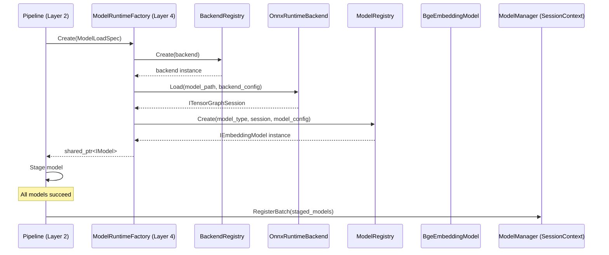

# RFC 0015: 模型能力与推理运行时解耦设计规范

- **RFC 编号**：0015-model-capability-backend-decoupling
- **创建日期**：2026-08-28
- **文档状态**：Proposed
- **关联分支**：`feat/model-backend-decoupling-rfc`
- **目标版本**：v5.0.0
- **负责人 / 作者**：LLM-EdgeFlow Architecture Team

---

## 1. 背景与动机 (Motivation & Context)

### 1.1 当前痛点
在当前架构中，`IModelEngine` 将**模型能力接口**、**领域预后处理（Tokenization/Sigmoid/OCR解码）**、**具体硬件运行时（ONNX Session / llama.cpp Context）**以及**平台配置解析**强耦合在单一类中：

1. **$M \times N$ 组合爆炸**：`engine_type` 表达的是“模型语义 × 运行时”的强绑定（如 `OnnxEmbeddingEngine`、`MockNpuEmbeddingEngine`）。新增硬件后端或模型时，需要成倍新增 Engine 类。
2. **代码重复严重**：`OnnxEmbeddingEngine` 与 `OnnxRerankEngine` 各自维护了一套近乎相同的 ONNX Runtime 初始化、SessionOptions 配置、输入输出 Tensor 探测与内存分配逻辑。
3. **平台参数泄漏**：`device_id`、`chip_type` 等特定硬件参数穿透了公共接口和 Layer 2 调度层，破坏了硬件无关性。
4. **批处理冗余拷贝**：现存 `FixedBatchExecutor` 需要调用方提供 `dummy_pad_input` 对象深拷贝，增加了不必要的内存开销。

### 1.2 预期收益
- **三元解耦**：将 Layer 4 清晰拆解为 **Capability**（强类型能力接口）、**Model**（模型语义与前后处理）、**Backend**（硬件推理运行时）。
- **统一后端运行时**：代码库仅保留一份纯粹的 `OnnxRuntimeBackend` 和 `LlamaCppBackend`，彻底消除样板代码。
- **高内聚低耦合**：Layer 3 节点仅依赖强类型 Model 接口；硬件与平台参数严格封装在 Backend 私有命名空间；Layer 1/2/3 保持极简侵入与零破坏性。

---

## 2. 设计范围与边界 (Scope & Non-Goals)

### 2.1 范围内 (In-Scope)
- **Layer 4 解耦重构**：
  - 定义 5 个强类型能力接口（`IEmbeddingModel`, `IRerankModel`, `ILlmModel`, `IOcrModel`, `IAsrModel`）；
  - 定义中性执行协议：`tensor_graph`（Tensor 图执行）与 `causal_lm`（自回归 Token 评估）；
  - 实现统一的 `OnnxRuntimeBackend` 与 `LlamaCppBackend`；
  - 提取独立的 `BgeEmbeddingModel`、`BgeRerankerModel`、`QwenCausalLmModel` 等语义实现；
  - 实现独立的 `ModelRegistry`、`BackendRegistry` 与 `ModelRuntimeFactory`；
  - 升级 `FixedBatchExecutor` 支持基于 `BatchSlice` 的零拷贝切片。
- **Layer 2/3 极简适配**：
  - `Pipeline::Build` 改为调用 `ModelRuntimeFactory`；
  - `PipelineValidator` 增加 `model_type` 与 `backend` 的存在性与协议兼容检查；
  - 5 个模型绑定算子（`TextEmbeddingNode` 等）平滑切换至对应的 `I*Model` 强类型接口；
  - 11 个生产 Pipeline JSON 配置升级 `models` 描述格式。

### 2.2 非目标 (Non-Goals / Out-of-Scope)
- **不新增业务模态或 Node**：不增加新的业务算子或对外 C ABI 函数。
- **不搬移公共头文件目录**：严格保留 `include/core/traceable_item.h` 与 `include/core/common_contracts.h`，不制造跨层路径震荡。
- **不建立重量级跨层 AST / DSL**：保持现有轻量直接的 Validator 校验，不引入复杂的元编程或通用设备抽象层。
- **不引入动态插件或远程推理**：继续保持单仓静态编译与就地注册机制。

---

## 3. 总体技术方案与架构设计 (Architecture & Technical Design)

### 3.1 四层架构映射 (4-Tier Mapping)

```text
Layer 1 (C ABI Adapter)
   │ (company_c_adapter.cpp / operator_adapter.cpp: 100% 零改动)
   ▼
Layer 2 (Pipeline & Blackboard)
   │ (Validator 校验 model_type/backend; Pipeline 通过 ModelRuntimeFactory 物化模型)
   ▼
Layer 3 (Common & Business Nodes)
   │ (ModelBoundNode<IEmbeddingModel>: 仅切换绑定的 Model 接口，DAG/端口/黑板 0 改动)
   ▼
Layer 4 (Decoupled Inference Layer)
   │ 4.1 Capability  : IModel, IEmbeddingModel, IRerankModel, ILlmModel...
   │ 4.2 Model       : BgeEmbeddingModel, BgeRerankerModel, QwenCausalLmModel (语义/前后处理)
   │ 4.3 Protocol    : ITensorGraphSession, ICausalLmSession (中性执行协议)
   │ 4.4 Backend     : OnnxRuntimeBackend, LlamaCppBackend (原生硬件会话)
   │ 4.5 Executor    : FixedBatchExecutor (零拷贝切片与溯源)
```

### 3.2 核心概念与交互关系

```text
Node (Layer 3)
  └──> IEmbeddingModel (强类型接口)
         └──> BgeEmbeddingModel (组织 Tensor, Tokenizer, Pooling)
                └──> ITensorGraphSession (中性协议: Run)
                       └──> OnnxRuntimeBackend (原生 Ort::Session)
```

---

## 4. 核心接口与协议规范 (Interfaces & Protocols)

### 4.1 Model Capability 强类型接口 (`include/engine/model_interface.h`)

所有 Model 实例在初始化完成后即处于就绪状态，不暴露 `Load()` 或硬件参数：

```cpp
namespace alg_framework {

class IModel {
 public:
  virtual ~IModel() = default;
  virtual const std::string& ModelType() const noexcept = 0;
  virtual const std::string& Capability() const noexcept = 0;
  virtual size_t GetMaxBatchSize() const noexcept = 0;
};

class IEmbeddingModel : public IModel {
 public:
  struct Options { bool normalize = true; };
  virtual int Embed(const TextBatch& inputs, const Options& options,
                    EmbeddingBatch* outputs) noexcept = 0;
};

class IRerankModel : public IModel {
 public:
  virtual int Score(const QueryCandidatesBatch& inputs,
                    ScoreBatch* outputs) noexcept = 0;
};

class ILlmModel : public IModel {
 public:
  struct Options {
    int max_tokens = 128;
    float temperature = 0.7f;
    float top_p = 0.9f;
    std::vector<std::string> stop_words;
  };
  virtual int Generate(const TextBatch& prompts, const Options& options,
                       TextBatch* outputs) noexcept = 0;
};

class IOcrModel : public IModel {
 public:
  virtual int Recognize(const ImageRefBatch& images,
                        OcrDocumentBatch* outputs) noexcept = 0;
};

class IAsrModel : public IModel {
 public:
  virtual int Transcribe(const AudioPcmBatch& audio,
                         TextBatch* outputs) noexcept = 0;
};

}  // namespace alg_framework
```

### 4.2 中性后端执行协议 (`include/engine/backend_interface.h`)

#### 1. Tensor Graph 协议（用于 ONNX Runtime 及未来 NPU 图推理）
```cpp
namespace alg_framework {

enum class ElementType { kFloat32, kInt32, kInt64, kUInt8 };

struct TensorDesc {
  ElementType element_type;
  std::vector<int64_t> shape;
};

class ITensorBuffer {
 public:
  virtual ~ITensorBuffer() = default;
  virtual const void* Data() const noexcept = 0;
  virtual void* MutableData() noexcept = 0;
  virtual size_t ByteSize() const noexcept = 0;
};

struct Tensor {
  TensorDesc desc;
  std::shared_ptr<ITensorBuffer> buffer;
};

using TensorMap = std::unordered_map<std::string, Tensor>;

bool CreateHostTensor(const TensorDesc& desc, Tensor* tensor,
                      std::string* diagnostic) noexcept;

class ITensorGraphSession {
 public:
  virtual ~ITensorGraphSession() = default;
  virtual int Run(const TensorMap& inputs, TensorMap* outputs,
                  std::string* diagnostic) noexcept = 0;
};

}  // namespace alg_framework
```

#### 2. Causal LM 协议（用于 llama.cpp 及自回归大模型）
```cpp
namespace alg_framework {

class ITokenCodec {
 public:
  virtual ~ITokenCodec() = default;
  virtual int Encode(const std::string& text, bool add_bos,
                     std::vector<int32_t>* tokens,
                     std::string* diagnostic) noexcept = 0;
  virtual int DecodeToken(int32_t token, std::string* piece,
                          std::string* diagnostic) noexcept = 0;
  virtual bool IsEndToken(int32_t token) const noexcept = 0;
};

class ISequenceState {
 public:
  virtual ~ISequenceState() = default;
};

class ICausalLmSession {
 public:
  virtual ~ICausalLmSession() = default;
  virtual ITokenCodec& TokenCodec() noexcept = 0;
  virtual size_t MaxContextTokens() const noexcept = 0;
  virtual std::unique_ptr<ISequenceState> CreateSequence(
      std::string* diagnostic) noexcept = 0;
  virtual int Evaluate(const std::vector<int32_t>& tokens,
                       ISequenceState& state,
                       std::vector<float>* logits,
                       std::string* diagnostic) noexcept = 0;
};

}  // namespace alg_framework
```

### 4.3 Backend 加载接口与 Registry
```cpp
namespace alg_framework {

class IBackendSession {
 public:
  virtual ~IBackendSession() = default;
  virtual const std::string& BackendType() const noexcept = 0;
  virtual size_t MaxBatchSize() const noexcept = 0;
};

struct BackendLoadSpec {
  std::string model_path;
  nlohmann::json backend_config;
};

class IInferenceBackend {
 public:
  virtual ~IInferenceBackend() = default;
  virtual const std::string& BackendType() const noexcept = 0;
  virtual std::shared_ptr<IBackendSession> Load(
      const BackendLoadSpec& spec, std::string* diagnostic) noexcept = 0;
};

}  // namespace alg_framework
```

### 4.4 优化的固定 Batch 执行器 (`include/engine/fixed_batch_executor.h`)

采用基于 `BatchSlice` 索引切片的零拷贝回调机制：

```cpp
namespace alg_framework {

struct BatchSlice {
  size_t offset = 0;
  size_t valid_count = 0;
  size_t execution_count = 0;
};

class FixedBatchExecutor {
 public:
  template <typename TIn, typename TOut, typename RunBatchFunc>
  static int Execute(const std::vector<TraceableItem<TIn>>& inputs,
                     size_t fixed_max_batch,
                     RunBatchFunc&& run_batch,
                     std::vector<TraceableItem<TOut>>* outputs) noexcept {
    if (!outputs) return -1;
    outputs->clear();
    if (inputs.empty()) return 0;
    if (fixed_max_batch == 0) return -2;

    outputs->reserve(inputs.size());
    size_t total = inputs.size();
    size_t num_batches = (total + fixed_max_batch - 1) / fixed_max_batch;

    std::vector<TOut> batch_out;
    for (size_t b = 0; b < num_batches; ++b) {
      size_t offset = b * fixed_max_batch;
      size_t valid_count = std::min(fixed_max_batch, total - offset);
      BatchSlice slice{offset, valid_count, fixed_max_batch};

      batch_out.clear();
      int ret = run_batch(slice, &batch_out);
      if (ret != 0) return ret;
      if (batch_out.size() < valid_count) return -3;

      for (size_t i = 0; i < valid_count; ++i) {
        const auto& src = inputs[offset + i];
        outputs->emplace_back(src.req_id, src.sub_id, std::move(batch_out[i]));
      }
    }
    return 0;
  }
};

}  // namespace alg_framework
```

---

## 5. Pipeline 配置与加载流程 (Pipeline Integration)

### 5.1 配置格式演进
`pipeline.json` 中的 `models` 声明清晰区分为能力、模型语义与后端引擎：

```json
{
  "models": [
    {
      "model_id": "embed_model_onnx",
      "capability": "embedding",
      "model_type": "bge_embedding",
      "backend": "onnxruntime",
      "model_path": "./models/bge_base_zh_v1.5.onnx",
      "model_config": {
        "embedding_dim": 128
      },
      "backend_config": {
        "max_batch_size": 4
      }
    }
  ]
}
```

### 5.2 模型物化时序与原子性



---

## 6. 测试与质量验收计划 (Testing & Verification Plan)

### 6.1 测试替身支持 (`tests/support/inference/`)
- 提供中性的 `test_tensor_backend` 与 `test_causal_lm_backend`；
- 单元测试与无物理权重的 CI 流程使用测试替身，确保在无大模型文件环境下 **CTest 100% 通过**；
- 生产代码彻底移除旧的 `mock_npu_*` 业务 Mock 实现。

### 6.2 质量门禁标准
```bash
# 1. 严格代码格式
./scripts/format.sh

# 2. 全量单元测试与回归
cmake -B build -G Ninja -DLLM_EDGEFLOW_USE_CCACHE=ON
cmake --build build -j$(nproc)
ctest --test-dir build -j$(nproc) --output-on-failure
./scripts/run_all_tests.sh

# 3. 内存安全校验（ASan/LSan 0 泄漏）
cmake -B build-asan -G Ninja -DCMAKE_BUILD_TYPE=Debug -DLLM_EDGEFLOW_ENABLE_ASAN=ON
cmake --build build-asan -j$(nproc)
ctest --test-dir build-asan -j$(nproc) --output-on-failure

# 4. 多模态端到端 Demo
./build/alg_demo
```

---

## 7. 实施路线与里程碑 (Implementation Milestones)

1. [ ] **阶段一：Layer 4 核心契约与双 Registry**（定义 `model_interface.h`, `backend_interface.h`, `ModelRegistry`, `BackendRegistry`）
2. [ ] **阶段二：Pipeline 规划工厂与轻量校验**（`ModelRuntimeFactory`, `ValidatedModelPlan`, `ModelManager::RegisterBatch`）
3. [ ] **阶段三：统一 OnnxRuntimeBackend 与 BGE 模型迁移**（实现唯一 ONNX 后端，迁移 Embedding 与 Rerank）
4. [ ] **阶段四：LlamaCppBackend 与 Qwen 模型迁移**（解耦 GGUF 运行时与 Chat 生成循环）
5. [ ] **阶段五：OCR / ASR 迁移与测试替身接入**（统一 Payload，引入 Fake Backend）
6. [ ] **阶段六：配置升级、废弃代码清理与 100% 验收**（升级 11 个 JSON，下线旧 `IModelEngine`，完成全量门禁）

---

## 8. 变更记录 (Changelog)

| 日期 | 版本 | 变更内容 | 作者 |
| :--- | :--- | :--- | :--- |
| 2026-08-28 | v1.0.0 | 初始草案（全量规约版） | LLM-EdgeFlow Team |
| 2026-08-28 | v1.1.0 | 架构精炼与瘦身：聚焦 Layer 4 核心解耦，消除非必要目录震荡，确立 Layer 2/3 最小侵入实施路线 | LLM-EdgeFlow Architecture Team |
