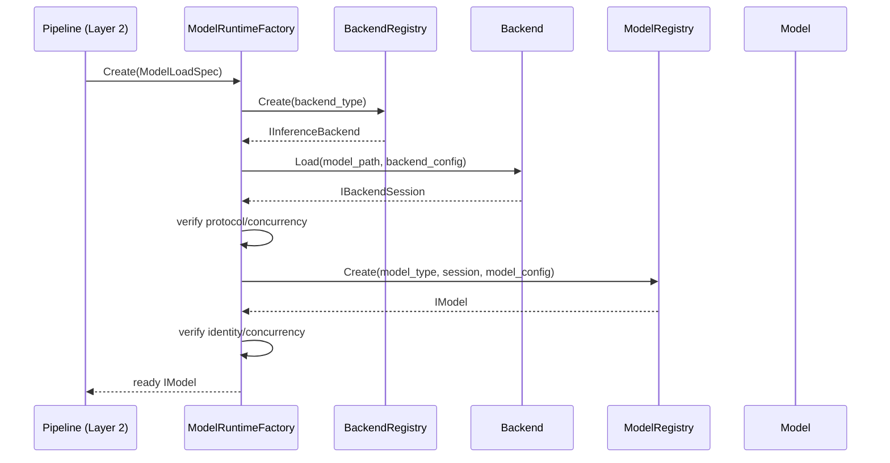

# RFC 0015: 模型能力与推理运行时解耦实施规范

- **RFC 编号**：0015-model-capability-backend-decoupling
- **创建日期**：2026-08-28
- **文档状态**：Proposed
- **关联分支**：`feat/model-backend-decoupling-rfc`
- **目标版本**：v5.0.0
- **负责人 / 作者**：LLM-EdgeFlow Team

---

## 1. 决策摘要

当前 `IModelEngine::Load()`、类型安全推理接口和具体运行时实现集中在同一个对象中。
`OnnxEmbeddingEngine` 与 `OnnxRerankEngine` 分别创建 ONNX Session、处理运行时配置和
执行，同时又各自包含模型输入输出语义；`LlamaCppEngine` 同时持有 llama.cpp 资源、
Tokenizer、采样和生成循环。`engine_type` 因而表达的是“模型能力 × 运行时”的组合，
无法独立复用 Model 或 Backend。

本 RFC 在不改变 Node 业务契约和 C ABI 的前提下，只重构 Layer 2～4 的模型物化与调用
边界。

LLM-EdgeFlow 将模型推理层拆成三个彼此独立的概念：

```text
Capability：Node 调用的类型安全能力
Model：模型语义实现
Backend：具体推理运行时适配器
```

运行时组合关系为：

```text
Node
  → typed Model capability
  → concrete Model
  → neutral execution protocol
  → concrete Backend Session
  → ONNX Runtime / llama.cpp
```

本 RFC 的核心决策：

1. Node 只依赖类型安全的 Model capability，不依赖 backend；
2. Model 负责预处理、模型输入组织、输出解码和模型语义；
3. Backend 负责模型文件加载、运行时资源、平台初始化、Tensor/序列绑定和执行；
4. Model 与 Backend 只通过中性执行协议交互；
5. Pipeline 配置分别声明 `capability`、`model_type` 和 `backend`；
6. Pipeline、Validator 和 RuntimeFactory 不理解任何平台、芯片或设备字段；
7. backend 的私有配置只由对应 backend 声明和解释；
8. Model Registry 与 Backend Registry 分别注册，不注册二者的组合类；
9. Node 的 `bind_model`、Blackboard 端口和业务 DAG 保持不变；
10. 本 RFC 只覆盖仓库已经存在的业务能力和推理运行时。

---

## 2. 目标与范围

### 2.1 目标

- 消除 `OnnxEmbeddingEngine`、`OnnxRerankEngine` 中重复的 ONNX Runtime 加载和执行代码；
- 将 llama.cpp 的运行时资源与 LLM 模型生成语义分开；
- 保留 Embedding、Rerank、LLM、OCR、ASR 不同且类型安全的输入输出；
- 允许同一 Backend 实现承载多个满足其执行协议的 Model；
- 允许同一 Model 在有兼容部署文件时切换到另一个同协议 Backend；
- backend 切换不修改 Node、端口、Blackboard Key 和 Pipeline DAG；
- 保持固定 Batch 和 `(req_id, sub_id)` provenance 的统一处理；
- 在模型加载前完成配置、Registry、capability 和协议校验；
- 任一模型物化失败时不向 Session 暴露部分模型。

### 2.2 当前业务范围

本 RFC 只处理以下能力字符串，保持现有 NodeDefinition 契约不变：

| Capability | 类型安全接口 | 当前 Node |
| :--- | :--- | :--- |
| `embedding` | `IEmbeddingModel` | `TextEmbeddingNode` |
| `rerank` | `IRerankModel` | `TextRerankNode` |
| `llm` | `ILlmModel` | `LlmGenerateNode` |
| `ocr` | `IOcrModel` | `OcrDetectNode` |
| `asr` | `IAsrModel` | `AsrTranscribeNode` |

本期生产 Backend 只有：

| Backend | 执行协议 | 说明 |
| :--- | :--- | :--- |
| `onnxruntime` | `tensor_graph` | 通用 ONNX 图加载与 Tensor 执行 |
| `llama_cpp` | `causal_lm` | GGUF 加载与 token/sequence 执行 |

### 2.3 非目标

- 不新增业务能力、Node 或 C ABI 模态；
- 不新增当前没有接入的生产 Backend；
- 不建立通用平台、芯片、设备或 Execution Provider 抽象；
- 不建立公共设备池、资源管理器或跨模型 Session 缓存；
- 不设计远程推理、模型热更新、训练、转换、量化或编译流程；
- 不实现连续批处理、跨请求动态合批或 Prefix Cache；
- 不承诺不同 backend 使用同一模型文件格式；
- 不把 Model/Backend 接口泛化为 `json`、`std::any` 或 `void*` 推理；
- 不重写 C ABI、业务 Pipeline 或 Blackboard 体系；
- 不在生产代码中保留带业务响应逻辑的 Mock 推理实现。

---

## 3. 分层边界

### 3.1 责任矩阵

| 组件 | 负责 | 不负责 |
| :--- | :--- | :--- |
| Layer 1 Adapter | C ABI 与 Blackboard 值转换、异常屏障 | Model、Backend、Tensor |
| Layer 2 Pipeline | 配置解析、校验、组合、Session 生命周期 | 模型语义、平台初始化、厂商 API |
| Layer 3 Node | 业务编排、端口读写、调用选项、结果组合 | backend 选择、模型加载、Tensor |
| Model capability | 类型安全输入输出契约 | 模型加载、平台配置 |
| Concrete Model | 预处理、Tokenizer、Tensor 组织、解码、后处理 | 厂商 Runtime、平台初始化 |
| Execution protocol | 中性 Tensor 或 token/sequence 原语 | capability、业务 DTO、平台字段 |
| Concrete Backend | 模型加载、运行时资源、平台处理、绑定和执行 | Node、业务规则、模型后处理 |

### 3.2 依赖方向

```text
Layer 1
  ↓
Layer 2 Pipeline / Session / Validator
  ↓
Layer 3 Nodes
  ↓
Layer 4 Model capability / Model implementation
  ↓
Layer 4 execution protocol
  ↓
Layer 4 concrete Backend
```

Neutral value contracts 可被各层共同 include，但不得包含行为、Registry、厂商头文件或
运行时资源。

### 3.3 平台信息边界

公共框架不得定义以下概念：

```text
platform
chip_type
device_id
execution_provider
device memory policy
vendor runtime option
```

如某个具体 backend 需要这些参数，它通过自己的 `BackendDefinition::config_fields` 声明，
并只在自己的实现中读取。通用 Parser、Pipeline、Model、ModelRuntimeFactory 和执行协议：

- 不包含上述字段；
- 不按字段名分支；
- 不从 `RuntimeOptions` 注入；
- 不增加公共默认值；
- 不修改归一化后的 `backend_config`。

框架对 `backend_config` 只执行选中 BackendDefinition 所声明的结构校验，然后完整传递给
该 backend。

### 3.4 厂商类型隔离

- `onnxruntime_cxx_api.h` 只能出现在 `src/engine/backends/onnxruntime/`；
- `llama.h` 只能出现在 `src/engine/backends/llama_cpp/`；
- vendor handle 只能保存在具体 Backend 或 Backend Session 的私有实现中；
- Model、Node、Core 和公共头文件不得出现 vendor 类型。

---

## 4. 目录与公共契约

### 4.1 目标目录

```text
include/
  contracts/
    config_schema.h
    traceable_item.h
    inference_payloads.h
  engine/
    model_interface.h
    backend_interface.h
    inference_definition.h
    model_registry.h
    backend_registry.h
    model_runtime_factory.h
    fixed_batch_executor.h

src/engine/
  runtime/
    model_registry.cpp
    backend_registry.cpp
    model_runtime_factory.cpp
  models/
    bge_embedding/
    bge_reranker/
    qwen_causal_lm/
    ppocr/
    paraformer_asr/
  backends/
    onnxruntime/
    llama_cpp/
```

只在对应实现开始时创建目录和源文件；不得先提交空 Model、空 Backend 或只返回
`not implemented` 的生产注册项。

### 4.2 Neutral contracts

`contracts/` 仅容纳三类跨层值契约：

1. `ConfigValueKind`、`ConfigFieldDefinition`；
2. `TraceableItem<T>`；
3. 五类现有推理能力实际使用的 payload 和 option。

不得在本 RFC 中增加通用 Status、ArrayView、设备描述、Tensor Runtime 或资源管理器到
`contracts/`。

`core/common_contracts.h` 继续保存 BlackboardTypeTraits、BlackboardKey 和非推理业务值；
推理 payload 从 `contracts/inference_payloads.h` 引用同一个定义，避免 Node 与 Model
各自定义 DTO。

### 4.3 共享推理值类型

`inference_payloads.h` 至少定义：

```cpp
using TextBatch = std::vector<TraceableItem<std::string>>;
using EmbeddingBatch =
    std::vector<TraceableItem<std::vector<float>>>;

struct QueryCandidatePair {
  std::string query;
  std::string candidate;
};
using QueryCandidatesBatch =
    std::vector<TraceableItem<QueryCandidatePair>>;
using ScoreBatch = std::vector<TraceableItem<float>>;

struct AudioPcmPayload {
  std::vector<float> pcm_data;
  int sample_rate = 16000;
};
using AudioPcmBatch = std::vector<TraceableItem<AudioPcmPayload>>;

struct ImageRefBatch : public std::vector<TraceableItem<std::string>> {
  using std::vector<TraceableItem<std::string>>::vector;
};

struct OcrBoxRecord {
  float x = 0.0f;
  float y = 0.0f;
  float width = 0.0f;
  float height = 0.0f;
  std::string text;
  float confidence = 0.0f;
};

struct OcrDocumentItem {
  std::vector<OcrBoxRecord> boxes;
  std::string combined_text;
};
using OcrDocumentBatch =
    std::vector<TraceableItem<OcrDocumentItem>>;

struct EmbeddingOptions {
  bool normalize = true;
};

struct GenerateOptions {
  int max_tokens = 128;
  float temperature = 0.7f;
  float top_p = 0.9f;
  std::vector<std::string> stop_words;
};
```

Blackboard 和 Model capability 必须使用这些相同类型。禁止在 capability 内再声明
`PairInput`、`AudioPcmData` 或 `OcrBoxItem`。

---

## 5. Model capability 契约

### 5.1 基础接口

`InferenceConcurrency` 定义在 `inference_definition.h`，供 Model、Backend、Validator
共同使用。

```cpp
class IModel {
 public:
  virtual ~IModel() = default;

  virtual const std::string& ModelType() const noexcept = 0;
  virtual const std::string& Capability() const noexcept = 0;
  virtual InferenceConcurrency Concurrency() const noexcept = 0;
  virtual size_t GetMaxBatchSize() const noexcept = 0;
};
```

`IModel` 不包含：

- `Load()`；
- 模型路径；
- 平台或设备信息；
- vendor handle；
- backend 名称；
- 通用 `Infer(void*)`。

模型文件由 Backend 加载，Model Instance 在创建成功时已经可用。

### 5.2 类型安全能力接口

```cpp
class IEmbeddingModel : public IModel {
 public:
  virtual int Embed(const TextBatch& inputs,
                    const EmbeddingOptions& options,
                    EmbeddingBatch* outputs) noexcept = 0;
};

class IRerankModel : public IModel {
 public:
  virtual int Score(const QueryCandidatesBatch& inputs,
                    ScoreBatch* outputs) noexcept = 0;
};

class ILlmModel : public IModel {
 public:
  virtual int Generate(const TextBatch& prompts,
                       const GenerateOptions& options,
                       TextBatch* outputs) noexcept = 0;
};

class IOcrModel : public IModel {
 public:
  virtual int Recognize(const ImageRefBatch& images,
                        OcrDocumentBatch* outputs) noexcept = 0;
};

class IAsrModel : public IModel {
 public:
  virtual int Transcribe(const AudioPcmBatch& audio,
                         TextBatch* outputs) noexcept = 0;
};
```

所有方法必须：

- 检查输出指针；
- 进入方法时清空输出；
- 空输入返回成功和空输出；
- 失败时不保留部分输出；
- 保持有效样本的 `(req_id, sub_id)`；
- 捕获自身预后处理异常并返回稳定错误码；
- 不让异常越过接口。

---

## 6. Backend 与执行协议

### 6.1 公共枚举和值类型

```cpp
enum class ExecutionProtocol {
  kTensorGraph,
  kCausalLm,
};

enum class InferenceConcurrency {
  kSerialized,
  kConcurrent,
};

struct BatchPolicy {
  size_t max_batch_size = 1;
  size_t fixed_batch_size = 0;  // 0 表示执行 batch 可变
};
```

`BatchPolicy` 必须满足：

- `max_batch_size > 0`；
- `fixed_batch_size == 0` 或 `fixed_batch_size == max_batch_size`；
- 固定 Batch 时每次执行数等于 `fixed_batch_size`；
- 动态 Batch 时每次执行数等于有效样本数且不超过 `max_batch_size`。

### 6.2 Backend Session 基类

```cpp
class IBackendSession {
 public:
  virtual ~IBackendSession() = default;

  virtual const std::string& BackendType() const noexcept = 0;
  virtual ExecutionProtocol Protocol() const noexcept = 0;
  virtual InferenceConcurrency Concurrency() const noexcept = 0;
  virtual BatchPolicy GetBatchPolicy() const noexcept = 0;
};
```

Backend Session 是加载一个 `model_path` 后的 session 级资源。每个 Model Instance 持有
一个 `shared_ptr<IBackendSession>`。

### 6.3 Tensor Graph 协议

```cpp
enum class ElementType {
  kFloat32,
  kInt32,
  kInt64,
  kUInt8,
};

struct TensorDesc {
  ElementType element_type;
  std::vector<int64_t> shape;
};

class ITensorBuffer {
 public:
  virtual ~ITensorBuffer() = default;
  virtual const void* Data() const noexcept = 0;
  virtual void* MutableData() noexcept = 0;
  virtual size_t ByteSize() const noexcept = 0;
};

struct Tensor {
  TensorDesc desc;
  std::shared_ptr<ITensorBuffer> buffer;
};

struct TensorSpec {
  std::string name;
  ElementType element_type;
  std::vector<int64_t> shape;
};

using TensorMap = std::unordered_map<std::string, Tensor>;

bool CreateHostTensor(const TensorDesc& desc,
                      Tensor* tensor,
                      std::string* diagnostic) noexcept;

class ITensorGraphSession : public IBackendSession {
 public:
  virtual const std::vector<TensorSpec>& Inputs() const noexcept = 0;
  virtual const std::vector<TensorSpec>& Outputs() const noexcept = 0;

  virtual int Run(const TensorMap& inputs,
                  TensorMap* outputs,
                  std::string* diagnostic) noexcept = 0;
};
```

Tensor 合约：

- shape 维度不得小于 `-1`；
- 运行时传入 Tensor 不得包含未解析的 `-1`；
- element count 与 byte size 必须做溢出检查；
- buffer 不得为空，且必须覆盖 Run 和 decode 生命周期；
- buffer byte size 必须与已解析 shape 和 dtype 精确相等；
- dtype、rank、静态维度和 batch 必须在调用 vendor API 前验证；
- 输入名称必须完整且无未知 binding；
- 输出名称、dtype 和 shape 必须在返回 Model 前验证；
- 禁止静默截断、部分复制或 dtype reinterpret；
- Backend 可以在内部复制、映射或绑定到自己的运行时内存，但该行为不暴露给 Model。

Model 使用 `CreateHostTensor` 构造输入。该函数必须验证 shape、乘法溢出和分配失败。
所有 typed data access helper 必须同时检查 element type、对齐和 byte size；不得向调用者
暴露未经检查的 `reinterpret_cast<T*>`。

`OnnxRuntimeBackend` 实现该协议。它不包含 tokenizer、pooling、embedding normalization、
rerank sigmoid、OCR decode 或 ASR decode。

### 6.4 Causal LM 协议

```cpp
class ITokenCodec {
 public:
  virtual ~ITokenCodec() = default;

  virtual int Encode(const std::string& text,
                     bool add_bos,
                     std::vector<int32_t>* tokens,
                     std::string* diagnostic) noexcept = 0;
  virtual int DecodeToken(int32_t token,
                          std::string* piece,
                          std::string* diagnostic) noexcept = 0;
  virtual bool IsEndToken(int32_t token) const noexcept = 0;
};

class ISequenceState {
 public:
  virtual ~ISequenceState() = default;
};

class ICausalLmSession : public IBackendSession {
 public:
  virtual ITokenCodec& TokenCodec() noexcept = 0;
  virtual size_t MaxContextTokens() const noexcept = 0;

  virtual std::unique_ptr<ISequenceState> CreateSequence(
      std::string* diagnostic) noexcept = 0;

  virtual int Evaluate(const std::vector<int32_t>& tokens,
                       ISequenceState& state,
                       std::vector<float>* logits,
                       std::string* diagnostic) noexcept = 0;
};
```

`LlamaCppBackend` 负责实现 GGUF 加载、vocabulary 原语、context/KV 资源和 token 前向计算。
它不负责 chat template、temperature/top-p 策略、stop word、生成循环或最终业务文本。

### 6.5 Backend Provider

```cpp
struct BackendLoadSpec {
  std::string model_path;
  nlohmann::json backend_config;
};

class IInferenceBackend {
 public:
  virtual ~IInferenceBackend() = default;

  virtual const std::string& BackendType() const noexcept = 0;

  virtual std::shared_ptr<IBackendSession> Load(
      const BackendLoadSpec& spec,
      std::string* diagnostic) noexcept = 0;
};
```

具体 Backend 必须：

- 自行解释全部 `backend_config`；
- 自行执行平台或运行时初始化；
- 校验 `model_path` 和文件格式；
- 把 vendor 异常和错误码转换为框架错误；
- 在 Session 析构时释放所有 vendor 资源；
- 不访问 capability、Node、Pipeline、AlgContext 或 Blackboard。

公共接口不提供 `GetDeviceId()`、`SetPlatform()` 或其他平台方法。

生产 Backend 不允许 emulator/fallback：

- 编译时缺少对应第三方运行时，Backend 不注册；
- model_path 不存在、格式错误或 Load 失败，直接返回失败；
- 不允许用确定性算法或业务模板伪造成功推理；
- fake 行为只存在于第 14 节规定的测试/Demo target。

---

## 7. Definition 与 Registry

### 7.1 ModelDefinition

```cpp
struct ModelDefinition {
  std::string model_type;
  std::string capability;
  std::string description;
  ExecutionProtocol required_protocol;
  std::vector<ConfigFieldDefinition> config_fields;
  InferenceConcurrency concurrency = InferenceConcurrency::kSerialized;
};
```

当前 ModelDefinition：

| model_type | capability | required_protocol |
| :--- | :--- | :--- |
| `bge_embedding` | `embedding` | `tensor_graph` |
| `bge_reranker` | `rerank` | `tensor_graph` |
| `qwen_causal_lm` | `llm` | `causal_lm` |
| `ppocr` | `ocr` | `tensor_graph` |
| `paraformer_asr` | `asr` | `tensor_graph` |

只有具备可执行实现和测试的 Model 才能注册。ModelDefinition 不声明支持哪些具体 backend。

### 7.2 BackendDefinition

```cpp
struct BackendDefinition {
  std::string backend_type;
  std::string description;
  std::vector<ExecutionProtocol> supported_protocols;
  std::vector<ConfigFieldDefinition> config_fields;
  InferenceConcurrency concurrency = InferenceConcurrency::kSerialized;
};
```

`config_fields` 是该 backend 的私有命名空间。不同 backend 可以声明完全不同的字段，
也可以不声明任何字段。公共代码不得假设存在相同 key。

### 7.3 Registry API

```cpp
struct ModelCreateContext {
  std::shared_ptr<IBackendSession> backend_session;
  std::string model_resource_root;
  nlohmann::json model_config;
};

class ModelRegistry {
 public:
  using Creator = std::function<std::shared_ptr<IModel>(
      const ModelCreateContext&, std::string* diagnostic)>;

  static ModelRegistry& Instance();
  bool Register(const ModelDefinition& definition,
                Creator creator) noexcept;
  std::optional<ModelDefinition> Find(
      const std::string& model_type) const noexcept;
  std::shared_ptr<IModel> Create(const std::string& model_type,
                                 const ModelCreateContext& context,
                                 std::string* diagnostic) const noexcept;
};

class BackendRegistry {
 public:
  using Creator = std::function<std::unique_ptr<IInferenceBackend>()>;

  static BackendRegistry& Instance();
  bool Register(const BackendDefinition& definition,
                Creator creator) noexcept;
  std::optional<BackendDefinition> Find(
      const std::string& backend_type) const noexcept;
  std::unique_ptr<IInferenceBackend> Create(
      const std::string& backend_type,
      std::string* diagnostic) const noexcept;
};
```

Registry 规则：

- Definition 和 Creator 一次注册；
- 空名称、重复名称、空 Creator 和非法 Definition fail closed；
- Creator 在 Registry 锁外调用；
- static registration 捕获所有异常；
- `Find` 返回 Definition 值副本，不暴露 Registry 内部存储地址；
- ModelRegistry 不保存 backend 名称；
- BackendRegistry 不保存 model type 或 capability；
- 不存在组合注册宏。

生产注册宏固定为：

```cpp
REGISTER_MODEL_WITH_DEFINITION(ModelClass, MakeModelDefinition());
REGISTER_BACKEND_WITH_DEFINITION(BackendClass, MakeBackendDefinition());
```

两个宏都必须把 Definition 和 Creator 交给对应 Registry 的同一次 `Register` 调用，并在
static initialization 边界捕获所有异常。不得提供只注册 Creator、不注册 Definition 的
简化宏。

### 7.4 Catalog 单一事实源

Pipeline Catalog 对 Model 和 Backend 的展示直接来自两个 Registry 的 Definition：

```text
catalog.models   ← ModelRegistry
catalog.backends ← BackendRegistry
```

Studio、CLI 和 Web 不维护兼容矩阵或名称列表。Model 与 Backend 的静态兼容性只通过
`required_protocol ∈ supported_protocols` 计算。

---

## 8. Pipeline 配置与 Validator

### 8.1 配置格式

```json
{
  "models": [
    {
      "model_id": "embed_model_v1",
      "capability": "embedding",
      "model_type": "bge_embedding",
      "backend": "onnxruntime",
      "model_path": "./models/bge_embedding.onnx",
      "model_config": {
        "tokenizer_path": "tokenizer.json",
        "max_length": 512,
        "pooling": "cls"
      },
      "backend_config": {}
    }
  ]
}
```

字段所有权：

| 字段 | 所有者 | 作用 |
| :--- | :--- | :--- |
| `model_id` | Pipeline | Session 内实例标识，供 Node `bind_model` |
| `capability` | ModelDefinition/Validator | 显式能力断言 |
| `model_type` | ModelRegistry | 选择 Model 实现 |
| `backend` | BackendRegistry | 选择推理运行时 |
| `model_path` | Backend | 加载部署文件 |
| `model_config` | Model | 模型语义配置 |
| `backend_config` | Backend | backend 私有配置 |

`model_id`、`capability`、`model_type`、`backend`、`model_path` 必填；两个 config 可省略，
省略时归一化为 `{}`，存在时必须是 object。

ModelDefinition 声明的 sidecar path 字段相对于 `model_path` 的父目录解析；绝对路径按原值
使用。只有具体 Model 解析这些字段，Core 仅按普通 string 字段校验。

### 8.2 Parser

`ParsedModelConfig`：

```cpp
struct ParsedModelConfig {
  std::string model_id;
  std::string capability;
  std::string model_type;
  std::string backend;
  std::string model_path;
  nlohmann::json model_config;
  nlohmann::json backend_config;
  size_t source_index = 0;
};
```

Parser 只处理 JSON 结构：

- 拒绝未知字段；
- 校验必填、类型、非空字符串和 model_id 唯一；
- `model_config`、`backend_config` 缺省为 `{}`，存在时只校验为 object；
- 不查询 Registry；
- 不解析 Model/Backend 私有字段；
- 不加载文件；
- 不读取 RuntimeOptions。

### 8.3 ValidatedModelPlan

```cpp
struct ValidatedModelPlan {
  std::string model_id;
  std::string capability;
  std::string model_type;
  std::string backend;
  std::string resolved_model_path;
  nlohmann::json normalized_model_config;
  nlohmann::json normalized_backend_config;
  ExecutionProtocol protocol;
  InferenceConcurrency effective_concurrency;
  size_t source_index = 0;
};
```

`ValidatedPipelinePlan` 必须直接包含 `std::vector<ValidatedModelPlan>`。Pipeline Build
不得再次查询原始 JSON 或重新执行 schema 归一化。

### 8.4 校验顺序

PipelineValidator 在任何副作用前执行：

1. Registry 冲突检查；
2. 查找 ModelDefinition；
3. 查找 BackendDefinition；
4. 校验配置中的 capability 等于 ModelDefinition.capability；
5. 校验 Model required_protocol 被 Backend 支持；
6. 按 ModelDefinition 校验并归一化 model_config；
7. 按 BackendDefinition 校验并归一化 backend_config；
8. 解析 model_path；
9. 校验 Node `bind_model` 引用存在；
10. 校验 NodeDefinition.model_capability 与模型 capability 一致；
11. 以 Model/Backend 更严格的一方计算 effective_concurrency；
12. 继续执行现有 DAG、端口和 wavefront 校验。

Validator 不做：

- vendor Runtime 初始化；
- 模型文件内容读取；
- platform/device 字段识别；
- Model×Backend 组合表查询；
- 隐式 backend fallback。

### 8.5 backend_config 传递规则

```text
JSON backend_config
  → Parser: 仅确认 object
  → Validator: 按选中 BackendDefinition 归一化
  → ValidatedModelPlan
  → ModelLoadSpec
  → BackendLoadSpec
  → IInferenceBackend::Load
```

从 `ValidatedModelPlan` 开始，backend_config 的 JSON 内容必须逐值一致。Pipeline、Model、
RuntimeFactory 不得合并、删除、覆盖或新增字段。

### 8.6 诊断码

新增：

```text
kUnknownModelType
kUnknownBackend
kModelCapabilityMismatch
kBackendProtocolMismatch
kUnknownModelConfigField
kUnknownBackendConfigField
```

每个错误必须提供稳定 code、准确 JSON Pointer、message 和 suggestion。例如：

```text
/models/0/backend
/models/0/model_config/max_length
/models/0/backend_config/<backend-private-key>
```

---

## 9. 模型物化与 Session 生命周期

### 9.1 Layer 4 加载契约

```cpp
struct ModelLoadSpec {
  std::string model_type;
  std::string backend_type;
  std::string model_path;
  nlohmann::json model_config;
  nlohmann::json backend_config;
};

class ModelRuntimeFactory {
 public:
  static std::shared_ptr<IModel> Create(
      const ModelLoadSpec& spec,
      std::string* diagnostic) noexcept;
};
```

`ModelLoadSpec` 属于 Layer 4，不 include `pipeline_validator.h`。Layer 2 Pipeline 只把
ValidatedModelPlan 的归一化字段复制到 ModelLoadSpec。

### 9.2 创建流程

```text
BackendRegistry::Create(backend_type)
  → backend.Load(model_path, backend_config)
  → validate actual session protocol/concurrency
  → derive model_resource_root from resolved model_path parent
  → ModelRegistry::Create(model_type, session, resource_root, model_config)
  → validate returned model identity
  → return ready IModel
```

每一步失败必须释放之前创建的对象并返回明确 diagnostic。Backend Session 实际并发能力
不得比 BackendDefinition 声明得更严格；Model Instance 的 identity/concurrency 必须与
ModelDefinition 一致。RuntimeFactory 不访问
SessionContext、Node、AlgContext 或业务配置。

`model_resource_root` 只用于 Model 加载 tokenizer、词表、label 或字典等语义 sidecar。
主权重文件仍只由 Backend 加载。Model 只能访问其 Definition/config 声明的 sidecar，不能
通过该目录探测 backend 类型或平台文件。



### 9.3 原子提交

Pipeline 按 ValidatedModelPlan 顺序创建全部模型，但先放入局部 staging：

```text
for each validated model
  create ready model
  stage {model_id, model, revision}

if all succeeded
  ModelManager::RegisterBatch(staged)
else
  destroy staged models
  leave ModelManager unchanged
```

`ModelRegistration` 保存：

```cpp
struct ModelRegistration {
  std::string model_id;
  std::string model_type;
  std::string capability;
  std::string backend_type;
  std::string revision;
  std::shared_ptr<IModel> model;
};
```

backend 名称属于 Session/Pipeline 的装配元数据，不进入 `IModel` 的语义接口。

`RegisterBatch` 在单锁内完成：

- 空 model_id 检查；
- 空 model 检查；
- staging 内重复检查；
- 与已注册模型冲突检查；
- 一次提交。

### 9.4 ModelManager

```cpp
class ModelManager {
 public:
  bool RegisterBatch(std::vector<ModelRegistration> models);

  template <typename T>
  std::shared_ptr<T> GetModel(const std::string& model_id) const;
};
```

内部存储由 `shared_ptr<IModelEngine>` 改为 `shared_ptr<IModel>`。Node 的 typed
`dynamic_pointer_cast` 行为保持。

### 9.5 所有权与析构

```text
SessionContext
  owns ModelManager
    owns shared_ptr<IModel>
      owns shared_ptr<IBackendSession>
        owns vendor runtime resources
```

销毁时先释放 Node 持有的 Model 引用，再释放 ModelManager。Backend Session 析构必须
完成 vendor 资源释放；不得依赖全局析构顺序。

模型 revision 继续用于 Session cache 隔离，输入至少包含：

```text
model_type + backend + resolved_model_path
+ normalized_model_config + normalized_backend_config
```

本 RFC 不改变 revision 的公共接口。

---

## 10. 当前模型的职责划分

### 10.1 BGE Embedding Model

Model 负责：

- 文本校验；
- tokenizer；
- 从 model_resource_root 加载 Definition 声明的 tokenizer sidecar；
- truncation/padding；
- `input_ids`、`attention_mask` 等 Tensor 构造；
- output Tensor 选择；
- pooling；
- `EmbeddingOptions.normalize`；
- 输出维度校验和 provenance。

Backend 只执行 Tensor Graph。

`TextEmbeddingNode` 保留缓存和 lifetime 业务；Node 不再自行实现向量 normalization，
而是把 `normalize` 传入 `EmbeddingOptions`。缓存 key 继续包含 normalize 和 model revision。

### 10.2 BGE Reranker Model

Model 负责：

- query/candidate pair tokenizer；
- 从 model_resource_root 加载 Definition 声明的 tokenizer sidecar；
- truncation/padding；
- Tensor 构造；
- logit 选择和 score decode；
- provenance。

`TextRerankNode` 继续负责：

- 把 Node 的多种输入端口统一成 `QueryCandidatesBatch`；
- 按 req_id 分组；
- 排序和 top-k；
- `RankedTextBatch` 组装。

Node 不再转换为 `IRerankEngine::PairInput`。

### 10.3 Qwen Causal LM Model

Model 负责：

- chat template；
- prompt 长度策略；
- 调用 TokenCodec；
- 创建独立 sequence state；
- prefill/decode 生成循环；
- temperature、top-p 和采样；
- end token、stop words 和 max_tokens；
- token piece 拼接；
- provenance。

LlamaCpp Backend 负责：

- GGUF 加载；
- llama backend/model/context 资源；
- vocabulary codec 原语；
- KV/sequence state；
- token Evaluate 和 logits；
- 具体运行时的全部平台处理。

Backend 不包含 Prompt 业务关键词、固定业务回答或 JSON 业务模板。

### 10.4 PPOCR Model

Model 负责：

- ImageRef 校验和读取策略；
- 从 model_resource_root 加载 label/字典等语义 sidecar；
- 图像预处理；
- detection/recognition 子图编排；
- box 和文本 decode；
- `OcrDocumentItem` 与 `combined_text`；
- provenance。

`OcrDetectNode` 直接接收 `OcrDocumentBatch`，只负责向 `document` 和 `text` 两个端口写值，
不再转换 Engine 内部 OcrBox DTO。

### 10.5 Paraformer ASR Model

Model 负责：

- sample_rate、PCM 长度和值域校验；
- 从 model_resource_root 加载词表等语义 sidecar；
- 音频分片和特征预处理；
- Tensor 构造；
- 模型输出 decode；
- transcript 组装和 provenance。

`AsrTranscribeNode` 直接把 `AudioPcmBatch` 传给 Model，不再深拷贝到 Engine 内部 DTO。

### 10.6 实现注册条件

PPOCR 或 Paraformer 只有在具备真实可执行 Backend 路径或测试目标内的受控 fake session
时才能注册。生产 Catalog 不得声称支持不存在的模型文件格式或运行时组合。

---

## 11. FixedBatchExecutor

### 11.1 单一批处理入口

五种 Model 的批推理都必须调用现有 `FixedBatchExecutor::Execute`。文件保持在
`include/engine/fixed_batch_executor.h`，不创建第二套 Runtime Executor。

### 11.2 新接口

```cpp
struct BatchSlice {
  size_t offset = 0;
  size_t valid_count = 0;
  size_t execution_count = 0;
};

template <typename TIn, typename TOut, typename RunBatch>
static int Execute(
    const std::vector<TraceableItem<TIn>>& inputs,
    const BatchPolicy& policy,
    RunBatch&& run_batch,
    std::vector<TraceableItem<TOut>>* outputs) noexcept;

// run_batch(const BatchSlice&, std::vector<TOut>* batch_outputs)
```

Executor：

- 不复制 `TIn`；
- 不生成语义 Dummy；
- 只计算 offset、valid_count 和 execution_count；
- 要求 callback 返回 execution_count 个结果；
- 只保留前 valid_count 个结果；
- 从原输入附加 `(req_id, sub_id)`；
- 任一批失败时清空全部输出；
- 捕获 callback 异常；
- 校验 callback 少返回或多返回。

Model callback 通过 offset 引用原输入，构造完整执行 Tensor。Padding Tensor 值由 Model
按模型契约生成；Backend 不识别字符串或业务对象中的特殊 sentinel。

### 11.3 必须覆盖的边界

- 空输入；
- null output；
- `max_batch_size == 0`；
- 非法 fixed/max 关系；
- 小于、等于、大于 max batch；
- 非整倍数尾批；
- callback 失败或抛异常；
- callback 返回数量不等；
- 第二批失败时第一批结果回滚；
- provenance 顺序和内容。

---

## 12. Node 与 Pipeline 的改动边界

### 12.1 ModelBoundNode

```cpp
template <typename ModelCapability>
class ModelBoundNode : public NodeBase {
 protected:
  const std::shared_ptr<ModelCapability>& model() const noexcept;
};
```

初始化流程保持：

1. 从 NodeDefinition 获取 `model_config_field`；
2. 解析 `bind_model`；
3. 从 SessionContext.ModelManager 获取模型；
4. typed cast 到 ModelCapability；
5. cast 失败则 Node Init 失败。

### 12.2 Node 修改清单

| Node | 修改 | 不修改 |
| :--- | :--- | :--- |
| TextEmbeddingNode | `IEmbeddingModel`、EmbeddingOptions | 端口、缓存、lifetime |
| TextRerankNode | `IRerankModel`、共享 QueryCandidatePair | 分组、排序、top-k |
| LlmGenerateNode | `ILlmModel`、GenerateOptions | prompt/text 端口 |
| OcrDetectNode | `IOcrModel`、直接接收 OcrDocumentBatch | document/text 端口 |
| AsrTranscribeNode | `IAsrModel`、直接传 AudioPcmBatch | audio/text 端口 |

所有 NodeDefinition 的：

- `node_type`；
- `model_capability`；
- `model_config_field`；
- typed ports；
- DAG 关系；

保持不变。

### 12.3 Pipeline Build

Pipeline Build 只新增以下职责：

- 把 ValidatedModelPlan 映射为 ModelLoadSpec；
- 调用 ModelRuntimeFactory；
- staging 全部模型；
- 原子注册。

Pipeline 不得：

- 直接创建具体 Model/Backend；
- include vendor 头文件；
- 读取 model_config/backend_config 私有字段；
- 注入 platform/device 配置；
- 根据 backend 名称分支。

---

## 13. 并发、异常与可观测性

### 13.1 并发

effective concurrency 取 ModelDefinition 和 BackendDefinition 中更严格的一方：

```text
任一 kSerialized → kSerialized
两者均 kConcurrent → kConcurrent
```

Validator 继续检查同一 parallel wavefront 的共享模型。Runtime 仍必须落实串行锁；不能
仅依赖静态校验。

LLM 每个请求创建独立 `ISequenceState`。若 LlamaCpp Session 不能安全并发，Backend
声明 `kSerialized` 并在 Session 内保护运行时上下文。

### 13.2 异常与错误

- 所有公共推理、Load 和 Creator 边界为 `noexcept`；
- Backend 捕获 vendor 异常并写 diagnostic；
- Model 捕获预后处理异常；
- Registry 捕获 Creator 异常；
- RuntimeFactory 保留最底层错误原因并增加 model/backend 上下文；
- Node 把 int error 映射到现有 `AlgContext::SetError`；
- Layer 1 保持 `noexcept` + catch-all；
- 错误日志不得记录完整 prompt、音频、图像内容或模型敏感配置。

本 RFC 沿用现有 int 错误码和 diagnostic string，不引入新的全局 Status 类型。

### 13.3 日志字段

模型加载和推理日志至少包含：

```text
model_id
model_type
capability
backend
model_revision
batch_valid
batch_executed
status_code
latency_ms
```

公共日志不要求 platform/device 字段；具体 Backend 可以在自己的日志中增加私有维度。

---

## 14. 测试与 Demo 替身

### 14.1 生产与测试隔离

生产 `alg_sdk` 只注册本期真实实现的 Model 和 Backend。Fake 实现放在：

```text
tests/support/inference/
```

测试可注册：

- `test_tensor_backend`，实现 `tensor_graph`；
- `test_causal_lm_backend`，实现 `causal_lm`；
- 可配置的 Tensor/logits 输出 fixture。

Fake Backend：

- 不使用真实平台名称；
- 不进入生产 Catalog；
- 不包含退款、发票、实体抽取等业务关键词；
- 根据测试 fixture 返回中性 Tensor 或 logits；
- 用于验证 Model 语义和组合，不替代生产 Backend 验收。

### 14.2 Node 单元测试

Node 单元测试优先直接向 ModelManager 注册 typed fake Model，验证 Node 本身的端口、业务
编排和错误处理，不要求启动真实 backend。

### 14.3 Pipeline 集成测试

Pipeline 配置和物化测试使用测试专用 Backend Registry 项；测试目标负责链接 fake
backend。生产构建下相同测试 backend 名称必须校验为 unknown backend。

### 14.4 Demo

无真实模型文件的 smoke profile 使用独立的 Demo fixture target，不把 fixture 编译进
`alg_sdk`。真实 profile 只能使用已注册生产 Backend 和可加载模型文件。

实施时必须逐个分类当前引用 Mock Engine 的 Pipeline 配置：

- 已有真实 Artifact 和生产 Backend 的配置，迁移到正式 `model_type + backend`；
- 仅用于无模型回归的配置，移动到 `tests/fixtures/pipelines/`；
- Demo smoke 需要的 fixture 配置，由 Demo fixture target 显式加载；
- 生产 `configs/` 下不得出现 test backend 名称或依赖测试注册项的配置。

---

## 15. 文件级改造清单

| 当前模块 | 目标修改 |
| :--- | :--- |
| `include/core/pipeline_catalog.h` | Config schema 移到 neutral contract；EngineDefinition 拆为 Model/Backend Definition |
| `include/core/common_contracts.h` | 推理 payload 改为引用 neutral contract；保留 Blackboard traits/keys |
| `include/core/traceable_item.h` | 更新全库 include 后删除，统一使用 neutral TraceableItem |
| `include/engine/engine_interface.h` | 替换为 model_interface/backend_interface；迁移完成后删除 |
| `include/engine/engine_registry.h` | 替换为 ModelRegistry/BackendRegistry；迁移完成后删除 |
| `include/engine/fixed_batch_executor.h` | 按 BatchSlice/BatchPolicy 改造，不移动文件 |
| `include/core/pipeline_config.h` | ParsedModelConfig 使用七个新字段 |
| `src/core/pipeline_config.cpp` | 严格解析新 models schema |
| `include/core/pipeline_validator.h` | 增加 ValidatedModelPlan 和诊断码 |
| `src/core/pipeline_validator.cpp` | 双 Registry、capability、protocol、双 config 校验 |
| `include/core/session_context.h` | ModelManager 保存 IModel 并增加 RegisterBatch |
| `src/core/pipeline.cpp` | 消费 ValidatedModelPlan、调用 RuntimeFactory、原子提交；删除 device_id 注入 |
| `include/nodes/model_bound_node.h` | EngineCapability/engine() 改为 ModelCapability/model() |
| `include/nodes/traceable_unary_inference_node.h` | 同步 Model capability 命名 |
| 五个 common model nodes | 按第 12.2 节进行窄修改 |
| `src/engine/onnx/` | 拆成唯一 OnnxRuntimeBackend 和 BGE 两个 Model |
| `src/engine/llama_cpp/` | 拆成 LlamaCppBackend 和 QwenCausalLmModel |
| `src/engine/mock_npu/` | 从生产注册和生产源码移除 |
| `configs/*.json` | models 配置升级；Node/DAG 不改 |
| Catalog/CLI/Studio | 分别展示 models/backends，不展示组合 Engine |
| CMake | vendor 依赖只链接对应 backend target；测试 fake 单独 target |

---

## 16. 实施顺序

每个阶段必须可编译、可测试，不提交空注册项。

### 阶段 1：Neutral contracts 与接口

1. 提取 Config schema、TraceableItem 和推理 payload；
2. 增加 Model capability、Backend protocol 和 Definition；
3. 增加两个 Registry；
4. 更新 Catalog 查询；
5. 增加 contract/registry 测试；
6. 暂不创建具体 Model/Backend 空桩。

完成条件：分支保持可编译，Registry 冲突和 Catalog 测试通过。

### 阶段 2：Pipeline 规划与物化

1. 更新 ParsedModelConfig；
2. 增加 ValidatedModelPlan；
3. 实现双 Definition 校验和 protocol 匹配；
4. 实现 ModelRuntimeFactory；
5. 实现 ModelManager::RegisterBatch；
6. Pipeline 改为 staging + atomic commit；
7. 增加配置、回滚和生命周期测试。

完成条件：使用 test backend/model 可完成一条 Pipeline 的 Build 和失败回滚。

### 阶段 3：ONNX Runtime + Embedding

1. 实现唯一 OnnxRuntimeBackend；
2. 提取 BgeEmbeddingModel；
3. 修改 TextEmbeddingNode；
4. 迁移 Embedding 配置；
5. 增加 Model 单测、Backend 单测和真实 ONNX 条件测试。

完成条件：Embedding Node/DAG 不变，ONNX 加载和 Tensor Run 只存在于 Backend。

### 阶段 4：Rerank 复用 ONNX Backend

1. 实现 BgeRerankerModel；
2. 修改 TextRerankNode；
3. 迁移 Rerank 配置；
4. 删除独立 OnnxRerankEngine 运行时代码；
5. 验证两个 Model 使用相同 Backend Creator。

完成条件：代码库只有一份 ONNX Runtime adapter，Rerank top-k 行为不变。

### 阶段 5：llama.cpp + Qwen LLM

1. 实现 Causal LM protocol；
2. 实现 LlamaCppBackend；
3. 实现 QwenCausalLmModel；
4. 修改 LlmGenerateNode；
5. 迁移 LLM 配置；
6. 增加 sequence、sampling、stop 和并发测试。

完成条件：vendor 资源只在 Backend；chat/sampling/generation loop 只在 Model。

### 阶段 6：OCR、ASR 与测试替身

1. 改造 PPOCR/Paraformer Model 接口和共享 DTO；
2. 修改 OCR/ASR Node，消除 DTO 深拷贝；
3. 建立 tests/support fake sessions；
4. 把业务响应 fixture 移入测试/Demo 支持目标；
5. 删除生产 Mock Engine 注册。

完成条件：现有 OCR/ASR Node 契约回归通过，生产 Catalog 不包含假运行时能力。

### 阶段 7：收口

1. 删除 IModelEngine、EngineFactory、EngineDefinition 和组合 Engine；
2. 删除配置中的 `engine_type`；
3. 更新所有配置、测试、CLI、Studio、README 和 architecture；
4. 执行格式化、CTest、全量脚本和 Demo；
5. 验收后更新 RFC 状态为 Completed。

---

## 17. 测试计划

### 17.1 Contract 与 Registry

- Tensor dtype/shape/byte size/overflow/buffer lifetime；
- BatchPolicy 非法组合；
- Model/Backend Definition 空值和重复；
- Creator 为空、抛异常、重入查询；
- Definition 指针生命周期；
- Catalog 与 Registry 一致；
- 生产 Catalog 无 test backend。

### 17.2 配置与 Validator

- 七个模型字段的 missing、unknown、wrong type、empty；
- model_config/backend_config 非 object；
- unknown model type/backend；
- capability mismatch；
- protocol mismatch；
- Model 和 Backend 私有字段类型/范围/枚举/默认值；
- backend_config 从 plan 到 Load 内容一致；
- RuntimeOptions 不注入 backend_config；
- Node model reference 和 capability；
- diagnostic code、JSON Pointer、suggestion；
- 校验失败时无模型加载副作用。

### 17.3 Runtime 与生命周期

- Backend Creator/Load 返回 null、错误和异常；
- Session 协议与 Definition 不一致；
- Model Creator 返回 null、错误和异常；
- 返回 Model 身份不一致；
- 第二个模型失败时第一个不提交；
- RegisterBatch staging 内重复和既有冲突；
- Model/Session/vendor 资源析构一次；
- serialized/concurrent 行为；
- Pipeline failed state。

### 17.4 FixedBatchExecutor

覆盖第 11.3 节全部边界，并验证每个 capability 的 batch 路径都调用统一 Executor。

### 17.5 Model

- Embedding tokenizer、padding、pooling、normalize、维度和 provenance；
- Rerank pair encode、score decode、分组/top-k 回归；
- LLM codec、context limit、sampling、stop、sequence 隔离；
- OCR 图像输入、box/text decode 和双端口输出；
- ASR sample rate、空音频、分片、decode 和 provenance；
- backend Run 错误时输出清空。

### 17.6 Backend

- ONNX model path、SessionOptions、I/O metadata、Run 错误和析构；
- 未编译 ONNX Runtime 时 `onnxruntime` 不注册；
- 两个不同 Model 同时使用 OnnxRuntimeBackend；
- ONNX Backend 源码无 Embedding/Rerank 条件分支；
- llama.cpp model/context/codec/sequence/Evaluate/析构；
- 未编译 llama.cpp 时 `llama_cpp` 不注册；
- 模型文件不存在或加载失败时不得进入 emulator/fallback；
- vendor exception 不越界；
- backend 私有配置只在对应实现中读取。

### 17.7 Node 与业务回归

- TextEmbeddingNode request/session cache；
- TextRerankNode 三种输入组、分组和 top-k；
- LlmGenerateNode options；
- OcrDetectNode document/text 输出；
- AsrTranscribeNode audio/text；
- 所有现有业务 Pipeline 的 validate/plan；
- Operator/C ABI 输入输出不变。

### 17.8 质量门禁

```bash
./scripts/format.sh
cmake -B build -G Ninja -DLLM_EDGEFLOW_USE_CCACHE=ON
cmake --build build -j$(nproc)
ctest --test-dir build -j$(nproc) --output-on-failure
./scripts/run_all_tests.sh
./build/alg_demo
```

并至少执行一次 ASan/LSan 构建，验证 Model、Backend Session、Tensor buffer 和 sequence
state 无泄漏、UAF 或 double free。

并对全部配置执行：

```bash
./build/alg_pipeline_tool validate <pipeline.json>
./build/alg_pipeline_tool plan <pipeline.json>
```

---

## 18. 验收标准

以下条件全部满足才允许把 RFC 标记为 Completed：

1. Node 只依赖五个 typed Model capability；
2. Model 代码不 include 具体 Backend 或 vendor 头文件；
3. IModel 不暴露 backend 名称，Model 源码不按 BackendType 分支；
4. Backend 代码不 include Node、Pipeline、AlgContext 或业务 payload 实现；
5. vendor 头文件只存在于对应 Backend 源文件；
6. 生产代码不存在模型类型 × backend 类型的组合注册；
7. ONNX Runtime 加载、I/O metadata、Tensor binding 和 Run 只有一份实现；
8. Embedding 与 Rerank 复用同一个 OnnxRuntimeBackend；
9. LlamaCppBackend 不包含 chat template、sampling 或业务回答；
10. QwenCausalLmModel 不持有 llama vendor handle；
11. OCR/ASR Node 不复制 Engine 嵌套 DTO；
12. 所有批推理经过唯一 FixedBatchExecutor；
13. Pipeline/Validator/RuntimeFactory 不读取平台、芯片、设备或 Provider 字段；
14. backend_config 只由对应 BackendDefinition 校验、对应 Backend 解释；
15. 配置切换 backend 不修改 Node 配置、端口和 DAG；
16. 不兼容 protocol 在模型加载前 fail closed；
17. 模型物化失败不产生部分注册；
18. 生产 Catalog 不包含 test/mock backend；
19. 生产 Backend 不包含 emulator/fallback 成功路径；
20. 配置中不再使用 `engine_type`；
21. CTest 100%、全量脚本、Demo、配置 validate/plan 全部通过；
22. README、architecture、Catalog/Studio 和本 RFC 内容一致。

---

## 19. 变更记录 (Changelog)

| 日期 | 版本 | 变更内容 | 作者 |
| :--- | :--- | :--- | :--- |
| 2026-08-28 | v1.0.0 | 定义模型能力与推理运行时解耦的最终实施规范 | LLM-EdgeFlow Team |
