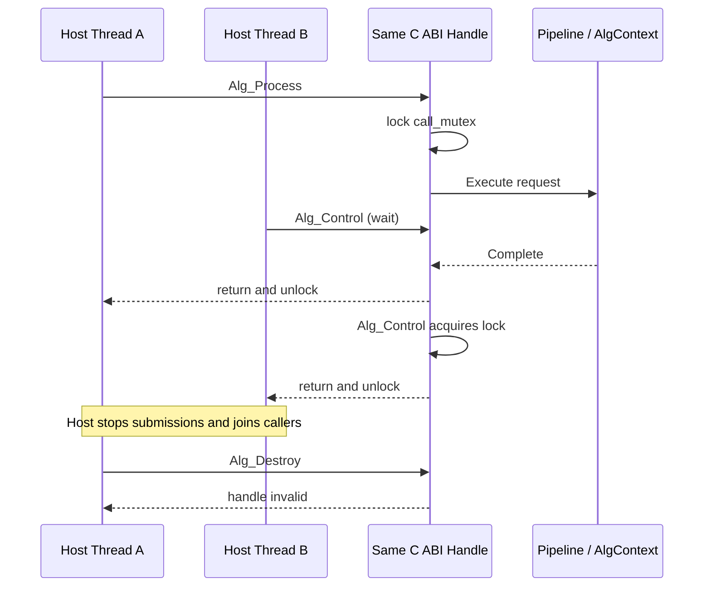

# RFC 0018: 请求黑板与算法句柄并发契约收敛

- **RFC 编号**：0018-request-context-and-handle-concurrency-contracts
- **创建日期**：2026-08-29
- **文档状态**：Completed
- **关联分支**：`feat/concurrency-contract-closure`
- **目标版本**：v5.3.0
- **负责人 / 作者**：LLM-EdgeFlow Team

---

## 1. 背景与动机 (Motivation & Context)

当前 `AlgContext` 使用 `shared_mutex` 保护容器查找，但 `Get<T>()` 在锁释放后返回容器
内部可变裸指针。并发 `Set`、`Erase` 或 `Clear` 可以使该指针失效，可变指针还允许绕过
Validator 的单生产者约束直接修改值，因此“容器操作加锁”并不等于“读取结果生命周期安全”。

当前 C ABI handle 仅持有 `SharedAlgorithmRuntime`。同一 handle 的 `Alg_Process`、
`Alg_Control` 和 `Alg_Destroy` 没有明确的互斥与停流契约，使调用方无法判断哪些并发组合
受支持。尤其是裸 `void*` 已被释放后再次进入函数，无法只靠对象内部 mutex 安全修复。

本 RFC 在不改变六个 C ABI 函数签名、不改变 Pipeline Schema、Node Definition、Model 或
Backend 接口的前提下关闭这两个并发契约。业务开发者继续通过 typed ports 和 Pipeline JSON
扩展业务，并发细节收敛在 Layer 1 和 Layer 2。

## 2. 设计范围与边界 (Scope & Non-Goals)

### 2.1 范围内 (In-Scope)

- 为 `AlgContext` 增加只读 `Read<T>()` 和单次发布 `Publish<T>()`。
- 让 `Read<T>()` 返回的对象在所属 `AlgContext` 析构前保持地址和内容稳定，即使同名 key
  后续被兼容接口替换、删除或清空。
- 保留 `Set/Get/Erase/Clear` 的迁移兼容面；`Get` 收敛为只读视图，生产 typed ports 改用
  `Read/Publish`。
- 同一 C ABI handle 上的 `Alg_Process` 与 `Alg_Control` 串行执行；不同 handle 仍可并行。
- 在公共 C11 header 中记录 `Alg_Destroy` 的调用方停流前置条件和失效规则。
- 增加黑板快照、重复发布和同 handle 并发回归测试。

### 2.2 非目标 (Non-Goals / Out-of-Scope)

- 本期不支持同一 handle 多个 in-flight `Alg_Process`，不引入并发额度或调度池。
- 不承诺 `Alg_Destroy` 与尚未进入或正在进入 C ABI 的调用并发安全；调用方必须先停流并
  等待该 handle 的所有调用返回。
- 不修改 Pipeline JSON、Catalog、Validator 规划规则或业务 Adapter 注册方式。
- 不引入通用事务、版本化黑板、Mutable Lease 或跨请求共享可变状态。
- 不修改 Layer 3/4 的业务能力和推理协议。

## 3. 总体技术方案与架构设计 (Architecture & Technical Design)

### 3.1 架构分层映射 (4-Tier Mapping)

- **Layer 1 (C ABI / Platform Adapter)**：handle 内部增加调用互斥；C11 header 明确相同
  handle 的串行与销毁停流契约，函数签名、结构体布局和错误码不变。
- **Layer 2 (Pipeline & Blackboard)**：黑板值使用不可变快照保存，新增 `Read/Publish`
  契约；被兼容操作替换或移除的快照延迟到请求上下文析构时释放。
- **Layer 3 (Stateless Capability Nodes)**：不新增 Node 作者必须掌握的并发 API；
  `BoundInput` 和 `BoundOutput` 内部适配新契约。
- **Layer 4 (Models & Inference Backends)**：无修改。

依赖方向保持 `Layer 1 -> Layer 2 -> Layer 3 -> Layer 4`，没有新增向上依赖。

### 3.2 核心接口与数据流设计 (Interface & Data Flow)

```cpp
class AlgContext {
 public:
  template <typename T>
  const T* Read(const std::string& key) const;

  template <typename T>
  bool Publish(const std::string& key, T&& value);

  // 迁移兼容：Set 允许替换；Get 是 Read 的只读别名。
  template <typename T>
  void Set(const std::string& key, T&& value);
};
```

`Publish` 仅在 key 不存在时成功。快照容器保留被兼容接口替换/删除的旧值，保证已经
获得的只读裸指针在 `AlgContext` 析构前不悬空。该兼容成本只发生在请求级重复写路径；
正常 Validator 单生产者 Pipeline 每个 key 只发布一次。

`BoundInput<T>` 通过 `Read<T>` 获取只读输入；`BoundOutput<T>::Set` 保持 Node 作者接口
不变，但内部使用 `Publish<T>`，重复发布作为编程错误进入 `NodeBase` 异常屏障。

```cpp
struct AlgHandleInstance {
  std::mutex call_mutex;
  std::unique_ptr<SharedAlgorithmRuntime> runtime;
};
```

`Alg_Process` 和 `Alg_Control` 在访问 runtime 前持有 `call_mutex`。`Alg_Destroy` 的合法调用
前置条件是调用方已经停止新调用并等待已有调用结束；满足前置条件后直接释放 handle，返回
后原 handle 值永久失效。

### 3.3 并发时序



## 4. 关键设计考量与权衡 (Design Trade-offs & Invariants)

1. **兼容性**：公共 C ABI 的符号、参数、布局与错误码不变；Pipeline 和业务配置不变。
   内部 C++ `Get<T>()` 从可变指针收敛为 const 指针，依赖原地修改的代码改为读取上游值并
   发布新的输出 key。
2. **生命周期**：只读快照由 `AlgContext` 拥有。替换和删除不会提前析构旧快照，避免锁释放
   后悬空；上下文本身析构后，所有视图仍然失效。
3. **内存**：兼容 `Set/Erase/Clear` 会保留旧快照到请求结束，重复替换增加请求期
   内存。生产 Pipeline 的单生产者约束使通常路径没有该增量。聚合节点必须发布新的输出
   key，不原地修改已发布值。
4. **异常安全**：新快照构造失败时不修改现有映射。Layer 1 保留全部六个 `noexcept`、
   `std::exception` 和未知异常屏障。
5. **吞吐**：同一 handle 的外部请求暂时串行；Pipeline 内部 wavefront 并行不受影响，多个
   handle 仍可并行。未来可在不修改 C ABI 和业务代码的情况下替换 handle 内部并发策略。
6. **销毁边界**：内部 mutex 无法保护已经被释放的裸 handle。并发 Destroy 属于调用方
   违约，文档不得暗示该场景受支持。

## 5. 测试与质量验收计划 (Testing & Verification Plan)

- [x] **黑板契约测试**：`Publish` 拒绝重复 key；`Read` 只读；兼容替换、Erase、Clear 后旧
  指针仍可读取。
- [x] **Node 作者体验测试**：现有 `BoundInput/BoundOutput` 测试不改业务调用形态并通过。
- [x] **C ABI 契约测试**：同一 handle 并发 Process/Control 返回确定结果；线程停止并 join
  后 Destroy 成功；C11 header 编译测试通过。
- [x] **回归测试**：所有现有业务 Pipeline、Adapter、Node、Model 和 Backend 测试通过。
- [x] **完整门禁**：`CCACHE_DIR=build/.ccache ./scripts/run_all_tests.sh` 完整构建并通过
  85/85 CTest。

专项验证记录：`LLM_EDGEFLOW_SANITIZERS=thread ./scripts/run_sanitizers.sh --fast` 完成
TSan 配置和构建，但当前 macOS AppleClang 16 环境中所有插桩可执行文件均在进入测试主体
前以 exit 139 退出，包括无关的 C11 和日志测试，未输出数据竞争报告。因此该次运行不计为
TSan 通过或代码 race 失败；本 RFC 的有效证据为同 key 并发替换、同 handle 并发
Process/Control 聚焦压力测试及完整默认门禁。

## 6. 实施路线与里程碑 (Implementation Milestones)

1. [x] **阶段一：建立 RFC，锁定兼容与并发边界**
2. [x] **阶段二：实现黑板快照与 typed-port 迁移**
3. [x] **阶段三：实现 handle 串行契约与公共文档**
4. [x] **阶段四：补齐并发/生命周期测试并运行统一完整质量门禁**
5. [x] **阶段五：将 RFC 标记为 Completed；远程 PR/合并仅按用户另行授权执行**

## 7. 变更记录 (Changelog)

| 日期 | 版本 | 变更内容 | 作者 |
| :--- | :--- | :--- | :--- |
| 2026-08-29 | v5.3.0 | 建立请求黑板与 C ABI handle 并发契约 | LLM-EdgeFlow Team |
| 2026-08-29 | v5.3.0 | 完成实现、迁移、契约测试与统一质量门禁 | LLM-EdgeFlow Team |
