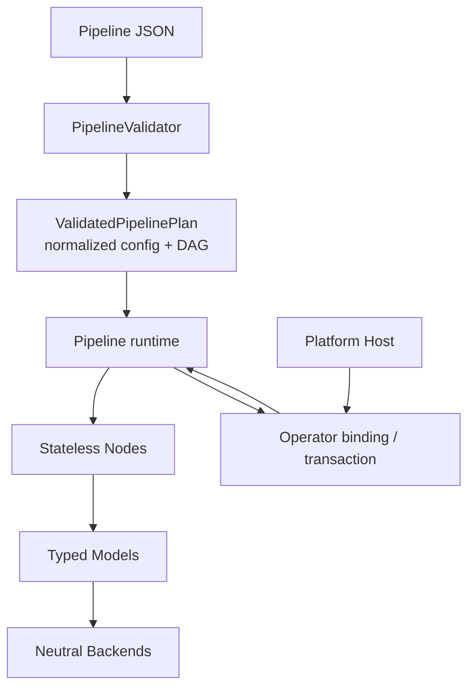

# RFC 0019: 高优先级分层代码收敛

- **RFC 编号**：0019-high-priority-layer-convergence
- **创建日期**：2026-08-30
- **文档状态**：Completed
- **关联分支**：`refactor/high-priority-layer-convergence`
- **目标版本**：v5.4.0
- **负责人 / 作者**：LLM-EdgeFlow Team

---

## 1. 背景与动机 (Motivation & Context)

当前四层架构及依赖方向已经稳定，但全面审查发现若干高优先级的内部收敛点：

- Pipeline Validator 生成了字段默认值，却没有把归一化配置作为运行时单一事实源；
- Pipeline 缓存了可由 `ValidatedPipelinePlan` 直接提供的业务名与拓扑状态；
- Operator 请求绑定、输出事务和值类型注册集中在超长实现中，重复样板掩盖了所有权边界；
- Model/Backend Registry 及 BERT 系模型的 Tensor、资源处理存在平行实现；
- 分片与逐测试模式分别维护测试声明，增加新增测试遗漏的风险。

本 RFC 在保持现有功能、公共契约和扩展点不变的前提下，收敛重复状态与内部样板，使每层
职责更直接，并通过契约测试证明兼容性。

---

## 2. 设计范围与边界 (Scope & Non-Goals)

### 2.1 范围内 (In-Scope)

- [x] Layer 2 将 `ValidatedNodePlan::normalized_config` 设为 Node 初始化配置的单一事实源。
- [x] Layer 2 删除 Pipeline 对业务名和拓扑结果的冗余缓存。
- [x] Layer 1 拆分 Operator 输入解析、输出绑定与发布事务的内部职责。
- [x] Layer 1 用小型、类型安全的辅助模板收敛内置值类型注册样板。
- [x] Layer 4 复用 Registry 查询/冲突处理以及 BERT Tensor/资源准备逻辑。
- [x] Tooling 用一个测试清单驱动分片与逐测试执行模式。

### 2.2 非目标 (Non-Goals / Out-of-Scope)

- 不修改六个导出 `Alg_*` C ABI、Operator 公共结构体或既有错误码语义。
- 不修改 Pipeline JSON Schema，不新增 Node、Model、Backend、Biz 或配置字段。
- 不把业务转换下沉到 Layer 2~4，不合并 Model 语义与 Backend 运行时职责。
- 不抽象 Layer 3 的领域计算流程；复杂 Node 的算法提取留给后续独立工作。
- 不扩大并发保证，不删除兼容别名，不改变固定 Batch 的 provenance 与去 padding 行为。

---

## 3. 总体技术方案与架构设计 (Architecture & Technical Design)

### 3.1 架构分层映射 (4-Tier Mapping)

- **Layer 1**：公共接口保持不变；内部按输入绑定、执行、输出事务组织代码。
- **Layer 2**：Validator 完成解析、默认值归一化和规划；Pipeline 仅消费计划。
- **Layer 3**：不改变生产 Node，仅用现有 Node 契约验证归一化配置传递。
- **Layer 4**：Registry 复用无语义的存储算法；BERT 家族仅共享 Tensor/资源机制。

### 3.2 核心接口与数据流设计 (Interface & Data Flow)

```cpp
ValidatedPipelinePlan plan = PipelineValidator::ValidateAndPlan(document);
// node.config 保留解析输入，normalized_config 是初始化时的最终配置。
NodeInitContext init{&plan.node_plans.at(id),
                     &plan.node_plans.at(id).normalized_config,
                     &session};
```

内部辅助模块只能依赖本层或更低层公开契约，不成为新的公共扩展接口。Registry 公共注册
方法仍执行各自 Definition 校验，通用辅助逻辑只负责查找、列举和冲突状态等机械操作。

### 3.3 数据流



---

## 4. 关键设计考量与权衡 (Design Trade-offs & Invariants)

1. **兼容性**：只收敛私有实现；Catalog Definition、ABI、配置格式和错误文本的既有断言保持稳定。
2. **单一事实源**：默认值只在 Validator 应用一次，Pipeline 不重新解析、排序或补默认值。
3. **所有权**：Operator 输出仍采用暂存后提交；任何转换失败都释放暂存块且不部分发布。
4. **抽象尺度**：只抽取多个实现共享的无语义机制，模型特有校验与后处理继续由具体 Model 持有。
5. **性能**：不引入额外深拷贝；归一化配置随计划移动，Tensor 辅助对象继续使用现有缓冲区所有权。

---

## 5. 测试与质量验收计划 (Testing & Verification Plan)

- [x] **Layer 2 契约测试**：省略可选配置时，计划与 Node Init 都观察到 Definition 默认值。
- [x] **Layer 1 回归**：Operator 输入/输出、失败回滚、分配故障注入与 C ABI 套件全部通过。
- [x] **Layer 4 回归**：Registry 冲突、BGE Embedding/Reranker、固定 Batch 与 Backend 契约通过。
- [x] **测试模式验证**：默认分片模式和逐测试模式均能配置并发现完整测试清单。
- [x] **Catalog/Smoke**：Catalog 保持 11 Nodes、3 Models、2 Backends、10 Biz，Demo Smoke 通过。
- [x] **完整门禁**：`./scripts/run_all_tests.sh` 最终通过，85/85 CTest 成功。

---

## 6. 实施路线与里程碑 (Implementation Milestones)

1. [x] **阶段一：建立隔离分支与 RFC，冻结 Catalog/测试基线**
2. [x] **阶段二：修复 Layer 2 单一事实源并删除重复运行时状态**
3. [x] **阶段三：收敛 Layer 1 Operator 与值类型注册样板**
4. [x] **阶段四：收敛 Layer 4 Registry 与 BERT 公共机制**
5. [x] **阶段五：统一测试清单并补充聚焦回归**
6. [x] **阶段六：运行完整质量门禁并将 RFC 状态更新为 Completed**

---

## 7. 变更记录 (Changelog)

| 日期 | 版本 | 变更内容 | 作者 |
| :--- | :--- | :--- | :--- |
| 2026-08-30 | v1.0.0 | 初始方案进入实施 | LLM-EdgeFlow Team |
| 2026-08-30 | v1.1.0 | 完成实现，Catalog 基线与 85 项完整门禁通过 | LLM-EdgeFlow Team |
