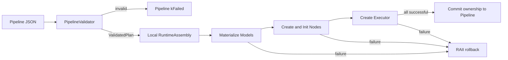

# RFC 0020: Layer 2 运行时一致性与事务化构建收敛

- **RFC 编号**：0020-layer2-runtime-convergence
- **创建日期**：2026-08-30
- **文档状态**：Completed
- **关联分支**：`refactor/layer2-runtime-convergence`
- **目标版本**：v5.5.0
- **负责人 / 作者**：LLM-EdgeFlow Team

---

## 1. 背景与动机 (Motivation & Context)

Layer 2 已经形成严格 Parser、共享 Validator、显式 DAG、类型化 Blackboard 和一次性
Pipeline 状态机，但当前实现仍有四个相互关联的一致性缺口：

- Node Definition 的 `allow_override` 可以让重复生产者通过 Validator，而运行时
  `BoundOutput` 使用 write-once `Publish`，同一配置会在执行阶段失败；
- 模型先提交到成员 `SessionContext`，随后 Node Init 失败时会保留部分模型、节点和线程池；
- `NormalizeExplicitDag` 跳过非 object 项后仍按原数组下标访问压缩后的 ID 数组；
- 并行波前在某个 `future::get` 抛异常时不能保证等待同层其余任务完成。

本 RFC 在不改变 Layer 1 调用面、Layer 3 Node 作者接口、Pipeline JSON 和四层依赖方向的
前提下，收敛这些问题，并保持实现可顺序阅读、不过度拆分类。

## 2. 设计范围与边界 (Scope & Non-Goals)

### 2.1 范围内 (In-Scope)

- [x] Validator 对所有重复 Blackboard 输出生产者 fail-closed，统一 write-once 语义。
- [x] 将现有生产 Node Definition 中未被运行时支持的 override 元数据纠正为 false。
- [x] Normalizer 对非 object Pipeline 项返回稳定诊断，不发生越界访问。
- [x] 模型、节点、执行层和线程池在局部 assembly 中完成物化，全部成功后一次性发布。
- [x] 并行波前始终回收全部已提交任务，并把异常转换为稳定执行错误。
- [x] 增加聚焦回归，证明失败构建无部分 Session 资源，且 Layer 1/3 公共调用面不变。

### 2.2 非目标 (Non-Goals / Out-of-Scope)

- 不修改六个 `Alg_*` C ABI、Operator 结构或 Adapter 数据转换。
- 不修改 `INode`、`NodeBase`、`NodeInitContext`、`BoundInput/BoundOutput` 的作者接口。
- 不修改持久 Pipeline JSON Schema，不引入隐式 DAG 兼容路径。
- 不引入通用 JSON Schema/反射框架，不拆出大量 Manager/Coordinator 类。
- 不实现 Pipeline 热重载、多阶段事务 Control 或同 handle 多请求并发。
- 不重构 Model/Backend 语义及其注册协议。

## 3. 总体技术方案与架构设计 (Architecture & Technical Design)

### 3.1 架构分层映射 (4-Tier Mapping)

- **Layer 1**：调用现有 `Pipeline` façade，不改源码和行为契约。
- **Layer 2**：Validator 收紧 write-once 规则；Pipeline 使用局部 runtime assembly；并行
  调度保证任务回收；Session 所有权改为地址稳定的内部对象。
- **Layer 3**：仅纠正三处 Node Definition override 元数据，不改 Node 算法或公共基类。
- **Layer 4**：无修改；继续通过 `ModelRuntimeFactory` 物化模型。

### 3.2 核心接口与数据流设计 (Interface & Data Flow)

对外 `Pipeline` API 保持不变。内部先创建局部、地址稳定的 Assembly：

```cpp
struct RuntimeAssembly {
  std::unique_ptr<ValidatedPipelinePlan> plan;
  std::unique_ptr<SessionContext> session;
  std::vector<std::unique_ptr<INode>> nodes;
  std::vector<std::vector<INode*>> layers;
  std::unique_ptr<ThreadPool> thread_pool;
};
```

Node Init 获得 `assembly.plan` 和 `assembly.session` 中的稳定地址。任何物化步骤失败时，
局部 Assembly 按 RAII 完整析构；成功时 Pipeline 只移动其所有权，不移动 Session/Plan
所指对象，因此 Node 保存的 Session 指针不会失效。

并行执行为每个任务增加异常屏障，所有已提交 future 都会被消费。主错误仍按拓扑层内
稳定顺序选取，避免某个异常使其余任务越过请求生命周期。

### 3.3 构建流程



## 4. 关键设计考量与权衡 (Design Trade-offs & Invariants)

1. **兼容性**：Layer 1 和 Layer 3 公共签名不变；现有官方 Pipeline 不依赖重复输出覆盖。
2. **单一写语义**：Blackboard 生产端保持 write-once。需要转换同一语义的数据时使用不同
   实际 key，不提供隐式 last-writer 行为。
3. **地址稳定性**：Session 与 Plan 使用 `unique_ptr` 持有；局部物化成功后的所有权移动不
   改变对象地址。
4. **失败原子性**：验证失败不加载模型；物化失败不发布模型、节点、线程池或执行层。
5. **异常安全**：并行任务内部捕获异常，Pipeline 在退出波前前消费全部 future。
6. **可读性**：只引入一个局部 Assembly 聚合所有权，不增加公开继承体系或通用框架。

## 5. 测试与质量验收计划 (Testing & Verification Plan)

- [x] **Validator 契约**：顺序 DAG 中即使 Definition 曾允许 override，重复 key 仍被拒绝。
- [x] **Normalizer 边界**：非 object、间隔非 object、缺失字段均稳定失败并返回正确路径。
- [x] **事务构建**：模型物化成功、后续 Node Init 失败时，公开 Session 不含已加载模型。
- [x] **并行异常**：一个 Node 抛异常时，同波前其他任务完成后 Execute 才返回。
- [x] **接口回归**：Layer 1 Operator/C ABI 与 Layer 3 Node 契约测试通过。
- [x] **完整门禁**：`./scripts/run_all_tests.sh` 通过，85/85 项测试成功。

## 6. 实施路线与里程碑 (Implementation Milestones)

1. [x] **阶段一：创建隔离分支与 RFC，冻结兼容边界**
2. [x] **阶段二：修复 Validator 与 Normalizer**
3. [x] **阶段三：实现事务化 Assembly 与并行回收**
4. [x] **阶段四：补齐聚焦回归与接口检查**
5. [x] **阶段五：运行统一门禁并将 RFC 标记为 Completed**

## 7. 变更记录 (Changelog)

| 日期 | 版本 | 变更内容 | 作者 |
| :--- | :--- | :--- | :--- |
| 2026-08-30 | v1.0.0 | 建立 Layer 2 一致性与事务化构建设计 | LLM-EdgeFlow Team |
| 2026-08-30 | v1.1.0 | 完成实现与回归，统一门禁 85/85 项通过 | LLM-EdgeFlow Team |
