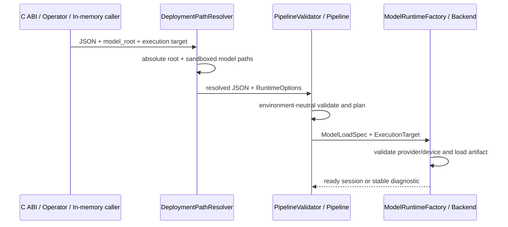

# RFC 0025: 部署路径、执行目标与可复现验收契约收敛

- **RFC 编号**：0025-deployment-runtime-contract-convergence
- **创建日期**：2026-09-01
- **文档状态**：Completed
- **关联分支**：`refactor/deployment-runtime-contract-convergence`
- **目标版本**：v8.0.0
- **负责人 / 作者**：LLM-EdgeFlow Team

---

## 1. 背景与动机 (Motivation & Context)

当前公开 C ABI 将 `model_root_dir` 定义为模型根目录，但官方 Pipeline 又把相对
`model_path` 写成 `./models/<artifact>`。Layer 2 Validator 直接拼接二者，导致
`./models/./models/<artifact>`、相对当前工作目录解析，以及文件 C ABI、内存 JSON、
Operator 三入口不一致。`device_id` 虽进入 `RuntimeOptions`，却没有进入
`ModelLoadSpec`、`BackendLoadSpec` 或生产 Backend；Operator 还向已删除的模型
`config` 方言尝试注入该值。

同时，real Profile 缺少可校验的 tokenizer sidecar 和完整 artifact 获取入口，默认 CI
不运行真实 C ABI、real Profile 或 sanitizer。Profile 的 mock/real/chip 名称不能证明
实际执行路径；ONNX 非 Tensor metadata 依赖 vendor 异常兜底；模型注册和版本元数据也
存在重复或不一致。现有综合验收报告早于当前 main 多个架构版本，不能继续作为最终证据。

本 RFC 把这些问题作为一个部署边界收敛项目处理，使公开参数只解释一次、生产 Backend
显式消费执行目标、真实资产可复现获取，并让验收证据自动绑定被测试的精确 Commit。

## 2. 设计范围与边界 (Scope & Non-Goals)

### 2.1 范围内 (In-Scope)

- [x] 冻结 `model_root_dir` 为“包含模型 artifact 与 sidecar 的部署目录”；官方 Pipeline
  的相对 `model_path` 不再重复 `models/` 前缀。
- [x] 在 Layer 1 按各入口公开契约解析文件 C ABI、内存 JSON 与 Operator 模型路径，
  并统一向 Core 提交绝对模型路径；Layer 2 只做环境无关的 lexical 校验和规划。
- [x] 以中性 `ExecutionTarget` 将可选 device/platform 从 Session 贯通到生产 Backend；
  不支持的目标必须 fail-closed，禁止静默忽略。
- [x] 将 `ModelManager` 收敛为单一 registration 状态源，保留真实生产消费者需要的
  typed model 与 revision 查询。
- [x] 对 ONNX 非 Tensor 输入/输出返回稳定显式诊断，并加入确定性 fixture。
- [x] 提供 pinned + SHA-256 校验的 real artifact 获取入口，修正真实配置与 Profile 命名，
  并为真实 C ABI、至少一个 real Profile、完整生产 Backend sanitizer 增加 CI job。
- [x] 明确产品版本、共享库 VERSION 与 SONAME/C ABI major，发布 v8.0.0 / C ABI 5；
  未变化的内部 Biz Adapter descriptor 版本保持 2.0.0。
- [x] 生成以精确 Git SHA 为字段的机器可读验收证据，并新增本 RFC 的验收报告。

### 2.2 非目标 (Non-Goals / Out-of-Scope)

- 不接入新的 Node、Model capability、NPU vendor Backend 或远程推理协议。
- 不把真实模型二进制、第三方源码或 tokenizer sidecar 提交到 Git。
- 不声称 CPU real Profile 等价于 AX650、Ascend、CUDA 等硬件验收。
- 不在本 RFC 中建立质量或性能基线；真实执行只证明可加载、可运行和契约一致。

## 3. 总体技术方案与架构设计 (Architecture & Technical Design)

### 3.1 架构分层映射 (4-Tier Mapping)

- **Layer 1**：新增共享部署模型路径解析器；C ABI artifact root 与 Operator bundle root
  保留各自公开语义，但在进入 Core 前都提交绝对规范模型路径。公开 C 结构布局不变，
  六个导出函数和异常屏障保持不变。
- **Layer 2**：移除 Validator 的 `model_root_dir` 环境参数；`ValidatedModelPlan` 只保存
  输入路径的 lexical normalized 结果。Pipeline 从 `SessionContext::RuntimeOptions` 向
  Layer 4 传递中性执行目标，但不解释具体 vendor 设备。
- **Layer 3**：无行为变更。
- **Layer 4**：`ModelLoadSpec` / `BackendLoadSpec` 携带 `ExecutionTarget`。ONNX Runtime
  CPU Backend 和 llama.cpp 明确验证/消费目标；非 Tensor metadata 在调用 tensor API
  之前显式拒绝。
- **Tooling / Delivery**：真实模型 manifest、Profile、CI、版本与验收证据同步收敛。

### 3.2 核心接口与数据流设计

```cpp
struct ExecutionTarget {
  std::optional<int> device_id;
  std::string platform;
};

struct ModelLoadSpec {
  std::string model_type;
  std::string backend_type;
  std::string model_path;
  nlohmann::json model_config;
  nlohmann::json backend_config;
  ExecutionTarget execution_target;
};

bool ResolveDeploymentModelPaths(
    const nlohmann::json& pipeline,
    const std::string& model_root_dir,
    nlohmann::json* resolved,
    std::string* diagnostic) noexcept;
```

路径不变量：

1. 相对 root 在 Layer 1 立即转换为绝对规范目录；
2. root 非空时，相对 `model_path` 只能解析到 root 内；
3. root 为空时只允许已经绝对的部署路径，或由不访问 artifact 的测试扩展显式使用
   Core 私有构建入口；公开部署入口不得依赖当前工作目录；
4. Operator `.conf` 的 `model_paths` 仍相对于 Operator `model_path`，最终也产生同一种绝对
   Pipeline `model_path`；
5. Layer 2 不检查文件存在性，文件类型与 vendor load 由生产 Backend fail-closed。

执行目标不变量：

1. `has_device_id == false` 映射为 `std::nullopt`；否则完整保留包括设备 0 在内的 ID；
2. Backend 必须显式接受、使用或以稳定诊断拒绝目标；不得丢弃字段；
3. CPU-only ONNX 路径只接受 CPU/未指定平台和设备 0；llama.cpp 将设备 ID 映射到
   `main_gpu`，但 CPU-only 配置只接受设备 0；
4. emulator Profile 一律声明 `chip=cpu`，不能使用真实芯片名称制造硬件覆盖印象。

### 3.3 时序图



## 4. 关键设计考量与权衡 (Design Trade-offs & Invariants)

1. **兼容性**：本仓库仍处于未正式发布状态。路径语义、Profile 名称和 C ABI major 在
   v8 一次性收敛，不保留双轨 fallback。
2. **单一事实源**：Core Validator 继续拥有 Pipeline schema/Definition/DAG 规则；Layer 1
   只解析部署环境，不复制 Catalog 规则。
3. **安全**：root 下相对路径拒绝 `..`、symlink escape 和 root 外绝对路径；Backend 对不
   支持的执行目标和 I/O 类型 fail-closed。
4. **所有权**：`ModelManager` 只保存一份 `ModelRegistration`；Node 的 typed model 引用
   和 Session cache 生命周期不变。
5. **发布版本**：产品 `VERSION=8.0.0`；本次公开行为破坏性收敛把 C ABI/SONAME 升为 5。
   内部 Biz Adapter descriptor 没有契约变化，继续使用其独立的 2.0.0 版本。Changelog
   版本仍表示里程碑，Git tag 由后续显式发布流程创建。
6. **CI 成本**：默认回归继续使用确定性 fixture；新增独立 sanitizer 和真实 GGUF job。
   大型 ONNX real suite 通过 pinned 下载脚本和专项命令验证，不在每个普通编译 job 重复
   下载全部权重。

## 5. 测试与质量验收计划 (Testing & Verification Plan)

- [x] **路径契约**：覆盖相对/绝对 root 的入口绝对化、双 `models/` 回归、root escape，
  并证明文件 C ABI、内存 JSON 与 Operator 都在进入 Core 前产生绝对模型路径。
- [x] **执行目标**：测试 device 0/非零/未指定，证明目标进入 mock capture Backend；生产
  ONNX/llama.cpp 对支持和不支持组合返回稳定结果。
- [x] **状态与 ONNX**：证明单 registration 状态源保持 revision/cache 行为；输入和输出
  metadata 均在 tensor API 前显式检查，并用 sequence-output fixture 固定诊断。
- [x] **真实执行**：真实 C ABI 不允许缺失 artifact 被 skip；real GGUF Profile 产生结构化
  输出；可用时运行全部 CPU real Profile。
- [x] **配置验证**：所有受影响 JSON 均执行 Catalog、Validate 与 Plan；smoke suite 通过。
- [x] **专项验证**：`./scripts/run_sanitizers.sh --full` 和真实模型专项命令分别记录。
- [x] **统一门禁**：最终候选只运行一次 `./scripts/run_all_tests.sh`。
- [x] **证据**：机器可读报告记录完整 SHA、工作树状态和门禁结果；artifact 的实际
  SHA-256 只由下载校验脚本计算，避免在证据生成器中复制预期哈希。远端 CI 使用
  `github.sha` 生成并上传同格式 artifact。

## 6. 实施路线与里程碑 (Implementation Milestones)

1. [x] **阶段一：RFC 与 Catalog 基线**。
2. [x] **阶段二：路径与执行目标契约实现**。
3. [x] **阶段三：状态、诊断、配置、Profile 与版本收敛**。
4. [x] **阶段四：CI、真实资产与 SHA 证据闭环**。
5. [x] **阶段五：专项验证、统一完整门禁和 RFC Completed**。

## 7. 变更记录 (Changelog)

| 日期 | 版本 | 变更内容 | 作者 |
| :--- | :--- | :--- | :--- |
| 2026-09-01 | v1.0.0 | 创建 RFC，冻结部署路径、执行目标、版本与验收设计 | LLM-EdgeFlow Team |
| 2026-09-01 | v1.1.0 | 完成实现、真实执行、sanitizer、统一门禁与 exact-SHA 证据 | LLM-EdgeFlow Team |
