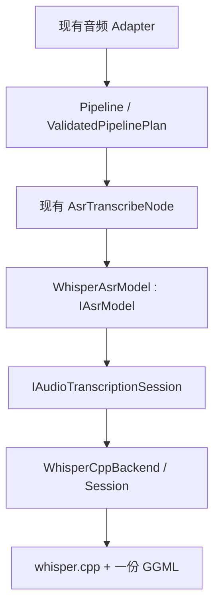

# RFC 0036: Whisper ASR 与 whisper.cpp Backend 接入设计及实施指南

- **RFC 编号**：0036-whisper-asr-backend
- **创建日期**：2026-09-05
- **文档状态**：In Implementation
- **关联分支**：`docs/whisper-asr-integration-review`（实施与验收）
- **目标版本**：v10.x（实现完成后确定）
- **负责人 / 作者**：LLM-EdgeFlow contributors
- **审查基线**：`713f64398fdbd8a3efb95c98c7ecc3fc8d5196ba`

本文是待实施设计。新增协议、类型、配置和命令中的新增选项尚未进入运行时；不能把本文
当成当前 Catalog。实施期间以注册 Definition 和 `alg_pipeline_tool` 为可执行事实源，
发生设计变化时同步修订本文。文档交付及技术探针通过不代表 ASR 集成已完成。

## 1. 审查结论与适用条件

**推荐采用 `AsrTranscribeNode → WhisperAsrModel → 中性音频转写协议 → WhisperCppBackend`。**
这是当前框架新增同步、离线、短音频 ASR 的优先方案：复用现有业务契约和 Node，补齐
Layer 4 真实能力，遵循既有托管文本生成协议的设计先例。

这里的“优先”针对架构适配与首版开发成本，不代表 Whisper 在目标业务的中文准确率、
延迟或内存方面优于所有其他模型。尚无用户指定的目标硬件、业务语料及性能预算，本文
据此采用 **CPU、16 kHz 单声道、整段输入、完整文本输出** 作为首版实施基线。

以下需求会改变推荐范围，不能直接扩大首版承诺：

- 边说边出字、严格低延迟：需要独立的流式协议、会话和输出契约设计。
- 任意长度录音或长转写：需要解决现有 C ABI/Operator 内部固定输出容量。
- 同进程 `whisper.cpp + kiteLLM`：当前 GGML 依赖没有共存证明，首版构建明确拒绝。
- 公司内部 NPU/SDK：继续遵守 [RFC-0029](0029-external-readiness-and-intranet-sdk-migration.md)，
  外网阶段不读取或模拟其契约。

### 1.1 对前一版建议的修订

| 审查发现 | 最终决定 |
| :--- | :--- |
| “直接换 Backend”遗漏真实 ASR Model 和执行协议 | 三者一起实现；现有 Node 继续复用 |
| “重采样或拒绝”给开发者留下两个不同工程范围 | 首版明确拒绝非 16 kHz；调用方负责转换，不引入 DSP 依赖 |
| 只提示 GGML 冲突不足以实施 | 复用现有 llama.cpp 所提供的一份 GGML；固定版本组合，建立构建矩阵 |
| Operator 动态字符串并未消除固定容量 | 内部仍经过 `CompanyAudioOutputStruct`，转写最多 511 个 UTF-8 字节 |
| ASR Demo 没有读取真实音频 | 增加真实 PCM 数据集路径和强制执行的真实模型验收 |
| 仅设置 `temperature=0` 不能定义完整解码策略 | 显式关闭温度回退，固定 greedy/best_of 等首版语义 |
| `auto` 语言可能被错误映射 | `language="auto"`、`detect_language=false`；后者为 true 会只检测语言后返回 |

### 1.2 备选方案比较

| 方案 | 当前收益与代价 | 决定 |
| :--- | :--- | :--- |
| 新增完整音频转写协议 + Model + whisper.cpp Backend | 与托管运行时边界吻合；复用 Node/Validator/Factory | **采用** |
| 将 whisper.cpp 包装成 `ITensorGraphSession` | 必须人为定义张量输入输出、解码或 token 契约，偏离其完整转写入口 | 首版不采用 |
| Model/Node 直接调用 `whisper.h` | 少写一层代码，但泄漏 vendor 依赖，绕过 Backend 生命周期与协议校验 | 不采用 |
| ONNX Runtime + Whisper encoder/decoder 图 | 可以成为后续方案，但还需导出图、KV-cache、tokenizer、特征与解码实现 | 本需求下成本更高 |
| CLI 子进程 / HTTP 转写服务 Backend | 能隔离依赖，但增加进程、部署、超时和错误传播成本 | 有明确隔离或服务化需求时另行设计 |
| 换用其他 ASR 模型体系 | 可能更适合中文、流式或专有硬件；须基于同一语料比较 | 保留为后续 Model/Backend 扩展 |

Whisper 模型与 whisper.cpp 运行时需要一起匹配。其他 ASR 权重以及任意 `.bin`/GGUF 文件
不能因为扩展名相同就直接复用；接入也不意味着所有 ASR Model 都可自动切换到该 Backend。

## 2. 当前代码与可执行 Catalog 证据

审查运行了 `./build/alg_pipeline_tool catalog`、`./build-kite/alg_pipeline_tool catalog`
及 `describe-node TextRuleMatchNode`，并与源码注册核对：

| 项目 | 当前行为及实施含义 |
| :--- | :--- |
| [ASR Node](../../src/common_nodes/asr_transcribe_node.cpp) | 已绑定 `IAsrModel`，要求音频与文本 1:1，保留 provenance |
| [Model 接口](../../include/engine/model_interface.h) | 已有 `Transcribe(const AudioPcmBatch&, TextBatch*) noexcept` |
| [音频载荷](../../include/contracts/inference_payloads.h) | `vector<float>` + `sample_rate`；无声道字段，无法自动识别交错立体声 |
| 默认生产 Catalog | Backend 为 `onnxruntime`、`llama_cpp`；没有 capability 为 `asr` 的 Model |
| Kite 构建 Catalog | Backend 为 `onnxruntime`、`kite_llm`；同样没有 ASR Model |
| [测试 ASR](../../dev_support/inference/test_business_models.cpp) | `test_business_asr` 根据采样值总和返回固定句子，不执行语音识别 |
| [Adapter](../../src/adapter/adapters/audio_asr_intent_adapter.cpp) | 最多 64 个输入；接受 8–192 kHz；每条最多 960000 个采样点。这个上限只有在 16 kHz 下等于 60 秒 |
| [C 输出](../../include/company_alg_interface.h) / [Operator bridge](../../src/adapter/operator/biz_bridges/audio_asr_intent_bridge.cpp) | `transcribed_text[512]`，最多 511 字节加 NUL；Operator 也经过此 DTO。超长复制返回 `COMPANY_ALG_ERR_BUFFER_TOO_SMALL`，不是成功截断 |
| [ASR Demo](../../demo/biz/audio_asr_demo.cpp) | 只检查 dataset 文件是否存在，然后生成固定浮点数组；原有文本语料不能证明转写 |
| [模型工厂](../../src/engine/runtime/model_runtime_factory.cpp) / [Validator](../../src/core/pipeline_validator.cpp) | 已按 Definition 校验协议和并发；无须加入 Whisper 名称分支 |

因此，“上层保持稳定”是可行的，但“所有现有采样率、长文本和 Demo 直接工作”不成立。

## 3. 首版范围与明确契约

### 3.1 范围内

- [x] 新增 `audio_transcription` 协议及 `whisper_asr` Model。
- [x] 新增可选 `whisper_cpp` Backend，CPU 运行，模型权重在 Session 生命周期内加载一次。
- [x] 支持 `zh`、`en`、`auto` 三种语言配置；只做原语言转写。
- [x] 接收完整单声道、归一化 float32 PCM，每条最多 60 秒；业务面向短语音命令。
- [x] 输出完整 UTF-8 文本；批次保持 1:1、顺序、`(req_id, sub_id)`，失败全量回滚。
- [x] 生产 Pipeline、部署配置、真实音频 Demo、契约和真实模型测试。
- [x] CPU 与默认 llama.cpp 共存；关闭新 Backend 后原有构建和配置继续通过。

### 3.2 本期不实现

流式/异步/取消、增量文字、时间戳输出、说话人分离、翻译、跨请求上下文、内置 VAD、
自动重采样、多声道混音、音频文件解码、GPU/NPU、连续批处理和新的公共 C ABI。
也不增加业务专属 ASR Node、第二套配置系统或通用 Backend 插件装载框架。

不公开 `whisper_full_params` 的全部字段。本期由 Model 定义固定转写策略，语言和资源上限
以少量强类型字段配置。需要新策略时先补充中性语义及测试，再开放字段。

### 3.3 输入和输出边界

1. `AudioPcmPayload` 的首版 Whisper 路径要求单声道、`sample_rate == 16000`，所有采样有限
   且处于 `[-1,1]`。非 16 kHz、NaN/Inf、超范围振幅明确失败；不自动裁幅或更改采样率。
   ABI 不含声道信息，单声道由调用方保证，并写入公共音频字段注释；这不改变 ABI 布局。
2. 空 batch 成功返回空 batch；合法采样率下的空单条音频成功返回一条空文本，并保留 ID。
   非空但不足 1600 个采样点（100 ms）明确失败，避免底层“太短但成功返回空文本”掩盖问题。
3. `WhisperAsrModel` 检查配置时长上限；Backend 防御性检查 100 ms–60 s，以及转换到 vendor
   `int n_samples` 的边界。Model 的校验发生在整批推理之前，非法后项不会先触发前项推理。
4. 零个识别 segment 是合法空文本；不能为了满足非空断言返回预设句子。非空静音/噪声
   可能被模型误转写，必须进入效果评估；首版不承诺“静音必为空”。
5. Backend 按 segment 顺序复制并连接文本，不擅自插入空格。Model 验证完整 UTF-8、拒绝
   内嵌 NUL，仅去除首尾 ASCII 空白；保留正文、标点和简繁体，不为意图规则修改识别结果。
6. `max_output_bytes` 限制 Backend 累计复制的原始文本字节数，超限失败并清空输出；不能
   靠截断 token/字符让推理看起来成功。它与 Layer 1 的 511 字节容量是两个独立边界。
7. Model 不硬编码 C ABI 的 511 字节限制。API 返回 BufferTooSmall 时，调用方不得使用
   部分结果；Operator 增大字符串池仍不能突破内部 DTO 限制。需要长文本时另立契约 RFC。

## 4. 分层设计和接口



### 4.1 中性执行协议

在 `ExecutionProtocol` 末尾追加 `kAudioTranscription`，保持已有枚举值；同步更新
`IsValidExecutionProtocol()`、`ExecutionProtocolName()`，名称为 `audio_transcription`。
不把协议名称写入持久 Pipeline JSON；Model/Backend Definition 决定兼容性。

下列为待实现接口，放入 `include/engine/backend_interface.h`，不含 vendor 类型：
使用 C++17 的 `std::string_view`，并补齐对应标准头。

```cpp
struct AudioTranscriptionOptions {
  std::string language = "zh";
  size_t max_output_bytes = 65536;
};

class IAudioTranscriptionSession : public IBackendSession {
 public:
  virtual bool SupportsLanguage(std::string_view language) const noexcept = 0;

  virtual int Transcribe(const AudioPcmPayload& audio,
                         const AudioTranscriptionOptions& options,
                         std::string* output,
                         std::string* diagnostic = nullptr) noexcept = 0;
};
```

接口契约是同步、单条完整音频、独立转写；输入只借用到调用结束，输出拥有自己的内存，
语言表示原语言转写或自动选择。首版固定 greedy、无温度回退、无上下文续写，参数的
vendor 映射属于 Backend。后续实现该协议的运行时应显式满足这些约定，不能静默忽略。

`SupportsLanguage()` 查询已加载模型的只读属性，让 `Model::Create` 在 Session 发布前
拒绝语言不匹配，不引入 Backend 名称判断或另一份 Catalog。英文专用权重支持 `en`，
`auto` 解析为 `en`，拒绝 `zh`；多语言权重支持本期三项。配置拼写先由 Definition 拒绝。
此方法不触发推理、不做语言检测、不分配请求状态。

### 4.2 Model：`WhisperAsrModel`

建议目录 `src/engine/models/whisper_asr/`，类继承 `IAsrModel`，使用
`REGISTER_MODEL_WITH_DEFINITION` 注册：

- `model_type = "whisper_asr"`，`capability = "asr"`。
- `required_protocol = kAudioTranscription`，语义并发 `kConcurrent`。
- 创建时检查 typed session、协议、语言支持、配置范围和 `BatchPolicy{1,0}`。
- 只持有不可变配置和共享 Session；验证音频与文本，管理批次语义，不 include `whisper.h`。
- 使用现有 `FixedBatchExecutor::Execute<AudioPcmPayload, std::string>`，策略 `{1,0}`。
  该 helper 已支持非固定 batch，复用其 ID 保留、数量校验及失败回滚，不新写批处理调度器。
- `GetMaxBatchSize()` 为 1，表示单次执行规模，不是业务入口只能传一条；Node 可以收到
  多条输入，由 executor 顺序处理，任一条失败则整个输出 batch 清空。
- `Transcribe()` 防御性检查空输出指针，捕获标准和未知异常；diagnostic 通过现有日志路径
  记录，Node 延续现有错误传播方式，不在本次重设计全局错误码系统。

### 4.3 Backend：`WhisperCppBackend`

建议目录 `src/engine/backends/whisper_cpp/`，继承 `IInferenceBackend`；内部 Session
实现中性接口。用 `REGISTER_BACKEND_WITH_DEFINITION` 注册 `whisper_cpp`，声明
`supported_protocols = {kAudioTranscription}`、`kSerialized`、`BatchPolicy{1,0}`。

生命周期及执行顺序：

1. `Load` 在 vendor 分配前校验 requested protocol、配置、执行目标、非空实际文件路径。
   通过 vendor 加载结果验证真实格式，不按后缀猜测。失败返回空 Session 及 diagnostic。
2. 使用 `whisper_init_from_file_with_params_no_state()` 加载权重，RAII 持有 context；
   明确 `use_gpu=false`、`flash_attn=false`，不继承上游默认 GPU 选择。
3. 每个 Session 的 mutex 覆盖 state 创建、完整推理、结果复制和 state 销毁。每条非空
   音频新建 `whisper_state`，调用 `whisper_full_with_state()`，结束后释放；权重保持加载。
   这是先保证请求隔离的选择，state 分配开销纳入实测。未经证明不改为共享可变 state。
4. 从 `_from_state` 系列函数取结果，不能混用读取 context 默认 state 的函数。
5. 所有厂商指针只在锁和 RAII 生命周期内使用；复制完成后才能销毁 state。Session 销毁
   释放 context，不能调用可能影响其他 Backend 的 GGML 全局清理。
6. `noexcept` 边界捕获 `std::exception` 和 `...`；推理失败、分配失败、坏输出、超限均
   清空输出。不要在每次加载/请求时用带有 Session 指针的全局日志 callback 覆盖其他实例；
   若接入框架日志，使用进程级一次性适配，不捕获 Session 指针或短生命周期数据。

Planner 使用 Model 与 Backend 中更严格的并发声明；Session mutex 仍然必要，因为直接
typed 调用及其他路径不能依赖 Planner 代为加锁。首版不使用 `whisper_full_parallel()`，
它切分的是单条录音，不等于框架的多请求 batch，也不能替代请求隔离。

### 4.4 首版解码映射

从锁定版本的 `whisper_full_default_params(WHISPER_SAMPLING_GREEDY)` 开始，明确覆盖：

| 设置 | 首版值 / 原因 |
| :--- | :--- |
| `n_threads` | Backend 配置；避免使用不受控的硬件线程数默认值 |
| `language` | Model 传入；英文专用模型的 `auto` 映射为 `en` |
| `detect_language` | `false`；`language="auto"` 自身已经触发检测并继续转写 |
| `translate` | `false`，不把中文翻译成英文 |
| `no_context` | `true`，同时使用每条独立 state |
| `temperature` / `temperature_inc` / `greedy.best_of` | `0.0 / 0.0 / 1`，完整定义无温度回退的 greedy 基线 |
| `no_timestamps` / `token_timestamps` | `true / false`，仅文字输出 |
| `single_segment` | `false`，允许内部多 segment，全部按序收集 |
| `offset_ms` / `duration_ms` | `0 / 0`，处理输入全段，不静默截短 |
| initial prompt / prompt tokens / callbacks | 空；不跨请求借用文本或指针 |
| `print_*` / `debug_mode` / `tdrz_enable` / `vad` | 全部关闭，真实日志接入按生命周期约定处理 |

其他内部阈值保持固定提交的默认值并在真实模型报告中记录。固定 greedy 不保证跨设备、
编译器或版本逐字一致，也不证明最佳准确率；调整解码策略应使用同一评估集比较。

### 4.5 Definition 与配置

以下表格是待实现 Definition 的设计规格，不是独立维护的运行时 schema：

| 所属 | 字段 | 类型 | 默认 | 范围 / 含义 |
| :--- | :--- | :--- | :--- | :--- |
| Model | `language` | string | `zh` | enum `zh`, `en`, `auto` |
| Model | `max_audio_seconds` | integer | `30` | `[1,60]`，单条音频长度上限 |
| Model | `max_output_bytes` | integer | `65536` | `[1,65536]`，累计原始转写字节上限，不是 C ABI 容量 |
| Backend | `n_threads` | integer | `4` | `[1,64]`，单次调用 CPU 线程数 |

定义由 Validator 注入默认值并拒绝未知字段；Model/Backend 的直接创建路径做必要的边界
复核。不要新增 `config_file`、任意 vendor JSON、Node 上的语言/线程参数或重复的 device 字段。

执行目标继续走 `BackendLoadSpec::execution_target`：大小写归一后接受空、`UNKNOWN`、
`CPU`、`CPU_GENERIC`；设备 ID 缺省或 0。其他平台、负数或非零设备 ID 明确拒绝。
首版既不注册 GPU 能力，也不把显式 GPU/NPU 请求静默退回 CPU。

## 5. 构建依赖与 GGML 共存

### 5.1 固定候选及审查依据

| 项目 | 固定值 |
| :--- | :--- |
| 当前 llama.cpp | `70adb1b4cea5ee39f867792c78dc59320921eda7` |
| whisper.cpp 候选 | release `b4938` 对应提交 `371b5a7561823ab2bb32142d2751e35e7534727b` |
| 源码归档 | `https://github.com/ggml-org/whisper.cpp/archive/371b5a7561823ab2bb32142d2751e35e7534727b.tar.gz` |
| 归档 SHA-256 | `89051d8fca516a3ad1f5c2f8f9d2fccb089afbaec338fca3f8731999babc6f81` |

候选源代码自报 `1.9.3-dev`，不能把 release 标签当成稳定语义版本保证。这里选用固定提交
是因为本次已对它执行编译/链接探针；最终支持范围取决于第 8 节验证。升级时必须重验组合。

### 5.2 采用单一 GGML 提供者

当前项目的 [llama.cpp CMake 集成](../../cmake/ThirdPartyEngines.cmake) 已提供
`ggml`、`ggml-base`、`ggml-cpu` target，包括缓存导入和源码构建两条路径。whisper.cpp 的
父工程接入支持复用已有 `ggml` target。因此首版规定：

1. 新增 `cmake/WhisperCpp.cmake`，由第三方配置在 llama.cpp 完成后调用。
2. `ENABLE_WHISPERCPP` 默认 `OFF`。开启时要求 `ENABLE_LLAMACPP=ON` 且
   `ENABLE_KITELLM=OFF`；不满足则 CMake fail-fast，不偷偷打开、关闭其他 Backend。
3. 沿用当前 llama.cpp/GGML 提供者，不再次添加 whisper.cpp 自带 GGML，不拼接两套静态库，
   不通过重复符号忽略、链接顺序或只给 CMake target 改名来掩盖冲突。
   当前缓存导入分支的完整静态 link group 挂在 `llama` target，而单个 `ggml` target 尚未
   声明全部子库传递依赖。实施时补齐 `ggml → ggml-cpu/ggml-base` 的传递链接闭包及系统库，
   必要时沿用现有 Linux link group；不能依赖链接另一个 Backend 恰好解决未定义符号。
4. 只构建、链接 `whisper` library；关闭 examples/tests/server/curl/SDL/FFmpeg 及额外硬件
   支持。父工程以 `EXCLUDE_FROM_ALL` 加入上游，避免默认构建新增的无关 `parakeet` target。
   静态库必须 PIC，与 `alg_sdk` 及 internal runtime 的链接方式一致。
   关闭的是 Whisper 自身额外依赖；共享 GGML 的编译选项仍归既有提供者所有，不通过
   Whisper 配置强行覆盖 llama.cpp 的硬件选项。Whisper 首版以运行时 `use_gpu=false` 选 CPU。
5. 头文件、compile definitions、链接依赖放在 Layer 4 target，vendor include 只出现在
   concrete Backend。补齐 `src/engine/CMakeLists.txt`，不能把源文件只加入测试 runner。
6. `HAVE_WHISPERCPP` 仅在依赖成功时定义并条件注册 Backend；关闭时不得提供假实现。
   Model 可像现有 `vision_document` 一样独立注册；没有匹配 Backend 时 Validator 明确拒绝。

要求开启 llama.cpp 是首版复用现有 GGML 提供者、缩小构建改动的明确取舍，不是 whisper.cpp
的算法依赖。不需要 LLM 的部署也可以只在 Pipeline 中加载 ASR，未绑定的 LLM 权重不会加载；
二进制仍含对应库。未来确需更小的独立 ASR 构建，再抽取中立 GGML CMake 提供者并重新验证。

缓存采用现有 `edgeflow_prepare_third_party_cache()`：whisper 提交/归档哈希、GGML 提供者的
版本及缓存 fingerprint、编译器/架构、PIC、静态链接、硬件与 OpenMP 选项共同参与匹配。
GGML fingerprint 可作为 `ABI_OPTIONS` 的一项传入，避免重写通用缓存系统。所有下载内容
保持在忽略的缓存/构建目录，不提交第三方源码、库、权重。

| 配置组合 | 首版结果 |
| :--- | :--- |
| Whisper OFF + 默认 ONNX/llama ON | 原有默认构建和完整门禁 |
| Whisper ON + llama ON + Kite OFF | 受支持；Whisper CPU 与 llama 共用一份 GGML |
| Whisper ON + llama OFF | 配置阶段拒绝，提示本期要求现有 GGML 提供者 |
| Whisper ON + Kite ON | 配置阶段拒绝，不能承诺同进程 Whisper → Kite Pipeline |
| Whisper OFF + 原有 Kite ON/llama OFF | 保持原有行为，不修改私有依赖 |

如目标要求 Whisper 与 Kite 同进程或独立 Whisper 构建，此表必须经新证据修订；不能绕过
守卫。单纯拆成两个动态库也不自动保证 GGML 符号隔离。

## 6. Pipeline、部署配置与真实音频入口

### 6.1 待实现的生产 Pipeline

新增 `configs/pipeline_audio_asr_whisper.json`，复用已注册业务名称及两种通用 Node。
下面是完整的最小目标文档，实施后必须通过 Catalog、validate、plan；当前不能直接运行：

```json
{
  "biz_name": "speech_audio_asr_intent_slot",
  "models": [
    {
      "model_id": "asr_model_v1",
      "capability": "asr",
      "model_type": "whisper_asr",
      "backend": "whisper_cpp",
      "model_path": "models/ggml-base.bin",
      "model_config": {
        "language": "zh",
        "max_audio_seconds": 30,
        "max_output_bytes": 65536
      },
      "backend_config": {"n_threads": 4}
    }
  ],
  "pipeline": [
    {
      "id": "transcribe",
      "node_type": "AsrTranscribeNode",
      "depends_on": [],
      "ports": {
        "inputs": {"audio": "audio_inputs"},
        "outputs": {"text": "transcripts"}
      },
      "config": {"bind_model": "asr_model_v1"}
    },
    {
      "id": "intent",
      "node_type": "TextRuleMatchNode",
      "depends_on": ["transcribe"],
      "ports": {
        "inputs": {"text": "transcripts"},
        "outputs": {"matches": "intent_slots"}
      },
      "config": {
        "default_category": "UNCLASSIFIED",
        "categories": {"NAVIGATION": ["导航"], "MUSIC_PLAY": ["播放"]}
      }
    }
  ]
}
```

保留 `intent` 是因为现有 Biz egress 同时声明 `transcripts` 和 `intent_slots`；其示例规则
只说明链路，不作为生产意图能力。真实评估须覆盖未匹配、空转写、标点、数字和简繁体差异。
未来纯 ASR Biz 若不需要意图结果，应另行注册契约，不能让 Validator 放过缺失输出。

新增同名 `.conf`，沿用现有 `data.pipe_path`、`data.model_paths.asr_model_v1`、`data.mem_que`。
模型路径走部署 resolver，替换 mock 配置中的旧权重映射；不要只改 Pipeline 而遗漏部署覆盖。
输出池容量维持 `transcribed_text: 511`、`intent_slot_json: 1023`。`ggml-base.bin` 是待准备的
多语言基线权重，中文评估也可显式比较 small/量化版本，不在未实测前宣称哪一个满足 SLA。

### 6.2 最小真实音频 Demo

为避免引入 WAV/FFmpeg 解码依赖，首版扩展现有 `audio_asr_demo.cpp` 和 Demo 辅助读取代码，
支持 UTF-8 JSONL 清单与原始 little-endian float32 PCM。格式为：

```json
{"request_id":70001,"pcm_f32le":"audio/nav_001.f32","sample_rate":16000,"reference_text":"导航到科技园","expected_category":"NAVIGATION"}
```

- 音频路径相对清单目录；`reference_text`、`expected_category` 只用于评估，不能进入 Model。
- 读取器明确解码 little-endian float32，检查文件字节数为 4 的倍数、大小上限、单声道约定
  及必需字段；先检查大小再分配。拒绝缺文件、损坏格式和空清单，不回退到固定数组。
- `request_id`、采样率和真实音频送入现有 Operator Runner；输出通过 `ResultWriter` 记录，
  保留每条转写、意图、耗时和总体失败状态，不能把错误转换成成功的空文本。
- 新增 `audio_asr_whisper` real Profile，CPU、device 0；沿用 Demo 选项默认
  `allow_fallback_sample=false`，不在 Profile JSON 中发明未注册字段。先实现
  batch_size=1 的实际 Demo，Model/Node 测试另外覆盖多条批次。
- 原来的固定数组只用于明确命名的 mock Profile；真实 Profile 缺数据必须失败。
- 输入文件转换在调用方或测试资产准备阶段完成，不放入 Node/Backend；中文样本、参考文本
  和权重应固定来源及哈希。不可将样本文件名或参考答案用作推理输出。

## 7. 实施顺序与文件落点

| 阶段 | 工作及主要文件 | 完成条件 |
| :--- | :--- | :--- |
| A：依赖组合 | `cmake/WhisperCpp.cmake`、`ThirdPartyEngines.cmake`、Layer 4 target；复核第 5 节版本 | Whisper/llama 双运行时探针、缓存/源码两条构建路径和禁止组合通过 |
| B：协议与 Model | `inference_definition.h`、`backend_interface.h`、`models/whisper_asr/` | 中性 fake session 证明校验、语言支持、batch/rollback；无 vendor 泄漏 |
| C：真实 Backend | `backends/whisper_cpp/`、注册与 CMake | 真实权重加载、语言/参数映射、RAII、并发、错误输出通过 |
| D：业务闭环 | 新 Pipeline/.conf、`demo/profiles.json`、ASR Demo/数据读取 | validate/plan 成功，真实音频经过公开 Operator 链路；超长输出明确失败 |
| E：验收交付 | 聚焦测试、默认门禁、新 Backend 专项/CI、架构文档及 CHANGELOG | 第 8 节必需验证实际执行，记录证据，更新 RFC 状态 |

可以先开发 B 的 fake-session 测试，但不能在 A 不成立时把依赖已接入作为既成事实。
上述新文件名为实施落点建议；应扩展已有明确负责该行为的 runner，不因新增源文件而强制
增加独立测试可执行文件。必要时更新 `cmake/Tests.cmake`、`IndividualTests.cmake` 和
`TestInventory.cmake`，保证两种测试构建模式覆盖一致。

Catalog/Factory/Validator 原有通用逻辑原则上复用；检查测试中 Backend 名称白名单，增加
真实注册项的预期，但不在产品代码、Web 或 skill 中添加手工能力组合表。
扩展 `scripts/check_layer_isolation.sh` 的 vendor 头守卫及其负例，让 `whisper.h` 只能出现在
具体 Backend。新生产配置的正向 validate/plan 测试条件依赖 `HAVE_WHISPERCPP`；关闭时
应测试 Unknown backend 的明确拒绝，不能把新配置加入默认构建的无条件成功列表。
CI 增加 Whisper CPU 专项，至少覆盖开启构建及协议/Model 测试，真实模型资产用固定哈希
准备；被声明为必需的真实模型任务缺资产必须失败，不能通过全 skip 获得绿灯。

本次仅交付 Proposed 设计及索引，不将尚未实现的 ASR 写入当前产品概览或 CHANGELOG。
实际代码开始时改为 `In Implementation`；第 8 节完成后才能标为 `Completed`。

## 8. 验收计划与完成标准

### 8.1 无权重的最小确定性测试

优先扩展 `ModelBackendDecouplingTest`、`ModelBackendPipelineTest`、Catalog/Validator 契约、
`AsrTranscribeNodeTest`、`AdapterContractSecurityTest`、`OperatorApiTest` 所在现有套件。
Backend 自身可新增 `test_whisper_cpp_backend.cpp` 并纳入 engine runner。

| 边界 | 必须证明的行为 |
| :--- | :--- |
| 协议与注册 | 枚举/name 有效；Model+错协议在加载前拒绝；谎报协议但未实现 typed 接口也拒绝；关闭 Backend 不注册假能力 |
| 配置与语言 | 默认值、未知键、错误类型、上下界；zh/en/auto 支持检查；英文专用模型+zh 初始化失败 |
| 输入 | 空 batch、空音频、99/100 ms、配置时长边界、60 s 与超限、8/48 kHz、NaN/Inf、振幅越界 |
| 批次 | 多条顺序、重复 req_id 配合不同 sub_id、空文本仍为 1:1、第二条失败清空全部输出、预校验失败不调用 Backend |
| 输出 | 多 segment 连接、空 segment 集、UTF-8/NUL、首尾空白、字节上限与越界、输出指针为空 |
| 生命周期 | 坏路径/格式/加载失败、state 分配或执行失败、结果指针异常、异常屏障和 RAII；错误后下一请求可用 |
| ABI / Operator | 511 字节通过、512 字节失败，多字节中文边界；Operator 更大池也不能绕过 DTO；超限不得报告成功 |
| Demo | 实际读取 PCM、路径相对清单、损坏/缺失文件拒绝、real Profile 禁止 fallback，参考文本不会送入推理 |

Backend 的厂商故障注入如确有需要，只在具体 Backend/测试内部设置窄 seam，不把 mock
vendor API 或测试类型写入公共协议。文本效果不使用 fake session 作为证据。

### 8.2 构建、契约和真实模型验证

默认门禁运行一次：

```bash
LLM_EDGEFLOW_JOBS=4 ./scripts/run_all_tests.sh
```

新 Backend 默认关闭，**上述门禁不能覆盖它的真实集成**。实施后另设干净的专项构建：

```bash
cmake -S . -B build-whisper -DCMAKE_BUILD_TYPE=Release \
  -DENABLE_WHISPERCPP=ON -DENABLE_LLAMACPP=ON -DENABLE_KITELLM=OFF \
  -DENABLE_ONNXRUNTIME=ON -DENABLE_REAL_MODEL_TESTS=ON
cmake --build build-whisper -j4
ctest --test-dir build-whisper -j4 --output-on-failure
./build-whisper/alg_pipeline_tool catalog
./build-whisper/alg_pipeline_tool validate configs/pipeline_audio_asr_whisper.json
./build-whisper/alg_pipeline_tool plan configs/pipeline_audio_asr_whisper.json
./build-whisper/alg_demo --profile audio_asr_whisper
```

新增变量是未来接口，先完成实施再执行；当前仓库尚不识别 `ENABLE_WHISPERCPP`。专项测试
必须通过固定资产准备明确启用真实 Whisper 用例，记录实际执行数；缺权重导致的 skip 不得
算通过。建议在现有真实模型 runner 及资产脚本中扩展 Whisper 分组：被显式请求的分组缺
权重/语料应失败，默认无权重测试继续可运行。`ENABLE_REAL_MODEL_TESTS` 本身不代替资产检查。

必需证据包括：

- Linux aarch64 与 x86_64 CPU 的编译/链接；现有 GGML 缓存导入和干净源码构建都验证。
- Whisper + llama 同进程分别完成真实推理、交错调用以及并行调用；重复初始化/销毁后
  继续工作。必须同时验证公开共享库与 internal runtime 的链接及既有 ABI 导出门禁。
- 同一 Whisper Session 两线程调用不同音频，结果归属正确；A→B→A、失败→A 无前请求
  残留。另测两个独立 Session；不能用 Node 的 `parallel_safe` 声明代替这些测试。
- 真实英文、多语言中文、静音/噪声、长于 30 秒的 Model 级样本；Model 可完整转写而公开
  ABI 字节超限失败，两者分别验收。长音频不借此宣称流式支持。
- CPU ASan/UBSan 覆盖资源生命周期及边界；若 TSan/特定平台无法运行，列明环境与剩余
  风险，不能将未运行的平台标为通过。GPU/NPU、macOS 不在首版验收范围。

### 8.3 效果和性能评估

功能验收与业务上线验收分别记录。使用带人工参考文本的中文业务语料，覆盖短命令、数字、
专有名词、口音、背景噪声、静音和中英混合。建议至少 100 条独立样本；保留来源/许可、
采样格式、文件哈希、模型哈希、代码版本、CPU、线程数和编译选项。

记录 CER（注明标点、空白、简繁和数字归一化规则）、意图正确率/关键槽位正确率、静音
误转写率、ABI 超限失败率、加载时间、含 state 创建的热请求 p50/p95、峰值 RSS。
RTF 定义为转写耗时除以音频时长；同时报告 Model/Backend 与公开 ABI 全链路耗时。
若目标是处理速度快于录音时长，需实测 RTF < 1，不能从“支持 CPU”推导。

当前没有业务给定的 CER/延迟/内存阈值，实施者应在调参前记录目标预算，再比较 base、small
及量化选项；tiny 技术样本通过不能决定生产模型。功能集成可在证据齐备后完成，业务上线
需另外确认这些预算达标，不能将未知指标当作已验收。

## 9. 本次审查执行记录

### 9.1 已完成

- [x] 核对默认及 Kite 两种 Catalog，与 ASR、Adapter、Demo、Factory、构建源码交叉检查。
- [x] 固定 whisper.cpp 提交、下载公开源码归档并计算 SHA-256；没有修改仓库运行时代码。
- [x] 在 Linux aarch64 / GCC 13.3 / C++17 上，使用现有缓存 GGML 编译 `libwhisper.a`，
  补齐探针中的 GGML 子库传递依赖，与现有 `libllama.a` 一起链接并成功调用两者 API。
- [x] 使用公开 `tiny-q5_1` 多语言权重转写上游 `samples/jfk.wav`（11 秒英文音频）。
  权重加载一次、每次新建 state，执行两次转写；第二次与 Qwen2.5-0.5B 的真实
  `llama_decode` 在不同线程同时执行。探针退出码 0，转写非空、两次文本相同，
  llama decode 返回 0，全部返回 logits 有限。
- [x] 本次文档交付执行 `LLM_EDGEFLOW_JOBS=4 ./scripts/run_all_tests.sh`：88/88 CTest
  通过，包含格式、构建、架构/治理和默认 Backend 门禁；日志
  `/tmp/whisper-asr-doc-gate.log`。另外检查本文相对链接、JSON 示例语法和 Markdown 代码块。
  这是当前仓库及文档的验证，不是尚未实现的 Whisper 框架集成验收。

| 探针资产 | SHA-256 |
| :--- | :--- |
| `ggml-tiny-q5_1.bin` | `818710568da3ca15689e31a743197b520007872ff9576237bda97bd1b469c3d7` |
| 固定上游提交的 `samples/jfk.wav` | `59dfb9a4acb36fe2a2affc14bacbee2920ff435cb13cc314a08c13f66ba7860e` |
| 现有公开 `qwen2.5-0.5b-instruct-q4_k_m.gguf` | `74a4da8c9fdbcd15bd1f6d01d621410d31c6fc00986f5eb687824e7b93d7a9db` |

Whisper 权重来自上游下载脚本指向的公开 Hugging Face 仓库；下载后以表中哈希标识本次
实际字节。WAV 为单声道 16 kHz PCM16，探针准备阶段按 `sample / 32768.0` 转为 float32。
这里只证明一个固定组合、单台 aarch64 CPU、单条英文音频下的局部运行兼容性；Qwen 部分
验证了真实 decode，未完成文本生成、框架 ASR 闭环、中文准确率或生产并发/性能验收。

探针目录为 `/tmp/edgeflow-whisper-review/`，日志 `probe-build.log`、`probe-runtime.log`。
它不是仓库正式测试入口，临时路径不是交付依赖。构建中只请求 `whisper` 与探针 target，不编译另一份
GGML 或无关库。源码归档缺 `.git` 时上游版本脚本出现 Git 提示，但构建退出码为 0。

### 9.2 实施与交付记录

- [x] 完成正式 Model/Backend、注册、配置、真实 Demo 及测试实现。
- [x] 把第 8 节要求的证据纳入可复现测试（包括 `WhisperCppBackendTest`、`WhisperPipelineValidationDependsOnBackend`、`FakeAudioTranscriptionSession` 解耦测试及真实模型 E2E `RealWhisperAsrTranscribe`）。
- [x] 补齐真实音频数据集及验证链路（`data/audio/nav_001.f32`、`data/corpus_audio_asr_whisper.jsonl`）。

## 10. 官方依据与后续维护

以下链接优先固定到本次审查提交；解释依赖当前源码，升级时重新核对：

- [whisper.h](https://github.com/ggml-org/whisper.cpp/blob/371b5a7561823ab2bb32142d2751e35e7534727b/include/whisper.h)：
  float PCM、16 kHz、context/state 生命周期、同 context 并发限制、语言和结果 API。
- [whisper.cpp 实现](https://github.com/ggml-org/whisper.cpp/blob/371b5a7561823ab2bb32142d2751e35e7534727b/src/whisper.cpp)：
  `detect_language` 的提前返回、100 ms 下限、温度回退默认值、请求上下文行为。
- [上游 CMake](https://github.com/ggml-org/whisper.cpp/blob/371b5a7561823ab2bb32142d2751e35e7534727b/CMakeLists.txt)
  和 [library targets](https://github.com/ggml-org/whisper.cpp/blob/371b5a7561823ab2bb32142d2751e35e7534727b/src/CMakeLists.txt)：
  复用父工程 GGML 与限定构建目标的依据。
- [模型下载入口](https://github.com/ggml-org/whisper.cpp/blob/371b5a7561823ab2bb32142d2751e35e7534727b/models/download-ggml-model.sh)：
  支持的模型变体与公开来源；正式资产仍须固定具体 revision/哈希。
- [实时示例](https://github.com/ggml-org/whisper.cpp/tree/371b5a7561823ab2bb32142d2751e35e7534727b/examples/stream)：
  分窗音频示例，不能替代框架的流式契约与延迟验收。

| 日期 | 变更 |
| :--- | :--- |
| 2026-09-05 | 完成方案复审，明确中性协议、首版边界、GGML 构建选择及分阶段实施/验收 |
| 2026-09-05 | 实施完成：WhisperAsrModel, WhisperCppBackend, CMake 构建隔离与多后端联调验证通过 |
