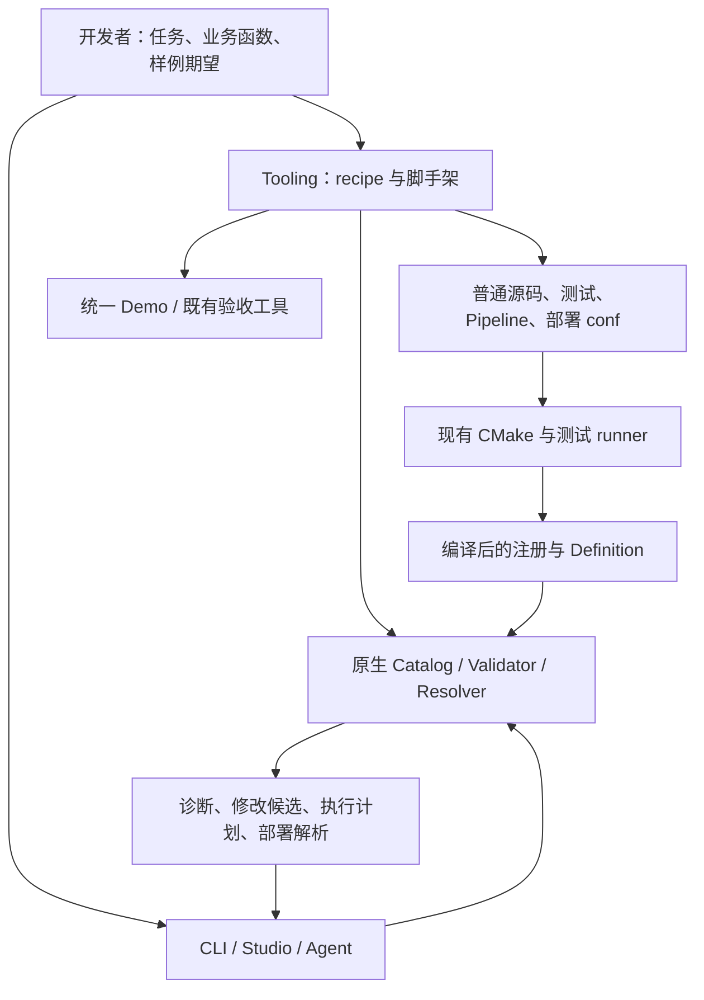

# RFC 0051：开发者任务路径、测试生成与修复诊断

- **RFC 编号**：0051-developer-task-experience
- **创建日期**：2026-09-11
- **文档状态**：Proposed
- **关联分支**：`docs/developer-task-experience-rfc`
- **目标版本**：v10.x，分阶段交付
- **负责人 / 作者**：LLM-EdgeFlow contributors
- **设计基线**：`ccb0f82d75b2bcc667e6a42084747f72a081515c`（PR #105 合并后的 main）
- **关联决策**：补充 RFC-0012、0013、0016、0039、0041、0044、0045；保留其分层、注册、验证和生命周期约束。

本文是待实施的架构提案。标为“拟新增”的命令、字段、文件和 C++ 接口在上述基线中尚不存在，
不能直接当作当前产品功能使用。本文同时维护设计、实施顺序和完成条件；采用方案后进入
`In Implementation`，按实际完成情况更新第 11 节。实施与交付流程统一引用
[CONTRIBUTING](../../CONTRIBUTING.md)，不另设审批或交付流程。

阅读顺序：先读第 1–3 节确认范围与责任，再按第 11 节领取里程碑；第 4–7 节是各模块的实施
规格，第 8–10 节用于迁移、工程验证和用户验收。每完成一阶段，就更新第 11 节的状态与证据。

## 1. 目标与总体决策

降低开发心智负担的主要手段，是让用户少做跨文件同步、少推测框架状态，并尽早看到自己的
修改产生了什么结果。用户仍负责业务意图、输入输出契约和预期结果；工具承担可以确定的
文件生成、构建登记、连接检查和验证编排。

本次采用四项相互配合、可以分别交付的改进：

| 改进 | 用户获得的行为 | 架构实现方式 |
| --- | --- | --- |
| 脚手架生成可执行测试 | 创建 Node 后已有测试文件、构建登记和准确执行命令 | 扩展现有生成器，复用现有测试 runner |
| Validator 提供修复建议 | 能看到错误原因、候选修改和影响范围 | 在原生校验责任内产生结构化解释与修改候选 |
| 减少 Definition 重复声明 | 端口类型、逻辑名称、模型绑定只声明必要次数 | 小型 typed helper，输出原有 Definition |
| 任务级 recipe | 从任务选择走到生成、编译、验证和样例结果 | 工具层组合既有能力与受测样例，不增加运行时任务引擎 |

**实施顺序：先完成测试生成，再完成高频修复诊断；随后交付 Definition 小型 helper，最后将这些
能力接入两条完整 recipe。** 第一阶段就整理任务入口和采集基线，不等待所有功能完成才观察用户。
这一顺序让 recipe 依赖的底层动作先可靠，同时让每阶段都有可单独使用的收益。

本次不交付动态插件、新 Pipeline 格式、通用业务 DSL、自动编写任意算法、自动推断业务期望、
批量静默修复，以及新的 Model/Backend 能力。保留完整 C++ 扩展路径和仓库内静态注册方式。
公司内部 SDK 集成仍遵循 [RFC-0029](0029-external-readiness-and-intranet-sdk-migration.md)。

## 2. 当前基础与已确认的断点

### 2.1 源码事实

| 入口 | 已具备能力 | 本次要补的缺口 |
| --- | --- | --- |
| [scaffold_custom_node.py](../../scripts/scaffold_custom_node.py) | compute、model、unary inference、Control 模板；源码落盘与 CMake 登记 | `--generate-test` 只输出片段；用户需手工放入测试套件 |
| [生成器测试](../../tests/tooling/test_scaffold_custom_node.py)、[编译夹具](../../tests/tooling/generate_scaffold_fixtures.py) | 检查 CLI，编译真实生成结果 | 要进一步验证生成文件到 CTest 实际执行的完整路径 |
| [ValidationDiagnostic](../../include/core/pipeline_validator.h) | code、JSON Pointer、节点、端口、related_nodes、suggestions | 缺少原因分类和可应用修改；部分 suggestions 只是字段或 Node 名称 |
| [PipelineValidator](../../src/core/pipeline_validator.cpp) | 统一配置规范化、DAG、端口、模型与业务闭合检查 | 应利用已有上下文区分“缺节点”和“已有节点但没有依赖” |
| [LLM starter](../../dev_support/node_authoring/starter_llm_node.cpp) | 两个普通文本函数即可修改业务处理 | typed key、端口构造、模型绑定仍有重复声明 |
| [NodeConfigParser](../../include/nodes/node_config_parser.h) | 字段定义、默认值、语义解析复用 | 应继续复用，避免再设计配置语言或第二份 schema |
| [CLI](../../src/tools/alg_pipeline_tool.cpp)、[Studio](../../tools/pipeline_studio/server.py) | Catalog、init、validate、plan、resolve-conf，以及保存 JSON/.conf | 尚未形成创建 Node 到验证修改结果的连续任务路径 |
| [任务导航](../README.md)、[试用计划](../plans/solution_developer_acceptance.md) | 已有任务入口和试用记录要求 | 应在现有入口补齐可执行任务，记录真实阻碍 |

### 2.2 诊断基线样例

设计期间使用当前构建的 `alg_pipeline_tool_test validate --stdin` 检查
[实体抽取 custom 方案](../../demo/fixtures/mock/pipeline_entity_extract_custom.json)：

1. 原始文档校验通过。
2. 仅删除第二个节点对 `custom_prompt` 的依赖，得到 `MISSING_INPUT_PRODUCER`，
   建议列出七种输出 `TextBatch` 的 Node；已有生产者未被指出。
3. 将 `temperature` 拼为 `temprature`，得到 `UNKNOWN_CONFIG_FIELD`，
   建议列出全部配置字段；没有指出最可能的拼写修复。

这些是局部诊断观察，说明下一步应改善什么，不代表已完成本 RFC 的测试或用户试用。

## 3. 责任边界与统一事实来源



图中表示工具调用和产物关系，运行时依赖仍仅向下：接入适配层 / Integration →
流程编排层 / Orchestration → 能力节点层 / Capability Nodes → 模型执行层 / Model Execution。

| 责任 | 所有者 | 明确边界 |
| --- | --- | --- |
| 外部请求字段选择、校验、响应组装 | Integration 的注册 Adapter / Operator bridge | recipe、Node、Demo 不替代外部协议转换；C 载体相同不能证明载荷协议相同 |
| Pipeline 合法性、规划、修复原因 | Orchestration 的 PipelineValidator 及其内部辅助 | Python、Web 和 recipe 不复制类型兼容、拓扑或模型约束规则 |
| Node 作者便利接口 | Capability Nodes 的作者头文件，或原有通用 typed port 定义处 | 输出原有 NodeDefinition；Core 不包含具体 Node 或模型实现 |
| 模型接口到能力标识的静态关系 | Model Execution 的中性能力接口定义 | 不表示当前构建具备某个 Model/Backend；可用性仍查 Catalog |
| 文件落盘、命令执行与任务进度 | Tooling | 不进入 SDK 请求执行路径；不修改当前请求的运行计划 |
| 测试源码清单与 runner 分组 | 现有 CMake 测试基础设施 | 源文件登记一次，默认与 individual 模式使用同一份清单 |

保留以下不变量：显式 `id + depends_on`；原生 Validator 是唯一校验与规划实现；Pipeline
消费 `ValidatedPipelinePlan`；Node 无请求成员状态；值通过 typed ports 传递；来源编号和所有权
显式保留。任何便利 helper 都不能自动承诺并发安全、来源关系或外部业务协议兼容。

## 4. 脚手架：生成能够被执行的测试

### 4.1 CLI 与产物契约

沿用 `scripts/scaffold_custom_node.py`，**拟新增** `--write-test`。推荐创建命令为：

```bash
# 拟新增用法：完成本节实现后可用。
./scripts/scaffold_custom_node.py MyTextNode \
  --kind model -m llm --write-test --add-to-cmake
```

| 参数组合 | 约定行为 |
| --- | --- |
| 现有参数，不含 `--write-test` | 保留原行为；`--generate-test` 仍打印片段 |
| `--write-test` | 除 Node 源码外，创建 `tests/unit/nodes/test_<snake_name>.cpp`，报告尚未登记的构建项 |
| `--write-test --add-to-cmake` | 同时登记 Node 源码和测试源码，输出聚焦执行命令 |
| `--write-test --dry-run` | 展示各目标路径、生成内容与登记差异，不创建或修改文件 |
| `--write-test --generate-test` | 拒绝歧义组合，提示选择落盘或片段模式 |
| `--write-test --force` | 第一版拒绝覆盖多文件任务；说明使用新名称或手工修改已有文件 |

Node 源文件继续按操作命名，放在 `src/custom_nodes/`。第一版落盘测试模式仅支持仓库内标准
源码与测试目录；自定义 `--output-dir` 继续供旧片段/夹具用法使用，组合不受支持时在写入前失败。
这避免自动猜测外部 CMake 结构；以后有实际独立仓库需求再扩展。

**保留旧 `--dry-run --generate-test` 的可编译输出格式。** 当前
[ScaffoldFixtures.cmake](../../cmake_ext/ScaffoldFixtures.cmake) 依赖该用法，新的多文件预览不能
污染旧 stdout。错误进入 stderr；成功输出列清创建/登记项及下一条准确命令。

### 4.2 一次生成的写入行为

生成器先构造内存中的文件变更集合，完成名称、路径、目标冲突、CMake 插入位置检查后再写入。
正常运行期异常应恢复已修改登记文件并删除本次新文件；回滚前比较写入后的内容，不能覆盖
同时发生的用户修改。若发现并发修改，保留现场并列出需要处理的具体路径。

第一版保证可检测失败的恢复，不承诺跨文件系统断电事务。单文件采用临时文件及替换等已有
可靠写入方式；新文件避免覆盖既有目标。重复执行同一创建命令应报已存在，且不产生额外登记项。
业务源码一经生成即归用户维护，后续模板升级不批量重写用户文件。

### 4.3 测试登记：编译成功还不够

拟新增 `cmake_ext/CustomNodeTests.cmake`，作为生成测试源码的单一清单，由
[TestInventory.cmake](../../cmake_ext/TestInventory.cmake) 引入。它只声明源码路径，不定义每个
Node 的新可执行程序，也不记录能力信息。

- 默认模式：将清单加入 `edgeflow_test_nodes_runner`。
- individual 模式：将同一清单加入已有 `test_common_nodes`。
- 第一版生成的 GTest 使用现有 `CustomNodeCatalogTest` suite，并给每个测试名加
  `<NodeType>_` 前缀；沿用 `CommonNodesTest` 当前覆盖该 suite 的过滤规则。
- 单 Node 的直接运行过滤器为 `CustomNodeCatalogTest.<NodeType>_*`；生成器按构建目录的
  `LLM_EDGEFLOW_SHARDED_TEST_RUNNERS` 值输出正确 runner。未配置构建时先输出配置步骤。
- Node 实现通过现有运行时目标链接，测试不得再次包含或编译生产 `.cpp`，避免重复注册。

验收必须枚举生成测试并证明过滤器匹配非零项，随后执行它们。`ctest --no-tests=error` 不能
发现“CTest 有任务但 GTest filter 匹配零用例”，因此生成器集成测试还需检查实际用例发现结果。
若未来改变 suite 名称，必须同步默认模式与 individual 模式的执行映射。

### 4.4 测试内容及业务期望

基础测试从模板明确承诺的行为生成；业务预期由开发者填写。测试应使用注册接口创建真实生成的
Node，以不同于逻辑端口名的实际键验证绑定，覆盖多条不连续 `(req_id, sub_id)`。

| 模板路径 | 必需覆盖 | 不应推断的内容 |
| --- | --- | --- |
| 同类型 compute 透传模板 | 注册、Init、缺输入、空批次、默认透传、输入未修改、来源保留 | 未来算法的正确答案、并发安全 |
| 改变类型或批次关系的 compute 模板 | 注册、缺输入、未实现路径失败且不发布成功输出 | 自动构造有意义的转换结果 |
| model / unary inference | 模型绑定、空批次、确定性正常调用、模型失败、数量/来源异常、不发布失败输出 | 真实模型效果、所有能力接口拥有相同容器行为 |
| Control 模板 | 初始配置、有效更新、非法更新保持旧值、实际输出改变 | 任意业务命令的事务或并发语义 |

优先复用或最小提取 [test_common_nodes.cpp](../../tests/unit/nodes/test_common_nodes.cpp) 中已有的
受控模型和绑定辅助，放入 `tests/support/`。只提取测试需要的公共部分，不让生产代码依赖测试；
测试替身不得出现在生产 Catalog，也不得为每个测试生成一份全局 Model 注册。

生成的业务样例区域写明“当前验证模板默认行为”，提供可编辑的输入与**独立字面量期望**。
预期值不能通过调用被测函数得到。修改业务逻辑后，应同时将样例换成任务数据与人工确认结果。
不生成永远成功的占位断言，不用默认跳过用例来宣称业务覆盖。转换尚未实现时，报告模板失败
契约已验证，不能标记业务路径完成。

### 4.5 本阶段完成条件

1. 标准目录中一条创建命令生成源码、测试及两类登记，无需用户手改构建文件。
2. 所有现有模板组合保留兼容；新增落盘模式支持的组合明确且被测试。
3. 冲突、重复执行、无效 CMake 插入位置和可模拟写入失败不留下正常情况下的半成品。
4. 新测试在默认与 individual 模式均被发现并实际执行，含业务样例区域。
5. 教程使用落盘路径，旧片段模式仍有覆盖；用户知道下一条执行命令和目前验证范围。

## 5. Validator：从位置诊断到可验证的修改建议

### 5.1 将错误识别、建议生成、应用修改分开

保持 `PipelineValidator::ValidateAndPlan` 的无副作用和失败语义。内部复用同一份 Catalog、字段
Definition、规范化配置和拓扑上下文产生原因说明，避免从英文 message 反向解析结构化信息。

本次区分三个动作：

1. **校验与解释**：既有 `validate` 在报告错误时给出具体原因和面向当前文档的文字建议。
2. **生成并验证修改候选**：拟新增 `validate FILE|--stdin --explain`；候选只修改内存副本，
   调用同一个原生校验实现确认结果，返回可预览修改。
3. **应用**：Studio 中由用户选择一个候选并应用到当前草稿；CLI 返回候选供查看或外部工具处理。
   第一版不提供批量应用或 CLI 原地改写文件。

`plan` 的失败输出保留对应 Validator 报告，支持同样的 `--explain` 选项；成功输出继续保持现有
shape。SDK 的 Pipeline 构建不承担候选枚举与多次试验成本，仍只执行一次原生校验/规划。
候选生成和验证代码位于 Orchestration，由工具显式调用；它不读取文件、不实例化 Node、不加载模型。

对外可在原有 `PipelineValidator` 上增量提供 `Explain(root, policy)`，返回带 remediation 的
`ValidationReport`；保留原有 Validate/ValidateAndPlan 签名。Explain 与普通校验共享私有实现，
不可通过另一份 JSON 解析与规划逻辑实现。CLI 的两个 explain 用法从同一报告读取诊断与 plan。

### 5.2 原因分类与候选排序

第一批实施下面六类诊断。保留现有顶层 `code`，通过附加原因区分当前被合并的失败情况。

| 现有诊断 | 优先判断 | 可以给出的建议 | 第一版修改候选边界 |
| --- | --- | --- | --- |
| `UNKNOWN_CONFIG_FIELD` | 同一对象的合法字段中是否有唯一近似项 | 更正拼写，并显示字段含义和类型 | 目标字段不存在且原值满足目标 schema 时，可给 rename 候选 |
| `MISSING_CONFIG_FIELD` / 字段类型、范围、枚举错误 | Definition 的 required、default、semantic、允许值 | 明确需要填写什么、实际值为何不合法 | 必填值未知时只解释；不随意填模型名、截断数值或强制类型转换 |
| `UNKNOWN_MODEL_REFERENCE` / `MODEL_CAPABILITY_MISMATCH` | 当前文档中的模型引用与能力 | 列出可引用的兼容实例及路径 | 当前方案中已声明、已通过相关校验的模型可作为显式选择候选 |
| `MISSING_INPUT_PRODUCER` | 同键生产者、依赖可达性、端口类型与流契约 | 指出缺依赖、错误绑定、类型不符或确实缺能力 | 优先修复当前图；不得直接新增未知配置的 Node |
| `MISSING_BIZ_OUTPUT` | Adapter egress 与当前实际生产键 | 指出缺少的内部结果及候选输出 | 可解释已有输出如何连接；重命名输出可能影响多个消费者时只展示影响与选择 |
| `DUPLICATE_DEPENDENCY` / `INVALID_DEPENDENCY` | 重复引用、拼错 ID、指向不存在节点 | 指出具体依赖元素及合法目标 | 去除确定重复项；疑似拼错的 ID 仍需显式选择并检查成环 |

`MISSING_INPUT_PRODUCER` 的推荐顺序为：

1. 当前图存在同一实际键的唯一生产者：解释其与消费者的依赖关系、类型与流契约。
2. 当前祖先节点或 biz ingress 存在满足契约的其他实际键：列出重绑定候选及原/新来源。
3. 当前图没有可用来源：从 Catalog 查找候选操作，过滤已知 biz 适用性和端口流契约，
   说明它还需要哪些输入、配置与模型绑定。

Catalog 候选只能称为“候选能力”，不能称为“可直接插入的修复”。多个生产者、已存在环、
未知节点 Definition 等情形应先解释阻断条件。对于源码新增但尚未编译的节点，提示重新构建
所选工具并查询 `describe-node`；不能因为另一个构建可见就判定当前构建可用。

字段相似度仅用于排序，不能证明作者意图。固定排序和数量上限，平局按稳定名称排序；
无需引入 LLM、网络服务或新的第三方搜索依赖。嵌套字段路径必须正确转义 JSON Pointer 的
`~` 与 `/`，不能继续直接拼接未经转义的字段名。

### 5.3 拟新增的机器可读契约

保留 `code/path/message/severity/node_id/port/related_nodes/suggestions` 的类型和含义；旧的
`suggestions` 列表不改为对象。新增可选 `remediation` 对象，单独携带版本。第一版定义：

| 字段 | 含义 |
| --- | --- |
| `schema_version` | 本修复契约版本，初始为整数 1 |
| `cause` | 稳定原因标识，例如 `producer_not_dependency_ancestor` |
| `summary` | 面向人的具体解释，客户端不能解析它作逻辑判断 |
| `facts` | 原因对应的事实字段，例如实际键、生产者 ID、期望/实际类型；按 cause 定义字段 |
| `fixes` | 可选候选列表，仅在 `--explain` 成功验证候选后输出 |

第一版 cause 与事实字段使用有限集合，缺少事实时省略对应可选字段，禁止填猜测值：

| cause | facts 的主要字段 |
| --- | --- |
| `unknown_config_field` | `field: string`、`candidate_fields: string[]` |
| `missing_config_field` / `invalid_config_value` | `field: string`、`expected_type: string`，可选 `minimum`、`maximum`、`enum` |
| `unknown_model_reference` / `model_capability_mismatch` | `model_id: string`、`required_capability: string`、`candidate_model_ids: string[]` |
| `producer_not_dependency_ancestor` | `bound_key: string`、`producer_id: string` |
| `port_type_mismatch` / `port_flow_mismatch` | `bound_key: string`、`producer_id: string`，以及可确定的 `expected` / `actual` 契约对象 |
| `no_compatible_input_source` | `bound_key: string`、`expected_type: string`、`candidate_node_types: string[]` |
| `missing_biz_output` | `biz_name: string`、`bound_key: string`、`expected_type: string` |
| `duplicate_dependency` / `unknown_dependency` | `dependency_id: string`，可选 `candidate_node_ids: string[]` |

`expected` / `actual` 契约对象仅使用既有 type_id、cardinality、provenance_policy、lifetime 字段。
没有可靠分类的诊断继续返回原字段，不强行覆盖所有 code。增加可选事实字段保持 v1；改变既有
字段类型或移除 cause 时提升 remediation 版本。第一版不在结构化事实中复制完整提示词或请求。

每个 fix 包含报告内唯一 `id`、`title`、`effect`、JSON Patch `patch` 及 `verification`。
`effect` 描述数据来源、依赖或配置的变化。`verification` 为 `pipeline_valid` 或
`target_resolved`；后者说明当前错误已解决但仍有其他错误。候选未验证通过时不输出可应用 patch，
仍可给文字建议。`id` 只在本次报告有效，不是持久业务标识。

以下为**拟新增输出示例**，对应第 2.2 节的缺依赖案例，旧字段从略：

```json
{
  "code": "MISSING_INPUT_PRODUCER",
  "path": "/pipeline/1/ports/inputs/text",
  "node_id": "node_2_StructuredJsonParseNode",
  "remediation": {
    "schema_version": 1,
    "cause": "producer_not_dependency_ancestor",
    "summary": "custom_prompt 已输出 llm_raw_answer，但不在消费者的依赖路径中。",
    "facts": {
      "bound_key": "llm_raw_answer",
      "producer_id": "custom_prompt"
    },
    "fixes": [
      {
        "id": "add-dependency-1",
        "title": "添加对 custom_prompt 的依赖",
        "effect": "消费者等待 custom_prompt 完成后读取其结果。",
        "patch": [
          {"op": "test", "path": "/pipeline/0/id", "value": "custom_prompt"},
          {"op": "test", "path": "/pipeline/1/id", "value": "node_2_StructuredJsonParseNode"},
          {"op": "test", "path": "/pipeline/1/depends_on", "value": []},
          {"op": "add", "path": "/pipeline/1/depends_on/-", "value": "custom_prompt"}
        ],
        "verification": "pipeline_valid"
      }
    ]
  }
}
```

Pipeline 原文与规范化对象必须区分：patch 的路径和值始终针对用户提交的**原始文档**，
不能指向仅存在于默认值注入结果的字段。新字段采用 `add`，已存在字段采用合适的
`replace` / `move` / `remove`；每个操作的存在性前提都要经过验证。字段重命名使用 `move`
保留原值，且不得覆盖已经存在的目标字段。

顶层报告的 `schema_version=1` 在本次保持不变，因为旧字段、类型与成功/失败含义不变，
新对象为可选扩展。随本次更新维护中的消费者，明确忽略未知可选字段；测试确认既有 CLI/Studio
消费者能读取扩展后的报告。不能容忍附加字段的外部严格解码器需要先放宽或同步升级。
未来若删除旧字段或改变其含义，再提升顶层版本。

### 5.4 候选验证算法与资源约束

候选生成辅助接收原始 JSON、同次校验上下文和报告。类型兼容、拓扑和 schema 判断复用已有
内部函数；不要在独立“修复规则库”重新实现合法性。必要时先将现有 Validator 大函数中的上下文
与规则提取为私有辅助，不公开第二套规划 API。

候选验证流程：

1. 在原始 JSON 副本上应用一个候选，包括前置 `test` 操作；失败则丢弃。
2. 调用不生成修复候选的原生校验入口，使用相同 ValidationPolicy 和 Catalog 基线，避免递归。
3. 校验通过标为 `pipeline_valid`。仍有错误时，仅在目标错误消失且未引入新错误的情况下
   标为 `target_resolved`；无法可靠比较时，保守退回文字建议。
4. 比较诊断时使用 code、稳定节点/模型 ID、逻辑端口和字段身份；数组下标变化不能被误判为
   新业务对象。对不具备稳定身份的根结构错误，不生成部分修复候选。
5. 每个候选基于原始文档独立验证。第一版每条诊断最多返回 3 个、每份报告最多验证 8 个候选，
   采用确定性顺序；达到上限时仍返回完整原始诊断和文字说明。

具体数量上限集中在一个私有实现位置，后续按测量调整；它只限制帮助信息，不能截断原有合法性
检查。普通 SDK Build 不进行候选试验。性能测试分别记录普通校验和 `--explain` 的耗时/候选次数，
用已有大小不同的合法、缺依赖、多错误 Pipeline 比较基线；不依赖真实模型加载。

### 5.5 客户端应用与过期处理

Studio 保存诊断对应的原始草稿快照及所选工具身份。应用前要求当前草稿仍与快照一致；
节点重排、配置编辑、切换工具或应用另一修复后，全部旧候选失效并重新校验。不能仅靠 patch
里的少量 `test` 操作判断整份方案是否仍匹配。

用户选择候选后，先在草稿副本应用并重新校验，再展示差异和剩余错误；接受后替换当前草稿，
提供现有撤销/草稿恢复能力或最小单次撤销。保存文件继续走已有保存流程。CLI 输出的候选同样只
对本次输入和工具有效，外部调用方应保留快照并重新校验，不得长期缓存。

客户端负责显示和编辑，不根据 `cause` 自行推导新修复。旧工具没有 remediation 时退回原有诊断
卡片；未知 remediation 版本只显示文字，不提供应用动作。CLI、Studio、Agent 对同一输入、
同一工具和相同选项必须收到同一诊断与候选。

静态验证只能证明配置契约成立。增加依赖会改变调度，重绑定会改变数据来源，替换模型会改变
业务输出；即使仅一个候选，也必须展示其影响，并在任务流程中执行修改后的样例验证。

## 6. Definition：减少重复，同时保留语义表达能力

### 6.1 第一版只增加小型作者接口

采用可调试的普通 C++ 函数、重载和现有模板机制。返回值仍为 `BlackboardKey<T>`、
`NodePortDefinition`、`NodeDefinition`；注册仍调用 `REGISTER_NODE_WITH_DEFINITION`。
不引入反射扫描、外部 schema 生成 C++、复杂链式 builder 或新的 Node 基类层次。

拟新增的最小接口如下，名称在实施时保持统一；具体函数签名由编译样例固定：

| 接口 | 位置与职责 | 行为 |
| --- | --- | --- |
| `MakeBlackboardKey<T>(name)` | `include/core/blackboard_key.h` | 从 `BlackboardTypeTraits<T>` 取 type_id；未知类型在编译期失败 |
| 接受单个 typed key 的 `RequiredInputPort` / `OptionalInputPort` / `OutputPort` 重载 | `include/core/port_definition.h` | 使用 key 的逻辑名和类型；保留现有显式名称重载 |
| `BoundInput<T>` / `BoundOutput<T>` 的 typed key 构造重载 | `include/nodes/node_base.h` | 从同一个 key 获取逻辑名；实际 Pipeline 键仍由 BindPort 解析 |
| `ModelCapabilityTraits<Interface>` | 拟新增 `include/engine/model_capability_traits.h` | 在中性模型接口旁定义静态 capability 标识；未知接口无默认映射 |
| `ModelBoundNode<Interface>::ModelInterface` | 原有基类的公开类型别名 | 让 Definition helper 读取实际声明的模型接口类型 |
| `MakeCustomModelNodeDefinition<NodeT>(description, inputs, outputs)` | 拟新增 `include/nodes/node_definition_helpers.h` | 从 NodeT 读取类型名和模型接口，填充 custom 类别、默认 bind_model 字段及模型能力 |

typed key 保存的名称必须具有足够生命周期；生成器使用 `inline static constexpr` 和字符串字面量。
本次不改 `BlackboardKey` 的所有权模型，不把短生命周期 `std::string::c_str()` 保存在静态声明中。
从 key 构造运行时端口时，应检查手写 key 的 type_id 与 traits 一致，避免 Definition 与 Process
使用不同类型标识；旧的合法构造路径继续可用。

以下是**拟新增 API 的作者示例**，只展示声明位置，不是可直接编译的完整 Node：

```cpp
// 位于继承 ModelBoundNode<ILlmModel> 的 MyTextNode 内。
inline static constexpr auto kInput = MakeBlackboardKey<TextBatch>("input");
inline static constexpr auto kOutput = MakeBlackboardKey<TextBatch>("output");

// 使用相同的声明创建运行时端口。
BoundInput<TextBatch> input_{kInput};
BoundOutput<TextBatch> output_{kOutput};

// 位于类外；仍返回原有 NodeDefinition。
NodeDefinition MakeMyTextNodeDefinition() {
  return MakeCustomModelNodeDefinition<MyTextNode>(
      "文本前后处理",
      {RequiredInputPort(MyTextNode::kInput)},
      {OutputPort(MyTextNode::kOutput)});
}
```

简单模型 helper 使用现有 `bind_model` 约定、`parallel_safe=false`，不隐式添加业务适用列表，
不合并复杂配置 schema。它服务于当前 starter 的单模型路径。多配置字段、特殊绑定名、多输入、
Control、跨字段规则继续直接构造完整 Definition；先保持这条路径清楚，不用一个庞大 helper
涵盖所有情况。

### 6.2 可以省略什么，必须由作者决定什么

| 信息 | 决策 |
| --- | --- |
| C++ batch 对应的 type_id、重复逻辑名 | 从已有 typed key / traits 推导 |
| 既有中性模型接口的 capability 字符串 | 从接口 traits 推导，和注册 Definition 做一致性测试 |
| 单模型 starter 的绑定 schema | helper 统一生成，不重复写 required string 与 model_config_field |
| 配置默认值、范围、语义解析 | 继续使用同一字段列表；复杂路径保留 NodeConfigParser |
| `1:1`、`preserve`、`request` | 简单 helper 沿用现有默认；文档明确其行为承诺，变化时必须显式声明 |
| 并发安全、聚合/拆分来源关系、生命周期延长、业务适用性 | 作者明确判断；不从继承、const 成员或输入输出类型推断 |

helper 提供的简短写法不代表对算法做过证明。默认 `parallel_safe=false`，即使使用
`TraceableUnaryInferenceNode` 也不能自动设为 true。配置更新、模型能力和 Backend 并发约束
继续走当前组合规则。

对 [PromptGuidedLlmNode](../../src/custom_nodes/prompt_guided_llm_node.cpp) 这样的复杂参数路径，
保留 `PromptConfiguration().Fields()` 与同一语义 parser 的复用。预检和 Init 分别执行相同规则，
Process 读取已拥有的参数。不能为了减少代码行数移除防御初始化校验，或通过 JSON 序列化绕一圈。

### 6.3 迁移与验收

先迁移受编译测试约束的 LLM starter、compute 生成路径及一个适合的现有 Node，保持声明内容、
Catalog 输出、端口绑定和失败行为等价。复杂 Node 留作完整接口范例，不要求全仓库机械迁移。

验证包括：新/旧声明的 Catalog 等价；逻辑名与实际键不同仍正确运行；未知 traits 拒绝编译；
手写 key 类型不一致得到明确失败；简单 helper 不擅自启用并发；头文件依赖仍向下。
编译期失败用例复用现有编译契约测试机制，避免新增独立测试框架。

模型 traits 是接口标识声明，不列出可用 Model/Backend。recipe 和 Studio 不从这份 traits 或
Python 生成器的签名表推断目标构建能力，仍查询目标 Catalog。

## 7. 任务级 recipe：连续完成一个开发任务

### 7.1 形态与首批范围

一个 recipe 由一页任务说明、受测试约束的样例引用和少量工具层编排代码组成。入口放在
现有[按任务开始](../README.md)导航。**拟新增** `scripts/dev_recipe.py`，提供
`list`、`prepare`、`verify` 三个子命令；实现只使用普通 Python 函数组合既有工具。

第一版只交付两条自动化路径：

| recipe ID（拟新增） | 面向任务 | 前置约束 | 主要产物 |
| --- | --- | --- | --- |
| `prompt-config` | 使用现有节点调整提示词并验证自己的方案 | 沿用已注册 biz 的完整外部输入输出契约 | 新 Pipeline/.conf、样例期望、验证命令 |
| `text-llm-node` | 填写文本前后处理、调用已有 LLM 能力并接入方案 | 使用既有 TextBatch 与模型能力，保持外部协议 | Node、测试、构建登记、新 Pipeline/.conf、样例期望 |

增加参数或 Control、适配完整 JSON 请求/响应先接入已有教程导航，标为指导路径；不把它们
列为本次自动化 recipe 的完成项。尤其外部协议变化必须转入 Integration，不能由通用文本
recipe 擅自提取 JSON 字段来满足任务。

recipe ID 是任务目录，不是第二份 Node Catalog。描述只保存样例/Profile 引用、需用户输入的
参数和受支持的修改位置；不复制完整节点清单、端口 schema、模型兼容表或验证规则。
第一版不引入用户自定义 recipe DSL、插件发现系统、持久项目描述文件或通用任务状态机。

### 7.2 用户输入与拟新增命令

下面的例子明确选择已有确定性测试 Profile，避免依赖模型下载。Profile 名及工具可用性在每次
执行时查询；不能只依赖本文的示例名称。

```bash
# 拟新增用法；MyTextNode 和新配置目标必须尚不存在。
./scripts/dev_recipe.py prepare text-llm-node \
  --name MyTextNode \
  --profile entity_extract_custom_mock \
  --tool ./build/alg_pipeline_tool_test \
  --build-dir build \
  --pipeline demo/fixtures/mock/pipeline_my_text.json
```

prepare 返回生成的文件、精确编辑位置、当前状态及下一条完整 verify 命令。用户不需要另外
寻找 CMake target、GTest filter、Demo biz 名或模型根目录。所有传给子进程的命令使用 argv
列表；展示命令时按 shell 正确引用，不能把描述或路径拼接成可执行 shell 文本。

`--tool` 对该流程固定：生产任务用目标生产工具，确定性测试任务显式用测试工具；工具缺失、
注册缺失或校验失败时不自动切换。`--build-dir` 必须与工具、SDK、Demo 和测试 runner 所属构建
一致。未提供足够证据确定二者对应时，在准备/执行编译前说明需要修正的具体参数。

`--pipeline` 决定 JSON 路径，同名 `.conf` 为部署产物。样例期望沿用现有 effects 规范格式，
引用明确的数据集和请求 ID；测试模型数据与配置放在测试 fixture 路径，不伪装成生产示例。
默认输出目标存在时整次 prepare 失败，不覆盖原 Profile、源码或用户测试。

### 7.3 prepare 的确定性步骤

1. 查询所选工具的 Catalog 与 Profile，检查 recipe 支持的样例形状、biz 及输入输出前提。
   若外部完整协议要求不同，明确路由到 Adapter 开发；缺少业务契约信息时不声称已匹配。
2. 用原生 `init --profile ... --raw` 克隆样例，校验未修改样例。返回非零退出码时停止，
   不能把错误响应保存为 Pipeline。
3. 配置任务直接准备新配置；Node 任务调用第 4 节生成器，在已受测位置替换节点类型，
   使用新 Node 的绑定配置，并保留经过确认的连线。对首个 `text-llm-node` 样例，替换
   custom Profile 的 `custom_prompt`，移除旧节点专属配置，仅保留模型绑定。
4. 通过既有部署生成辅助准备配套 `.conf`，`data.pipe_path` 指向新 JSON。重建模型路径映射，
   不沿用原 Profile 覆盖新模型选择的旧值；保留已确认的输出池配置及容量。复用
   [verify_selection.py](../../tools/verify_selection.py) 的 `build_run_conf`，无需从 Web server 导入服务对象。
5. 用同一工具校验配置任务结果，并通过 `resolve-conf` 验证有效配置。新 Node 尚未编译时，
   只将相关校验标记为待编译后执行，不设置已通过，也不生成供绕过未知节点的假 Catalog。
6. 预检所有目标后写入文件，报告编辑区域、产物和后续命令。源文件与配置的跨工具写入采用
   prepare 所有的变更清单；复用生成器的准备/提交辅助，不通过多次独立写入掩盖失败。

可从现有脚本最小提取纯文件准备函数供两入口共用；其职责是生成内容，不校验 Pipeline。
不要为共享几十行代码先建设新的通用工作流平台。

### 7.4 verify 的步骤、失败与报告

拟新增 `verify` 接收 recipe ID、所选工具/构建目录、生成配置和样例期望；Node 任务还包含
Node 类型。prepare 打印完整参数，避免用户重新填写。所有阶段执行当前工作树上的真实产物：

| 阶段 | 必须检查什么 | 失败后的反馈 |
| --- | --- | --- |
| 构建，仅 Node 任务需要 | 保持当前构建配置，增量编译真实 SDK、所选工具、Demo 与对应 Node runner | 输出实际编译诊断和涉及文件；停止后续运行 |
| Catalog | 新 Node 在所选工具可见，生成测试能够被发现 | 指出缺失的源码登记、构建产物或测试匹配 |
| 原生配置验证 | 对新 JSON 执行 validate/plan，对配套 conf 执行 resolve-conf | 保留原生诊断及第 5 节解释；不改用旧 Profile 绕过 |
| 聚焦 Node 测试 | 非零匹配数、实际执行、业务样例断言 | 指出当前失败用例与实际/期望结果 |
| 完整样例路径 | 统一 Demo 执行新配置，并按请求 ID、状态和指定输出字段核对 | 报告失败/缺失样例及产物位置 |

源码生成后需要刷新 CMake；使用同一目录的缓存配置，不在 recipe 内暗中切换 Backend、
构建类型或真实模型开关。配置任务不要求重新构建 SDK，工具不可用时给出现有构建入口。
开发阶段只跑适用的聚焦步骤，最终交付仍走 canonical gate，不在每次 verify 重复全库门禁。

完整样例核对优先调用现有 `verify_selection.py evaluate`，传入同一 Pipeline、conf、tool、
Demo 和模型根目录；沿用其 effects 规范、状态检查和证据失效规则。当前生产资产清单没有上述
测试模型，mock recipe 需要在 `tests/fixtures/` 下新增符合现有 schema 的测试资产清单，引用
仓库自有 neutral fixture 及其校验和，显式通过现有 `--manifest` 传入，`--model-root` 使用项目根。
不跳过资产检查，不将测试资产加入生产模型清单，也不以生产 preset 的 Backend 清单校验带测试
注册的工具。发生 fixture 变化时更新该测试清单并重新验收；不通过运行时接受任意 hash 绕过检查。
它当前固定的 CPU/batch 验收范围不得被 recipe 宣传为设备性能验证。

prepare/verify 支持人类文本输出及 `--json` 报告。拟新增报告的最小字段为 `schema_version=1`、
`ok`、`recipe`、`completed_steps`、`pending_steps`、`failed_step`、`artifacts`、`next_commands`。
命令的机器形式保存 argv 数组；状态名称来自上述有限阶段，不持久保存可恢复任务程序。

- prepare 成功表示产物已准备，返回 0；Node 未编译时 `pending_steps` 必须列清待验证项。
- verify 只有请求的全部阶段完成且样例核对通过才返回 0；前提缺失或执行失败返回非零。
- 参数使用错误返回 2，其余任务失败返回 1；子进程实际退出码作为失败阶段详情保留。
- 失败后保留已生成、已归用户编辑的产物，指出修复后重跑命令；不能重新生成覆盖算法或测试。
- 报告不记录“业务已实现”的推测。模板样例、确定性端到端路径、真实模型效果分别说明。

### 7.5 每页 recipe 的固定内容

任务页控制在能够顺序完成一次任务的范围，复杂概念链接参考文档。固定写出：适用条件和
外部契约、准备命令、生成文件、需要修改的业务区域、输入与期望样例、verify 命令、通过标准、
失败后的下一步，以及何时升级到完整 Node/Adapter/Model 开发路径。

教程不再让读者复制多份易漂移的完整实现。代码来自真实模板，样例配置来自实际 fixture，
文档中的核心函数体继续采用现有“提取后编译/执行”的校验方式。新用户首先看到任务步骤，
需要改变流语义时再进入 Definition、来源和并发概念。

## 8. 文件改动范围与兼容策略

### 8.1 实施定位

下表用于定位修改责任，拟新增文件不要求在第一步全部创建；先完成对应里程碑。

| 工作包 | 主要实现位置 | 对应测试与文档 |
| --- | --- | --- |
| 测试落盘、文件预检/恢复 | `scripts/scaffold_custom_node.py`、`dev_support/node_authoring/` | `tests/tooling/test_scaffold_custom_node.py`、生成夹具、Node 入门 |
| 两种构建模式的测试接入 | `cmake_ext/TestInventory.cmake`、拟新增 `CustomNodeTests.cmake`、`Tests.cmake`、`IndividualTests.cmake` | 现有质量门禁契约与真实生成集成验证 |
| 诊断原因与候选 | `include/core/pipeline_validator.h`、`src/core/pipeline_validator.cpp`，必要时同目录私有辅助 | Pipeline Catalog/Validator 集成套件、配置与 Definition 套件 |
| CLI/Studio 解释与修改预览 | `src/tools/alg_pipeline_tool.cpp`、`tools/pipeline_studio/server.py`、`web/editor.js` 与草稿处理代码 | Python 服务测试、JS editor/浏览器测试、CLI/Studio parity |
| typed 声明 helper | `core/blackboard_key.h`、`core/port_definition.h`、`nodes/node_base.h`、`nodes/model_bound_node.h`，以及第 6 节两份拟新增头文件 | Node 契约、Definition schema、Catalog 等价、编译边界检查 |
| recipe 入口与两条任务 | 拟新增 `scripts/dev_recipe.py`，按需要提取纯工具辅助 | 拟新增 `tests/tooling/test_dev_recipe.py`，接入现有 tooling CTest；复用 Demo/effects 套件 |
| 用户指南 | `doc/README.md`、`doc/dev_guide/first_custom_node.md`、Studio 指南与新增任务页 | 文档片段与路径检查；已有开发者试用计划 |

Node 模板、期望样例和文档步骤需要一起更新，不能只修改生成脚本内的字符串而让可读 starter
继续展示旧接口。生成测试尽量取自可读模板，避免同一种业务契约存在多个独立模板副本。

### 8.2 兼容与迁移顺序

| 表面 | 本次约束 |
| --- | --- |
| C ABI / Operator | 无签名、结构布局和外部 payload 契约变化 |
| Pipeline JSON / 部署 conf | 无格式迁移；生成普通现行文件，继续严格原生校验 |
| Catalog | NodeDefinition 的含义和输出不变；可用性仍由目标构建决定 |
| 诊断 JSON | 可选增加 remediation，旧字段继续可读；修复版本独立 |
| 既有 C++ 作者代码 | typed helper 为增量接口，旧的合法 Definition 仍可编译 |
| 脚手架命令 | 保留旧片段模式和 dry-run 输出；新落盘模式显式启用 |
| 已生成的用户代码 | 不自动重写；只迁移受本项目维护且有测试的样例 |
| 新生成测试 | 依赖本次测试清单接入；不能仅将测试文件复制到旧构建规则后宣称已接入 |

先交付能读取新增诊断字段的维护中消费者，再启用 Studio 应用候选。旧工具回退为文字诊断，
不需要将运行时 Pipeline 降级。当前扩展使用仓库内源码重编译；C++ 头文件变化应重新构建消费者，
不承诺独立二进制插件兼容。

回退某个便利工具时，已经生成的 Pipeline/.conf 和普通业务源码仍有明确归属。使用新 helper 的
源码需要保留对应头文件，或先机械展开回旧 Definition 再回退；不能删除 helper 让用户项目失去
编译能力。拟新增测试源码清单的移除同样要先迁移登记，避免测试静默消失。

### 8.3 已考虑的替代方案

| 替代方案 | 未采用的原因 | 何时重新评估 |
| --- | --- | --- |
| 只补充更多教程 | 文件登记、测试执行和候选修复仍需人工完成 | 教程用于解释概念，与工具交付一起维护 |
| 为每个 Node 创建可执行测试程序 | 增加构建和链接成本，违背已有 runner 分组 | 出现需要进程隔离的真实契约时单独论证 |
| 通过 Definition 自动产生全部业务测试 | Definition 缺少业务算法的正确答案 | 可以继续生成明确契约测试，人工提供效果期望 |
| 引入通用 Node/recipe DSL | 新增一套语言、schema 与调试路径，当前重复量不足以支持 | 多条已交付任务出现无法用小函数解决的重复后 |
| 以 LLM 作为 Validator 修复判定器 | 无法稳定保证拓扑、类型和兼容约束，增加服务依赖 | Agent 可解释原生结果，但合法性判定仍由 Validator 负责 |
| 默认自动应用全部修复 | 不同候选可能冲突，且配置合法不等于业务选择正确 | 独立设计具备意图与验证边界的自动化任务后 |
| 给每个任务引入持久项目描述文件 | 与 Pipeline、conf、Profile 形成新的同步负担 | 明确出现跨仓库部署或恢复任务需求后另行设计 |

## 9. 验证矩阵

测试以用户可观察行为为依据，不通过断言实现代码文本来代替执行。共享测试辅助只解决初始化、
受控模型与结果读取；预期值必须独立于被测函数。优先扩展下列现有责任套件。

| 编号 | 场景 | 通过条件 | 测试归属 |
| --- | --- | --- | --- |
| G1 | 落盘生成 compute、LLM、其他已支持模型/Control 组合 | 产物完整、真实源码可编译、测试发现非零且执行通过 | 生成器 Python + 生成夹具/Node runner |
| G2 | 同名目标、非法目录、重复执行、CMake 插入失败、模拟写入失败 | 非零退出，原文件不变，无重复登记；恢复冲突明确报告 | 生成器 Python |
| G3 | 旧 `--dry-run --generate-test` 与新预览 | 旧输出仍能编译；新预览不修改文件 | 生成器 + 编译夹具 |
| G4 | 默认与 individual 模式 | 相同生成测试在两模式都被发现和执行，Node 不重复注册 | 聚焦的非默认构建/执行 |
| V1 | 第 2.2 节缺依赖 | 指向已有 custom_prompt；候选补依赖后原生校验通过 | Pipeline Catalog/Validator 集成 |
| V2 | 同键不同类型、错误绑定、唯一/多个生产者、可能成环 | 原因准确；不提供会引入环或错误来源的可应用候选 | 同上 |
| V3 | 字段拼写、目标字段已存在、非法类型/范围/枚举、路径含 `~`/`/` | 不丢值、不覆盖合法配置，路径可应用；无依据的值只解释 | 配置/Definition + Validator |
| V4 | 模型引用、能力不符、候选模型自身非法 | 仅推荐当前构建和文档中已确认满足约束的实例 | Model/Pipeline + Validator |
| V5 | 多错误、重复依赖、数组位置变化、候选数超限 | 正确区分全部合法与目标解决；不把新增错误当修复成功；有界终止 | Validator |
| V6 | 默认 Build 与 explain | 普通 Build 不枚举候选、不加载额外资源；explain 不递归 | 原生契约与聚焦耗时记录 |
| U1 | 相同输入与工具经 CLI/Studio 调用 | 原生诊断、原因和候选一致；旧报告和未知 remediation 版本可降级 | `test_pipeline_studio.py` 与 parity fixtures |
| U2 | 预览后修改草稿、重排节点、切换工具、应用另一候选 | 旧候选失效；不改写当前文档；重新校验后再应用 | JS editor/浏览器 + 服务测试 |
| U3 | 候选选择、预览、撤销与保存 | 显示影响，应用的是当前草稿，保存仍使用原有冲突保护 | Studio 现有测试 |
| D1 | 新旧 Definition 与复杂原写法共存 | Catalog 和端口行为等价，模型绑定与并发默认值不漂移 | Node / Catalog / Definition |
| D2 | 未注册 batch traits、key 类型冲突、向上依赖 | 错误明确失败；架构边界检查通过 | 编译契约 / layer checks |
| R1 | 两条 recipe 从 prepare 到 verify | 实际新方案和新 Node 被使用，聚焦测试及样例结果通过 | recipe tooling + 既有 Demo/effects |
| R2 | 工具不存在、Profile 不符、未编译 Node、旧模型路径覆盖、目标冲突 | 不换工具或旧方案绕过；阶段和下一步准确；不覆盖用户产物 | recipe tooling |
| R3 | 请求缺失/重复、非零状态、结果不符、输入或配置改变 | 复用验收器报告失败或证据失效；不把 summary 成功数当完整业务证据 | 既有 effects + recipe |

本 RFC 不要求真实模型或目标硬件来验证生成、修复和 helper 行为；两条 recipe 的自动化验收使用
确定性 fixture。真实模型效果不属于上述结果的推论。外部协议未变时不新增无关 C ABI 用例；若
实施中意外引入外部契约变化，应重新界定范围并补充直接 `Alg_Process` 的完整请求/响应测试。

完成改动后执行一次 [canonical gate](../../CONTRIBUTING.md#6-run-one-canonical-delivery-gate)。
G4 的 individual 模式是本次真实受影响的非默认路径，只配置/构建/执行相关 Node 测试，不要求
重复完整非默认门禁。未覆盖项、资产导致的跳过及失败必须在实施记录中写明。

## 10. 开发者体验验收

工程测试证明工具工作正确，用户试用用于判断是否减少了负担。沿用
[方案开发者试用计划](../plans/solution_developer_acceptance.md) 的记录入口，不新建第二份长期
指标台账。基线与复测使用相同任务规模、构建条件和已准备的模型/测试资产。

首轮建议至少两位未维护过 Core 的开发者完成以下任务；人数和背景如受限，记录限制，不虚构
统计显著性。先记录未使用新工具的基线，再使用新路径复测；可交换任务顺序减少熟悉度影响。

| 任务 | 硬性体验验收 | 观察指标 |
| --- | --- | --- |
| 调整提示词并运行自己的方案 | 无 C++ 改动；修改后的 JSON/conf 被执行；能找到实际结果与期望 | 首次跑通耗时、手工路径修改次数、求助原因 |
| 新增文本 LLM Node | 源码/测试自动登记；用户主要填写业务函数与独立期望；无需手查 runner/filter | 手工机械修改文件数、业务外重复声明、查阅入口数 |
| 修复缺依赖和字段拼写 | 不阅读 Validator 实现即可选择正确修改，随后原生校验与样例验证通过 | 修复尝试次数、错误建议次数、首次修复耗时 |
| 将新 Node 用于第二份同契约方案 | 复用已注册类型，修改实际键后仍可运行；不复制算法文件 | 复用时需修改的代码和配置范围 |

硬性工程目标是：标准创建路径中的手工源码/测试登记次数为 0；生成测试过滤器匹配零项被识别为
失败；两项已确认高频诊断能给出针对当前方案的正确修改；完整路径运行的确是用户修改的产物。

时间改善目标在采集基线后由团队记录并确定，不能先宣称固定分钟数或改善比例。复测若没有减少
求助、机械修改或修复尝试，回到具体阻碍修正任务步骤；不以代码行数减少替代使用效果。

## 11. 实施里程碑与完成记录

每个里程碑保持可独立评审、可验证，不将工具层与运行时无关重构混在一起。实施代码时按
[AGENTS.md](../../AGENTS.md#agent-responsibilities) 分别安排测试作者、构建代理和测试执行代理，
主代理负责实现、协调、复核和文档；具体开发与交付流程仍以 CONTRIBUTING 为准。

| 顺序 | 交付范围 | 开始条件 | 退出条件 |
| --- | --- | --- | --- |
| M0：固定基线 | 记录当前生成、诊断、Definition 与两项任务操作路径；确定本文契约 | 采用本提案 | 可复现的基线与测试落点，未来接口不被写成现有功能 |
| M1：测试文件闭合 | 第 4 节的 CLI、文件预检/恢复、单份测试清单与两模式接入 | M0 | G1–G4 通过；Node 教程能直接生成并执行测试 |
| M2：高频诊断解释 | 第 5.2 节原因分类与当前上下文建议，保持旧代码/字段契约 | M0 | 基线错误被准确解释，字段/模型/端口的聚焦回归通过 |
| M3：候选验证与预览 | remediation v1、explain、有界候选验证、CLI/Studio 一致性、过期保护 | M2 | V1–V6、U1–U3 通过；默认 Build 不承担试验成本 |
| M4：Definition 减重 | 第 6 节小型 helper，迁移 starter 和最小样例 | M1 | D1–D2 通过；新旧 Catalog/运行行为等价 |
| M5：两条完整 recipe | prepare/verify、配置与样例生成、任务文档、复用既有结果核对 | M1、M2、M4；交付时集成 M3 | R1–R3 通过；新 Node 编译前状态准确，编辑后路径完整执行 |
| M6：试用与收口 | 任务试用、阻碍修复、现行指南和 Changelog 同步 | M1–M5 | 第 10 节硬性目标通过；所有所需检查及最终 gate 通过 |

M1 和 M2 的设计/实现可以独立推进，但共享构建目录不得并发构建。M4 可以在 M3 开发期间开展
独立源代码工作；M5 应等生成与接口稳定后接入，避免 recipe 成为绕过未完成能力的临时补丁。

实施期间在下表填写真实状态和证据路径，不提前勾选；常规修复直接更新本 RFC 和现行指南。
产品 README 仅在实际入口可用后更新，Changelog 记录已交付行为，不能把本提案写成已发布功能。

| 项目 | 状态 | 实施时记录的证据 |
| --- | --- | --- |
| M0 基线与采用 | 待实施 | 源码与工具基线、任务操作记录 |
| M1 测试生成 | 待实施 | 真实落盘产物、用例发现与两模式执行结果 |
| M2 诊断原因说明 | 待实施 | 六类诊断的输入与输出 |
| M3 修复候选 | 待实施 | 预览、部分修复、冲突/过期、CLI/Studio parity |
| M4 Definition helper | 待实施 | 等价比较、生成模板编译、边界失败 |
| M5 recipe | 待实施 | 两条路径的完整参数、配置、测试和样例证据 |
| M6 用户试用与交付 | 待实施 | 既有试用计划中的记录、最终 gate 与未覆盖范围 |

**完成判定**：所有本次范围内里程碑和验证项完成，试用中的阻断问题已处理，现行指南与实际
命令一致，再将 RFC 和索引更新为 `Completed`。如果代码与工程验证已完成但尚无实际用户试用，
明确记录该事实并保留未完成状态；真实模型和内网硬件验收继续由其原有专项计划管理。
