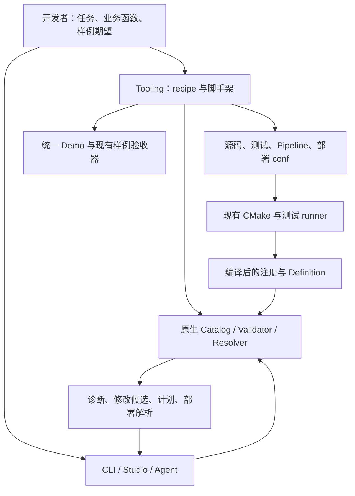

# RFC 0051：开发者任务路径、测试生成与修复诊断

- **RFC 编号**：0051-developer-task-experience
- **创建日期**：2026-09-11
- **文档状态**：Proposed
- **关联分支**：`docs/developer-task-experience-rfc`
- **目标版本**：v10.x
- **负责人 / 作者**：LLM-EdgeFlow contributors
- **设计基线**：`ccb0f82d75b2bcc667e6a42084747f72a081515c`
- **架构依据**：RFC-0012、0013、0016、0039、0041、0044、0045、0049、0050。

本文定义开发者体验改进的完整实施规格。第 2 节说明现有基础；其余章节中的新增命令、字段和
C++ helper 均待实现。实施时按第 11 节推进，采用方案后将状态更新为 `In Implementation`。
开发、验证和交付流程遵循 [CONTRIBUTING](../../CONTRIBUTING.md)。

阅读顺序：第 1–3 节确认目标和责任，第 4–7 节指导实现，第 8–10 节指导兼容与验收，
第 11 节记录实施进度。

## 1. 目标与交付范围

让开发者将注意力放在业务输入、处理逻辑和预期输出上。文件登记、契约连接、错误定位和执行
命令由工具承担；业务意图、正确答案、来源关系和并发安全仍由开发者负责。

| 交付项 | 用户完成的任务 | 工具承担的工作 |
| --- | --- | --- |
| 可运行测试脚手架 | 创建 Node，填写业务逻辑和独立期望 | 生成源码与测试、登记构建、提供准确运行命令 |
| 可验证修复诊断 | 根据原因选择修改并检查结果 | 定位当前方案中的失败原因、验证修改候选、展示影响 |
| 简化 Definition | 声明必要的端口和模型语义 | 复用 typed key，推导类型标识和简单模型绑定元数据 |
| 两条任务 recipe | 调整提示词；添加文本 LLM Node 并接入方案 | 串联准备、增量构建、原生校验、聚焦测试和样例核对 |

实施顺序为：**测试生成 → 诊断解释与修复预览 → Definition helper → 两条 recipe → 用户试用**。
各阶段都提供可以独立使用的能力，recipe 在底层动作稳定后接入。

首批 recipe 覆盖已验证的 `data.mem_que` 单输出 Profile，沿用现有完整外部业务协议。
`data.outputs` 多输出部署继续使用原生接入路径。本次不建设多输出 recipe、通用任务 DSL、
动态插件、新 Pipeline 格式、自动算法生成或自动业务标注，不增加 Model/Backend 能力。
公司内部 SDK 集成范围遵循 [RFC-0029](0029-external-readiness-and-intranet-sdk-migration.md)。

## 2. 实施起点

### 2.1 现有基础

| 实现入口 | 可直接复用的能力 | 本次工作 |
| --- | --- | --- |
| [scaffold_custom_node.py](../../scripts/scaffold_custom_node.py) | compute、model、unary inference、Control 模板，源码生成及 CMake 登记 | 增加测试落盘与完整测试接入 |
| [生成器测试](../../tests/tooling/test_scaffold_custom_node.py)、[编译夹具](../../tests/tooling/generate_scaffold_fixtures.py) | CLI 契约检查，编译真实生成结果 | 验证落盘文件被发现并执行 |
| [PipelineValidator](../../src/core/pipeline_validator.cpp) | 统一配置、DAG、端口、模型和 biz 闭合检查 | 用同一校验上下文产生原因和修改候选 |
| [ValidationDiagnostic](../../include/core/pipeline_validator.h) | 稳定 code、JSON Pointer、节点/端口、related_nodes、suggestions | 增加可选的结构化 remediation |
| [LLM starter](../../dev_support/node_authoring/starter_llm_node.cpp) | 普通文本前后处理函数、模型调用、来源检查 | 减少端口和模型绑定的重复声明 |
| [NodeConfigParser](../../include/nodes/node_config_parser.h) | 字段列表、默认值、普通参数结构和语义解析复用 | 直接使用；不重新建设参数解析 |
| [CLI](../../src/tools/alg_pipeline_tool.cpp)、[Studio](../../tools/pipeline_studio/server.py) | Catalog、init、validate、plan、resolve-conf、保存方案 | 增加诊断消费和任务编排 |
| [部署辅助与验收器](../../tools/verify_selection.py) | 单输出 conf 生成、按请求 ID 核对结果、证据指纹 | 首批 recipe 复用该受支持路径 |
| [原生多输出接入](../dev_guide/operator_output_allocation.md) | data.outputs、逐槽位 allocator/params、独立输出池与转换 | 保持原生能力；recipe 显式识别自身支持范围 |
| [任务导航](../README.md)、[试用计划](../plans/solution_developer_acceptance.md) | 开发任务入口和实际试用记录 | 接入两条任务，记录体验改善 |

Studio Profile 保存、`build_run_conf` 和效果验收的 `effect_inputs` 当前依赖 `data.mem_que`。
原生 Resolver 支持多输出，不代表这些工具已经支持自动生成和验收多输出方案。

### 2.2 用于诊断验收的样例

以 [entity_extract custom 方案](../../demo/fixtures/mock/pipeline_entity_extract_custom.json) 为输入，
使用同一构建的 `alg_pipeline_tool_test validate --stdin`：

| 输入变化 | 当前结果 | 本次要求 |
| --- | --- | --- |
| 原始方案 | 校验通过 | 保持通过 |
| 删除第二个节点对 custom_prompt 的依赖 | MISSING_INPUT_PRODUCER，建议多种输出 TextBatch 的 Node | 指出当前图中的生产者及缺失依赖，给出可验证的添加依赖候选 |
| 将 temperature 拼为 temprature | UNKNOWN_CONFIG_FIELD，列出全部合法字段 | 优先解释可能的拼写错误，在条件满足时给出字段重命名候选 |

这组样例固定预期行为。其他字段、模型和端口场景按第 9 节扩展，不从单个样例推断覆盖完整。

## 3. 架构与责任



图中表示工具调用和产物关系。运行时依赖保持接入适配层 / Integration → 流程编排层 /
Orchestration → 能力节点层 / Capability Nodes → 模型执行层 / Model Execution。

| 所有者 | 负责什么 | 实施约束 |
| --- | --- | --- |
| Integration：Adapter / Operator bridge | 完整外部请求校验、字段选择、响应组装 | Node、Demo、recipe 不替代协议转换；相同 C 载体不代表相同 payload 契约 |
| Integration：Resolver / OutputConfigReader / 分配方案 | 部署路径、输出槽位、布局选择与参数解析 | 布局参数在 Create 解析；Node Definition 不接管分配或队列字段 |
| Orchestration：PipelineValidator | Pipeline 校验、规划、原因识别和候选验证 | CLI、Python、Web 不复制类型、拓扑和模型合法性规则 |
| Capability Nodes：作者 helper | 将 typed 声明转换为现有 Definition 和端口 | Core 不依赖具体 Node；helper 不自动承诺来源关系或并发安全 |
| Model Execution：中性接口 traits | 模型接口对应的 capability 标识 | traits 不表示某个 Model/Backend 在目标构建可用；可用性查 Catalog |
| Tooling 与测试基础设施 | 文件准备、命令执行、结果展示、测试登记 | 不进入 SDK 请求执行路径；测试源码清单只有一份 |

必须保持显式 `id + depends_on`、Pipeline 消费 `ValidatedPipelinePlan`、Node 无请求成员状态、
typed ports、来源编号和现有所有权契约。

配置按责任处理：NodeConfigParser 消费节点 JSON 并共享字段和语义规则；Integration 的
`MakeOutputParameterParser<T>` 消费布局参数文本，在 Create 建立不可变参数。两者可返回普通
参数结构，但不合并成跨层 parser。`resolve-conf` 的 `output_pools[*].params` 表示交给布局
解析器的文本，展示时保留这一含义；不能当作补齐默认值后的对象回写 `.conf`。布局专属默认值
由解析器负责，工具不要求 `ToJson()` 或维护另一份默认值表。参见
[RFC-0050](0050-operator-configuration-text-boundary.md)。

## 4. 测试脚手架

### 4.1 命令与产物

在现有生成器上增加 `--write-test`。标准创建命令如下，完成本节实现后可用：

```bash
./scripts/scaffold_custom_node.py MyTextNode \
  --kind model -m llm --write-test --add-to-cmake
```

| 用法 | 行为 |
| --- | --- |
| `--write-test` | 创建 Node 源码与 `tests/unit/nodes/test_<snake_name>.cpp`，报告待登记项 |
| `--write-test --add-to-cmake` | 同时登记源码和测试，输出准确的聚焦构建/运行命令 |
| `--write-test --dry-run` | 展示各文件、内容及登记差异，不写入 |
| `--write-test --generate-test` 或 `--write-test --force` | 拒绝歧义输出和多文件覆盖，写入前返回错误 |
| 不含 `--write-test` | 保持现有参数行为，包括 --generate-test 的片段输出 |

落盘测试模式使用仓库标准源码和测试目录，Node 仍按操作放在 `src/custom_nodes/`。与自定义
`--output-dir` 的组合在写入前明确拒绝，避免猜测外部构建结构。现有
`--dry-run --generate-test` 输出继续可编译，[ScaffoldFixtures.cmake](../../cmake_ext/ScaffoldFixtures.cmake)
仍可使用它。错误写入 stderr，成功输出列清产物、登记项和下一条命令。

### 4.2 写入与恢复

先构造内存变更清单，检查名称、路径、目标冲突和 CMake 插入位置，再提交全部文件。检测到
运行期写入失败时恢复本次修改的登记文件并删除本次新文件；恢复前核对内容，发现同时发生的
用户编辑则保留现场并报告具体路径。单文件使用可靠的临时写入/替换方式，新文件不得覆盖目标。

重复创建同一 Node 应失败且不增加登记项。生成器保证可检测失败的恢复，不承诺跨文件系统断电
事务。生成源码和测试归用户维护，模板更新不自动重写这些文件。

### 4.3 构建与执行接入

新增 `cmake_ext/CustomNodeTests.cmake` 作为生成测试的源码清单，由
[TestInventory.cmake](../../cmake_ext/TestInventory.cmake) 引入。复用已有 runner：

| 构建模式 | 测试源码接入目标 | GTest 约定 |
| --- | --- | --- |
| 默认 sharded | edgeflow_test_nodes_runner | suite 为 CustomNodeCatalogTest，测试名以 `<NodeType>_` 开头 |
| individual | test_common_nodes | 使用相同源码清单和命名 |

沿用 `CommonNodesTest` 覆盖该 suite 的 CTest 过滤器。单 Node 过滤器为
`CustomNodeCatalogTest.<NodeType>_*`。从所选构建目录的
`LLM_EDGEFLOW_SHARDED_TEST_RUNNERS` 配置确定 runner；未配置时先输出配置步骤。
Node 实现通过现有运行时目标链接，测试不重复编译或包含生产 `.cpp`。

验收先枚举测试并确认匹配非零项，再实际执行。`ctest --no-tests=error` 无法发现 GTest filter
匹配零用例，因此生成器集成验证必须检查实际用例发现结果。默认与 individual 模式均需验证。

### 4.4 生成的测试

用注册接口创建真实生成的 Node，使用不同于逻辑端口名的实际键，覆盖多条不连续的
`(req_id, sub_id)`。按模板承诺生成以下测试：

| 模板 | 必需覆盖 |
| --- | --- |
| 同类型 compute 透传 | 注册、Init、缺输入、空批次、默认透传、输入未修改、来源保留 |
| 改变类型或批次关系的 compute | 注册、缺输入、未实现路径失败且不发布成功输出 |
| model / unary inference | 模型绑定、空批次、受控正常调用、模型失败、数量/来源异常、失败时不发布输出 |
| Control | 初始配置、有效更新、非法更新保持旧值、实际输出变化 |

按需要最小提取 [现有 Node 测试](../../tests/unit/nodes/test_common_nodes.cpp) 的受控模型与绑定
辅助到 `tests/support/`；不得让生产代码依赖测试，或让测试替身进入生产 Catalog。

业务样例区提供可编辑输入和独立字面量期望，明确当前验证模板默认行为。开发者填写任务数据和
人工确认结果；期望值不能通过调用被测函数得到。不生成恒真断言或默认跳过的业务占位测试。
未实现转换的失败契约通过，只表示模板防护有效，不能报告业务实现完成。

## 5. Validator 修复诊断

### 5.1 调用与修复范围

在现有 `PipelineValidator` 上提供 `Explain(root, policy)`，返回带 remediation 的
`ValidationReport`。Validate、ValidateAndPlan 和 Explain 共享私有解析、校验及规划实现；
直接利用校验上下文产生结构化原因，不从 message 文本反向解析。

| 调用 | 工作与结果 |
| --- | --- |
| `validate FILE` / `validate --stdin` | 一次原生校验，错误包含具体原因及文字建议 |
| 上述调用加 `--explain` | 在内存副本中验证有界数量的修改候选，返回可预览 patch |
| `plan` 及其 `--explain` 用法 | 使用相同诊断报告；失败保留诊断，成功保持现有输出结构 |
| SDK Pipeline Build | 一次 ValidateAndPlan，不枚举或试验修复候选 |
| Studio 选择候选 | 对当前草稿预览、校验并应用，保存继续使用既有流程 |

候选逻辑属于 Orchestration，不读取文件、实例化 Node 或加载模型。本次只修复输入的 Pipeline
JSON。部署路径、输出槽位、allocator 和布局参数错误由 Integration 的 Resolver 诊断，recipe
原样展示；不得将其路径作为 Pipeline patch，也不得将分配器字段加入 Node config_fields。
第一版 CLI 不原地改写文件，Studio 不批量静默应用候选。

### 5.2 诊断规则与候选顺序

保留现有顶层 code，优先实现以下六类帮助：

| 诊断 | 解释与候选规则 |
| --- | --- |
| UNKNOWN_CONFIG_FIELD | 按同一对象的合法字段排序近似项；目标字段不存在、原值满足其 schema 时允许重命名候选 |
| 缺字段、字段类型/范围/枚举错误 | 展示 Definition 的要求与语义；未知必填值只说明需求，不任意填值、截断数值或转换类型 |
| UNKNOWN_MODEL_REFERENCE / MODEL_CAPABILITY_MISMATCH | 推荐当前文档中已声明、相关校验通过且满足能力要求的模型实例；说明替换影响 |
| MISSING_INPUT_PRODUCER | 区分缺依赖、错误绑定、类型/流契约不符和确实缺来源，优先修复当前图 |
| MISSING_BIZ_OUTPUT | 指出 Adapter 缺少的内部结果和候选输出；改变多个消费者来源时只解释影响与选择 |
| DUPLICATE_DEPENDENCY / INVALID_DEPENDENCY | 定位依赖元素；删除确定重复项，疑似拼错的 ID 给出显式选择并检查成环 |

输入来源的查找顺序固定为：同一实际键的现有生产者 → 当前祖先或 biz ingress 的兼容键 →
Catalog 中可能提供该能力的操作。最后一类需过滤已知 biz 适用性和流契约，并说明缺少的输入、
参数和模型绑定，不能直接作为可插入 Node 的 patch。

存在多个生产者、已有环或未知 Definition 时，先解释阻断条件。源码新增但当前工具尚不可见的
Node 应提示重编译并查询 describe-node，不自动切换构建。字段相似度只用于排序；平局按稳定
名称排序。规则不依赖 LLM、网络服务或新增第三方搜索库。

### 5.3 报告契约

保留 `code/path/message/severity/node_id/port/related_nodes/suggestions` 的类型与含义，
增加可选 `remediation` 对象。顶层报告保持 `schema_version=1`；维护中的消费者接受未知可选
字段，使用严格解码的调用方须同步兼容。修改已有字段含义时才升级顶层版本。

| remediation 字段 | 类型与含义 |
| --- | --- |
| schema_version | 整数 1，修复契约单独版本化 |
| cause | 稳定原因标识 |
| summary | 面向人的解释，客户端不解析此文本判断逻辑 |
| facts | 原因对应的可确定事实，未知值省略 |
| fixes | 仅在 explain 验证成功后输出的候选列表 |

第一版 cause 和主要事实字段如下：

| cause | facts |
| --- | --- |
| unknown_config_field | field: string、candidate_fields: string[] |
| missing_config_field / invalid_config_value | field、expected_type: string；可选 minimum、maximum、enum |
| unknown_model_reference / model_capability_mismatch | model_id、required_capability: string；candidate_model_ids: string[] |
| producer_not_dependency_ancestor | bound_key、producer_id: string |
| port_type_mismatch / port_flow_mismatch | bound_key、producer_id: string；可确定的 expected/actual 契约对象 |
| no_compatible_input_source | bound_key、expected_type: string；candidate_node_types: string[] |
| missing_biz_output | biz_name、bound_key、expected_type: string |
| duplicate_dependency / unknown_dependency | dependency_id: string；可选 candidate_node_ids: string[] |

契约对象只使用现有 type_id、cardinality、provenance_policy、lifetime 字段。不可靠的分类保留
基础诊断即可，不强制覆盖所有 code，也不复制完整提示词或请求。新增可选事实字段保持 v1；
移除 cause 或改变字段类型时升级 remediation 版本。

每个 fix 包含报告内唯一 `id`、`title`、描述配置或数据来源变化的 `effect`、JSON Patch
`patch` 和 `verification`。验证状态为 `pipeline_valid`（整份配置通过）或 `target_resolved`
（目标错误消失，仍有其他错误）。未通过验证的修改只保留文字建议。

以下为第 2.2 节缺依赖样例的目标输出片段：

```json
{
  "code": "MISSING_INPUT_PRODUCER",
  "path": "/pipeline/1/ports/inputs/text",
  "node_id": "node_2_StructuredJsonParseNode",
  "remediation": {
    "schema_version": 1,
    "cause": "producer_not_dependency_ancestor",
    "summary": "custom_prompt 已输出 llm_raw_answer，但不在消费者的依赖路径中。",
    "facts": {"bound_key": "llm_raw_answer", "producer_id": "custom_prompt"},
    "fixes": [{
      "id": "add-dependency-1",
      "title": "添加对 custom_prompt 的依赖",
      "effect": "消费者等待 custom_prompt 完成后读取其结果。",
      "patch": [
        {"op": "test", "path": "/pipeline/0/id", "value": "custom_prompt"},
        {"op": "test", "path": "/pipeline/1/id", "value": "node_2_StructuredJsonParseNode"},
        {"op": "test", "path": "/pipeline/1/depends_on", "value": []},
        {"op": "add", "path": "/pipeline/1/depends_on/-", "value": "custom_prompt"}
      ],
      "verification": "pipeline_valid"
    }]
  }
}
```

### 5.4 候选验证

patch 始终针对用户提交的原始文档，不指向仅存在于默认值注入结果的字段。正确转义 JSON
Pointer 的 `~` 和 `/`；检查各操作的路径存在性。重命名使用 move 保留原值，不覆盖已有目标字段。

1. 在原始 JSON 副本上应用单个候选及其 test 前提，失败即丢弃。
2. 使用相同 ValidationPolicy 和不可变 Catalog 快照，调用不生成候选的原生校验路径，避免递归。
3. 全部通过标为 pipeline_valid；目标错误消失且没有新增错误时才允许 target_resolved。
4. 比较诊断使用 code、稳定节点/模型 ID、逻辑端口与字段身份，不能把数组下标变化当新对象。
   身份不足以可靠比较时退回文字建议，根结构错误不生成部分修复候选。
5. 各候选独立基于原文验证，每条诊断最多返回 3 个，每份报告最多验证 8 个。上限集中定义，
   顺序确定；达到上限仍返回完整原始诊断，不能截断合法性检查。

分别记录普通校验和 explain 在不同规模合法、缺依赖、多错误文档上的耗时与候选次数。
普通 SDK Build 不承担候选枚举成本；校验过程不需要真实模型资产。

### 5.5 Studio 应用与过期处理

保存报告对应的原始草稿快照和工具身份；同路径二进制重建也须视为工具变化，身份检查在工具层
完成。编辑草稿、重排节点、切换工具或应用另一候选后，已有候选全部失效。不能仅靠少量 patch
test 操作判定整份文档是否仍匹配。

用户选择一个候选后，在草稿副本应用并重新校验，展示差异、影响和剩余错误，接受后替换草稿，
提供单次撤销或已有草稿恢复能力。客户端只负责显示和编辑，不根据 cause 自行产生新修复。
缺少 remediation 时显示基础诊断；未知修复版本显示文字且不提供应用动作。

CLI、Studio、Agent 对同一输入、工具和选项应获得相同原生报告。CLI 候选也仅对本次输入和工具
有效。静态契约成立不能证明业务意图正确，应用候选后仍需执行修改方案的样例验证。

## 6. Definition 作者接口

### 6.1 最小 helper 集合

使用普通 C++ 函数、重载和模板，返回现有 BlackboardKey、NodePortDefinition、NodeDefinition，
继续通过 `REGISTER_NODE_WITH_DEFINITION` 注册。新增以下接口：

| 接口 | 位置与行为 |
| --- | --- |
| `MakeBlackboardKey<T>(name)` | core/blackboard_key.h：从 `BlackboardTypeTraits<T>` 获取 type_id，未知类型编译期失败 |
| 单 typed key 的 RequiredInputPort / OptionalInputPort / OutputPort 重载 | core/port_definition.h：复用 key 的逻辑名和类型，保留显式名称重载 |
| `BoundInput<T>` / `BoundOutput<T>` 的 typed key 构造 | nodes/node_base.h：复用逻辑名，实际键仍由 BindPort 解析 |
| `ModelCapabilityTraits<Interface>` | 新增 engine/model_capability_traits.h：定义中性模型接口的静态标识，未知接口无默认映射 |
| `ModelBoundNode<Interface>::ModelInterface` | 原有基类提供公开类型别名，让 helper 读取实际声明的模型接口 |
| `MakeCustomModelNodeDefinition<NodeT>(description, inputs, outputs)` | 新增 nodes/node_definition_helpers.h：填充 Node 类型、custom 类别、bind_model 字段和模型能力 |

下例展示目标作者接口，完整 Node 仍需实现处理函数：

```cpp
// 位于继承 ModelBoundNode<ILlmModel> 的 MyTextNode 内。
inline static constexpr auto kInput = MakeBlackboardKey<TextBatch>("input");
inline static constexpr auto kOutput = MakeBlackboardKey<TextBatch>("output");
BoundInput<TextBatch> input_{kInput};
BoundOutput<TextBatch> output_{kOutput};

// 位于类外。
NodeDefinition MakeMyTextNodeDefinition() {
  return MakeCustomModelNodeDefinition<MyTextNode>(
      "文本前后处理",
      {RequiredInputPort(MyTextNode::kInput)},
      {OutputPort(MyTextNode::kOutput)});
}
```

生成器以 inline static constexpr 和字符串字面量声明 key；不改变 key 所有权，不保存短生命周期
字符串指针。typed key 构造应检查手写 type_id 与 traits 一致，避免 Definition 和 Process 漂移。
中性模型 traits 与注册 Definition 做一致性验证，可用模型仍由目标 Catalog 决定。

### 6.2 默认值与完整扩展路径

简单模型 helper 服务于单模型 starter，生成 required string 的 bind_model 及对应绑定元数据，
使用 `parallel_safe=false`，不添加业务适用列表、不合并复杂配置 schema。端口默认沿用
`1:1 / preserve / request`，教程明确这些是行为承诺；拆分、聚合或生命周期变化需显式声明。

复杂配置、特殊绑定名、多输入、Control 和跨字段规则继续直接构造完整 Definition。
[PromptGuidedLlmNode](../../src/custom_nodes/prompt_guided_llm_node.cpp) 沿用
`PromptConfiguration().Fields()` 和同一个语义 parser。预检与 Init 分别执行同一规则，Process
读取已拥有的参数；不为减少行数删除防御初始化校验或增加 JSON 序列化往返。

先更新受编译测试约束的 LLM starter、compute 生成路径和一个适合的现有 Node，保持 Catalog、
端口绑定及失败行为等价。复杂 Node 作为完整写法范例保留，不要求全库机械迁移。即使继承
TraceableUnaryInferenceNode，也不能自动启用并发安全。

## 7. 任务 recipe

### 7.1 入口与支持范围

新增 `scripts/dev_recipe.py`，提供 list、prepare、verify 和 `--json` 输出。recipe 由任务页、
受测样例引用和普通 Python 编排函数组成，入口接入现有任务导航。只保存任务参数与样例引用，
不复制节点 schema、能力清单或校验规则，不增加持久项目描述文件。

| recipe | 前置条件 | 产物 |
| --- | --- | --- |
| prompt-config | 用已有 Node 调整提示词，沿用同一完整 biz 契约 | Pipeline/.conf、样例期望、验证命令 |
| text-llm-node | TextBatch、已有 LLM 能力、相同外部协议 | Node、测试、构建登记、Pipeline/.conf、样例期望 |

两条路径都要求已验证的 `data.mem_que` Profile。prepare 和 verify 在写入或构建前识别
`data.outputs`，返回 `UNSUPPORTED_RECIPE_DEPLOYMENT`，保留配置并指向原生接入指南；
即使只有一个输出槽位，也不转换为 mem_que。这是 recipe 的支持边界，原生 Resolver 继续接受
合法多输出。参数/Control 和外部 JSON 协议开发链接现有教程，本次不为它们增加自动化 recipe。

### 7.2 准备命令与固定输入

下面选择已有确定性测试 Profile，完成实现后可用：

```bash
./scripts/dev_recipe.py prepare text-llm-node \
  --name MyTextNode \
  --profile entity_extract_custom_mock \
  --tool ./build/alg_pipeline_tool_test \
  --build-dir build \
  --pipeline demo/fixtures/mock/pipeline_my_text.json
```

`--tool` 固定该任务使用的 Catalog 和校验器，测试任务显式选择测试工具，生产任务使用目标生产
工具，失败不自动切换。build-dir、工具、SDK、Demo 和 runner 必须属于同一构建，无法确认时
说明需要修正的参数。`--pipeline` 决定 JSON 路径及同名 conf；effects 样例复用现有规范格式。
prepare 输出全部产物、业务编辑位置和带完整参数的 verify 命令，避免用户另查 target 和 filter。
子进程使用 argv 数组，展示命令时正确 shell 引用。

### 7.3 prepare 流程

1. 查询所选工具的 Catalog/Profile，检查样例形状、部署格式与完整外部业务契约。协议不同则
   转入 Adapter 开发；契约信息不足时不能声称匹配。
2. 从 Catalog 获得 biz，调用 `init --biz ... --profile ... --raw` 并检查退出码，校验原始样例。
   不能把错误响应保存成 Pipeline。
3. 配置任务准备新的配置；Node 任务复用脚手架的文件准备函数。首条 text-llm-node 路径替换
   custom 样例的 custom_prompt 类型，配置仅保留新 Node 声明的模型绑定，保留确认过的连线。
4. 复用 `build_run_conf`，将 data.pipe_path 指向新 JSON，按该 Pipeline 重建模型路径映射。
   完整保留源 mem_que，包括存在时的 allocator、params 和容量；不从 resolve-conf 文本反推
   参数，也不沿用原 Profile 覆盖新模型选择的旧 model_paths。
5. 对所有源码、测试、登记、配置和样例目标预检后提交，使用第 4.2 节的变更清单与恢复规则。
   配置任务校验实际 JSON 和 conf，调用 validate/plan、resolve-conf；失败按清单恢复本次写入。
   新 Node 尚未编译时将依赖注册的校验标为待执行，不创建假 Catalog，也不报告已通过。
6. 输出编辑位置、阶段状态与后续命令。模板的默认样例可以验证生成路径，业务完成仍需要开发者
   填写任务输入与独立期望。

共享函数只负责准备内容与提交文件，合法性仍调用原生工具。prepare 不覆盖同名目标；业务源码
一旦交给用户编辑，后续 verify 失败也不能重新生成覆盖它。

### 7.4 verify 流程与结果核对

verify 接收 recipe、tool/build-dir、Pipeline、effects 和模型根目录，Node 任务还接收 Node 类型；
prepare 打印完整参数。同名 conf 对应要验证的部署配置。按顺序执行以下适用步骤：

| 阶段 | 成功条件 | 失败反馈 |
| --- | --- | --- |
| 前提检查 | 部署格式、工具和构建对应关系符合任务 | 缺失或不支持的具体输入 |
| 增量构建，仅 Node 任务 | 使用现有 CMake 缓存刷新配置，构建实际 SDK、工具、Demo 和 Node runner | 真实编译诊断，停止后续执行 |
| Catalog/测试发现 | 新 Node 可见，生成测试匹配非零项 | 缺少的注册、产物或测试匹配 |
| 原生配置验证 | 当前 JSON 的 validate/plan 和 conf 的 resolve-conf 通过 | 原生诊断与修复解释 |
| 聚焦测试，仅 Node 任务 | 真实执行生成测试和业务样例断言 | 失败用例、实际值与期望值 |
| 完整样例路径 | Demo 使用当前方案，按请求 ID、状态和指定输出字段核对通过 | 失败/缺失样例、结果产物位置 |

配置任务不要求重新构建 SDK。工具不可用时指向现有构建入口，任务不得暗中切换 Backend、
构建类型或真实模型开关。verify 只运行适用的聚焦步骤；最终交付另按 canonical gate 执行。

结果核对调用现有 `verify_selection.py evaluate`，显式传入同一 Pipeline、conf、tool、Demo、
模型根目录和 effects，复用其比较逻辑及证据指纹。mock recipe 在 tests/fixtures 下增加符合
现有 schema 的测试资产清单，固定仓库自有 neutral fixture 校验和，通过 `--manifest` 传入，
模型根目录使用项目根。测试资产不进入生产模型清单，不跳过 hash 检查，也不用生产 preset 的
Backend 清单校验带测试注册的工具。fixture 变更后更新清单并重新验收。

验收器现有的 CPU/batch 范围保持不变。确定性测试结果仅证明工程路径和指定样例，不能据此
宣称真实模型效果或设备性能通过。

### 7.5 输出与退出码

prepare/verify 的 JSON 报告使用 `schema_version=1`，包含 ok、recipe、completed_steps、
pending_steps、failed_step、artifacts、next_commands；命令的机器形式为 argv 数组，失败阶段
保留子进程实际退出码。报告作为执行产物，不作为运行时配置或可恢复工作流程序。

| 结果 | 退出码与报告 |
| --- | --- |
| prepare 成功 | 0，表示产物已准备；未编译 Node 的校验项列入 pending_steps |
| verify 成功 | 0，要求所有请求阶段与样例核对通过 |
| 前提缺失或执行失败 | 1，报告 failed_step 和下一步，保留用户已编辑产物 |
| 参数使用错误 | 2，给出具体用法 |

每页任务说明固定包含：外部契约和适用条件、prepare 命令、生成文件、业务编辑区、输入/期望、
verify 命令、通过标准、失败后的下一步和完整扩展指南链接。引用实际模板与 fixture，核心教程
函数体继续参与提取后的编译/执行检查。

## 8. 兼容与改动位置

### 8.1 接口兼容

| 对象 | 要求 |
| --- | --- |
| C ABI、Operator、外部 payload | 无签名、结构布局或业务协议变更 |
| Pipeline、conf、Catalog | 保持格式和含义，生成现行普通文件；原生多输出能力保持 |
| 诊断 JSON | remediation 为可选扩展，基础字段保持；消费端适配与生产端同时验证 |
| C++ 作者代码 | helper 为增量接口，现有合法 Definition 保持可编译，源码扩展重新构建 |
| 脚手架 | 现有片段模式和 dry-run 输出保持，落盘测试显式启用 |
| 用户产物 | 不自动重写源码/测试，不覆盖方案；新测试必须随源码清单接入执行 |

先完成消费端对可选诊断字段的处理，再启用 Studio 应用候选。回退 helper 前，使用它的源码需
保留依赖头文件或展开为完整 Definition；移除测试清单前先迁移登记，防止测试静默消失。

### 8.2 主要文件

| 模块 | 改动位置 |
| --- | --- |
| 生成器 | scripts/scaffold_custom_node.py、dev_support/node_authoring/、tests/support/ |
| 测试登记 | cmake_ext/TestInventory.cmake、新增 CustomNodeTests.cmake、Tests.cmake、IndividualTests.cmake |
| 原生诊断 | include/core/pipeline_validator.h、src/core/pipeline_validator.cpp；必要时同目录私有辅助 |
| 诊断消费 | src/tools/alg_pipeline_tool.cpp、tools/pipeline_studio/server.py、web/editor.js 和草稿处理代码 |
| 作者 helper | 第 6.1 节列出的 core/nodes 头文件及两份新增头文件 |
| recipe | 新增 scripts/dev_recipe.py、tests/tooling/test_dev_recipe.py；复用现有部署/验收函数 |
| 指南 | doc/README.md、Node 入门、Studio 指南、两条任务页及已有试用计划 |

小型 helper 保持普通 C++ 的调试路径，recipe 保持普通工具函数。只有真实重复成本证明需要时，
再考虑更多抽象；本次不引入反射、庞大 builder、配置语言或独立任务引擎。

## 9. 工程验证

以下用例证明行为，优先扩展已有责任套件。代码文本匹配不能替代真实执行；预期值不能由
被测函数生成。默认构建和非默认路径的证据分别记录。

| 编号 | 场景与通过条件 | 归属 |
| --- | --- | --- |
| G1 | 支持的 compute/model/unary/Control 模板真实落盘、编译，测试发现非零且执行通过 | 生成器 Python、编译夹具、Node runner |
| G2 | 冲突、无效路径、重复执行、CMake 插入失败、模拟写入失败时不覆盖原文件或重复登记；恢复冲突明确报告 | 生成器 Python |
| G3 | 现有片段输出可编译，落盘模式预览不修改文件 | 生成器与编译夹具 |
| G4 | 同一批生成测试在 sharded/individual 模式都被发现并执行，Node 不重复注册 | 聚焦非默认构建与执行 |
| V1 | 第 2.2 节缺依赖指向现有生产者，应用候选后原生校验通过 | Pipeline Catalog/Validator 集成 |
| V2 | 错误绑定、类型/流契约不符、多生产者、成环得到准确原因，无错误可应用候选 | 同上 |
| V3 | 字段拼写、目标已存在、类型/范围/枚举、含 ~/ 的路径处理正确，不丢值或覆盖合法字段 | 配置/Definition、Validator |
| V4 | 模型引用和能力错误只推荐当前文档中已验证且兼容的实例 | Model/Pipeline、Validator |
| V5 | 多错误、数组位置变化、重复依赖、候选超限不被误判，部分修复无新增错误且有界终止 | Validator |
| V6 | SDK Build 不枚举候选，explain 不递归；分别记录两种路径耗时 | 原生契约与聚焦测量 |
| U1 | 同一输入/工具/选项的 CLI/Studio 报告一致，基础报告与未知修复版本可降级 | Studio Python、parity fixtures |
| U2 | 草稿改变、节点重排、切换/重建工具、应用另一候选后，旧候选失效 | editor/浏览器与服务测试 |
| U3 | 单个候选预览、接受、撤销和保存使用当前草稿并遵守冲突保护 | Studio 现有测试 |
| D1 | helper 与完整 Definition 共存，Catalog、绑定和并发默认值等价 | Node、Catalog、Definition |
| D2 | 未知 traits、手写 key 类型冲突明确失败，依赖仍向下 | 现有编译契约与 layer checks |
| R1 | 两条 recipe 使用真实生成产物完成准备、校验、适用测试与样例核对 | recipe tooling、Demo/effects |
| R2 | 工具缺失、Profile 不符、未编译 Node、路径覆盖或目标冲突时阶段准确，不切换工具/旧方案 | recipe tooling |
| R3 | 请求缺失/重复、非零状态、结果不符、输入/配置变化导致失败或证据失效 | 现有 effects 与 recipe |
| R4 | data.outputs 在 recipe 写入/构建前明确拒绝，支持的 mem_que 字段完整保留，原生多输出继续合法 | recipe tooling、Resolver 回归 |
| R5 | params 按文本展示且不伪称默认值已补齐；部署错误不生成 Pipeline patch | 工具层与 Operator/Studio |

G4 只需要构建和执行受影响的 individual Node 测试，不重复完整非默认门禁。其余适用检查和
文档完成后，执行一次 [canonical gate](../../CONTRIBUTING.md#6-run-one-canonical-delivery-gate)。
资产跳过、非默认结果及未覆盖范围如实记录。

本次用确定性 fixture 验证工具行为，不要求真实模型或硬件。外部协议保持时不新增无关 C ABI
测试；若实施中发现必须改变外部契约，应重新界定范围并覆盖直接 Alg_Process 的完整请求/响应。

## 10. 用户体验验收

在[既有试用计划](../plans/solution_developer_acceptance.md)记录结果。先采集基线，再以相同
任务规模、构建条件和准备好的资产复测。首轮建议至少两位未维护过 Core 的开发者参与；可交换
任务顺序减少熟悉度影响，参与条件受限时说明限制。

| 任务 | 通过条件 | 观察指标 |
| --- | --- | --- |
| 调整提示词 | 只改配置，实际运行修改后的方案并找到结果与期望 | 首次跑通耗时、手工路径修改、求助原因 |
| 新增文本 LLM Node | 源码/测试自动登记，用户主要编辑业务函数与独立期望 | 机械修改文件数、重复声明、查阅入口数 |
| 修复缺依赖和字段拼写 | 不读 Validator 实现即可选择正确修改并完成校验和样例验证 | 修复尝试、错误建议、首次修复耗时 |
| 复用新 Node | 用于第二份同契约方案，修改实际键即可复用，无算法文件复制 | 复用所需源码和配置修改范围 |

硬性目标：标准创建路径手工源码/测试登记为 0；过滤器匹配零用例被识别为失败；两项基线错误
得到正确修改建议；完整路径运行用户实际修改的产物。

时间目标在基线采集后确定，不预先宣称固定分钟数或改善比例。若求助、机械修改和修复尝试没有
减少，按实际阻碍修正任务步骤；代码行数减少不能代替体验改善。

## 11. 实施顺序与完成条件

按下表交付并就地更新状态与证据。代码变更按
[AGENTS.md](../../AGENTS.md#agent-responsibilities) 分别安排测试作者、构建代理、测试执行代理，
主代理负责实现、协调、复核和文档；生命周期仍由 CONTRIBUTING 定义。

| 阶段 | 交付内容 | 依赖 | 完成证据 | 状态 |
| --- | --- | --- | --- | --- |
| M0 基线 | 固定生成、诊断、Definition 和任务操作基线 | 采用方案 | 可复现输入、工具基线与验收落点 | 待实施 |
| M1 测试生成 | 第 4 节的生成、恢复、源码清单、两模式接入与教程 | M0 | G1–G4 | 待实施 |
| M2 诊断解释 | 第 5.2 节六类原因及当前上下文建议 | M0 | 基线错误和字段/模型/端口解释回归 | 待实施 |
| M3 修复候选 | remediation v1、explain、候选验证、Studio 预览与过期保护 | M2 | V1–V6、U1–U3 | 待实施 |
| M4 Definition | 第 6 节 helper、starter 和最小样例 | M1 | D1–D2，Catalog 与运行行为等价 | 待实施 |
| M5 recipe | 两条 prepare/verify 路径、任务页、样例与部署边界 | M1、M2、M4；交付集成 M3 | R1–R5 | 待实施 |
| M6 试用交付 | 用户试用、阻碍修复、现行指南和 Changelog | M1–M5 | 第 10 节硬性目标、全部所需检查及最终 gate | 待实施 |

M1/M2 可独立推进，M4 可与 M3 的源码工作并行；同一构建目录不并发构建。每阶段控制在本模块
及必要连接处，不混入无关运行时重构。产品导航和 Changelog 随实际功能交付更新。

全部阶段、工程验证和用户验收完成，现行指南与命令一致后，将 RFC 与索引更新为 Completed。
只有工程完成而用户试用未完成时，保留相应待办状态。真实模型效果与内网硬件验收仍由原有
专项计划管理，不计入确定性 recipe 的通过结论。
