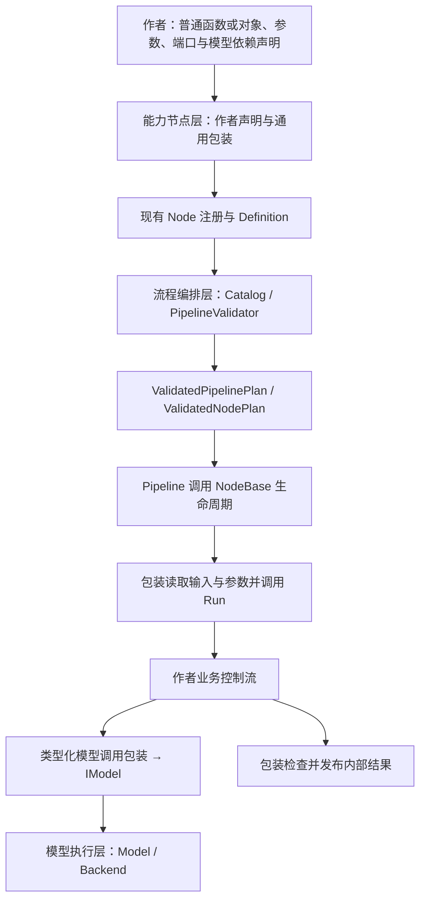

# RFC 0052：面向基础 C++ 开发者的 Node 作者接口重构

- **RFC 编号**：0052-function-oriented-node-authoring
- **创建日期**：2026-09-13
- **文档状态**：Proposed
- **关联分支**：`docs/node-authoring-refactor-plan`
- **目标版本**：下一次投产前开发接口版本；Catalog v3 在 M5 引入
- **负责人 / 作者**：LLM-EdgeFlow contributors
- **设计基线**：`87f490b882a4bc3188e1ec7ee39c1345f3cdceb0`
- **关联决策**：补充 RFC-0012、0018、0030、0038、0039、0041、0044、0051；M5 取代单模型 Node Definition 表示。

本文是可分阶段实施的重构规格。文中的 `NodeResult`、`MakeMapSpec`、`MakeBatchSpec`、
`REGISTER_FUNCTION_NODE`、模型调用包装及测试夹具均为**拟新增接口**，不是当前可用 API。
接口示例固定职责、数据形态和调用关系；实施时先使最小示例参与真实编译，再冻结具体声明。
本文交付只包含设计文档，不代表任何重构阶段已实施或通过验收。

实施流程、分支与交付要求引用 [CONTRIBUTING](../../CONTRIBUTING.md)，不在此另设批准流程。
阅读顺序：第 1–3 节确认范围；第 4–10 节实施作者接口；第 11–14 节实施迁移和工具；
第 15–17 节执行阶段验收。不要只复制接口示例而跳过生命周期、来源和错误契约。

## 1. 问题、目标与当前基础

### 1.1 要解决的实际问题

目标用户能够编写函数、结构体、字符串操作、`if/for` 和简单容器，但不熟悉模板实现、虚函数
生命周期、黑板、模型资源管理与并发调度。常见任务应当只要求其编写业务逻辑、声明参数及
输入输出，并给出独立的样例期望。

当前 starter 虽然只要求修改 `BuildPrompt` / `FormatAnswer`，文件仍包含端口绑定、请求批次、
编号搬运、模型错误与来源检查。增加参数、多输入或第二次推理时，作者容易退回复制框架代码。
改进目标是将这些固定操作收进框架维护的实现，同时保留自由控制业务流程的能力。

### 1.2 基线事实及复用清单

以下以基线源码及执行 `./build/alg_pipeline_tool catalog` / `describe-node` 的结果为依据。
实施开始时重新构建并采集 Catalog，不能从本表推断其他构建可用的节点或模型。

| 现有能力 | 实现入口 | 本次处理 |
| --- | --- | --- |
| 初始化、Process 异常屏障 | [NodeBase](../../include/nodes/node_base.h) | 保留生命周期，新包装继续继承它 |
| 类型端口和计划绑定 | 同上；[ValidatedNodePlan](../../include/core/validated_node_plan.h) | 从作者声明创建同一套 BoundInput/BoundOutput |
| 单模型绑定及配置规范化 | [ModelBoundNode](../../include/nodes/model_bound_node.h) | M1–M4 复用；M5 迁移到统一依赖集合 |
| 批量推理、空批次与来源校验 | [TraceableUnaryInferenceNode](../../include/nodes/traceable_unary_inference_node.h) | 复用行为和校验函数，避免增加深继承链 |
| 字段校验和普通参数结构 | [NodeConfigParser](../../include/nodes/node_config_parser.h) | 增加成员绑定声明，复用通用校验 |
| Definition 辅助构造 | [node_definition_helpers.h](../../include/nodes/node_definition_helpers.h) | 统一衔接新声明，不增加第二套 Catalog |
| 源码、测试生成及登记 | [scaffold_custom_node.py](../../scripts/scaffold_custom_node.py) | 增加作者风格，复用落盘、冲突和恢复机制 |
| prepare/verify recipe | [dev_recipe.py](../../scripts/dev_recipe.py) | 同步模板选择，保留现有部署支持范围 |
| 原生诊断及修复预览 | [PipelineValidator](../../src/core/pipeline_validator.cpp) | 多模型时按具体依赖扩展，不在工具中复制规则 |
| Mock 与局部测试 | [node_test_utils.h](../../tests/support/node_test_utils.h) | 封装为输入/期望夹具，沿用 runner |

[RFC-0051](0051-developer-task-experience.md) 第 11 节记录 M0–M5 已完成，M6 用户试用仍进行中。
本 RFC 延续这些实现，不重做生成、recipe 或 Explain，不自动将 RFC-0051 结项。

### 1.3 可观察目标

1. 新建普通文本转换 Node 后，业务函数不出现 `AlgContext`、`SessionContext`、`BindPort`、
   手工编号构造、JSON 字符串读取或 Node 错误码。
2. 简单参数不再重复维护默认值、字段类型、JSON 读取及 Definition。
3. 模型 Node 可以条件调用、重复调用同一模型；自由批次入口允许普通函数和普通对象。
4. 完成 M5 后，一个 Node 能声明多个模型依赖；每个依赖都参与预检、绑定和并发校验。
5. 业务算法可作为普通函数被多个 Node 复用；完整 Node 继续通过 Pipeline 组合。
6. 日常局部验证主要编辑输入及人工确认的期望，生成及登记机械工作由工具承担。

## 2. 范围与关键决策

### 2.1 本 RFC 的必需交付

| 项目 | 范围 |
| --- | --- |
| Map 入口 | 单输入、单输出、一对一保序；业务函数只处理载荷 |
| Batch 入口 | 一个或多个类型化输入、一个输出；自由控制业务流程；首批内置一对一保序输出策略 |
| LLM 快捷模板 | 作为 Batch 入口上的可选组合，前处理、一次批量生成、后处理 |
| 普通对象 | 允许 `const Run` 及多个辅助函数；首版每次处理创建一个轻量逻辑对象 |
| 参数声明 | 普通结构体成员绑定；基础标量及明确的局部复杂解析扩展 |
| 模型调用 | 首批 LLM；随后增加 Embedding 包装与显式多模型依赖，保留直接 typed IModel 的高级路径 |
| 开发验证 | GTest 夹具、真实生成代码编译、两种 runner 模式、增量反馈及 recipe 接入 |
| 迁移样例 | starter、一个现有单模型节点；PromptGuided 的算法/参数复用；测试专用的多输入自由调用/多模型例子 |

“单输出”指一个内部输出端口，其值可以是已有批类型。不能通过新建混装结构绕过原有独立端口
契约，也不表示限制 C ABI 的输出槽位数量。已有多输出 Node 保持完整接口和原有行为。

### 2.2 明确保留的能力及延期范围

- 保留 `NodeBase` / `ModelBoundNode` 的完整扩展路径。复杂多输出、session 载荷、Control、
  OCR 独立容器、自定义来源变换等继续可开发；本次不要求将所有已有 Node 转成简化入口。
- Filter、Split、Group 的载荷级快捷入口留待独立增量设计，见第 10 节；不默认套用保序校验。
- 通用子流程、嵌套 Pipeline、多键原子发布、异步模型调用和资源热替换不属于本 RFC。
- 不增加新的业务公共端口类型、Model 语义、Backend 或公司 SDK 集成。
- 不增加运行时脚本语言、动态插件、通用反射系统，保持 C++17 和现有依赖。
- 本次不建设任意节点的 JSON `run-node` 或 Studio 单节点执行服务。先用现有测试进程完成
  隔离验证，避免同时设计所有内部类型的 JSON 编解码协议。

### 2.3 采用方案与替代方案

| 方案 | 决策及原因 |
| --- | --- |
| 继续扩大源码模板，标注“不要修改” | 不采用为主要方案；修复不能自动覆盖已生成节点，需求变化仍暴露框架代码 |
| 所有节点都固定为前处理/推理/后处理 | 不采用；无法自然表达条件、多次推理与复杂算法 |
| 无限扩展的通用 Context/service locator | 不采用；隐藏依赖，无法完整预检并发和模型契约 |
| YAML/JSON 再描述一套节点程序 | 不采用；新增语言和双重契约维护，与目标用户的基础 C++ 能力不匹配 |
| 普通函数/对象 + 有限 C++ 声明 + 框架包装 | 采用；保留普通控制流，固定机制集中维护，运行时仍是现有 Node |

## 3. 架构与职责



图中的注册/规划为构建与控制流，不能据此引入 Core 对 `include/nodes/` 的代码依赖。
运行时职责方向保持 Integration → Orchestration → Capability Nodes → Model Execution。

| 所有者 | 新增/调整内容 | 保持的边界 |
| --- | --- | --- |
| 接入适配层 / Integration | 通常无需改动；复用现有业务验收路径 | 外部字段选择、校验、完整响应组装始终属于 Adapter |
| 流程编排层 / Orchestration | M1 的声明工厂异常屏障；M5 的模型依赖、静态校验、计划及 Catalog | 唯一 Validator；显式 id/depends_on；Pipeline 不重解析/排序 |
| 能力节点层 / Capability Nodes | 作者接口、参数成员绑定、调用包装、starter 与试点迁移 | 请求无成员状态；typed ports；不调用别的 Node 绕过调度 |
| 模型执行层 / Model Execution | 使用既有 typed IModel 与 capability traits | 不在 Node 包装中搬入 tokenizer、采样实现、固定 batch 补齐或厂商逻辑 |
| Tooling / Tests | 生成、登记、测试夹具、增量运行及 UI 消费新 Catalog | 不进入 SDK 请求执行路径；不维护独立校验规则 |

## 4. 作者接口：两个执行入口，一套生命周期

### 4.1 Map：作者只处理一个载荷

拟议的完整最小使用形态如下。`Input<TextBatch>` / `Output<TextBatch>` 从类型 traits 创建
typed key，名字、类型及固定来源策略同时供 Definition 和运行时端口使用。

```cpp
#include "nodes/authoring.h"

namespace llm_edgeflow::custom_nodes {
namespace {

struct CleanParameters {
  std::string prefix;
};

auto CleanConfiguration() {
  return Parameters<CleanParameters>({
      Field("prefix", &CleanParameters::prefix)
          .Default(std::string{})
          .Description("添加到文本开头的普通前缀"),
  });
}

std::string CleanText(const std::string& input,
                      const CleanParameters& parameters) {
  std::string output = input;
  while (!output.empty() && output.back() == '\n') output.pop_back();
  return parameters.prefix + output;
}

auto CleanSpec() {
  return MakeMapSpec(Input<TextBatch>("input"),
                     Output<TextBatch>("output"),
                     CleanConfiguration(), &CleanText)
      .Description("去除末尾换行并添加前缀");
}

REGISTER_FUNCTION_NODE(CleanTextNode, CleanSpec());

}  // namespace
}  // namespace llm_edgeflow::custom_nodes
```

约束如下：

- 首版支持 `OutputPayload(const InputPayload&, const Parameters&)` 和返回
  `NodeResult<OutputPayload>` 的函数。无参数使用明确的 `NoParameters` 适配，不无限推断重载。
- 从输入批类型提取 `TraceableItem<T>` 的载荷类型；输出载荷必须匹配输出批类型。
  不支持类型的组合在编译时拒绝，并给出期望函数签名。
- 纯 Map 不注入模型，避免把逐载荷函数悄悄变成逐条模型推理入口。需要模型时使用 Batch。
- 包装顺序读取每项载荷，通过现有 `TraceableItem::Map` 或等价操作保留两个编号；
  不要求作者手工构造 `TraceableItem`。
- 空批次直接发布空批次，不调用业务函数。任意一项失败则本次整个 Node 失败，不发布输出。
- 普通返回值只能表示成功；可失败算法显式返回 `NodeResult`。空字符串是合法值，不表示错误。

### 4.2 Batch：作者决定条件、循环和推理次数

Batch 入口直接处理内部批类型。它隐藏绑定和生命周期，不承诺把所有来源语义也隐藏。
拟议签名固定为：

```cpp
NodeResult<OutputBatch> Run(const Inputs& inputs,
                          const Parameters& parameters,
                          const Models& models);
```

`Inputs` 是普通输入视图结构；`Models` 是所声明的类型化模型调用对象集合；没有配置或模型时
分别使用 `NoParameters` / `NoModels`。允许绑定普通函数或成员函数 `const Run`。

```cpp
struct AnswerInputs {
  const TextBatch* questions = nullptr;
  const TextBatch* context = nullptr;
};

struct AnswerModels {
  LlmCall llm;
};

NodeResult<TextBatch> Answer(const AnswerInputs& inputs,
                           const AnswerParameters& parameters,
                           const AnswerModels& models) {
  auto prompts = MapPayloads(*inputs.questions, [&](const std::string& text) {
    return BuildPrompt(text, parameters);
  });

  auto result = models.llm.Generate(prompts, parameters.generation);
  if (!result.ok()) return result;

  for (int round = 0;
       round < parameters.max_revisions && NeedsRevision(result.value());
       ++round) {
    auto revised = MapPayloads(result.value(), BuildRevisionPrompt);
    result = models.llm.Generate(revised, parameters.generation);
    if (!result.ok()) return result;
  }

  return MapPayloads(result.value(), FormatAnswer);
}
```

本例展示对完整批次重新生成；业务决定停止条件及修正次数。局部重试的来源合并另见第 8 节。
`MapPayloads` 是保持顺序及编号的批转换辅助函数，不是一个新的 Pipeline Node。

对应声明必须同时包含：

```cpp
// 拟议声明片段：具体类型由 MakeBatchSpec 的返回类型保存。
InputsOf<AnswerInputs>({
    Required("questions", &AnswerInputs::questions),
    Optional("context", &AnswerInputs::context,
             InputFlow::AggregateByRequest),
});
ModelsOf<AnswerModels>({
    Llm("generator", "bind_model", &AnswerModels::llm),
});
PreservedOutput<TextBatch>("output", "questions");
```

`MakeBatchSpec` 将输入声明、参数 schema、模型声明、输出策略及处理函数组成一个规格；
`REGISTER_FUNCTION_NODE` 与 Map 共用注册实现。输出策略中的 `questions` 指明输出对齐哪个
输入，不按声明位置或字段名猜测。只有输出对应关系需要此 anchor，其他输入可用于参考或聚合。

其调用顺序固定如下，避免实施者再设计一套与 Map 无关的登记机制：

```cpp
auto AnswerSpec() {
  return MakeBatchSpec(
      InputsOf<AnswerInputs>({
          Required("questions", &AnswerInputs::questions),
          Optional("context", &AnswerInputs::context,
                   InputFlow::AggregateByRequest),
      }),
      PreservedOutput<TextBatch>("output", "questions"),
      AnswerConfiguration(),
      ModelsOf<AnswerModels>({
          Llm("generator", "bind_model", &AnswerModels::llm),
      }),
      &Answer)
      .Description("支持有界修正的文本生成");
}

REGISTER_FUNCTION_NODE(AnswerNode, AnswerSpec());
```

本节 AnswerConfiguration/BuildPrompt 等是业务占位函数，实施用完整编译 fixture 提供定义。
`InputFlow::AggregateByRequest` 在本版只生成已有 `N:1/aggregate/request` 输入契约，不执行
隐藏聚合；默认 Required 为 `1:1/preserve/request`。如果需要不同已存在流契约，高级作者用
显式的 InputContract 参数描述，并仍交给原 Validator 检查，不能另维护不一致的兼容表。

所有已连接输入均在调用 `Run` 前读取并检查，包括 optional 端口；optional 未连接时才是
`nullptr`。已连接但没有值或值类型错误应失败，不能被当作“没有参考材料”。

Batch 的 `Run` 在输入为空时也会调用；作者可按业务返回空结果或错误。快捷 LLM 组合明确
沿用空输入跳过模型的行为。`PreservedOutput` 对空 anchor 只接受空输出；需要无输入生成结果
的 Node 使用现有高级接口，不放宽保序策略。

### 4.3 普通类及复用算法

允许 `MakeBatchSpec(..., &AnswerLogic::Run)`，其中 `Run` 是 `const` 成员函数。包装在每次
Process 内默认构造一个轻量 `AnswerLogic`，参数及模型通过调用参数提供，不保留逻辑对象到
下一请求。不要求业务类继承任何框架类型，也不向它注入可访问任意资源的 Context。

作者可以把逻辑拆成任意数量的普通函数或辅助类。函数对象/类构造必须轻量且无资源加载；
重型预计算应进入参数语义解析产生的不可变派生值，真正的共享资源继续使用高级 Node 设计。
首版不提供捕获任意共享可变状态的 lambda 注册，不提供常驻逻辑对象及隐式 Control。

### 4.4 LLM 快捷组合

`MakeLlmTextSpec` 是可选的规格工厂，组装以下现有行为：

1. 空输入返回空输出；
2. 逐项调用 BuildPrompt，生成保序批次；
3. 一次调用 `LlmCall::Generate`，由底层 Model 自行切批；
4. 校验模型结果后逐项 FormatAnswer；
5. 全部成功才交给单输出包装发布。

该工厂复用 Batch 包装和模型调用检查，不再复制一份 ProcessNode。需要分支或重复推理时，
只将规格里的快捷组合替换成自由 `Run`；节点类型、端口、参数和绑定字段可保持不变。
不得把可选快捷模板变成全部模型 Node 必须继承的固定流程。

## 5. 包装、注册及编译边界

### 5.1 实现结构

采用一个 `AuthorNode<Spec>` 薄包装，直接继承 `NodeBase`，通过组合使用输入绑定、配置解析、
模型绑定和执行策略。Map/Batch 是执行策略，不再叠加多级基类。

`Spec` 在注册时构造一次，持有静态元数据、函数指针及类型化成员访问器；不得保存请求数据、
模型句柄或部署资源。每个 Node 实例独立持有解析后的参数、已解析端口和会话模型句柄。

C++17 实现可在声明阶段将不同成员指针封装为同一所属结构体的绑定条目，用于 Init 和生成
Definition；Process 中的输入载荷与业务调用保持类型化。不得为实现成员绑定将请求载荷转为
JSON 或 `map<string, any>`。工厂返回类型保存处理函数/成员函数的确切类型；成员函数所属类
从指针类型确定，并由包装局部创建。运行时保持一套 NodeBase 调度调用，不逐项动态查注册表。

`REGISTER_FUNCTION_NODE(TypeName, SpecExpression)` 只承担以下固定工作：

1. 建立可默认构造的具体 Node 类型或类型别名，确定唯一 `kNodeType`；
2. 由同一个 Spec 生成 `NodeDefinition` 与 Node 构造参数；
3. 最终使用现有 `REGISTER_NODE_WITH_DEFINITION` 注册构造函数和 Definition。

宏不解析业务函数体，不捕获变量，不维护独立表，不执行模型加载。重复节点名继续由现有注册
冲突机制处理。默认 `category=custom`、`biz_names=[]`、`parallel_safe=false`；common 试点
显式使用 common 元数据，不能因包装迁移改变归属。

**注册时的声明构造也必须处于异常屏障中。** 当前 REGISTER_NODE_WITH_DEFINITION 的
`noexcept` 静态 lambda 先求值 Definition，随后才进入 Register 内的 try/catch；若新 Spec
在此前因非法声明抛异常，进程会在 main 前终止。M1 对同一注册入口作以下最小加固：

- 在 NodeRegistry 增加模板方法 `RegisterWithDefinitionFactory(name, creator, factory)`，
  name 接收不分配内存的 string_view；creator/factory 作为 callable 参数传入，不在外层先
  构造可能分配的 std::function。方法自身在 try 内求值 factory、形成 Definition 及 CreatorFunc，
  再调用既有 Register；捕获标准和未知异常后用现有注册失败记录机制标记错误并返回 false。
- REGISTER_NODE_WITH_DEFINITION 保持调用语法，将 Definition 表达式延迟到上述 factory；
  REGISTER_FUNCTION_NODE 最终仍通过该宏。Spec 工厂只在此受保护路径求值，不能提前以
  未保护的命名空间静态对象执行用户工厂。
- 声明失败时不发布该 Node 的可用 creator，Catalog/Validator 报注册失败；错误含节点名和
  声明原因。避免先注册一个缺省空 Definition 再尝试补全。
- 增加独立启动 fixture：非法默认值、重复参数成员及主动抛异常均不得 abort；CLI 能启动并
  以失败状态报告诊断。复用现有注册冲突可执行 fixture 机制，不污染常规生产注册。

此项仅收口同一注册入口的声明求值边界，不更换 NodeRegistry 或 NodeBase 生命周期。

### 5.2 参数化初始化与处理顺序

| 阶段 | 工作顺序与失败边界 |
| --- | --- |
| 原生预检 | Definition 完整性 → 字段规范化 → 参数语义/连线约束 → 模型依赖及 DAG/并发 → Plan |
| Init | 从 Plan 取绑定；防御校验参数 → 构造完整参数 → 解析 typed 模型句柄 → 发布实例就绪状态 |
| Process | 读取输入视图 → 创建请求局部逻辑对象 → 调用业务 → 检查结果契约 → 单次发布输出 |

包装不依赖 `PipelineValidator` 头文件，Init 不重新构建 DAG；预检与防御初始化复用同一字段
列表和语义函数。一个阶段失败不得留下“部分可用”的新实例，Pipeline 保持既有失败状态机。

### 5.3 端口契约与输出策略

- 一份 typed 声明产生 logical name、type_id、required、cardinality、provenance、lifetime
  及对应运行时绑定；不让用户在构造器、成员、Init 和 Definition 四处重复写同一端口。
- 首版普通入口仅支持 `lifetime=request`，以已注册的 `vector<TraceableItem<T>>` 批类型为主。
  `ImageRefBatch` 等独立容器不可假装满足此模板，需要未来显式 traits 或高级接口。
- 内置 `PreservedOutput` 输出契约为 `1:1/preserve/request`，逐项比较数量、顺序和两个编号；
  校验复用 `ValidatePreservedTraceableAlignment`。它不额外推断编号唯一性。
- 未支持的输出来源策略在 Spec 构建/编译时拒绝；M1–M6 不提供返回 true 的“跳过校验”开关。
  自定义重排、拆分、聚合使用高级接口并声明真实契约。
- 有 Plan 时，包装明确要求输出绑定存在且类型匹配，不依赖 `BoundOutput` 缺绑定时的默认键
  回退。无 Plan 测试初始化只支持第 7.5 节限定的默认键路径。
- 注册类型必须具备正确 `BlackboardTypeTraits`。不能宣称任意 C++ 结构或 move-only 类型
  都可发布；底层 `std::any` 及既有载荷所有权要求继续适用。

### 5.4 所有权与发布保证

输入视图只在当前调用中借用；不得保存到 Node 成员、静态变量或后台任务。输出值由业务局部
构造，移动给发布接口；嵌套指针/视图的生命周期仍遵循原载荷契约，按值返回不能修复悬空引用。

新包装只有一个输出端口。业务失败、模型失败、格式化异常或来源校验失败发生在发布之前，
故不发布本次输出。重复 key 继续保留旧值并报告错误。

**当前 AlgContext 没有多键事务。** 现有高级多输出 Node 如果在第二次 Set 时失败，先前发布
的值不会自动撤销；Pipeline 必须失败，不能作为完整成功结果返回。本 RFC 不增加回滚，也不
将“先构造所有输出”描述为多输出原子提交。

## 6. 参数：普通结构体成员与单份声明

### 6.1 唯一事实源

`Field(name, &Parameters::member)` 关联外部字段和 C++ 存储位置，从成员类型推导字段类型。
默认值、范围、枚举及 semantic 在 Field 描述中各声明一次，同时用于：

- 生成 `NodeDefinition.config_fields`；
- 复用 `ValidateAndNormalizeFields`；
- 将已校验字段赋给成员；
- 向 Catalog/Studio 提供同一份说明。

参数结构仍是普通 C++，需要声明成员；本方案消除重复的**类型描述、默认值和解析逻辑**，
不承诺 C++17 自动反射成员名称或自动生成任意结构体。参数成员不再设置第二套业务默认值。
示例中的 `Parameters`、`Field` 为有限的 C++ helper，不引入额外文件语言或 AST 解析器。

Spec 必须先将业务参数字段与模型绑定字段合并成最终字段表，检查重名后，才构造实际用于
Definition、预检和 Init 的 `NodeConfigParser<P>`。原始 config 始终按这份最终字段表规范化；
成员读取器只赋值其声明负责的成员，模型绑定器读取已声明的绑定字段。不得拿“仅业务参数
字段”的 Parse 去处理包含 bind_model 的完整 config，否则会错误拒绝合法模型字段。

### 6.2 首版支持及精确语义

| 项目 | 行为 |
| --- | --- |
| 基础类型 | `std::string`、`bool`、`int`、`int64_t`、`double` |
| 非必填字段 | 基础成员绑定必须显式给 Default；缺失时使用该默认值 |
| 必填字段 | 显式 Required，不同时声明 Default；缺失失败 |
| null | 不是缺失；基础标量显式 null 均按类型错误拒绝 |
| 整数 | 拒绝浮点 JSON；读取前检查目标 C++ 表示范围，禁止截断或溢出 |
| 范围/枚举 | 进入同一 ConfigFieldDefinition；字符串枚举沿用既有规则 |
| 未知字段 | 由原通用规范化路径拒绝，不静默忽略 |
| 字段/成员重复 | 相同外部字段重复、同一个成员绑定多次均拒绝，除非未来单独设计别名契约 |
| 派生成员 | 仅由参数语义函数计算，不宣称能反射检查所有未绑定成员 |

成员读取器应把目标整数范围约束也带入预检使用的解析路径。现有 schema 数字边界以 double
存储，不能单靠它保证所有 int64_t 边界；转换前做精确 signed/unsigned 范围检查，预检与 Init
都执行该检查。非法默认值在 Definition/声明检查阶段拒绝。

### 6.3 复杂参数和连线约束

简单参数直接使用成员绑定。嵌套数组、模板语法及组合规则继续复用 `NodeConfigParser<P>`：
允许同一局部 schema 将“基础成员绑定”与“显式复杂字段+解析函数”组合，合并后检查字段名
唯一性；最终仍只有一份字段表和一个语义解析过程。不得暗中读取未声明字段。

语义函数处理已转换的普通参数及派生值，返回成功/说明；无外部 I/O、模型加载或请求访问。
与输入连接相关的规则，例如模板引用 context 时必须连接 context，使用 Spec 上明确的
`ValidateBindings(parameters, connected_inputs)` 钩子；预检及 Init 都执行同一规则。

公开参数工厂可有 Parse/ParseNormalized 两个框架内部入口，但日常业务 `Run` 只接收
`const Parameters&`。原始配置先规范化；Plan 路径仍作防御校验，不以“此前验过”省掉 Init
边界。不进行 JSON dump/parse，不跨预检与 Init 缓存解析对象。

## 7. 模型推理：类型化注入与自由控制流

### 7.1 调用包装的职责

首批实现 `LlmCall`，M5 增加 `EmbeddingCall`，方法分别对应已有 `ILlmModel::Generate` 与
`IEmbeddingModel::Embed`，参数保持既有 GenerateOptions / EmbeddingOptions 语义。

```cpp
NodeResult<TextBatch> LlmCall::Generate(
    const TextBatch& prompts, const GenerateOptions& options) const;

NodeResult<EmbeddingBatch> EmbeddingCall::Embed(
    const TextBatch& inputs, const EmbeddingOptions& options) const;
```

两种包装只负责：空批次直接返回空批次、调用 typed IModel、收集返回码、成功结果的数量/来源
校验、产生结果对象。每次非空调用只调用一次 typed Model 方法；Model 可在内部执行多个
固定 batch。继续使用 `FixedBatchExecutor::Execute` 的既有实现，不在包装中另做 padding。

包装不改变模型选项含义，不推断模型路径，不按厂商分支，不自动重试，不将失败转为空串。
`Generate` 等成功的前提是编号和数量对应本次输入；Node 最终输出还需通过输出策略检查。

### 7.2 模型对象及调用期生命周期

已加载模型仍由 SessionContext/ModelManager 管理，Node 保存安全共享句柄。调用包装是只读
访问能力的门面：由绑定器初始化，对作者不暴露 Session、ModelManager 或任意 GetModel。
首版调用门面禁复制、可移动，由框架构造 Models；作者通过 `const Models&` 使用。

模型调用包装不保存上次输入、输出或错误，不把临时 Result 放进成员；方法可从不同请求调用
不代表底层模型允许并发，必须服从第 9 节。禁止在请求结束后保留输入视图或异步继续推理。

### 7.3 固定快捷模板与自由 Run 的性能区别

Map 本身不访问模型；快捷 LLM 先形成整个批次再调用。自由 Run 可以循环调用模型，也可以
创建子批次，但不会自动改写作者的控制流或做跨请求动态 batching。

不得声称将任意逐样本推理循环“自动合批”。自由调用的测试应记录非空输入规模及实际 Model
调用次数；跨模型时每种能力单独统计。业务循环必须提供明确停止条件；示例使用有界
`max_revisions`，不会偷偷从框架发起无限重试。

### 7.4 多模型依赖元数据（M5）

以一个统一向量取代 NodeDefinition 现有 `model_capability/model_config_field` 两个标量：

```cpp
struct NodeModelDependency {
  std::string name;          // Node 内稳定槽位名，例如 generator
  std::string capability;    // 由 typed capability traits 推导
  std::string config_field;  // config 中引用 model_id 的字符串字段
};

std::vector<NodeModelDependency> NodeDefinition::model_dependencies;

struct ResolvedNodeModelBinding {
  std::string name;
  std::string capability;
  std::string config_field;
  std::string model_id;
};

std::vector<ResolvedNodeModelBinding> ValidatedNodePlan::model_bindings;
```

首版所有已声明依赖都是初始化必需的。字段可以显式 required，或使用既有非空默认 model_id；
规范化后的值必须存在且非空。即使某个分支不调用某模型，也必须完成绑定和静态检查。
可选/延迟加载依赖不在本次范围内。

声明名及 config_field 分别唯一、均非空；所引用 config field 必须是字符串。新 ModelsOf
声明同时生成绑定字段和依赖元数据；若业务参数 schema 使用同名字段，注册失败，不能维护
两个可编辑来源。typed wrapper 与 capability 不匹配时尽早在编译/声明阶段拒绝。

示例最终 Catalog v3 片段：

```json
{
  "model_dependencies": [
    {"name": "generator", "capability": "llm", "config_field": "bind_model"},
    {"name": "encoder", "capability": "embedding", "config_field": "bind_embedding"}
  ]
}
```

Pipeline 继续使用既有 config 对象，不增加新的运行时 Pipeline 格式：

```json
{"bind_model": "answer_model", "bind_embedding": "document_encoder"}
```

### 7.5 预检、计划及初始化

1. Catalog 检查依赖定义的唯一性、字段类型和完整性；只依赖中立 Definition，不包含作者模板。
2. Validator 对规范化 config 中每个绑定检查 model_id 存在、能力匹配，并保存全部已解析
   绑定到 ValidatedNodePlan。错误路径精确指向该 config_field，正确转义 JSON Pointer。
3. 现有 Model 计划继续保存实际有效并发类别；Node 绑定通过 model_id 关联，不在多处维护
   可分歧的并发数据。
4. 初始化优先消费 Plan 的 model_bindings；再次确认所需槽位与 typed capability，并从
   ModelManager 取得模型。缺失、重复或与声明不一致的绑定必须失败，不能静默改读其他字段。
5. 无 Plan 的直接初始化仍可复用相同字段规范化及轻量模型依赖解析辅助，再进行 typed 获取；
   不允许 Node 调用完整 Validator。辅助放在现有可见 Core 契约范围，不能复制 DAG 或并发
   规划。在下述受支持的端口子集内验证模型绑定及参数错误一致。

现有 NodeInitContext 没有独立的端口映射或 connected_inputs 承载。本次不扩展该公开结构：
新 AuthorNode 的无 Plan 初始化只支持**全部输入必需、实际键等于逻辑名**的节点。Init 以所有
必需输入的逻辑名作为已连接集合，Process 再检查实际值存在性；该约定不证明生产者/DAG 合法。
带 optional 输入的 Spec 在无 Plan Init 时明确失败并提示使用已验证计划；自定义键映射测试也
必须走真实 Plan。不能在 Init 期间猜测尚不存在的请求黑板内容。原有高级节点的无 Plan 行为
保持自身既有契约，不被新包装的限制追溯覆盖。

`ModelBoundNode<T>` 保留为高级单模型便利入口，迁移后要求恰好一个依赖且 capability 与 T
匹配；复用统一绑定实现。不要让新包装读向量而旧基类继续维护第二套标量绑定。

## 8. 错误、重试及来源

### 8.1 NodeResult 与错误传播

在能力节点层新增 `NodeResult<T>` 与 `NodeFailure`，Result 总是明确处于成功或失败之一；
失败态不包含可被当作成功输出的 T。提供 `ok()`、成功值访问、失败访问和移动提取；
`[[nodiscard]]` 及编译告警帮助发现丢弃的失败，但不声称能静态证明所有错误都被处理。

接口允许从 T 的右值构造成功结果，并用 `NodeResult<T>::Failure(NodeFailure)` 构造失败；
不提供含糊的默认成功结果。跨输出类型传播错误必须显式取出 NodeFailure 再构造目标 Result，
不能把 `NodeResult<EmbeddingBatch>` 当作 `NodeResult<TextBatch>` 返回。`value()` 对失败态
不得返回默认 T，应触发可被 NodeBase 捕获的明确逻辑错误。错误状态可移动传播，不复制整批
成功载荷；测试覆盖移动语义及失败态访问。

NodeFailure 至少包含 kind、message，可携带 stage、逻辑模型槽位、底层 cause_code 和来源
位置。kind 限定为业务失败、模型调用失败、输出数量错误、来源错误、输入错误；未知异常沿用
NodeBase 异常屏障。包装在最终失败时通过 `Fail` 写入请求诊断，节点实例定位沿用 Pipeline。

框架内部错误类别由 `include/nodes/node_error_codes.h` 统一分配名称与不冲突数值；不要让
入门作者分配负整数。M0 记录现有数值基线，实施时为新类别选择空闲区间并增加冲突检查。
迁移已有节点时保留原返回码及已有业务可观察语义，可用显式 ErrorPolicy 映射；底层 cause
仅提供原因，不无条件替代节点既有错误码。错误归因格式测试检查稳定字段/片段，避免锁死整句。

### 8.2 失败结果不立即污染 AlgContext

`LlmCall` / `EmbeddingCall` 失败只返回 NodeResult，不调用 `ctx.SetError`。这样业务能显式
重试同一次调用并最终成功，不会出现返回成功但 Context 留着旧错误。最后未恢复的失败才由
Node 包装写入请求错误；重试历史可记录日志，但不成为成功请求的最终错误状态。

框架不默认重试。作者有意降级时需保持现有业务可辨识状态契约；没有状态字段的输出不能
通过塞入伪造文本掩盖失败。Node 包装不会拦截失败后悄悄发布“默认回答”。

### 8.3 批次来源与子批次

`MapPayloads` 保持每项 req_id/sub_id 和顺序，不把数组下标当来源。结果检查复用既有保序
函数；它不检测输入重复编号，因此不把此函数宣传为通用来源证明器。

自由 Run 若要仅处理部分项，首版允许作者显式构造保留原编号的子批次，并依据原输入位置
合并结果；最终保序校验仍执行。通过编号回填前须拒绝重复/未知编号，不能盲目覆盖。
本次不提供默认去重、自动排序或自动关联；这类通用 helper 必须先确定契约和失败案例。

多输入的业务关联由作者声明选择：逐项关联使用 `(req_id, sub_id)`；参考片段聚合按 req_id。
可选 context 的端口声明本身不自动实施关联。PromptGuided 试点复用其当前按请求聚合语义，
不按两个 vector 的下标 zip。

## 9. 并发、状态与 Control

### 9.1 默认声明和实际能力

`parallel_safe=false` 仍为默认。它表示不能被放进要求其并行安全的多节点并行层，不表示框架
为其自动加锁或将并行层改为串行。只有审查作者函数、静态变量、辅助对象与依赖后才设 true。
普通函数、`const Run`、每请求逻辑对象均不能自动证明外部共享资源安全。

### 9.2 多模型并发校验

Validator 将当前“每节点一个 model_id”改为每节点的模型 ID 集合：

- 同节点多个槽位绑定同一 model_id 时先去重，避免误报自己与自己冲突。
- 同一并行层不同节点共享任何一个 serialized 模型时拒绝，包括第二或第三个槽位。
- 对所有可能执行的分支依赖保守检查，不尝试证明业务 if 的互斥性。
- 保留 ModelRuntimeFactory 对实际 Model/Backend 并发能力与 Definition 的核验。

当前 ModelManager 的锁只保护资源表，**不会串行化推理**；当前 Pipeline 也没有逐调用的
自动资源调度器。首版模型门面只支持同步调用，自由 Run 不得自行创建线程/异步任务并发使用
serialized 实例。跨请求及高级直接调用继续服从现有句柄并发约定，不能从新接口推导新保证。

### 9.3 配置更新

首版简化入口参数在 Init 后不可变；Control 请求沿用 Unsupported。需要 Control 的既有
节点保持原接口，不把其能力删除，也不迁移至一个丢失 Control 的简化 Node。

未来如加入统一参数替换，必须显式选择命令、更新范围和失败语义，先构造完整新值，再发布
不可变快照，一次 Process 读取同一快照。含模型/外部资源的热替换不归普通参数更新处理。
本 RFC 只固定扩展边界，不提供未设计完成的热更新 helper。

## 10. 算法复用、完整节点复用及后续处理形态

### 10.1 算法可直接复用

重复的清洗、模板渲染、排序等逻辑提取为普通函数或普通算法类。custom 共享代码继续按操作
组织在 `src/custom_nodes/`，不按业务新建目录。多个 common/custom 使用方确有共同需求时，
由能力节点层维护中立 helper，放 `include/nodes/` 与必要的 `src/common_nodes/support/`。
Core、Model/Backend 和 common 不包含 custom 实现；不要为共享而把领域算法搬入 Core。

只提取试点确实重复的纯算法，不创建空的全局算法库，不强迫所有 Node 分拆成多个文件。
共享 helper 自身不参与调度、Control 或 Catalog 注册；它的调用成本就是普通函数调用。

### 10.2 完整节点继续由 Pipeline 组合

完整 Node 的端口、参数、绑定、初始化及执行由 Pipeline 管理。不能在业务 Run 中通过注册表
创建另一个 Node 后直接调用 Process，不能在模型门面中塞入 ExecuteNode/ExecutePipeline。

若未来需要复用一段图，另行设计编排层子流程，优先评估构建时展开到显式 DAG 的方案，并
明确实例命名、端口映射、模型资源、诊断和 Control 定位。本次没有子流程实现，不承诺循环图。

### 10.3 Filter / Split / Group 的后续约束

这些快捷入口不是 M1–M6 完成条件。后续设计必须逐项确定以下内容，完成前使用高级 Node：

| 形态 | 必须明确的语义 |
| --- | --- |
| Filter | 输出保留原编号及相对顺序；全部过滤是合法空值；需要独立于 1:1 的真实数量契约 |
| Split | 同请求多个父项统一分配 uint32 子编号；稳定顺序、编号溢出、空子项、计数辅助输出 |
| 嵌套拆分 | 当前 TraceableItem 没有 parent lineage，不能承诺仅凭新 sub_id 可恢复全部父子关系 |
| Group | 按 req_id 还是完整编号分组；输出编号/顺序；没有成员的请求从哪个显式 anchor 枚举 |
| Join | 缺失、重复、一对多和顺序规则；禁止默认按数组下标关联 |

尤其不能因为返回 `vector<T>` 就自动生成一个来源规则。“让框架搬运编号”和“由框架猜测业务
关系”是两件事；本 RFC 只对已明确的一对一形态提供默认保证。

## 11. 源码布局与影响清单

下表中新路径均为实施计划，创建前检查是否已有等价 helper，避免重复维护。

| 路径/模块 | 工作及责任 |
| --- | --- |
| `include/nodes/authoring.h`（新） | 作者总入口，只聚合所需能力层头文件，不暴露完整 Validator |
| `include/nodes/function_node.h`（新） | AuthorNode、Map/Batch Spec、注册桥及函数签名检查 |
| `include/nodes/node_result.h`（新） | NodeResult / NodeFailure；能力层内部协议 |
| `include/nodes/parameter_binding.h`（新） | 字段成员绑定及与 NodeConfigParser 衔接 |
| `include/nodes/model_calls.h`（新） | LLM/Embedding 同步调用包装 |
| `include/nodes/traceable_algorithms.h`（新） | 保序 MapPayloads；不提前实现未确定来源策略 |
| `include/nodes/node_definition_helpers.h`、`model_bound_node.h` | 复用声明、M5 迁移统一模型依赖 |
| `include/core/node_registry.h`、`src/core/node_registry.cpp` | M1 注册工厂异常屏障及失败诊断；保留既有注册语法与机制 |
| `include/core/node_definition.h`、`validated_node_plan.h` | M5 元数据/计划；中立类型不得包含 nodes 头文件 |
| `src/core/pipeline_catalog.cpp`、`pipeline_validator.cpp` | M5 Definition 校验、序列化、依赖解析、并发及 Explain |
| `src/tools/alg_pipeline_tool.cpp` | M5 describe-node 的版本及 plan 新字段输出，不能只改 Catalog 顶层版本 |
| `include/core/session_context.h` | 原模型管理器原则上保留；只在确有共享绑定契约时最小提取，不另建池 |
| `dev_support/node_authoring/` | 新可编译 starter；旧高级模板按第 13 节保留 |
| `scripts/scaffold_custom_node.py`、`scripts/dev_recipe.py` | 新作者风格与生成测试；同一渲染入口 |
| `tools/pipeline_studio/web/app.js`、`workbench.js` | M5 所有模型槽位的编辑、改名、删除、替换与候选过滤 |
| `cmake_ext/TestInventory.cmake`、`CustomNodeTests.cmake` | 同一测试源清单接入已有 runner |
| `cmake_ext/ScaffoldFixtures.cmake` | 新生成源码参与真实编译及测试发现 |
| `cmake_ext/LayerHeaderViews.cmake`、`node_core_contracts.txt` | 验证作者头文件可见；只有新增中立 Core 契约时调整白名单 |
| `scripts/check_layer_dependencies.py`、分层编译测试 | 验证没有 Core→nodes 或 nodes→完整 Validator 依赖 |

不要先创建所有空文件。按 M1–M5 的实现需要加入；能留在一个小 helper 的内容不强行拆目录。
作者逻辑仍按操作直接放在 custom_nodes 中。模板/inline 支持留作者头文件；非模板实现留在
能力节点层目标，不能为链接方便移入 Core。

## 12. 测试夹具与开发反馈

### 12.1 两级验证

1. 普通算法函数可直接单元测试，使用普通输入值和独立期望；这证明算法行为。
2. `NodeHarness`（拟新增测试侧 helper）通过现有注册创建真实 Node，准备计划/Session/
   AlgContext/模型，验证同一算法在实际 Node 边界的输入输出与错误。这证明包装及契约。

Harness 不从生产作者头文件导出，不进入 SDK 或生产 Catalog。它放在
`tests/support/node_harness.h`，复用 `node_test_utils.h` 中的模型替身和绑定基础。

建议的普通用例表达：

```cpp
TEST(CustomNodeCatalogTest, CleanTextNode_RemovesTrailingNewline) {
  NodeHarness harness("CleanTextNode");
  harness.Config({{"prefix", "任务："}});
  harness.TextInput("input", {"hello\n", "world"});
  auto result = harness.Run();
  ASSERT_TRUE(result.ok()) << result.diagnostic();
  EXPECT_EQ(result.TextValues("output"),
            (std::vector<std::string>{"任务：hello", "任务：world"}));
}
```

默认编号由 fixture 生成且确定，至少两请求与非零 sub_id；显式来源用例允许覆盖编号，不使
每个业务测试都手写搬运。`TextValues` 必须先检查类型和存在性，读取失败不可返回空数组伪装成功。

### 12.2 Harness 的精确职责

- 按 Catalog 的逻辑端口接入样例，但使用不同实际 key 验证绑定有效；不直接调用作者函数
  替代真实 Node 执行。
- 正常路径使用真实 Validator 生成的内部测试计划；可使用现有无 biz 内部测试策略，不为
  每个 Node 新增生产 biz。必须清楚标明未证明 Adapter/C ABI 外部协议闭合。
- 无 Plan Init 用例仅覆盖第 7.5 节默认键/全必需输入子集的参数和模型绑定一致性，并验证
  optional Spec 被明确拒绝；不以它代替正常计划路径或任意端口映射。
- 返回初始化 diagnostic、Process 返回码与请求错误，不能只有 bool 或固定失败文字。
- 可绑定已有 Mock，并设置成功、少返回、错编号、推理失败；记录提示词、选项及调用次数。
- 默认检查输出策略对应的来源；不把实现函数输出当作期望生成器。
- 生命周期遵循现有测试 RuntimeEnvironment 初始化约定；多个 case 之间不泄漏模型或配置。

### 12.3 测试与命令复用

生成的业务测试仍使用 `CustomNodeCatalogTest.<NodeType>_*` 命名，源码登记到同一
CustomNodeTests 清单。默认 runner 为 `edgeflow_test_nodes_runner`，individual 为
`test_common_nodes`；从选定构建目录的 CMakeCache 确认，不能硬编码。

已有配置下，局部开发示例：

```bash
cmake --build build --target edgeflow_test_nodes_runner
./build/edgeflow_test_nodes_runner --gtest_filter='CustomNodeCatalogTest.CleanTextNode_*' --gtest_list_tests
./build/edgeflow_test_nodes_runner --gtest_filter='CustomNodeCatalogTest.CleanTextNode_*'
```

名字为实施后的示例 Node，执行前须实际生成并登记。工具先枚举并确认非零用例，零匹配视为
失败；不以 GTest 空运行的退出码报告通过。测试产物路径必须与当前源码/构建目录一致。

## 13. 脚手架与默认开发路径迁移

### 13.1 新入口与兼容

在现有脚手架增加 `--authoring basic|advanced`：初期缺省保持 advanced；M6 验收通过后，
面向新手的 recipe 和教程显式使用 basic，不在本 RFC 内静默改变旧命令的缺省输出。

- basic + compute：只支持首批 Map 组合；
- basic + model + llm：生成 LLM 快捷组合，可切换至自由 Batch；
- basic + 其他不支持的组合、Control 或未知批类型：写入前明确拒绝并给出 advanced 路径；
- advanced：保留当前 compute/model/unary_inference/Control 及端口参数行为；
- `--write-test` / `--add-to-cmake` / dry-run / 冲突恢复继续复用现有 ChangePlan，禁止静默覆盖
  作者已修改文件。`--generate-test` 的已有片段输出语义不变。

基础模板、独立测试与 recipe 使用同一个渲染函数，不出现 CLI 生成新模板、recipe 仍生成旧
框架代码的分裂。批次自由模板以可编译 starter 形式提供；不要求第一版脚手架支持交互输入
任意多端口/多模型拓扑。

### 13.2 内循环与完整方案验证

日常修改函数后先增量编译并跑该节点用例。已有 recipe 的 prepare/verify 继续负责完整方案
产物及 Demo；不要因为 Harness 容易运行，就让 recipe 改为只测函数。

RFC-0051 的 recipe 当前限定 TextBatch 单输入/单输出、LLM 与单输出部署 conf 路径；本 RFC
不扩大到任意节点/多输出部署。新增隔离测试与 recipe 都清楚报告自身验证范围。

## 14. 兼容、迁移与回退

### 14.1 Catalog v3 与单模型声明迁移

M1–M4 保持当前 Catalog v2，基础包装将单模型声明降低到现有两标量字段。
M5 在一个完整变更集中迁移所有生产/测试注册与消费者至 v3：

- NodeDefinition 删除两旧标量，以 `model_dependencies` 为唯一模型声明；无模型为空数组。
- 单模型节点仍使用原 `config.bind_model` 及原默认值，旧 Pipeline JSON 不因元数据迁移而改写。
- Catalog 与 describe-node 输出 `schema_version=3`，删除旧模型标量，不维护可分歧的双写兼容层。
- Studio、CLI 辅助、recipe、验证脚本、fixtures、文档示例同时迁移；旧客户端遇到不支持版本
  必须明确报版本不兼容，不能将缺标量理解为“无需模型”。不要假定第三方旧客户端已实现此检查。
- 本仓库维护的消费端在切换前添加严格版本握手；外部使用者须使用同版本工具重新构建/升级。
  本次是源码扩展接口变化，不保证旧 C++ 二进制插件兼容；公开 C ABI 保持原契约。
- Plan 的 model_bindings 为内部计划附加信息；若 CLI plan 序列化该信息，按其现有报告版本
  规则增加字段并测试消费者，不能误把 Catalog 版本当作 Pipeline 文档版本。

没有正式投产允许集中迁移，但不允许在同一交付中混用 v2 工具与 v3 Catalog。阶段结束前
通过全仓检索确认旧字段不再作为运行逻辑；历史 RFC 引用不作机械改写。

### 14.2 Studio 与 Explain 必改行为

1. 编辑模型字段时根据该槽位 capability 筛选候选，而非节点唯一能力。
2. 模型改名更新所有节点所有槽位，包括同节点多个引用。
3. 删除模型检查全部引用；替换模型能力检查所有受影响槽位。
4. 第二槽位错误的 remediation/fix 只修改第二槽位；候选仍由同一 Validator 验证。
5. serialized 冲突错误定位到实际引用字段，并指出其他冲突节点。
6. 读取 schema version 不支持时停止相关编辑/验证，并给出工具版本说明。

### 14.3 试点迁移顺序

| 对象 | 迁移内容 | 必须保持 |
| --- | --- | --- |
| 新 Map fixture | 验证参数与普通函数入口 | 不新增无用途的生产 common Node |
| starter_llm_node.cpp | 快捷组合替代生命周期模板 | BuildPrompt/FormatAnswer 行为、测试注册隔离 |
| LlmGenerateNode | 复用调用包装及一致错误策略 | node_type、prompt/text 端口、配置默认值/范围、返回码、批次调用 |
| PromptGuidedLlmNode | 保留高级生命周期；按实际复用需要提取纯算法、衔接参数 helper；M5 迁移模型元数据 | optional context 的条件读取/空主输入快捷返回、模板三种语法、默认值、输出及错误码 |
| 测试专用自由/多模型 Node | 多输入视图、条件二次推理、LLM+Embedding、模型槽位验证 | 仅测试注册，不进入生产 Catalog |

PromptGuided 当前先处理空主输入，且仅在模板实际引用 context 时读取该端口；新 Batch 默认
预先检查所有已连接输入，两者不完全等价。因此本次不把 PromptGuided 的 Process 迁入新
包装，也不为迁移它而增加复杂的条件读取 DSL。新增自由 Batch fixture 明确接受其自身较严格
的输入契约，并可复用提取后的纯算法。增加迁移回归：空主输入、未引用但已连接的 context
缺值/错类型、实际引用 context 的成功与失败，均保持 PromptGuided 当前行为。

PromptGuided 的复杂 schema 可走第 6.3 节局部解析扩展；不能为了统一 helper 改写其模板语义或
将业务解析搬进框架。TextEmbedding 的 session/lifetime、Ocr 多输出、TextRuleMatch Control
等也不强行迁移，M5 只改其模型元数据所需部分。高级接口是持续支持的路径，覆盖复杂节点
不以“所有 Node 都已换基类”作为重构完成指标。

### 14.4 回退

M1–M4 可逐节点恢复旧实现，保留相同注册名/外部契约，不让新旧实现同时注册。
M5 的回退必须整体恢复匹配的声明、Catalog、工具和测试版本，不能只回滚 Node 包装。
源文件与配置回退按 Git 正常变更执行，保留作者自定义逻辑；生成器从不自动重写已有节点。

旧完整扩展接口继续作为高级路径；不会在 RFC 完成时删除所有旧 helper，也不保留两份长期
可编辑的模型元数据。后续删除已无人使用的快捷 helper 应有明确引用清理和独立变更。

## 15. 验证矩阵

测试应证明契约和失败边界，避免仅复述实现或只检查“创建成功”。新增测试源可接入现有
TestInventory 和 runner，不新建每 Node 一个可执行文件。

| ID | 需要证明的行为 | 最小落点 |
| --- | --- | --- |
| A1 | Map 多请求/非零 sub_id 保序、输入未修改、空批次不调用；中间项失败无输出 | 新 `tests/unit/nodes/test_function_node.cpp`，接既有 nodes runner |
| A2 | Batch 空输入调用 Run；optional 未连/已连空/已连缺值区分；anchor 错误失败 | 同上 |
| A3 | 普通对象每请求创建，跨请求参数/输入无污染，引用有效期正确 | 同上及 `test_node_ownership_and_reuse.cpp` |
| A4 | 错误函数签名、未知 batch traits、错模型成员类型编译失败并给可读诊断 | 现有分层/编译 fixture 机制，增加小型正反例 |
| A5 | 重复 output key 保留旧值且失败；最终业务失败不发布新输出 | 同上及 typed blackboard suite |
| A6 | Spec/Definition 求值抛异常、重复成员、非法默认值不 abort，注册失败有诊断 | 现有独立注册冲突 fixture 机制；验证进程退出状态 |
| C1 | 默认/必填/null/未知字段/精确整数上下界/非法默认一致 | 新 `test_parameter_binding.cpp` 接 nodes runner；复用 config schema suite |
| C2 | 跨字段、复杂字段、context 连线规则在预检和 Init 相同；不做 JSON 序列化 | 同上及现有 Validator suite |
| M1 | 一次非空批次一次 Model 调用；空输入零调用；options 完整传递 | Node 模型包装测试，使用受控 Mock |
| M2 | Model 返回失败、少项、乱序、错 req/sub 全部失败无输出 | 同上 |
| M3 | 条件二次调用、失败后显式重试成功、耗尽后失败；Context 最终错误一致 | 自由 Run fixture，断言实际提示词及调用次数 |
| M4 | 定义重复槽位/字段、第二模型缺失/能力错误；全部绑定入 Plan | `test_definition_schema_validation.cpp`、`test_validated_pipeline_plan.cpp` |
| M5 | 同节点同实例去重；其他节点共享第二槽位 serialized 被拒绝；独立实例通过 | `test_validated_pipeline_plan.cpp` |
| M6 | 一个实际 Node 调用两种能力；受支持子集的有/无 Plan 参数/模型绑定一致；无 Plan optional 明确失败 | `test_model_backend_pipeline.cpp`、Node 初始化 suite |
| U1 | Catalog v3、单模型旧 config 不变、旧版本握手拒绝 | Catalog SSOT、CLI、Studio/recipe 工具测试 |
| U2 | 槽位候选/重命名/删除/换能力与第二字段 Explain 正确 | 现有 Studio 与 CLI 测试 |
| T1 | basic/advanced、dry-run、错误组合、冲突恢复及 recipe 模板选择 | `test_scaffold_custom_node.py`、`test_dev_recipe.py` |
| T2 | 生成源码真实编译；业务测试非零发现并执行；sharded/individual 一致 | ScaffoldFixtures 与同一测试清单 |
| T3 | 只包含 authoring.h 可编译，不能访问平台头、具体 Backend、完整 Validator | 分层头视图/LayerGuard 正反例 |
| R1 | LlmGenerate 包装迁移、PromptGuided helper/元数据调整前后行为等价；后者条件读取语义不变 | 各自既有 Node suite 与新增必要断言 |
| R2 | 两份 custom Pipeline 的 validate/plan 及 Demo 真实路径、ID/status/结果一致 | 既有 entity_extract_custom/doc_qa_custom fixtures |

性能验收先保留可复现基线：固定构建、输入、批大小、模型替身及重复次数，分别比较 Map、
快捷 LLM 和自由 Run。要求无额外模型调用、无整批 JSON 序列化、无仅为包装产生的整批输入深拷贝；
允许算法本身构造新载荷。CPU 时间、分配次数、增量编译耗时记录变化与解释，不预先编造改善比例。
如出现超过基线运行波动的持续退化，先定位并处理再扩大迁移；不能以模型耗时掩盖包装退化。

所有权/异常包装变更需在独立 build 目录运行聚焦 ASan/UBSan；增加的新并行案例采用受控模型
验证声明及跨请求状态，不能把未运行的 TSan 当作已验证证据。没有新增 Backend，故本 RFC
不强制下载真实模型或访问公司 SDK；Mock 验证不代表真实模型效果或目标硬件验收。

最终本地交付执行一次 canonical gate：

```bash
./scripts/run_all_tests.sh
```

局部诊断按所改模块选择构建和测试，不在 canonical gate 前后重复完整默认构建/测试。
修改后的 Pipeline 必须用匹配工具验证；测试注册使用 alg_pipeline_tool_test，不能以未修改
Profile 的成功代替新实现所在路径的实际结果。具体命令引用[验证指南](../../.agents/skills/llm-edgeflow-developer-guide/references/verification.md)。

## 16. 实施里程碑与实施者检查表

阶段按依赖顺序推进。每阶段包含实现、最小测试及对应文档；表中状态均为 Planned，本文创建
不代表 M0 已完成。多模型跨度较大，独立安排评审，避免与所有节点迁移混成一次难以诊断的修改。

| 阶段 | 交付与明确结束条件 | 前置 | 状态 |
| --- | --- | --- | --- |
| M0 基线与接口冻结 | 采集当前 Catalog/命令/试点结果/错误码/性能；编译 API 小样并确认可读错误；固定验收案例 | 采用本设计 | Planned |
| M1 Map 与结果协议 | AuthorNode、Spec 注册桥及异常屏障、无参数 Map、NodeResult、单输出契约；A1/A4/A5 及 A6 工厂异常用例通过 | M0 | Planned |
| M2 参数及 Harness | 成员绑定、复杂解析衔接、输入/期望夹具；C1/C2、A3、A6 参数声明用例及受限双路径 Init 通过 | M1 | Planned |
| M3 自由 Batch 与 LLM | typed 输入视图、LlmCall、自由函数/对象、快捷组合；A2、M1–M3 通过 | M2 | Planned |
| M4 创建路径与单模型试点 | basic 脚手架、recipe、starter/LlmGenerate 迁移、PromptGuided helper 复用；T1–T3、R1/R2 通过 | M3 | Planned |
| M5 显式多模型 | Definition/Plan/Catalog v3、Validator/Explain/Studio 全消费者迁移、EmbeddingCall、多模型 fixture；M4–M6/U1/U2 通过 | M4 | Planned |
| M6 体验及交付 | 新手实测、阻碍整改、性能/内存证据、现行文档、canonical gate；所有必需条件有记录 | M5 | Planned |

M0 的 API 小样只是编译性设计探针，不先开发完整运行时；接口如与第 4–7 节不一致，先将决定
回写本文。后续实现者无需重新选择“一种函数还是一种类”的总体方向，但必须让已决定的签名
及元数据生成方式在 C++17 中真实可编译。

每阶段检查以下事项：

- [ ] 按本阶段范围修改，保留无关用户变更；能力可用性来自重新构建的 Catalog。
- [ ] 作者固定代码实际集中在框架，不只是挪到每个生成文件的另一个区域。
- [ ] 生产行为与测试期望由不同来源给出；生成例子的模板默认成功不等于业务完成。
- [ ] 未跨层调用；若新增中立头文件，更新同一白名单及编译检查。
- [ ] 阶段所需错误/空值/来源/所有权检查通过后，再迁移下一类节点。
- [ ] M5 所有消费者同批迁移，当前 config 兼容且旧字段不再参与执行。
- [ ] 记录实际命令、结果、未覆盖范围；不要提前将 RFC 标为 Completed。

工程角色按 AGENTS 分配：主代理/负责人负责接口和架构决策，机械工作在接口冻结后委派；
测试可独立编写；M3 生命周期/错误和 M5 多模型/并发安排只读独立评审；统一由一个验证执行者
运行最终门禁，同一 build 目录不竞争构建。

## 17. 用户体验验收与最终结果记录

在[现有试用计划](../plans/solution_developer_acceptance.md)增加本 RFC 任务，基线与复测使用
相同准备好的环境。至少邀请两位仅掌握基础 C++、未维护 Core 的开发者；人员不足时记录限制，
不能由框架作者代做后宣布新手验收通过。

| 任务 | 通过条件 |
| --- | --- |
| 文本清洗 | 编辑业务函数及独立期望即可完成，不阅读生命周期代码，不手工登记源码/测试 |
| 增加一个参数 | 修改结构成员与一处字段声明；无重复 JSON 读取/默认值；非法值能定位 |
| 一次模型生成 | 修改前后处理，能够通过 Mock 检查真正发送的 prompt 和最终结果 |
| 条件二次推理 | 改用自由 Run，无需修改 Core 或手工处理 Session；样例证明第二次确实执行 |
| 第二个模型 | 在现成多模型例子上增加/修改明确槽位，错误能力被预检定位 |
| 复用 | 同一算法用于另一 Node，或同一 Node 用于另一 Pipeline；没有复制框架生命周期代码 |

记录完成时间、求助次数/原因、手工修改位置、是否阅读框架实现、错误定位尝试及模型调用次数。
时间目标由 M0 基线确定；不以减少行数、生成成功或 Agent 自测替代真实体验改善。
若自由 Run 的进入成本仍要求先学全部框架，回到 M3 改进输入/模型门面及例子，不退回固定流程。

最终完成条件是 M0–M6 的必需交付、验证矩阵、体验验收及现行指南更新均完成；延期项仍按
第 2.2/10 节保留。实施进度和证据就地更新本 RFC，不另建一份重复接续计划。

| 结果项 | 当前记录 |
| --- | --- |
| 已交付内容 | 设计文档；生产重构尚未开始 |
| 工程验证 | 待实施后记录；文档门禁不构成上述 API 的实现验证 |
| 用户试用 | 待 M0 采集基线及 M6 复测 |
| 性能/所有权专项 | 待实施后记录 |
| 延期范围 | Filter/Split/Group 快捷入口、Control 包装、通用子流程、多输出事务、异步推理 |
