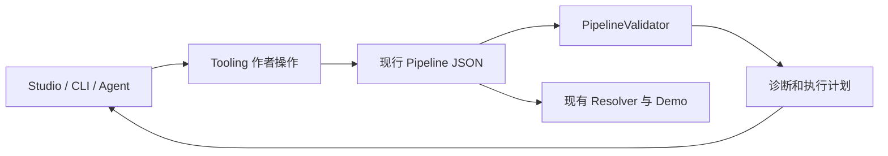

# RFC 0057：降低 Pipeline 编排认知负担的实施方案

- **RFC 编号**：0057-pipeline-composition-experience
- **创建日期**：2026-09-14
- **文档状态**：In Implementation
- **关联分支**：`fix/rfc0057-acceptance`
- **目标版本**：投产前，分阶段交付
- **负责人 / 作者**：LLM-EdgeFlow contributors
- **评估基线**：`236e03f`；现有生产工具 Catalog v3
- **关联决策**：承接 RFC-0006、0007、0045、0051；复用 RFC-0052、0055；新增工具作者操作和已有部署文件关联规则。

本文同时保留设计与分阶段验收规格。M1a/M1b/M2/M3 已实现并补充验收修复，已有部署文件关联与
统一候选配置也已落地；高级模型操作、M5/M6 和真实开发者试用仍按第 10 节推进。第 2 节保留
评估基线，当前使用方法见 [Studio 指南](../../tools/pipeline_studio/README.md)。

## 1. 结论、目标与必要范围

当前复用模板调参的负担基本可控，从零组合、改接多分支流程、切换真实模型和重新打开部署
方案的负担偏高。作者需要维护连接的多种表达、理解工具状态，并在多个配置入口之间核对实际
生效值。本判断来自源码、Catalog/Validator 实测和静态交互审阅，尚无足够的开发者试用数据，
不能据此宣称具体耗时或改善比例。

建议保留显式运行时格式，将机械编排工作集中到工具，使普通任务无需手写内部键、依赖数组
或部署路径。优先完成下面六项，工程实现与实际试用分别验收。

| 优先级 | 工作包 | 开发者获得的变化 |
| --- | --- | --- |
| P0 | M1：统一作者图操作 | 用节点和端口连接；工具安全维护 key、引用和依赖，CLI 与 Studio 行为一致 |
| P0 | M2：连续编辑与可读诊断 | 修改后一次动作校验或运行；错误与修复先用节点、字段和影响说明 |
| P0 | M3：运行前部署预检 | 无需先运行 Demo，即可看清实际模型路径、覆盖来源和部署错误 |
| P1 | M4：关联已有部署文件 | 服务重启后可显式重新关联 JSON 与 `.conf`，继续成套编辑保存 |
| P1 | M5：模型与参数渐进展示 | 优先选择模型实例或资产预设，复杂参数保留类型和缺省语义并减少 JSON 编辑困难 |
| P1 | M6：契约说明与任务验收 | 理解必要的数据关系，通过样例完成编排；不要求先阅读 Core |

本轮不改变公共 C ABI、Operator、运行时 Pipeline schema、`.conf` schema 或调度语义，
不新增持久化方案清单、图 DSL、Python Builder、自动协议转换、模型下载或算法生成。
不要求所有用户转用 Web；手写 JSON 继续可用，CLI/Agent 通过同一作者操作生成现行文件。
不以新增 Node、Model、Backend 或重构整个 Studio 为前置条件。

## 2. 现状与真实缺口

| 议题 | 已有事实与证据 | 尚需改进的部分 |
| --- | --- | --- |
| 数据绑定与执行依赖 | [connectPorts](../../tools/pipeline_studio/web/workbench.js) 已同时填写 `ports` 与 `depends_on`；[Validator](../../src/core/pipeline_validator.cpp) 检查生产者位于依赖祖先链 | CLI 缺少作者操作；导入无法恢复依赖意图，断线会删除同对节点的依赖，改接会留下旧依赖 |
| 内部字符串 key | [app.js](../../tools/pipeline_studio/web/app.js) 自动生成 ID/key；[AlgContext](../../include/core/alg_context.h) 是请求级、单次发布、有类型检查的数据空间 | 自动命名只检查节点 ID，未完整检查已占用 key；改 ID 后新增节点可能碰撞 |
| 图与合法性 | 可浏览缺资产或尚不合法的文档；[graphDocument](../../tools/pipeline_studio/web/workbench.js) 为布局建立临时连接关系 | 重复 key 的 Map 后写覆盖会掩盖来源歧义；画布连通不代表文件中的依赖已满足 |
| 编辑与诊断 | [editor.js](../../tools/pipeline_studio/web/editor.js)、[app.js](../../tools/pipeline_studio/web/app.js) 已有表单缓冲、继续操作、原因、候选修复、撤销和过期保护 | 合法表单仍需额外确认应用；修复预览偏向 JSON Pointer 与序列化差异 |
| 部署与运行 | [server.py](../../tools/pipeline_studio/server.py) 已有草稿运行、双 revision 成套保存、预检和失败回滚；运行结果已有版本归属 | 预检没有独立任务入口；服务重启后已有 `.conf` 不受当前会话管理 |
| 模型与参数 | 已有资产目录、兼容筛选、散列检查、构建提示和基础字段表单 | Model/Backend/路径同时暴露；object/array 仍是文本 JSON；恢复缺省往往要进入 JSON 页 |
| 来源契约 | Catalog 已含 cardinality/provenance/lifetime；[批次工具](../../include/nodes/traceable_batch_operations.h) 与 [Node 教程](../dev_guide/custom_node_concepts.md) 已封装常用处理 | 连线时缺少数量与来源的直观解释；静态校验与真实对齐保证容易混淆 |

固定两个回归用例：

1. A 输出 `a_out`，C 读取它并声明 `depends_on: ["a"]`。当前断线会删除依赖，但文件没有
   说明该依赖是否还承载作者要求的执行顺序；工具无法无损猜出意图。
2. 节点 `foo` 改名为 `bar` 后，保留 `foo__out` 是合法的。再次新增 `foo` 时，目前可生成
   同名 key；断开业务输出时重新分配内部 key 也存在类似风险。

已实际查询 `keyword_match_v1` 和 `TextChunkNode`。后者 `chunks` 输出声明为
`1:N / generate_sub_id`，`chunk_counts` 为 `1:1 / preserve`。这仅是本基线示例；实现时仍
查询目标工具，不把本文变成第二份节点或字段目录。

[RFC-0051](0051-developer-task-experience.md) 的 M1–M5 已交付，M6 试用待完成；本方案扩展其
诊断和任务闭环，不重建测试生成器、修复引擎或 recipe。历史 RFC 中旧部署写法按当时基线
阅读；本方案仅消费当前 Resolver 接受的 `data.outputs` 配置。

## 3. 开发者需要知道什么

| 人员 / 场景 | 必须理解 | 默认由工具或既有 helper 处理 |
| --- | --- | --- |
| 复用已有能力编排 | 完整业务输入输出、节点用途、数据来源、常用参数、校验与运行的区别 | key 分配、依赖补充、模型 ID 引用、命令和配套路径 |
| 拆分、检索、多输入、聚合 | 一条还是多条结果；属于哪个请求/片段；逐条关联还是按请求分组 | 已注册节点的来源实现、静态兼容性检查和关系说明 |
| 编写自定义 Node | C++ 业务函数、逻辑端口、数量与来源、错误处理、请求无状态 | 既有 AuthorNode/Spec、批次工具、生成测试与登记 |
| 实现 Adapter 或部署集成 | 完整 C ABI 契约、外部载体与容量、部署根和输出池 | 原生 Resolver、既有 Adapter/bridge 作者工具 |

普通编排不要求理解 `AlgContext` 实现、锁、JSON Pointer 编码或批次补齐机制。
`req_id/sub_id` 表示数据归属，不能随时用循环下标替代；编写自定义批次算法时必须理解。
基础概念可以学习，但工具已经能够确定的信息不应要求作者重复填写。

## 4. M1：统一连接、命名与引用

### 4.1 所有者与接口

增加工具私有的 `src/tools/pipeline_authoring.h/.cpp`，由生产和测试 `alg_pipeline_tool` 共用，
不链接进 SDK 请求执行路径，不成为 Node/Model 的依赖。它只变换作者文档，从 Catalog 查询
定义，调用 `PipelineValidator` 判断生成文档；不复制校验规则。



运行时依赖仍为接入适配层 / Integration → 流程编排层 / Orchestration → 能力节点层 /
Capability Nodes → 模型执行层 / Model Execution；运行时不推导缺失的 `depends_on`。

拟新增 `alg_pipeline_tool edit --stdin`。输入包含 `schema_version: 1`、完整 `pipeline`，以及
互斥的单个 `operation` 或有序 `operations` 数组；它只是短生命周期操作请求，不是第二种
保存格式。首批动作限定为 `add_node`、`remove_node`、`rename_node`、`connect`、`disconnect`、
`reset_input_binding`、`add_dependency`、`remove_dependency`。
端点用 `node_id + port`，业务端点沿用 `$ingress/$egress`；参数/模型仍编辑现行字段。

| operation.kind | 其余请求字段 | 约定 |
| --- | --- | --- |
| `add_node` | `node_type`，可选 `id`、`config` | 类型查目标 Catalog；省略 ID 时自动分配，显式 ID 冲突时报错；缺参数可留在草稿，归一化默认值不全部回写 |
| `remove_node` | `node_id` | 必须唯一存在；列出断开的引用 |
| `rename_node` | `node_id`、`new_id` | 新 ID 非空且不冲突；同名为无变化操作 |
| `connect` | `source`、`target`，各含 `node_id`、`port` | 定位当前图中的唯一端点；重复同一连接不增加重复依赖 |
| `disconnect` | `source`、`target`，形状同上 | 先检查实际连接仍匹配，避免断开已被改接的输入 |
| `reset_input_binding` | `target`，含 `node_id`、`port` | 删除该输入的显式绑定，按原生默认语义重新解释；展示解析来源或未绑定/错误，不承诺一定接入 ingress |
| `add_dependency` / `remove_dependency` | `node_id`、`depends_on_id` | 分别表示消费者和前置节点，均须存在；已添加/已删除时不重复改变文档 |

例如操作对象的拟议形状如下；外层 `pipeline` 由调用方放入实际完整文档：

```json
{
  "kind": "connect",
  "source": {"node_id": "chunk", "port": "chunks"},
  "target": {"node_id": "embed", "port": "text"}
}
```

严格识别操作字段；未知动作、缺失/重复端点、歧义生产者返回工具诊断，不猜目标。
操作定位或请求解析失败时 `ok=false`、非零退出，不返回可应用的新文档；输入保持原样。结果包含
`schema_version`、`ok`、变换后的 `pipeline`、结构化 `changes` 和完整 `validation`。
`changes` 每项记录动作、稳定节点 ID、相关端口、受影响节点和中文说明，供预览与撤销使用。
`ok` 表示该请求按指定提交策略完成，`validation.ok` 表示配置合法，退出码随 `ok`。
顶层可选 `require_valid` 默认为 false，允许交互草稿；true 时最终校验失败则 `ok=false`，
返回诊断但不返回可应用的新文档。生成最终方案的 Agent/脚本使用 `require_valid: true`。

新增节点或断开必需端口可产生不完整草稿，允许编辑但必须显示未通过校验。保存为可运行方案
和运行继续要求严格校验成功。不能放宽运行时规则，也不能要求每个中间编辑状态都合法。

作者变换模块和 `edit --stdin` 本身不写文件。Studio 拟增 `/api/v1/authoring/preview` 转发
单动作或批量请求，复用草稿 revision、工具 fingerprint 与过期响应保护；一次接受整个结果
形成一个撤销步骤。文件写入由现有 Studio 保存边界或第 4.5 节的显式 CLI 包装负责。

### 4.2 数据连接与执行依赖

| 作者动作 | 必须产生的行为 |
| --- | --- |
| A 输出连接 B 输入 | 同步实际 key；如 A 尚不是 B 的依赖祖先，加入直接依赖；已有祖先关系不增加冗余边 |
| 改接输入 | 改 key、补新生产者依赖；旧依赖按下述保守规则处理 |
| 断开输入 | 移除可选绑定；必需输入分配不碰撞的未连接占位 key，保持用户明确断开的意图 |
| 恢复默认绑定 | `reset_input_binding` 删除该输入映射；必需输入由原生尝试同名默认来源，可选输入回到不消费状态 |
| 断开/改接后的旧依赖 | 默认保留，显示为纯执行依赖；不依据“没有数据边”自动删除 |
| 删除执行依赖 | 独立动作，展示影响和原生结果；如仍为数据读取所需，草稿显示对应错误 |
| 删除节点 | 列出消费者、业务出口和被移除执行边；清除引用，必需输入转为未连接状态，支持撤销 |
| 打开/导入 | 不补依赖、不改 key、不排序回写；图用于浏览，校验状态单独展示 |

同一未中断撤销历史内可记录“本次连接动作新增的依赖”，改接后无其他连接使用时，在预览中
提供清理选项；用户显式添加/保留的依赖不得归为可自动清理。文件重开、JSON 手工编辑或历史
丢失后一律视为未知意图，恢复保守规则。历史仅作为编辑提示，不写入 Pipeline，不从 ID、
数组顺序或 key 名猜意图。没有这项辅助清理也可以交付首版，保守规则必须先成立。

同一节点对的数据关系与显式依赖都应有可查看、可编辑的入口，不能被图形合并隐藏。
类型、成环、来源兼容性由原生报告决定；浏览器只做操作形状检查和提示。
本轮不建设全目录自动接线推荐或搜索规划器。

#### 断开与恢复默认的生命周期

必需输入省略映射时，现行 Validator 使用逻辑端口名寻找同名祖先生产者，适用时再从 biz
ingress 解析。故意断开时直接删除映射，可能让它悄悄接回默认来源；未连接占位 key 用于阻止
这种回退，不修改 Catalog 或运行时规则。可选输入省略映射则不消费，不自动读取同名 ingress。

重新 `connect` 会覆盖该端口的占位；`reset_input_binding` 删除映射并在预览中显示恢复后的
来源/诊断；删除节点同时删除其绑定。占位不是独立资源，无引用后不再进入占用集合。不按
`__unconnected__` 等字符串前缀识别或清理导入内容，因为它仍可能是用户合法使用的数据名。
恢复默认不等同于连接 ingress，也可能得到同名祖先输出或仍因无来源而报错。

#### 扇出共享与重连范围

此处扇出指一个输出有多个消费者，与数据 Cardinality 的 `1:N` 是不同维度。`1:1` 输出也可
扇出，`1:N` 输出也可只有一个消费者；普通扇出不额外复制节点或改变端口数量/来源声明。

| 动作（初始为 A.out 同时供给 B.in 和 C.in） | key 与消费者范围 |
| --- | --- |
| 断开 B.in | 只改变 B 的输入绑定；A 的发布 key 和 C 的绑定保持不变 |
| 将 B.in 改接到 D.out | 只改变 B 的输入和所需依赖；A/C 不变，旧顺序依赖沿保守规则 |
| A.out 接到 biz egress | 按契约改 A 的发布 key，同步全部有效消费者，包括省略映射的必需输入 |
| 断开 A.out 与 biz egress | 给 A 分配新内部 key，同步全部有效消费者；B/C 仍连接 A，不能随出口一起断开 |
| 删除 A | 所有消费者分别进入必需未连接或可选未绑定状态，完整预览且一次撤销 |

出口已被另一生产者占用时，不由 connect 静默替换；用批量 disconnect + connect 明确表达。
生产者 key 只有在出口连接/断开等明确的输出重映射动作中才改变，普通消费者操作不得改它。

### 4.3 key、ID 与歧义

1. ID 全图唯一；key 用节点 ID/逻辑端口形成可读前缀，冲突时加确定性后缀。占用集合包括
   显式绑定、目标 Catalog/原生解析得到的有效默认绑定、未连接占位键和 biz ingress/egress，
   不仅检查节点 ID 或 JSON 中显式出现的 ports。缺 Catalog 导致无法确定默认绑定时，不分配
   可能冲突的 key，保留浏览/JSON 编辑入口并提示构建工具。
2. 改 ID 同步 `depends_on`、选择状态与布局关联，保留数据 key；不全文替换字符串。新增
   节点、断开业务输出、未连接占位键都使用同一分配器。
3. biz ingress/egress key 属于契约，不任意改名。连接业务输出检查生产者唯一性；连接或断开
   业务出口导致发布 key 改变时，同步该输出的所有有效消费者，原先省略映射者写入明确绑定。
   不能遗漏隐式引用；必需消费者已故意断开时不因名字相近而被重新接回。
   一个输出需要发布到两个不同契约 key 时报告当前操作无法表达，
   不隐式复制节点或伪造输出。
4. 导入有重复生产者时保留全部候选并显示歧义，不用 Map 后写覆盖伪装唯一来源。可浏览
   原文、明确修复；选择生产者的操作须先消除歧义。
5. 不提供全库 key 规范化或打开即迁移；内部 key/依赖数组收进高级详情，JSON 始终可查。

### 4.4 有界批量操作

首版同时支持单动作和批量，二者调用同一变换实现。批量请求一次读取/解析完整文档，固定
同一目标 Catalog 快照，按数组顺序作用于私有副本。后续动作引用本批新增节点时使用明确 ID，
不增加结果引用表达式或持久会话协议。

- 单次最多 128 个动作，整个输入最多 4 MiB；超限或空数组在变更前拒绝。示例的 5 个新增
  节点和 8 次连线可放在一个请求，不需要 13 次 CLI 启动或文档往返。
- 中间允许必需端口尚未连接等不完整状态。逐步只做动作前置检查，不对每个动作完整校验；
  完成后统一执行原生校验，按 `require_valid` 决定是否接受最终候选。
- 任一步动作失败，返回零起始 `failed_operation_index` 与原因，丢弃整个副本，不暴露可误用的
  部分成功文档；严格提交的最终校验失败也丢弃副本。原输入与磁盘文件始终不变。
- 成功返回合并 changes、最终 Pipeline 和报告，Studio 作为一条历史记录接受或撤销。
  这是内存文档的全有或全无操作，不承诺跨文件、模型资源或 SDK 执行事务。

M0a 固定对比输入与测量字段；M1a 实现后记录单动作循环与批量的进程次数、输入/输出字节数、
校验次数及耗时。批量减少确定的重复工作，但不在测量前宣称 13 次小文档操作已造成严重性能问题。

### 4.5 IDE 文件工作流与原地依赖修复

增加有界的文件便利命令，复用原生解释与同一作者操作，不将读写文件放入 Validator：

```bash
# 拟议命令：默认预览差异和最终校验结果，不写文件
./build/alg_pipeline_tool fix-deps configs/pipeline_example.json
# 明确要求修复并原地保存；此命令仍待实现
./build/alg_pipeline_tool fix-deps configs/pipeline_example.json --in-place
```

`fix-deps` 只处理原生诊断确认的 `producer_not_dependency_ancestor`：定位当前实际 key 的唯一
生产者，复用有效默认绑定和现有依赖候选，在副本上添加所缺依赖。不猜数据 key，不删除已有
顺序依赖，不重命名节点，不改参数、biz 或 `.conf`；已存在祖先关系不加冗余边。

多生产者/来源歧义、无生产者、成环、类型或来源不兼容、未知配置等不能用补依赖掩盖。读取
一次当前文档，收集有界的明确候选，用共享操作顺序应用并做最终完整校验；不能通过时返回
原生诊断、非零退出，原地模式不写入部分修复。无需变化时保持原文件字节不动，重复执行幂等。

原地模式只覆盖用户明确指定的普通文件，不跟随符号链接。读入时保存旧字节和文件身份，
在同目录写临时文件、保留原权限，提交前再次核对身份及内容；冲突或预检/写入失败保留原文件，
成功通过单文件原子替换安装。默认预览不写文件；机器报告注明写入与否、目标路径、changes、
最终 validation，不以退出 0 代替结果检查。跨任意外部编辑器的恶意竞争和多文件事务不在承诺内。

这个命令面向已在 IDE 保存到磁盘的配置；未保存的编辑器缓冲不在读取范围。VSCode 可用普通
任务调用，无需本轮建设专属插件；涉及模型路径或输出池仍走 M3/M4 的配套预检与保存。

## 5. M2：连续编辑与可读诊断

保留现有表单缓冲和历史机制。存在未应用修改时，“校验”“运行”明确显示“应用修改并校验”
“应用修改并运行”，一次点击提交当前合法表单到草稿并继续，不自动落盘。非法表单保留输入
和焦点，不调用运行接口；切文档或放弃修改仍沿用明确选择。保存使用相同应用过程，目标由
服务端返回。

将修复的 `window.confirm` 换成页内审阅面板：原生原因、节点/字段、`fix.title/effect`、
影响的其他节点、剩余错误与验证程度。Pointer、patch、code、diff 放进展开详情。区分
`pipeline_valid` 与仅解决目标问题的候选；无安全候选时保留原生建议和手工入口。

消费既有 remediation，不解析 message 猜原因，不在浏览器重建规则或生成候选。保留草稿
修改、数组重排、工具重建、切文档使旧候选失效的保护，应用后重验且一次撤销。用户文本用
文本渲染，不插入 HTML。已有运行快照与旧结果失效机制继续使用，新动作纳入相同版本比较；
不重建运行历史或任务调度系统。

## 6. M3 / M4：部署预检与成套编辑

### 6.1 M3：独立预检

增加“检查运行条件”，复用 staging、`resolve_run_conf` 和原生 `resolve-conf`；临时文件
结束后清理，不加载权重、不运行 Demo、不写用户文件。草稿与运行设置共同构成预检版本，
修改后摘要标为过期。

| 摘要 | 来源与边界 |
| --- | --- |
| 本次 Pipeline、biz、部署根 | 提交快照、首版固定的项目根与 Resolver 结果 |
| 最终模型路径与覆盖来源 | `configuration.model_paths`，不在浏览器推导优先级 |
| 生效参数与输出池容量 | `effective_pipeline`、`output_pools`；布局 `params` 保留文本语义，不伪称已补齐布局默认值 |
| 当前工具、Backend、资产 | 当前 Catalog 与既有资产检查；区分缺失、存在未校验、散列已验证 |
| 下一步 | 配置错误、缺工具、缺资产分阶段指引；保留原始诊断 |

区分“配置通过”“资产检查结果”“尚未执行”“样例执行结果”；预检通过不能显示模型已加载
或效果达标。实际加载与样例验收继续走现有路径。

### 6.2 M4：显式关联已有配置

增加“关联部署配置”：选择受控目录内的 `.conf` 和运行选项；首版部署根固定 `PROJECT_ROOT`，
资产目录 `model_root` 仍可明确选择项目内目录。原生 Resolver 确认该文件解析到当前保存的
Pipeline，展示两份文件及覆盖后建立本会话关联，记录双 revision。
关联本身不写文件。重开可提示候选，但不得凭同名或 Profile 自动取得覆盖权限。

首批限定现有受控 `configs/` 与项目内路径，复用路径/符号链接约束；外部导入继续另存副本。
单槽/多槽 `data.outputs` 只要原生接受且工具可原样保存即可关联，不降级输出池布局。

路径必须按下表处理；关联旧文件时先保持原来的有效值，不把旧 Pipeline 路径重新解释为所选
资产目录下的文件。资产目录仅用于用户随后明确选择的新资产。

| 作者动作 | Pipeline / conf 的确定变化 |
| --- | --- |
| 常规模型选择中换资产 | 将选中资产相对 `model_root` 的路径写入该模型 `model_path`；同时将 `model_root/该路径` 相对项目根的值写入该 ID 的 conf 覆盖；由 Resolver 验证结果 |
| 只改模型参数 | 只改指定 `model_config/backend_config` 等参数，保留所有路径和覆盖 |
| 高级“只改部署覆盖” | 只更新该 ID 的 conf 覆盖，值相对项目根；Pipeline 保持，摘要显示来自部署配置 |
| 高级原始 JSON 改 model_path，已有覆盖 | 不猜生效意图；保存/运行前提供“保留当前部署覆盖”或“让新资产路径在本部署生效”，明确预览结果。前者保留原覆盖，后者按明确 model_root 重建该条覆盖 |
| 显式模型 ID 改名 | 使用明确 old/new 映射，迁移 Catalog model_dependencies 声明的模型引用及对应覆盖；新 ID 冲突拒绝，不替换任意字符串 |
| 原始 JSON 删除旧 ID 并新增 ID | 作为删除与新增处理，不推断改名；清理旧覆盖，新增项仅在有明确资产选择记录时建立覆盖；否则不创建覆盖，按 Resolver 将 Pipeline 路径相对项目根解析并展示结果 |
| 删除模型 | 删除对应覆盖，保留其他条目；未修复的节点引用继续由 Validator 拒绝 |

原始 JSON 修改无覆盖模型路径且无明确资产选择记录时，同样不创建覆盖，保持 Resolver 的
项目根解析语义，展示实际结果；不能把这种编辑默认为相对当前资产目录的选择。

例：Pipeline 的 A 为 `a.gguf`、B 为 `b.onnx`，旧 conf 分别覆盖到 `models/a_old.gguf` 和
`deploy/b_tuned.onnx`。在常规选择中以 `model_root=models` 给 A 换成 `a_new.gguf` 后，
Pipeline A 写 `a_new.gguf`，conf A 写 `models/a_new.gguf`，B 的覆盖仍为 `deploy/b_tuned.onnx`。
预检、Demo 与保存后重开必须得到相同两条有效路径；仅修改绑定 A 的节点生成参数时，A 的覆盖也不变。

1. 扩展当前“本会话生成方案”的管理记录以接受显式关联。模型 ID/路径变更先展示 Pipeline
   与部署覆盖的现值和拟修改值，明确本次写入范围。
2. 仅修改作者此次改动涉及的模型覆盖；其余覆盖保留。删/改名模型时列出相关条目、更新
   引用并预检，不从 Profile 重建整份部署文件。
3. 原样保留无关的合法 `outputs`、`allocator`、`params`、容量。未知或 Resolver 拒绝的配置
   只读展示并报告原因，不删字段求通过；原样指 JSON 值及参数文本保真，不承诺原缩进。
4. 复用双 revision、staging、提交前复核、写入失败回滚与备份保留。只成套更新明确关联的
   文件；外部修改要求重载/审阅，不静默覆盖。
5. 预检、运行、保存使用同一候选部署配置，仅临时执行替换 `pipe_path`；不能预检保留覆盖，
   运行又按 Profile 重建路径。staging 位于项目根内，Resolver root 与 Demo cwd 均为项目根，
   `--config` 必须相对此根；不透传绝对 conf 路径使 Demo 改以配置父目录为根。二进制、数据集、
   输出位置使用明确路径。支持其他部署根另行设计，不加入首版。
6. Profile 可提供数据集/运行选项，不覆盖已关联方案；输出含明确 `--config` 的当前命令，
   不回写原 Profile，也不强制创建新 Profile。

现有保存提供单服务进程内冲突检测与失败恢复。本轮不承诺任意外部写入竞态或断电时跨文件
的系统级原子事务；并发编辑、持久事务、跨刷新自动接管另立需求。

### 6.3 内部 egress 与输出池的边界

`$egress` 是 BizDefinition 声明的内部结果 key；`data.outputs` 是 Operator bridge 声明的逻辑
输出槽位。二者不要求一一对应，不能根据画布连线增删输出池。

本基线 `smart_doc_qa_v1` 有 `llm_answers`、`intent_matches`、`doc_chunk_counts` 三个内部
出口，Adapter 组装为 DocResult，bridge 只有 `doc_out` 一个槽，conf 对应只有
`data.outputs.doc_out`。事实分别见 [Adapter](../../src/adapter/biz/doc_qa_adapter.cpp)、
[bridge](../../src/adapter/biz/doc_qa_operator_bridge.cpp)和[部署配置](../../configs/pipeline_doc_qa_default.conf)。
可用契约仍需查询目标 Catalog，槽位完整性以原生 Resolver 和 bridge 注册为准。

| 变更 | 工具应做什么 |
| --- | --- |
| 同一 biz 内增删/改接 egress 连线 | 仅修改内部数据绑定；outputs/allocator/params/容量保持原值，重跑 Validator 和 Resolver |
| 断开必需 egress | 标为不完整草稿，阻止可运行保存与执行；不能靠删除输出池“修复”缺少业务结果 |
| 某个可选内部结果本次不产出 | 按既有 Adapter 契约处理，不能推断 bridge 槽位可删除；已声明的可选输出槽也要求部署配置 |
| 选择另一 biz / 注册契约变化 | 作为业务契约切换，现有关联失效；选匹配模板或明确重新关联并完整预检，不把旧槽位按端口名猜测迁移 |
| 新增/删除真正的外部输出槽 | 走 Integration 的 Adapter/bridge/输出类型与 conf 变更及契约测试；不是普通 Pipeline 连线操作 |

因此本工作包补齐的是保留和失配检测规则，不新增自动级联输出池的功能。跨层参考
[RFC-0049](0049-operator-output-allocation-strategies.md)及[当前输出分配指南](../dev_guide/operator_output_allocation.md)。

## 7. M5：模型与参数渐进展示

默认先选当前方案中兼容的模型实例，需要新增时再选已有资产组合。继续用目标 Catalog
核对 capability/protocol，用已有资产清单提供路径；不由预设名推断可加载。ID 自动分配，
Model 类型、Backend、路径及两类完整参数留在高级区。

预设变更先预览模型、节点绑定和部署覆盖的影响，再形成一次撤销操作。共享实例列出全部
消费者；默认给单节点换模型仅改变该节点绑定，修改共享实例用独立明确动作。无适用预设
时保留手动配置，未知或缺 Backend 的导入仍可浏览，不自动下载/更换构建/切到测试注册。

参数复用 ConfigFieldDefinition 的类型、默认、枚举、范围、semantic。增加“使用默认值 /
显式设置”，用删除字段恢复缺省；区分缺省、空串、空对象、空数组、零、false。不能因展开
字段而写默认值，不能修剪提示词空白或破坏多行文本。

object/array 首批做通用 JSON 值树：增删键/元素、选择值类型、格式化、切回源码；只保证
JSON 语法与已声明外层类型。没有子结构元数据不推断必填子字段，不根据示例另造校验。
业务合法性交给原生语义校验，非法文本缓冲保留，合法内容在树/源码间无损往返。

本轮不引入递归 schema 系统或 UI 专属节点表。若试用显示某复杂字段仍是主要阻碍，再提出
Definition 子结构元数据的独立 RFC，同时迁移 Catalog 消费端；不在浏览器硬编码隐藏 schema。

## 8. M6：契约说明与基础概念

默认从已有可用模板新建，空图保留为进阶入口。显示已有业务名称、标识、内部输入和必需输出，
明确它们是 Adapter 内部端口；完整外部请求/响应查对应任务样例与[业务接入指南](../dev_guide/business_onboarding.md)。

在现有入门/recipe 页面补原始请求/响应示例与变更范围判断，复用 fixture 和 C ABI 契约测试。
没有完整样例的业务标明尚无样例，不由 TextBatch 或 C 载体推导 payload；业务维护自己的
样例，不在 Web 建中央业务分支。本轮不新增 Catalog 外部 schema 协议。

端口详情展示类型、数量、来源、生命周期，已知值附简短解释，原始值可查；未知值不默认视为
`1:1/preserve`。可变语义如 `lifetime_config_field` 消费原生规范化/校验结果，没有结果就标为
待校验，不能展示静态默认却声称已生效。解释是端口声明，不从单个标记推断整个算法行为。

不在 UI 重写兼容矩阵：现有 `N:M`、`N:1`、`preserve`、`aggregate` 规则并非字符串相等。
在既有教程补“两条请求分别拆成三块/两块，排序或过滤后正确关联”的小样例，讲清类型相同
仍可来自不同请求、逐条关联与按请求聚合不同。1:1 Node 复用现有 Spec，复杂批次复用
RFC-0055 工具。静态校验只证明声明可连接，真实对齐由 Node/Model/Adapter 运行时检查保证。

## 9. 兼容、迁移与替代方案

| 对象 | 实施要求 |
| --- | --- |
| Pipeline / `.conf` | 旧合法文件保持合法；不批量重写，显式 `id/depends_on` 不变 |
| Catalog / 诊断 | 复用 Catalog v3、remediation v1；新作者操作单独版本化 |
| CLI / Studio 版本差异 | 不支持 edit 的工具仍可打开、JSON 编辑、原生校验和运行；新图编辑提示重建，不悄悄使用另一套变换实现 |
| SDK / 分层 | 作者变换只进工具目标；不改执行计划消费，不移动平台协议转换 |
| 文件归属 | 普通保存保持原范围；仅显式关联/本会话创建的方案可以成套更新 |
| 作者职责 | 业务语义、来源策略、效果期望由人决定；工具不给不确定行为补成功结果 |

不采用以下路径：

- 运行时从 key 隐式补依赖：改变严格契约，也无法恢复纯顺序意图。
- 所有人只用 Studio：遗漏 CLI/Agent；需共享小型作者操作。
- 新 DSL、Builder、持久方案 manifest：增加表示和迁移成本，先生成现行文件再评估必要性。
- 删除来源契约或用数组位置替代归属：保留错配风险，不能保证结果属于正确请求。
- 只补文档或改布局：不能修复已确认的意图丢失、key 碰撞与部署覆盖缺口。

M1 迁移后删除重复 JS 变换，前端保留显示/交互/请求。标准产物可由旧运行时读取；回退工具
无需迁移文件。M4 回退后仍可用显式 `.conf` 命令执行，不依赖会话记录。

## 10. 实施顺序、责任与工作量

各包完成指定行为、聚焦测试和指南后交付；估算面向熟悉仓库的单人，不含资产准备、试用
等待和环境故障，不是完成时限承诺。

| 阶段 | 主要内容 / 文件 | 前置 | 估计 | 状态 |
| --- | --- | --- | --- | --- |
| M0a | 工程基线：固定旧提交、工具/环境、任务输入、期望和失败样例；维护者可独立完成 | 采用本 RFC | 1 人日 | 已完成 |
| M0b | 开发者体验基线：安排试用并记录求助/耗时；复用既有试用计划 | 与工程并行，不阻断开发 | 约 1 人日，加人员安排 | 待试用 |
| M1a | 单动作/批量共用作者操作、fix-deps 文件包装；`src/tools/alg_pipeline_tool.cpp`、CMake、测试工具目标 | M0a | 4–7 人日 | 已实施 |
| M1b | Studio 消费操作、歧义图、键隐藏、依赖审阅；`server.py`、`workbench.js`、`app.js`、`graph.js` | M1a | 3–4 人日 | 已实施 |
| M2 | 连续动作和页内修复；`app.js`、`editor.js`、`workflow.js`、`index.html` | M0a，可与 M1a 并行 | 2–3 人日 | 已实施 |
| M3 | 无执行预检、摘要；`server.py`、`app.js`、现有 `verify_selection.py` 辅助 | M0a，可与 M1a 并行 | 2–3 人日 | 已实施 |
| M4 | 已有 conf 关联、局部覆盖更新、预检/运行/保存共用候选 | M3 | 3–5 人日 | 部分实施；高级单独覆盖编辑和显式模型 ID 迁移待实施 |
| M5 | 模型选择分层、共享影响、缺省切换与 JSON 值树 | M1b/M2；部署联动依赖 M4 | 3–5 人日 | 待实施 |
| M6 | 来源说明、既有教程补充、开发者复测 | 说明可提前；复测依赖前述交付 | 2–3 人日，加试用安排 | 待实施 |

首个可交付增量为 M1a/M1b + M2 + M3；先修正确性和高频动作，再做 M4/M5。仅 M0a 是工程
前置，M0b 缺参与者不阻断开发、测试或工程交付；维护者走查不能冒充新开发者试用。

M0a 固定基线提交、任务夹具、构建/资产版本和环境说明，保留可复现旧版的方式；参与者到位后
可在隔离环境补做旧版/新版的等价任务，明确延迟采样与学习效应。体验项保持待试用，不因为
工程通过而宣称用户效率已验证。不得因等待试用停掉已具备工程前置条件的任务，也不顺带重构
Core、schema 框架或整个可视化 IDE。

## 11. 验证与完成条件

### 11.1 工程行为矩阵

| 编号 | 场景与必须观察到的结果 | 现有责任套件 |
| --- | --- | --- |
| G1 | 同输入的 CLI/Studio 操作得到相同文件与原生报告；草稿不合法不冒充可运行 | `tests/tooling/test_pipeline_studio.py` 的真实工具 roundtrip |
| G2 | 连线维护 key/依赖；间接祖先不加冗余边；改接/断线保留未知顺序意图 | 同上；`studio_graph_test.mjs` |
| G3 | foo 改 bar 再加 foo、断开业务出口、未连接占位键均不碰撞；导入省略绑定时的有效默认 key 也被保留 | 同上；`studio_browser_test.mjs` |
| G4 | 重复生产者/缺依赖/无效 ID 导入不静默修正；歧义图不选任意来源 | 同上；原生 `test_pipeline_catalog_validator.cpp` |
| G5 | 扇出、隐式默认消费者、业务出口、改名/删除/撤销正确；过期结果不覆盖新草稿 | `studio_editor_test.mjs`、真实 handler 测试 |
| G6 | 5 节点/8 连线一次批量请求；中间可不完整；动作失败/strict 最终失败无部分结果；超限拒绝，批量一次撤销 | CLI roundtrip、handler 与历史用例 |
| G7 | 同名 ingress 存在时断线仍不读取；显式 reset 才恢复默认；重连覆盖占位，可选 reset 后不消费 | Catalog/Validator 与 Studio 操作用例 |
| G8 | A 扇出 B/C，改接或断开 B 不改变 A/C；连接/断开业务出口同步含隐式绑定的全部消费者 | 原生 roundtrip、`studio_graph_test.mjs` |
| G9 | fix-deps 预览不写、唯一生产者正确补依赖、幂等；歧义/循环/其他错误不写；文件冲突/写失败保持原文件 | `test_pipeline_studio.py` CLI 与临时文件故障注入 |
| U1 | 合法表单一次动作校验/运行；非法表单无运行请求、原输入保留 | `studio_browser_test.mjs` |
| U2 | 修复面板显示验证程度/影响/剩余错误；保留过期、切文档、工具重建保护 | `studio_fix_workflow_test.mjs`、服务测试 |
| D1 | 预检无 Demo/用户文件写入，临时文件清理；摘要与原生结果逐字段一致 | `test_pipeline_studio.py` 的 resolve-conf/staging 用例 |
| D2 | 重启后显式关联可保存；未关联不接管；错指向/路径/符号链接/revision 拒绝 | 同上的 ownership/conflict 用例 |
| D3 | 两模型旧覆盖与 Pipeline 不同时仅换一个，按动作表保留另一覆盖；多输出保真；预检/运行/保存重开路径一致，Demo 使用项目根和相对 conf | 同上；已有 Operator Resolver 测试 |
| D4 | 第二文件安装失败回滚；回滚失败留备份；冲突不覆盖外部修改 | 同上已有故障注入用例 |
| D5 | 三个内部出口对应一个 doc_out 槽；断开/改接不增删池，缺必需结果仍失败；切 biz/注册槽变更使旧关联失效，缺槽/多槽原生拒绝 | Catalog、Adapter/bridge、Resolver 与 Studio 用例 |
| F1 | 换单节点绑定只影响该节点；编辑共享模型列出消费者；缺资产/构建不伪报就绪 | 现有模型表单、asset hash、build variant 用例 |
| F2 | 缺省/空值/零/false/多行、树/源码往返保真；非法输入保留 | `studio_editor_test.mjs`、浏览器字段用例 |
| C1 | 数量/来源/有效生命周期正确显示；同类型但不兼容仍由原生拒绝 | `test_validated_pipeline_plan.cpp`、Catalog/Validator、Studio |
| C2 | 两请求不等长拆分、排序/过滤正确对齐；错数量/来源被运行时拒绝 | 既有 `test_traceable_batch_operations.cpp`、相应 Node/Adapter 测试 |
| T1 | 生产/测试工具不互换；新操作版本化；旧命令/配置保持行为 | CLI/parity 用例、Catalog 契约套件 |

只补变更所需差异测试，未修改的来源 helper 不重复写同构测试。不为表格每行创建可执行文件，
按现有 Python/JS/C++ suite 扩展。浏览器验收须执行真实页面动作，不能靠字符串匹配；缺少
浏览器则明确未覆盖，默认门禁可选浏览器跳过不表示页面验收已完成。

每个交付增量完成源码、测试与文档后，按 [CONTRIBUTING](../../CONTRIBUTING.md#6-run-one-canonical-delivery-gate)
执行一次 `./scripts/run_all_tests.sh`，不在前后重复完整构建/测试，不同代理不并发构建同目录。
工具行为可用确定性 fixture 验证；真实模型质量与目标硬件按现有验收流程单独记录。

### 11.2 开发者任务

原始记录继续放在[既有试用计划](../plans/solution_developer_acceptance.md)，不建平行台账。
体验验收目标仍为至少两位未维护 Core 的方案开发者，在相同准备环境做基线/复测；
这不是工程开工条件，暂缺人员按 M0b 记录待试用。交换等价任务顺序，记录
首次跑通时间、求助原因、人工 key/依赖/路径修改次数、修复尝试、查阅入口数和输出证据；
下载/完整构建等待单列。

| 任务 | 通过条件 |
| --- | --- |
| A：关键词模板改规则并运行 | 无 C++ 修改；契约不变、结果随规则改变；不手工维护 key/依赖/路径 |
| B：多节点方案插入、改接、重命名 | CLI/Studio 各覆盖；无 key 碰撞、不丢已有顺序要求；最终校验及样例通过 |
| C：给单节点换兼容模型，重启 Studio 再编辑 | 识别共享影响；关联正确 conf；实际加载与预检一致，缺资源时定位失败阶段 |
| D：修复缺依赖、错端口、复杂字段非法值 | 不阅读 Validator 实现或依靠裸 Pointer，能说明原因、修复并验证 |
| E：解释两请求拆分/聚合与错误来源样例 | 区分类型、逐条对应和同请求归属，不要求复述实现细节 |

硬性要求：正常图操作人工 key/依赖同步为 0；未知顺序意图不静默删除；已关联方案无需手工
改路径使修改生效；实际运行与显示版本一致；非法配置与错配不能被简化流程包装成成功。
时间目标由团队在 M0b 体验基线采集后确定，不用代码行数代替体验改善。求助和反复尝试未下降时，
按记录修正对应工作包，不能仅凭自动化通过关闭体验验收。

## 12. 实施记录

已完成工程基线 M0a 及首个可交付增量 M1a/M1b + M2 + M3 的实现与自动化回归测试；M0b 体验基线与 M6 复测待真实开发者试用后补充记录。功能实际交付时更新 Changelog，不提前宣称耗时减少。M1–M5 等工程包可在各自
工程门禁通过后独立交付；RFC 整体关闭仍要求指定体验验收有证据，暂缺人员时保留 M0b/M6
待试用状态，不阻塞工程交付。未执行的真实模型/平台验收保留边界。公司内部 SDK 与目标硬件
按 [RFC-0029](0029-external-readiness-and-intranet-sdk-migration.md)的授权环境要求进行。

### 2026-09-14 交付增量实现（M0a/M1a/M1b/M2/M3）

1. **C++ 原生图作者操作库与 CLI**（M1a）：
   - 在 `src/tools/pipeline_authoring.h` 和 `src/tools/pipeline_authoring.cpp` 中实现规范操作（`add_node`, `remove_node`, `rename_node`, `connect`, `disconnect`, `reset_input_binding`, `add_dependency`, `remove_dependency`）。
   - 实现最大 128 步有界内存事务与原子回滚，4 MiB 请求上限校验。
   - 实现保留节点 ID 检查（`$ingress`/`$egress`），自动规避间接祖先冗余依赖。
   - 实现隐式/默认端口绑定的解析与断开同步，断开出口时同步所有消费节点（含隐式绑定）。
   - 实现 `fix-deps` 子命令：支持只读预览（stdout/json）与原子安全 `--in-place`（检查短写/刷新/关闭，提交前复核身份和内容，失败保留原文件），对歧义生产者（多生产者提供同名 key）或环路自动拒改（fail-closed）。
2. **Pipeline Studio 服务与前端交互**（M1b/M2/M3）：
   - 在 `tools/pipeline_studio/server.py` 实现 `/api/v1/authoring/preview`、`/api/v1/preflight` 与 `/api/v1/deployment/associate` 路由。
   - `app.js` 的图修改统一调用原生作者操作；`workbench.js` 仅构建只读图。支持端口连接/断开/默认重置、独立依赖编辑、一次应用表单并校验/运行/保存，以及页内修复审阅。
   - 增加运行前无执行部署预检与结构化诊断展示。
3. **自动化测试套件与门禁保障**：
   - 扩充 `tests/tooling/test_pipeline_studio.py`，覆盖原生作者事务、短写故障、请求边界、部署候选与双文件冲突。
   - 覆盖 Node.js/DOM 前端单测（`studio_graph_test.mjs`, `studio_editor_test.mjs`, `studio_fix_workflow_test.mjs`）。
   - 全量通过 `./scripts/run_all_tests.sh` 门禁。

### 2026-09-14 实现验收修复

- R1/R2/R5/R6/R7：原地写入使用独占临时文件及完整写入/刷新/关闭检查，提交前重验文件；普通扇出保持有效 key；错误端点、歧义 ID/生产者及非法请求拒绝，不返回可应用的部分文档。
- R3/R10：Studio 图操作统一进入原生工具；添加默认绑定与独立依赖入口，候选应用形成一次撤销；修复改为页内审阅，应用前再次检查草稿和工具版本。
- R4：预检、运行和保存共享候选部署配置，保留无关覆盖及输出池。常规模型表单换路径记录显式资产动作；原始 JSON 改动已有覆盖的路径时，运行页提供保留覆盖/采用新资产选择。服务拒绝缺少意图的请求。
- R8/R9：预检绑定方案、文档、关联配置和运行设置快照；改变后标为过期，丢弃延迟响应；工具状态使用服务端同名字段。
- 聚焦回归及真实 Chromium 流程涵盖原生图请求、默认绑定重置与撤销、页内修复取消/应用、预检过期与延迟响应。最终交付继续执行一次 `scripts/run_all_tests.sh`；浏览器验收需要设置 `STUDIO_PLAYWRIGHT_MODULE`，不能将默认跳过视为页面验收。

此次为审查问题修复，RFC 保持 `In Implementation`。M4 尚有高级操作，M5/M6 与真实试用未完成，不以本次修复宣称整个 RFC 或体验指标已验收。

### 2026-09-14 评审意见采纳

| 意见 | 结论与修订 |
| --- | --- |
| 1. 缺批量事务 | 采纳有界内存批量；原无写文件路径并无磁盘部分提交，“极度低效”待实测，不扩为 SDK/分布式事务 |
| 2. 缺原地同步 | 采纳显式 fix-deps 文件包装；默认预览，只补确定依赖，保留工具变换与文件副作用的责任边界 |
| 3. 占位破坏默认回退 | 占位用于明确断开，机制保留；补 reset 操作、重新连接覆盖和生命周期，纠正“永久阻断”的理解 |
| 4. outputs 级联同步 | 不采纳按内部 egress 增删池；补内部出口与 bridge 槽的区别、保真和重新校验规则 |
| 5. 扇出共享语义 | 采纳更精确操作范围及隐式消费者测试；图扇出不等同数据 Cardinality 1:N |
| 6. 试用阻断工程 | 拆 M0a 工程基线与 M0b 并行体验基线；缺参与者不阻断工程交付，体验结论仍待真实记录 |
