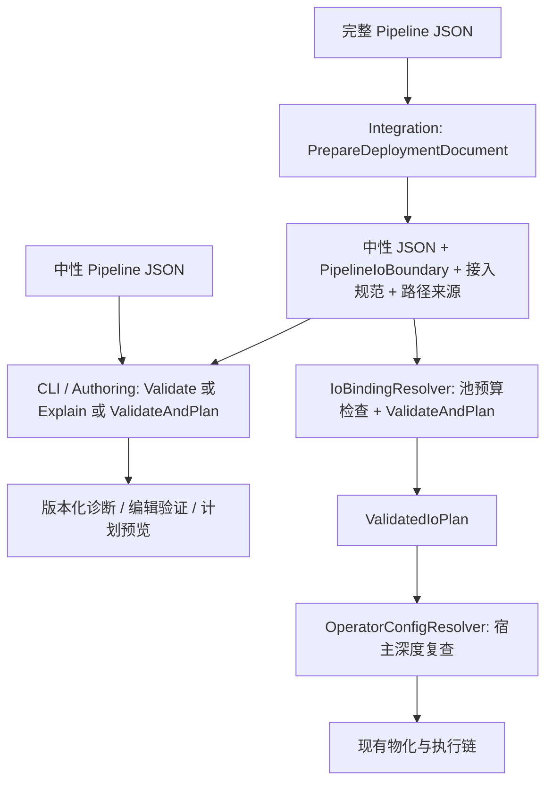

# RFC 0062: Integration 部署解析入口统一实施设计

- **RFC 编号**：0062-unified-integration-deployment-preparation
- **创建日期**：2026-09-17
- **文档状态**：Completed
- **关联分支**：`docs/integration-deployment-resolution-design`
- **目标版本**：下一次 Integration 内部解析收敛版本
- **负责人 / 作者**：LLM-EdgeFlow 维护者
- **代码核查基线**：`8e1a74ac1bff`
- **关联决策**：细化 RFC-0061 的共享接入解析实现，补齐其“覆盖不得修复非法原始声明”约束；保留 RFC-0025 的路径边界、RFC-0049/0050 的输出分配契约，以及 RFC-0057 的编辑与修复行为。

> 本文设计已全部实施完成。所有入口已统一迁移至共享部署准备流程 `PrepareDeploymentDocument`。
> 实施状态与验证记录详见本文第 5 节。

## 1. 问题与范围

### 1.1 需要消除的重复

当前同一份完整 Pipeline JSON 会经过不同的接入准备代码：

| 入口 | 当前实现 | 现有差异 |
| --- | --- | --- |
| `validate`、`plan` | [`alg_pipeline_tool.cpp`](../../src/tools/alg_pipeline_tool.cpp) 的 `ResolveDeploymentBoundary` | 自行检查 binding、converter、输出槽位、模型覆盖、I/O 边界；Core 错误可以保留完整报告 |
| `validate-io`、`resolve-conf`、SDK Create/配置预检 | [`io_binding_resolver.cpp`](../../src/adapter/io_binding_resolver.cpp) 的 `ResolveFromPipelineJson` | 重复上述逻辑，另做路径解析、批次上限计算、默认深度输出池预算和计划组装；错误主要通过字符串返回 |
| `edit`、`fix-deps` | [`pipeline_authoring.cpp`](../../src/tools/pipeline_authoring.cpp) 的 `ValidateOrExplainAuthoring` | 第三份边界构造；未应用模型覆盖或校验输出分配；未知 binding/converter 可能退回无接入边界的 Core 校验 |

`validate-io` 还会从错误文本中的 `(at ...)` 或 `at /...:` 反向提取 JSON Pointer。
修改错误文案可能改变机器可读诊断，因此需要让路径以数据形式跨函数传递。

### 1.2 已复现的问题

以 `configs/pipeline_cross_rerank_cpu.json` 为原始输入，保留合法
`deployment.model_paths.rerank_model_v1`，分别删除、清空或将
`models[0].model_path` 改成数字，当前 `validate --stdin` 都返回 `ok: true`。
移除覆盖后，相同原始声明被拒绝。

原因是两个入口都先把覆盖值写入 JSON，再让 Core 解析。原始错误被覆盖擦除。
[RFC-0061 §2.4](0061-pipeline-owned-deployment-configuration.md#24-模型路径覆盖与解析基准)
要求原始 `model_path` 必填且类型正确，不能由覆盖使非法声明合法化。

### 1.3 实施结果

实施后，同一完整文档、同一注册集合和相同准备选项，得到相同的：

- binding/converter、端口映射、有效批次上限；
- 输出槽位规范和归一化参数；
- 有效模型路径及每个路径的来源；
- 中性 Pipeline JSON 与 `PipelineIoBoundary`；
- 接入错误的 `code/path/message`。

DAG、Node/Model/Backend Definitions、端口闭合及执行计划继续只由
`PipelineValidator` 检查和生成。普通校验、解释诊断和运行计划可以选择不同的
Validator API，但不得各自重新解释部署规则。

### 1.4 范围边界

本 RFC 包含共享部署准备、三个调用面的接入、结构化错误传递、原始声明校验修复及回归测试。
不修改 Pipeline JSON/`.conf` 的持久格式，不删除 `deployment.model_paths`，不迁移现有方案参数。

以下事项维持现状：

- C++ Operator 公共头、函数表、`noexcept` 和两类异常屏障；
- `.conf` 只含 `pipe_path`，宿主提供模型与配置根目录；
- `init` 生成或复制草稿的语义，特别是 `init --empty`；
- Core 不认识 `deployment`、平台类型和输出池；
- Node、Model、Backend 实现，Profile 发现、模板复用和真实模型效果验收；
- 池预算策略：现有默认深度检查及宿主非默认深度复查均保留，见 §2.6。

## 2. 决策与详细设计

### 2.1 采用“共享准备结果，再按用途校验”

新增 Integration 内部函数 `PrepareDeploymentDocument`，提取部署部分的共同语义。
它返回准备结果，不执行 `PipelineValidator`，不创建模型、Node、Session 或输出池。
临时 JSON、归一化参数等普通内存分配允许发生。



不能把 CLI 简单改成调用现有 `ResolveFromPipelineJson` 后只取成功计划。
该接口在 Core 失败时只保留首条字符串错误，无法满足 `--explain`、修复候选及部分 DAG
诊断的要求。共享准备结果能保留这些能力，也避免“先完整校验一次，再为 Explain 校验一次”。

### 2.2 新增内部文件与接口

新增文件均放在 `src/`，不进入公共 SDK 头文件视图：

| 文件 | 职责 |
| --- | --- |
| `src/adapter/deployment_diagnostic.h` | 轻量错误载体；不包含工具响应 JSON、平台布局或注册表逻辑 |
| `src/adapter/deployment_preparation.h/.cpp` | 完整部署文档准备、原始结构校验、绑定/槽位/覆盖/边界的唯一实现 |
| `src/tools/pipeline_document_validation.h/.cpp` | CLI 和 Authoring 共用的调用、Core 报告保留及序列化适配；不新增验证规则 |

接口形状如下。实现可以调整局部命名，但必须保持这些输入、结果和阶段边界：

```cpp
struct DeploymentDiagnostic {
  std::string code;     // Integration 错误码，或 DiagnosticCodeName 的结果
  std::string path;     // 原始完整文档的 RFC 6901 JSON Pointer
  std::string message;
  int legacy_status = -2;
  std::optional<PipelineDiagnostic> pipeline_diagnostic;
};

enum class DeploymentPathMode {
  kLexicalOnly,
  kUnderRoot,
};

struct DeploymentPrepareOptions {
  std::string transport = "operator";
  DeploymentPathMode path_mode = DeploymentPathMode::kLexicalOnly;
  std::string model_root_dir;
};

struct PreparedDeployment {
  IoBindingDefinition binding;
  const InputConverterDefinition* input_converter = nullptr;
  const OutputConverterDefinition* output_converter = nullptr;
  InputPortBindings input_port_bindings;
  OutputPortBindings output_port_bindings;
  size_t effective_max_batch_size = 0;

  std::unordered_map<std::string, ResolvedOutputPoolSpec> output_specs;
  std::unordered_map<std::string, std::string> output_parameter_texts;
  std::unordered_set<std::string> overridden_model_ids;
  std::vector<std::string> model_path_source_pointers;  // 与 models 原顺序对应

  nlohmann::json neutral_pipeline_json;
  PipelineIoBoundary io_boundary;
};

bool PrepareDeploymentDocument(
    const nlohmann::json& document,
    const DeploymentPrepareOptions& options,
    PreparedDeployment* output,
    DeploymentDiagnostic* diagnostic);

void ProjectModelPathDiagnostics(
    const PreparedDeployment& prepared,
    ValidationReport* report);
```

错误载体可包含 `core/pipeline_diagnostic.h`，依赖方向仍然向下。
Integration 专属错误码不加入 Core 的 `DiagnosticCode` 枚举。
仅需在 Integration 保留一处错误码映射；CLI 不以字符串消息判断错误种类。

契约要求：

1. `output` 必须非空；入口清空旧结果和旧错误。所有工作在局部对象完成，成功才整体移动到输出。
2. 失败不得留下部分 `PreparedDeployment` 或复用上一次的 converter/路径。
3. `document` 为只读；准备过程不修改调用者的 JSON。
4. 新函数只接收完整部署文档。没有 `deployment.io` 时失败；中性文档由调用端路由给 Core。
5. `kUnderRoot` 要求非空根目录；`kLexicalOnly` 要求根目录为空。矛盾选项作为内部调用错误拒绝。
6. 返回成功仅表示接入准备成功，不表示 Pipeline 已通过验证或具备可执行计划。

### 2.3 固定处理顺序

#### S1：检查调用参数与部署文档结构

检查输出参数、transport 和路径模式。复用 `SplitPipelineDocument`，保留它提供的错误路径。
拒绝未知 `deployment` 字段、缺失/错误类型的 `io`、非法覆盖值等。
除了移除已经校验的 `deployment`，不能过滤其他顶层字段。

#### S2：覆盖之前验证原始中性结构

对 `split.neutral_pipeline_json` 调用现有 `ParsePipelineConfig`，获得
`ParsedPipelineConfig original` 与 `PipelineDiagnostic`。

这个阶段只复用 Core 现有的严格结构解析，包括原始 `biz_name`、模型声明、重复 ID、
显式节点 `id/depends_on` 等；不检查注册能力、不做拓扑规划、不补 Node/Model 默认值。
禁止在 Integration 再写一份必填模型字段清单。

解析失败立即返回，错误指向原始 `/models/<index>/model_path` 等位置。
覆盖不能改变该错误的来源。原始 `biz_name` 类型错误也在此报告，不能先用
`json.value<string>` 读取而抛出未组织的异常。

**允许两次结构解析**：这里解析原始文档，随后 Validator 解析有效中性文档。
两次复用同一实现，各自证明不同的输入；本 RFC 不为避免这点 CPU 开销新增 Core 规划 API。
这不等于运行两次完整校验/规划。

#### S3：解析 binding、converter 和业务边界

使用 `IoBindingRegistry`、`IoConverterRegistry`：

1. binding 必须存在且 transport 为 `operator`。
2. `original.biz_name` 必须与 binding 的 `biz_name` 完全一致。
3. 输入/输出 converter 必须存在，沿用注册表已经建立的组合约束。
4. 有效批次上限取 input converter、output converter 的最小值；存在 exposure 时再纳入其上限。
5. 未知 binding/converter 直接失败，不允许退回 Core 的默认业务边界。

注册定义自身的完整性继续由注册表负责。本阶段不能复制 Definition 校验规则或硬编码 biz 列表。

#### S4：解析输出分配

保留现有 `R ⊆ C ⊆ A` 规则：必须配置全部必需输出槽位，可以省略可选槽位，不允许未知槽位。
逐槽调用 `OperatorConfigResolver::ResolveOutputAllocation`，同时保存规范和归一化参数文本。

`type`、allocator、metadata、capacity 和参数文本的具体规则仍由现有 resolver/ValueType 定义负责。
不能根据 map key 推断外层类型，不能把队列深度塞进 allocator 参数。

此处不做整句柄深度预算，也不创建输出池。预算分工见 §2.6。

#### S5：应用模型路径覆盖并记录来源

用 `original.models` 建立 model ID 到 source index 的映射；禁止重新容忍缺 ID 或重复 ID。
未知覆盖 ID 返回 `/deployment/model_paths/<escaped-id>`。

在局部中性 JSON 副本上，仅覆盖已声明模型的 `model_path`：

```text
有覆盖：effective.models[i].model_path = deployment.model_paths[id]
        source[i] = /deployment/model_paths/<escaped-id>
无覆盖：保持原始 model_path
        source[i] = /models/<i>/model_path
```

模型顺序不改变，不覆盖 capability、Backend 或 sidecar 字段。
`~` 和 `/` 使用现有 `EscapeJsonPointer`，诊断顺序采用原 models 顺序；多个未知覆盖键采用
JSON 对象的稳定顺序，不依赖 `unordered_map` 的遍历顺序。

#### S6：按模式处理有效路径

- `kLexicalOnly`：保持有效路径的相对/绝对形式，不访问文件系统、不要求模型文件存在。
  后续 Core 继续负责已有的路径词法检查。
- `kUnderRoot`：调用现有 `ResolveDeploymentModelPaths`；保留根目录可访问性、规范化、
  `..` 与符号链接边界约束。路径相对宿主根目录解析，不相对 JSON、`.conf` 或 CWD 搜索。
  不新增“权重文件必须存在”的要求，不解析 sidecar 内容。

原始结构检查和有效路径检查不能混淆：原始路径为合法非空字符串、但被覆盖前指向另一个
位置时，不要求旧位置可访问；只对最终有效路径做部署路径安全检查。

扩展 `ResolveDeploymentModelPaths`，在现有字符串错误之外增加可选结构化错误输出。
结构化路径在产生错误的位置设置，不能在上层重新解析文案。所有现有调用保持可编译。

#### S7：构造中性 I/O 边界，发布准备结果

按 converter 的 logical ports 和 binding 的映射构建 `PipelineIoBoundary`。
保留端口类型、required、cardinality、provenance、lifetime 和 lifetime 配置字段。
不手工把 session/request 生命周期改成常量，也不以 Catalog 的默认 ingress/egress
替代 binding 的实际映射。

完成后发布 `PreparedDeployment`。以下步骤由消费方执行：Core 校验/解释、预算、计划组装、物化。

### 2.4 CLI 与 Authoring 的共用适配

在 `src/tools/pipeline_document_validation.*` 定义工具内部结果：

```cpp
enum class DocumentValidationMode { kValidate, kExplain, kPlan };

struct DocumentValidationResult {
  bool ok = false;
  nlohmann::json response;
  std::optional<ValidationReport> core_report;
};

DocumentValidationResult ValidatePipelineDocument(
    const nlohmann::json& document, DocumentValidationMode mode);
```

它只负责以下编排，不增加模型/端口/部署校验规则：

1. 对象包含 `deployment`：调用共享准备，选择 `kLexicalOnly`。
2. 不含 `deployment`，或根不是对象：原样交给 Core；不得提前剥除未知字段。
3. 准备成功后，根据 mode 调用 `Validate`、`Explain` 或 `ValidateAndPlan` 中的一项。
4. 调用 `ProjectModelPathDiagnostics` 归位有效模型路径的诊断，再保存完整 `ValidationReport`，
   用于 `fix-deps` 读取诊断、remediation、related nodes 等信息；中性输入不需要投影。
5. 准备失败时返回结构化报告；尚未调用 Core 时 `core_report` 为空，不能伪造“可自动修复”的 Core 报告。

`Explain` 本身会验证候选补丁，这是现有 Core 解释功能；不受“调用一种 Validator API”约束影响。
禁止在进入 `Explain` 之前额外运行完整 `ValidateAndPlan`。

各入口处理：

| 命令 | 新路由与必须保留的行为 |
| --- | --- |
| `validate` | 共用适配的 `kValidate`；失败仍保留完整 Core 诊断 |
| `validate --explain` | `kExplain`；准备成功后允许诊断不完整的 DAG/配置，不要求先得到成功计划 |
| `plan` | `kPlan`；成功响应移除 `diagnostics`，失败保留诊断和 plan |
| `plan --explain` | 保持基线行为：目前解析该参数但仍走规划，不在本 RFC 中新增解释语义 |
| `edit` | 对操作后的 `working_pipeline` 调用 `kExplain`；保留原始工作文档作为返回值，不返回解析后的绝对路径或补齐默认值的副本 |
| `fix-deps` | 修复前后均调用 `kExplain`；读取 `core_report` 的修复信息，最后完整部署验证通过才允许写文件 |
| `init` | 继续生成/复制模板；不新增准备或完整校验，空草稿继续可用 |

Authoring 的事务要求：

- `require_valid: false` 时，合法编辑操作可以返回无效草稿，`result.ok` 为 true，
  `result.validation.ok` 为 false；部署错误不能使草稿不可编辑。
- `require_valid: true` 时，准备失败或 Core 失败都使操作失败，不返回修改后的 pipeline。
- `fix-deps` 若准备失败，不继续猜测部署边界或修复部署配置；返回该诊断，`written: false`。
- 有 Core 报告时，保留现有仅修复无歧义依赖的算法；最终验证失败时保持原文件字节不变。

删除旧 `ResolveDeploymentBoundary`、其后重复的 biz 比对，以及
`ValidateOrExplainAuthoring` 中的部署解释代码。保留薄封装时，它只能转调共用工具适配。

### 2.5 IoBindingResolver 与宿主入口

`ResolveFromPipelineJson` 改成以下步骤：

```text
构造 options（空 root → LexicalOnly；非空 root → UnderRoot）
  → PrepareDeploymentDocument
  → 用 prepared.output_specs 执行现有默认深度句柄预算检查
  → PipelineValidator::ValidateAndPlan(prepared.neutral_pipeline_json,
                                      kStrict, &prepared.io_boundary)
  → ProjectModelPathDiagnostics(prepared, &plan.report)
  → 若失败，返回 Core 主错误与完整来源路径，不发布计划
  → 若成功，移动 prepared 字段和 Core 计划，组装 ValidatedIoPlan
```

文件入口职责保持为 I/O：`ResolveFromFile` 读取 `.conf`，`ResolveFromConfig` 读取 Pipeline
一次后转内存入口。准备函数和 Validator 不重新打开 `.conf` 或 Pipeline。

`ValidatedIoPlan` 继续是已验证计划；不能让 `PreparedDeployment` 替换该类型传入运行时。
Runtime 继续消费已经生成的 `ValidatedPipelinePlan`，不再次解析 JSON 或排序 DAG。

为 `ResolveFromFile`、`ResolveFromConfig`、`ResolveFromPipelineJson` 增加尾部可选参数
`DeploymentDiagnostic* out_diagnostic = nullptr`。保留现有返回值、`out_error` 和已有调用方式。
每一层负责把结构化错误向上传递，文件读取错误也必须填充结构化结果。

相应扩展 `DeploymentIoConfig::ReadFromFile/Parse` 的尾部可选诊断输出：打开文件、JSON 解析、
`.conf` 字段及 `pipe_path` 检查在原来的错误产生点填写载体，保留现有字符串错误。
不能在上层根据错误文案猜测文件错误类别。`.conf` 错误路径相对 `.conf` 文档，消息须说明文件；
进入 Pipeline 读取后，路径才相对 Pipeline 文档。未知的宿主路径解析失败可使用 `/`。

为内部 `OperatorConfigResolver::Resolve` 增加相同可选输出，置于现有 depth 参数之后。
公共 Operator API 不暴露新类型。Create/配置预检仍通过现有最后错误字符串报告失败。

### 2.6 路径与池预算模式必须明确

| 消费入口 | 模型路径模式 | 整句柄池预算 |
| --- | --- | --- |
| `validate/plan/edit/fix-deps` | LexicalOnly | 不假定宿主队列深度，不做整句柄预算 |
| `validate-io` 未给 `--model-root` | LexicalOnly | 现有默认深度检查 |
| `validate-io --model-root` | UnderRoot | 现有默认深度检查 |
| `resolve-conf`、SDK 配置预检/Create | UnderRoot | 现有默认深度检查，再按宿主非默认 depth 复查 |
| 直接 Core 单元测试 | 不经 Integration | 不涉及外部输出池 |

共享准备统一的是相同条件下的规则，不是把环境相关检查强塞进静态校验。
静态通过不承诺宿主深度、文件根目录或真实模型加载可用。

现有 `ComputeOutputPoolPayloadBytes`、`CheckedAdd`、单槽及整句柄预算仍复用原实现。
默认深度 25、最大深度 1024、句柄业务载荷预算 64 MiB 以现有常量为准，不在新准备函数再定义。
`depth == 0` 仍按现有逻辑归一化。

当前默认深度与实际深度两次检查的政策是否应改成只检查实际深度，是独立行为决策。
本 RFC 保留它，避免在解析收敛时扩大可接受配置范围。

### 2.7 结构化诊断、路径来源与兼容

准备失败使用稳定错误载体，最小响应字段为 `code/path/message/severity`。
severity 固定为 `error`；模型/Node 的 Core 报告继续保留其他字段。

| 错误类别 | 机器码 | 主路径 |
| --- | --- | --- |
| deployment 结构或字段错误 | `DEPLOYMENT_ERROR` | `SplitPipelineDocument` 返回的精确位置 |
| 缺少完整部署 I/O | `MISSING_DEPLOYMENT_IO` | `/deployment/io` |
| 未知 binding | `UNKNOWN_IO_BINDING` | `/deployment/io/io_binding` |
| transport 不支持/不匹配 | `UNSUPPORTED_TRANSPORT` | binding 不匹配指向 binding；入口选项错误指向 `/` |
| biz 与 binding 不匹配 | `BIZ_MISMATCH` | `/deployment/io/io_binding` |
| 缺少 converter | `UNREGISTERED_CONVERTER` | `/deployment/io/io_binding` |
| 未知/缺少输出槽位 | `UNKNOWN_OUTPUT_SLOT` / `MISSING_OUTPUT_SLOT` | `/deployment/io/output_allocations/<escaped-slot>` |
| 分配配置错误 | `INVALID_OUTPUT_ALLOCATION` | 槽位路径；有结构化子路径时可进一步精确 |
| 未知模型覆盖 ID | `UNKNOWN_MODEL_ID` | `/deployment/model_paths/<escaped-id>` |
| 原始 model_path 非字符串/空串 | `INVALID_MODEL_PATH` | `/models/<index>/model_path` |
| 其他原始中性结构错误 | 保留 Core 的 code，包括 `MISSING_FIELD` | 原始 Core path |
| UnderRoot 有效路径解析/越界错误 | `INVALID_MODEL_PATH` | 有覆盖指覆盖项，否则指原始 model_path |
| Core 词法路径错误 | 保留 Core 的 code，当前为 `FIELD_RANGE` | 仅投影 path 到有效路径来源，保留 Core 的 `-3` 状态 |
| 根目录/内部准备选项错误 | `DEPLOYMENT_ERROR` | `/`，消息说明宿主参数 |
| `.conf` 结构/pipe_path 错误 | `DEPLOYMENT_ERROR` | 对应 `.conf` 字段；无法细分时 `/`，消息说明文件上下文 |
| 默认/宿主深度预算错误 | `INVALID_OUTPUT_ALLOCATION` | 单槽失败指该槽位；合计失败指 `/deployment/io/output_allocations` |
| 文件打开/读取 JSON 错误 | `CONFIG_FILE_OPEN` / `JSON_PARSE` | `/`，消息包含实际读取的配置文件路径 |
| 非预期异常 | `INTERNAL_EXCEPTION` | `/`，不能作为校验成功降级 |

原始结构诊断保留 `pipeline_diagnostic`，用于测试和内部归因。对原始 model_path 的
类型/空值错误映射到既有 CLI `INVALID_MODEL_PATH`，是响应兼容转换，不是重复 schema 检查。
缺字段仍为 `MISSING_FIELD`。已有非法文档含多个错误时，采用 §2.3 的确定阶段顺序，
不承诺与旧分散实现完全相同的首错排序。

返回码兼容按入口保留：`IoBindingResolver` 的空 `out_plan` 保持 `-1`；
`OperatorConfigResolver::Resolve` 的空 `result/model_path/cfg_file_name` 保持 `-2`。
新准备函数空 `output` 的载体可以使用 `legacy_status = -1`，但上层不能用它覆盖已有入口
自身的参数检查。其余接入/分配/路径错误保持 `-2`；Core 错误保持 `-3`。
原始 model_path 类型/空串错误保持 `-2`，其余原始结构错误沿用 Core 的 `-3`。
过去被覆盖掩盖的非法声明现在按上述规则拒绝，这是预期修复。

有效路径错误由来源表投影回完整文档：仅将严格匹配
`/models/<i>/model_path` 的诊断改为 `source[i]`；不改模型配置、tokenizer 或 Backend 字段的路径。
原始结构错误发生在覆盖前，永远不投影到覆盖项。

`--explain` 的 Node/依赖修复补丁必须仍可应用于原始完整 JSON：准备不得重排节点、模型，
不得把补齐后的 config 写回编辑文档。基线 Explain 不生成部署路径修复。
若某个候选补丁触及本次被覆盖/改写的 model_path，该候选不得直接暴露为已验证修复；
本次移除此候选，保留诊断和其他候选。未来支持路径修复需另加“对原始文档应用并重新准备”的验证。

不同命令保留既有 envelope：

- `validate/plan/edit.validation/fix-deps.validation` 使用原生准备 code/path；版本号仍为 1。
- 准备失败的 `plan` 带空 `layers` 和 `topological_order`；Core 失败保留其实际部分计划。
- `validate-io` 仍使用外层 `IO_VALIDATION_ERROR`，但 path 直接取结构化错误，不再解析 message。
- `resolve-conf` 仍使用外层 `DEPLOYMENT_CONFIG`，保持当前 `/` 主路径和消息；精确底层诊断留在内部结果。
- `resolve-conf` 成功响应中的有效配置、默认值、`output_pool(s)`、model path source 名称保持不变。

因此跨入口测试应比较“接受/拒绝、底层原因和来源”，不能要求所有历史命令的外层 code 相同。

### 2.8 注册表、生命周期与异常

准备函数不执行全局 Init/Deinit，不装载插件，也不清空注册表。调用者保证注册完成且读取期间
注册表不会被 `ClearForTesting` 等操作修改。converter 指针延续现有 `ValidatedIoPlan` 的借用约定；
binding 按值保存，归一化参数保持现有 `shared_ptr<const ...>` 所有权。

工具进程在 `validate/plan/validate-io/edit/fix-deps/resolve-conf` 的外层建立一次注册生命周期保护：
检查 Init 返回值，成功初始化才负责配对 Deinit。移除 Authoring 验证函数中重复的 Init。
准备或共用工具适配内部不自行 Deinit，避免清理调用者拥有的活动句柄。
工具内部函数的直接测试显式建立注册环境；SDK 的 Init/Create/Destroy/Deinit 顺序不改变。

新增函数使用局部结果和标准异常传播；普通校验失败走结构化结果。
CLI 命令外层和所有现有导出函数继续捕获 `std::exception` 与未知异常。
不要给可能分配字符串/JSON 的内部函数随意加 `noexcept`，导致坏输入或资源不足触发 terminate。

### 2.9 取舍

| 备选方案 | 不采用原因 |
| --- | --- |
| CLI 直接使用现有成功型 `ValidatedIoPlan` 接口 | 失败 Core 报告被压缩，Explain/修复能力受损 |
| 将 deployment 搬入 Core Validator | 引入 Core 对 Integration/平台输出分配的反向依赖 |
| 只抽取几段 utility，保留三份流程 | 校验顺序、覆盖规则与失败降级仍然可以漂移 |
| 本次新增 Core 已解析配置规划 API | 扩大 Core 接口和 Explain 迁移范围；两次轻量结构解析可以接受 |
| 本次同时删除 model_paths 或 `.conf` | 涉及配置格式/宿主迁移，超出入口统一范围 |

## 3. 文件改动与兼容迁移

### 3.1 文件责任清单

| 文件 | 实施内容 |
| --- | --- |
| 新 `src/adapter/deployment_diagnostic.h` | 定义轻量错误载体及必要转换约定 |
| 新 `src/adapter/deployment_preparation.h/.cpp` | 完成 S1–S7，集中错误映射与模型路径来源投影 |
| `src/adapter/deployment_io_config.h/.cpp` | 在既有文件读取、JSON 解析和定位配置校验处填充可选结构化诊断，不复制解析规则 |
| `src/adapter/deployment_model_resolver.h/.cpp` | 增加结构化错误输出，保留路径规则和现有字符串参数 |
| `src/adapter/io_binding_resolver.h/.cpp` | 三个入口传递可选诊断；内存入口转共享准备，再预算、规划、组装 |
| `src/adapter/operator/operator_config_resolver.h/.cpp` | 传递结构化错误；保留宿主路径解析、默认值和非默认 depth 复查 |
| 新 `src/tools/pipeline_document_validation.h/.cpp` | 工具共用调用适配，保留 Core report 和版本化响应 |
| `src/tools/alg_pipeline_tool.cpp` | 删除重复部署 helper/biz 检查；迁移 validate/plan；移除 validate-io 文案解析；统一命令生命周期保护 |
| `src/tools/pipeline_authoring.cpp` | 使用共用适配；保留草稿、require_valid、回滚和 fix-deps 的 typed Core report 消费 |
| `src/adapter/CMakeLists.txt` | 将准备实现加入 `edgeflow_integration_objects` |
| `src/tools/CMakeLists.txt`、`tests/CMakeLists.txt` | 将工具共用实现同时编入生产 CLI 和测试 CLI |
| 现有 Adapter/Operator/CLI 测试 | 按第 4 节扩展原 suite，不新增独立测试可执行文件 |
| `tools/pipeline_studio/README.md`、`doc/CHANGELOG.md` | 实施完成后记录原始声明拒绝、Authoring 部署验证补齐及各校验模式边界 |

`cmake_ext/LayerHeaderViews.cmake` 已收集 `src/adapter` 私有头；不得为了新 helper 扩大
公共 SDK 或 Core 的 include 视图。完成时由现有分层检查验证。

### 3.2 可观察行为变化

合法现有配置不需要改写。下列错误行为按设计收紧：

1. 原始模型路径缺失/类型错误/为空，即使有合法覆盖也失败。
2. `edit` 的 validation 与 `fix-deps` 不再放过未知 binding/converter、错误分配和未知覆盖 ID。
3. 格式错误的 biz 等字段返回结构化错误，不能绕到默认边界或产生非 JSON 命令输出。
4. 多错误文档的首错顺序按共享阶段确定；保留诊断的准确来源，允许修正此前错误的路径。

不扩展新的兼容分支或双解析开关。实施分支完成全部入口迁移与验收后再交付，
避免部分入口已经收紧、其他入口仍使用旧规则的长期中间状态。

## 4. 验证与完成条件

### 4.1 测试分工

| 测试文件 / suite | 责任 |
| --- | --- |
| `tests/unit/adapter/test_io_binding_registry.cpp` / `IoBindingRegistryTest` | 准备函数、split/Core 边界、binding、slot、覆盖、来源、失败结果清空 |
| `tests/integration/pipeline/test_pipeline_catalog_validator.cpp` / `PipelineValidatorTest` | 准备后只交给 Core 的行为；完整报告、Explain、静态模型路径词法语义 |
| `tests/contract/abi/test_adapter_contract_security.cpp` / `AdapterContractSecurityTest` | 内存/文件路径与根目录边界、符号链接、SDK 预检 |
| `tests/integration/operator/test_operator_api.cpp` / `OperatorApiTest` | 配置预检/Create、输出分配、默认及宿主深度、句柄总预算、失败无句柄 |
| `tests/tooling/test_pipeline_studio.py` / `PipelineCliTest` | 真实 CLI 子进程的 validate/plan/explain/validate-io/resolve-conf 结果 |
| 同文件 / `Rfc0057AuthoringAndDeploymentTest` | edit/fix-deps、无效草稿、require_valid、事务写入和部署一致性 |

使用现有 fixture builder/临时目录生成变体，避免复制整份 Pipeline。
中性 Core fixture matrix 不直接接收带 deployment 的文档，部署矩阵应在 Integration/CLI 测试中构造。

### 4.2 必须覆盖的矩阵

以下“静态链”指 validate、plan、validate --explain 和 Authoring 的 validation；
“部署链”指内存/文件 IoBindingResolver、validate-io、resolve-conf 及 SDK 配置预检。
文件/根目录检查只在具备相应输入的链路比较，不要求不同模式无条件返回相同结果。

| 编号 | 输入/操作 | 预期结果 |
| --- | --- | --- |
| T01 | 合法完整文档，含/不含覆盖 | 准备信息一致；实际计划、归一化参数和绑定映射与基线相同 |
| T02 | 合法中性文档 | CLI/Core 保持可校验；部署链拒绝缺 deployment；Core 直接接收完整文档仍拒绝未知字段 |
| T03 | 原始 model_path 缺失、null、数字、空串 + 合法覆盖 | 全部拒绝；path 指原始字段；配对无覆盖用例证明相同结构要求 |
| T04 | 缺少其他必需模型字段、重复 model_id、models 类型错误 + 覆盖 | 复用 Core 原始结构检查，覆盖不能隐藏错误 |
| T05 | 原始路径结构合法但旧位置不存在 + 有效覆盖 | 不检查被替代的权重位置；允许通过静态准备/路径解析 |
| T06 | 覆盖未知 ID/空值/非字符串、含 `~` 或 `/` 的 ID | 精确、稳定并正确转义的覆盖路径；不隐式新增模型 |
| T07 | 未知 binding/converter、biz 不匹配、biz 非字符串 | 静态链与部署链均失败；Authoring 不回退默认业务边界 |
| T08 | 缺必需槽位、未知槽位、type/allocator/params/capacity 错误 | 同一 slot 规则；单槽主路径准确；合法可选槽位省略成功 |
| T09 | override 的 `..`/越界绝对路径/符号链接逃逸 | UnderRoot 拒绝并指向覆盖项；无覆盖指向模型路径；词法/文件系统边界分别断言 |
| T10 | 相对路径，静态模式无根目录 | 不访问或要求模型文件；UnderRoot 用宿主根解析；不给根目录的静态测试仍通过 |
| T11 | 一槽预算、两槽合计预算、默认深度、非默认深度、depth=0/超过上限 | 保留全部现有预算行为；失败在模型/池物化前；静态 CLI 不冒充深度验收 |
| T12 | 准备成功，Core 同时存在多个 Node/DAG 错误 | 完整 diagnostics、related_nodes、可用层级保留，不压缩成首条字符串 |
| T13 | 可修复缺依赖/Node 配置拼写错误 + 完整 deployment | Explain 有效；候选补丁应用于原始完整文档后重跑静态链得到预期结果 |
| T14 | edit 无效 deployment，require_valid=false/true | 前者返回草稿及失败 validation；后者失败且不返回修改文档 |
| T15 | fix-deps 可修依赖，但 deployment 无效 | 不写入；部署原始错误可见；合法部署下原 preview/in-place/idempotence 测试仍通过 |
| T16 | plan 准备失败 / Core 失败 / 成功 | 分别为空计划 / Core 部分计划 / 无 diagnostics 的成功 envelope |
| T17 | init --empty、profile clone | 保留生成能力；不要求空草稿已经合法 |
| T18 | 先成功准备，再用同一输出变量准备失败 | 输出重置；无残留 binding/converter/path；输入 JSON 深比较不变 |
| T19 | resolve-conf 成功、错误；validate-io 错误 | 成功 schema/source/defaults 不变；错误外层 code 保留，validate-io 不再依赖文案提取 path |
| T20 | Init 失败、异常、重复准备；不执行真实模型 | 版本化错误/现有 SDK 错误屏障；无模型、Node、Session 或输出池实例化 |

CLI parity 至少参数化 T03、T06、T07、T08、T12、T16；不要只测试准备函数本身，
否则工具可能仍绕过共享实现。T03–T08 的部署链至少覆盖内存 resolver 和一个文件入口。
含 mock Model/Backend 的 fixture 全程使用 `alg_pipeline_tool_test`。

### 4.3 实施阶段的聚焦命令

默认分片构建可使用以下命令。它们是开发反馈，不代替最终门禁：

```bash
cmake --build build --target edgeflow_test_adapter_runner edgeflow_test_tooling_runner alg_pipeline_tool alg_pipeline_tool_test
ctest --test-dir build --output-on-failure -R '^(IoBindingRegistryTest|AdapterContractSecurityTest|OperatorApiTest|PipelineStudioTest)$'
LLM_EDGEFLOW_PIPELINE_TOOL="$PWD/build/alg_pipeline_tool_test" python3 tests/tooling/test_pipeline_studio.py PipelineCliTest Rfc0057AuthoringAndDeploymentTest
```

Python 测试若涉及完整 Studio/Demo 运行，按已配置的 `PipelineStudioServerTest` CTest
环境执行，使用其 selection tool、Demo、alg_show 路径；不要改用生产 tool 执行 mock fixture。
非默认构建优先使用相同 CTest 名称，避免假定测试 runner 文件名固定。

源代码、测试、实施文档及 CHANGELOG 全部就绪后，按
[CONTRIBUTING](../../CONTRIBUTING.md#6-run-one-canonical-delivery-gate)
执行一次 canonical gate：

```bash
./scripts/run_all_tests.sh
```

不得在其前后例行重复全量 build/CTest。它不验证真实模型效果或目标硬件；本 RFC 也不要求
为解析重构新增真实模型验收。缺少某 Backend 的构建应保留相应静态失败，不能借 test 注册绕过。

### 4.4 完成检查表

- [x] `ResolveDeploymentBoundary` 与 Authoring 自行构造部署边界的实现已移除。
- [x] binding、槽位、覆盖及边界规则在 Integration 只有一份流程实现。
- [x] 原始声明在覆盖前由 Core parser 检查，T03/T04 通过。
- [x] `validate --explain` 保留完整报告和可应用的修复候选；plan envelope 不变。
- [x] 无效草稿可以编辑，require_valid 与 fix-deps 写入边界不变。
- [x] 文件/内存/SDK 预检得到相同准备结果；路径来源和转义正确。
- [x] `validate-io` 不再从 message 解析 JSON Pointer。
- [x] 现有深度/容量/多槽合计预算和异常屏障测试通过。
- [x] 新头文件只在内部可见，Core 与能力节点层未引入 Integration 依赖。
- [x] canonical gate 通过；记录实际命令、结果和跳过项。
- [x] 实施后的当前指南与 CHANGELOG 已更新，RFC 与索引状态同步。

## 5. 实施顺序与最终结果

### 5.1 推荐实施顺序

按下表推进，每阶段完成后再进行依赖它的阶段。分支和交付流程遵循 CONTRIBUTING，
本表只规定本次实现的依赖关系与验收点。

| 阶段 | 工作 | 阶段完成证据 |
| --- | --- | --- |
| P0 契约基线 | 阅读本文关联实现，补 CLI envelope、Explain 和 Authoring 草稿的现有行为断言；新增 T03 的失败回归用例 | 原有契约用例通过；T03 在旧实现上能暴露问题，不能写成接受旧错误行为 |
| P1 共享准备 | 新增诊断载体、PreparedDeployment 和 S1–S7；扩展模型路径 resolver 的结构化错误 | Adapter 聚焦测试覆盖原始结构、槽位、覆盖、来源、失败清空；暂不删除旧入口 |
| P2 运行入口迁移 | IoBindingResolver 转共享准备，传递结构化错误，保留预算和成功计划组装；OperatorConfigResolver 贯通诊断 | 文件/内存/SDK 配置预检及预算测试通过 |
| P3 CLI 迁移 | 新增工具适配，迁移 validate/plan/validate-io，删除旧 helper 和文案路径解析；处理注册生命周期 | 真实子进程 parity、envelope、explain 测试通过 |
| P4 Authoring 迁移 | edit/fix-deps 使用同一工具适配；保留 typed Core report、草稿语义和最终完整验证 | T13–T17 通过，错误部署不被静默忽略，文件写入回归通过 |
| P5 收尾 | 清理无用 include/重复代码，更新当前指南和 CHANGELOG，独立审阅，再执行一次完整门禁 | 本文完成表全部满足，记录验证结果后完成 RFC |

P1 的旧入口临时保留仅用于同一实施分支内迁移；不得把“新 helper 已加入、旧入口仍工作”
作为最终交付。不要维护运行时新旧解析开关。

独立审阅重点：层级依赖、路径来源、失败结果原子性、注册生命周期、Explain 修复及所有旧入口
是否实际接入共享实现。机械迁移可在接口和诊断映射确定后分工；不要并行争用同一构建目录。

### 5.2 实施记录与验证结论

- **实施完成状态**：已完成全部 P0–P5 阶段实施与测试，所有入口统一收敛至 `PrepareDeploymentDocument`。
- **核心变更汇总**：
  1. 结构化诊断与共享准备：新增 `src/adapter/deployment_diagnostic.h`、`src/adapter/deployment_preparation.h/.cpp`（实现 S1–S7 处理流程）。
  2. 核心结构前置拦截：在应用模型路径覆盖前，严格调用 Core 解析器 `ParsePipelineConfig` 检查原始文档结构。原始模型路径缺失、类型非字符串、空串或模型结构非法均在覆盖生效前被拒绝并准确指出 `/models/<i>/model_path`（T03/T04）。
  3. 诊断路径来源投影：新增 `ProjectModelPathDiagnostics`，将对有效模型的诊断精准映射回原始输入对应位置（覆盖项映射至 `/deployment/model_paths/<escaped_id>`，原始项映射至 `/models/<i>/model_path`）。
  4. 运行时入口迁移：`io_binding_resolver.cpp`、`deployment_io_config.cpp`、`deployment_model_resolver.cpp`、`operator_config_resolver.cpp` 全面贯通 `DeploymentDiagnostic`，由 `PrepareDeploymentDocument` 统一解析部署边界后进行默认深度句柄预算及 Core 规划。
  5. CLI 与 Authoring 统一：新增 `src/tools/pipeline_document_validation.h/.cpp`，废弃并移除 `alg_pipeline_tool.cpp` 中的 `ResolveDeploymentBoundary` 及 `pipeline_authoring.cpp` 中的重复边界构造。`validate`、`validate --explain`、`plan`、`edit` 与 `fix-deps` 均接入统一准备。
  6. 契约修复与错误原子性：`validate-io` 直接透传底层结构化诊断；`PrepareDeploymentDocument` 失败时原子清空输出状态，无残留对象。
- **聚焦测试验证记录**：
  - `IoBindingRegistryTest`（23/23 通过）：全面覆盖 T01–T08、T18、诊断投影以及内存/文件入口（T03–T08）完整诊断。
  - `AdapterContractSecurityTest`、`OperatorApiTest`、`PipelineStudioTest` 均通过。
  - `tests/tooling/test_pipeline_studio.py`（85/85 通过，1 skipped 为无真实 Chromium 环境跳过）：全面覆盖 CLI Parity（T03、T06、T07、T08、T12、T16）、T14（编辑事务边界）、T15（依赖修复写入保护与诊断）、T19 以及 RFC-0057 编辑/修复回归。
- **架构与边界一致性**：
  - 新头文件全部位于私有目录（`src/adapter/` 与 `src/tools/`），不暴露任何公共 SDK 头文件或跨层污染。
  - Core 与能力节点层保持中性，无反向 Integration 依赖。
