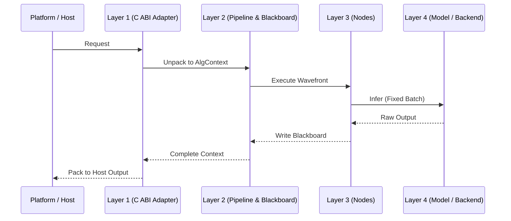

# RFC <编号>: <需求 / 功能标题>

- **RFC 编号**：<如 0005-your-feature-name>
- **创建日期**：YYYY-MM-DD
- **文档状态**：Draft | Proposed | In Implementation | Completed | Deprecated
- **关联分支**：`feat/<feature-name>` | `fix/<name>` | `refactor/<name>`
- **目标版本**：vX.Y.Z
- **负责人 / 作者**：<作者或团队>

---

## 1. 背景与动机 (Motivation & Context)

- **当前痛点**：描述现有代码或架构存在的问题、性能瓶颈或功能缺失。
- **业务需求**：描述接入方/客户/平台的具体业务诉求。
- **预期收益**：本方案带来的核心价值（如吞吐提升、ABI 解耦、内存安全等）。

---

## 2. 设计范围与边界 (Scope & Non-Goals)

### 2.1 范围内 (In-Scope)
- [ ] 明确本 RFC 必须完成的功能点与接口设计。
- [ ] 明确涉及的架构层级（Layer 1 ~ Layer 4）。

### 2.2 非目标 (Non-Goals / Out-of-Scope)
- 明确本期**不做**的事情，避免需求蔓延。

---

## 3. 总体技术方案与架构设计 (Architecture & Technical Design)

### 3.1 架构分层映射 (4-Tier Mapping)
只填写实际涉及的层；纯 Tooling/Governance 变更可明确写为不修改运行时四层：
- **Layer 1 (C ABI / Platform Adapter)**:
- **Layer 2 (Pipeline & Blackboard)**:
- **Layer 3 (Stateless Capability Nodes)**:
- **Layer 4 (Models & Inference Backends)**:

### 3.2 核心接口与数据流设计 (Interface & Data Flow)
```cpp
// 关键类定义、接口签名或 C ABI 契约声明
```

### 3.3 时序图 / 流程图 (Mermaid / PlantUML)


---

## 4. 关键设计考量与权衡 (Design Trade-offs & Invariants)

1. **内存与生命周期管理**：
   - 谁负责分配，谁负责释放？是否存在多线程并发所有权竞争？
2. **异常安全与错误传播**：
   - Layer 1 是否严格遵守 `noexcept` + `try-catch` 边界？
   - 错误码如何统一映射？
3. **拷贝与性能影响**：
   - 黑板存取是否存在可避免的深拷贝？
   - 是否满足固定 Batch DMA 调度对齐？

---

## 5. 测试与质量验收计划 (Testing & Verification Plan)

列出能证明本 RFC 不变量的最小测试集合。优先扩展已有责任明确的套件；只有独立能力才
创建新的测试目标。交付前统一运行 `./scripts/run_all_tests.sh`：

- [ ] **单元/契约测试**：列出新增或扩展的测试套件
- [ ] **异常与边界测试**：空输入、越界、并发安全、异常回调回滚测试
- [ ] **端到端集成测试**：纳入 `./scripts/run_all_tests.sh` 全量回归
- [ ] **专项验证（按风险）**：Sanitizer、真实模型、硬件、性能或兼容性证据

---

## 6. 实施路线与里程碑 (Implementation Milestones)

1. [ ] **阶段一：RFC 评审与设计定稿**（在独立分支中编写 RFC 并完成自评）
2. [ ] **阶段二：核心功能实现与单元测试编写**
3. [ ] **阶段三：运行一次统一完整质量门禁**
4. [ ] **阶段四：更新 RFC 状态为 Completed，按用户授权创建 PR 或合并**

---

## 7. 变更记录 (Changelog)

| 日期 | 版本 | 变更内容 | 作者 |
| :--- | :--- | :--- | :--- |
| YYYY-MM-DD | v1.0.0 | 初始草案创建 | Author |
