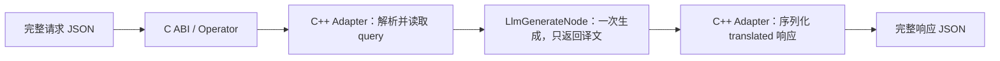

# JSON 字符串翻译方案

输入输出以 C ABI 边界为准，遵循[统一接入约定](../dev_guide/business_onboarding.md#输入输出以-c-abi-为边界)。
完整请求 JSON 字符串进入 SDK，翻译 Adapter 在接入适配层只提取 `query`，通过现有
模型进行一次生成，只返回简体中文译文原句；C++ Adapter 再用 JSON 序列化器组装
仅含 `translated` 字符串的完整响应，返回宿主。
`version`、`endpoint`、`src_lan` 和其他字段不参与路由、类型检查或提示词构造。

## 直接调用 C ABI

翻译句柄使用 `ALG_BIZ_TYPE_TRANSLATE`，Pipeline 的 `biz_name` 为 `translate_v1`。
输入/输出复用已有文本载体，因此结构字段仍叫 `sentence_text` / `entities_json`。
传入的是完整对象文本，不是 `query` 子串，也不是双重 JSON 编码后的字符串：

```c
CompanyAlgParamCreate create = {
    "configs/pipeline_translate_cpu.json", "./models", 0,
    ALG_BIZ_TYPE_TRANSLATE
};
CompanyEntityInputStruct input = {
    1,
    "{\"version\":\"0.0.1\",\"endpoint\":\"translate\","
    "\"query\":\"hello,what is your name\",\"src_lan\":\"en\"}"
};
CompanyEntityOutputStruct output = {0};
const void* inputs[] = {&input};
void* outputs[] = {&output};
int count = 1;
/* Alg_Init、Alg_Create(&handle, &create) 成功后： */
int ret = Alg_Process(handle, inputs, 1, outputs, &count);
/* ret == 0 时，output.entities_json 是完整的 {"translated":"..."}。
   使用后 Alg_Destroy(handle)、Alg_DeInit；检查各接口返回值。 */
```

`input.sentence_text` 的实际内容是：

```json
{"version":"0.0.1","endpoint":"translate","query":"hello,what is your name","src_lan":"en"}
```

本机 Qwen2.5 0.5B Q4_K_M / llama.cpp CPU 实际返回：

```json
{"translated":"你好，你叫什么名字？"}
```

用户示例的 `{"translated":"你好，你的名字是什么"}` 同样符合格式；具体措辞由模型生成。

## Demo

先按根 README 构建。权重为 `models/qwen2.5-0.5b-instruct-q4_k_m.gguf`，缺失时可沿用
`./scripts/fetch_real_test_models.sh --gguf-only`；来源及校验以
[资产清单](../../models/asset_manifest.json)为准。本次使用工作区已有权重。

```bash
python3 demo/json_prompt_demo.py --input '{"version":"0.0.1","endpoint":"translate","query":"hello,what is your name","src_lan":"en"}'
python3 demo/json_prompt_demo.py --dataset data/corpus_translate.jsonl
```

stdout 每行输出一个完整响应 JSON；日志路径写 stderr。包装层只将请求对象压成一行，
保留全部字段和值，不提取 query，也不投影响应字段。`results/translate/run-*` 保存
`input.txt`（完整请求）、`demo.log` 和 `results/translate/` 下的原生结果/汇总。
也可通过 stdin 输入一个完整请求，或用 `--output-dir` 指定保存目录。

统一 Demo 走 Operator 外观，与 C ABI 共用同一个 Translate Adapter；它不会调用导出的
`Alg_Process`。可直接去掉 Python 层运行同一方案：

```bash
./build/alg_demo --biz translate --config configs/pipeline_translate_cpu.conf \
  --dataset data/corpus_translate.jsonl --output-dir results/translate-native
```

上面的 C ABI 示例和直接调用 `Alg_Process` 的契约测试单独证明 C 入口的行为。

## 复用范围与处理边界



- [Translate Adapter](../../src/adapter/biz/translate_adapter.cpp)复用现有 Entity Adapter
  的指针/长度校验、copy-in、来源映射和 C/Operator 两种输出打包，只增加 JSON 字段映射。
  [bridge](../../src/adapter/biz/translate_operator_bridge.cpp)复用 `entity_in/entity_out`
  宿主类型和输出池；统一 Demo 复用现有文本/JSON 运行函数。
- [Pipeline](../../configs/pipeline_translate_cpu.json)仅使用已有 `LlmGenerateNode`，
  直接将 `input_sentences` 原文传入模型，生成纯文本 `llm_answers`。翻译规则放在模型
  `system_prompt` 配置中，由现有 C++ Model 组装对话提示词。每条请求只调用一次文本
  生成，没有格式修复或二次推理；自回归生成内部仍逐 token 解码。无关字段不会进入模型。
- [部署配置](../../configs/pipeline_translate_cpu.conf)选择既有 Qwen Model / llama.cpp
  Backend；新增业务仅涉及 Integration 的注册与转换，Core、节点、模型实现和现有
  实体业务语义保持不变。决策见 [RFC-0048](../rfcs/0048-translation-json-abi.md)。

输入必须是 JSON 对象且 query 是字符串；非法输入在 SDK 内报错。空串可通过接入校验，
但当前 Qwen Model 拒绝空原文并返回错误，不补造成功译文。
模型只输出译文原句；`{"translated":...}` 的字段与 JSON 转义全部由 C++ 决定。
Adapter 原样保存模型文本，不解析、裁剪或去掉引号；即使文本恰好像 JSON，也只是
`translated` 的字符串内容。输入与输出中的换行、引号、反斜杠和 NUL 通过解析/序列化保真。
无静态默认译文或成功 fallback。错误状态、来源异常或容量不足返回非零。

完整输入沿用 64 KiB 上限。C ABI 输出数组为 2048 字节（含结尾 NUL），超出报错；
Operator 的 JSON 输出池在本配置中为 8191 字节。当前上下文为 2048 tokens、生成上限为
512 tokens，用于短文本演示。长文需调整并验证上下文、生成长度和输出容量；C++ 保证
响应格式，译文准确性、完整性和是否遵守提示词仍取决于模型。

## 验证与后续需求

```bash
./build/alg_pipeline_tool catalog --biz translate_v1
./build/alg_pipeline_tool validate configs/pipeline_translate_cpu.json
./build/alg_pipeline_tool plan configs/pipeline_translate_cpu.json
./build/alg_pipeline_tool resolve-conf configs/pipeline_translate_cpu.conf --root . --depth 1
./scripts/run_all_tests.sh
```

现有 Adapter 套件直接调用 `Alg_Process`，使用计数测试模型验证原始 query 输入、
每条请求仅一次生成、C++ 组装完整响应，以及无关字段忽略、转义、失败与输出容量。
该测试不作为翻译质量证据。Python 测试验证完整对象转发和完整 SDK 响应转发；
真实模型验证使用同一份生产 Pipeline，分别执行直接 C ABI 调用和三条样例的 Operator Demo。

本次真实 C ABI 请求返回 `ret=0`、`count=1`、`request_id=101`、`status_code=0`，
响应如上。Demo 的请求 ID 30001–30003 状态均为 0，译文分别为“你好，你叫什么名字？”、
“早上好。”和“谢谢！”。同句柄输入 `{"query":""}` 实测返回 `-1`，没有有效成功响应。

复用相同输入/输出契约的新提示词方案只需改配置；改变 SDK 字段契约时，按
[业务接入指南](../dev_guide/business_onboarding.md)在 Integration 增加必要转换。
不要在 Demo 外预先提取字段来替代 C ABI 能力。后续指导见
[json-prompt-solution skill](../../.agents/skills/json-prompt-solution/SKILL.md)。
